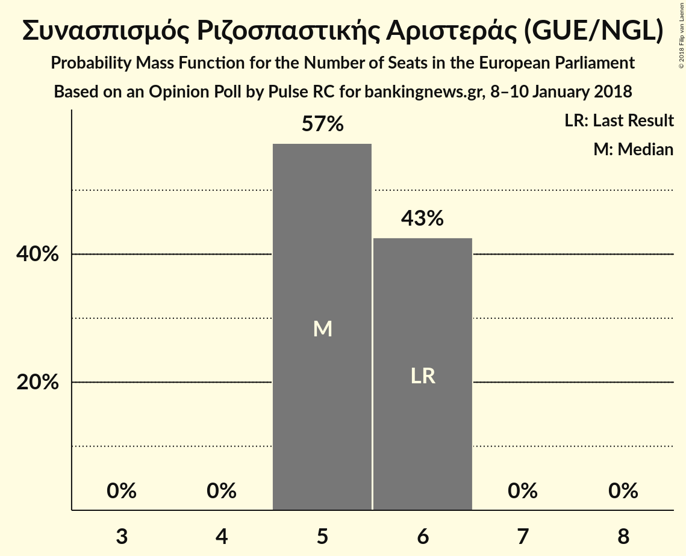
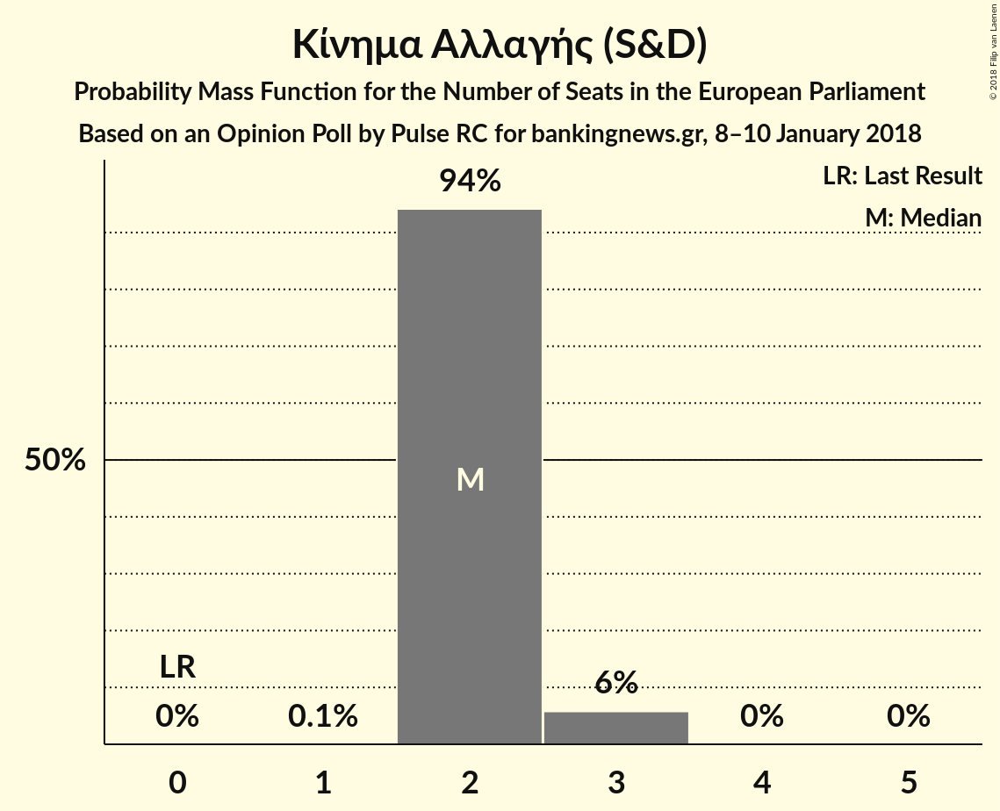
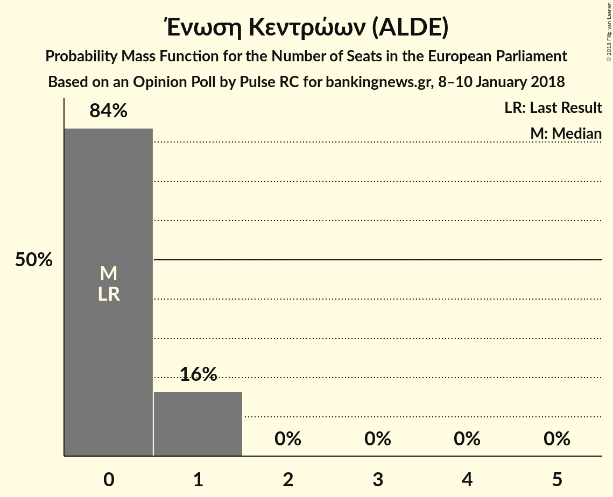

# Opinion Poll by Pulse RC for bankingnews.gr, 8–10 January 2018

<a href="#voting-intentions">Voting Intentions</a> | <a href="#seats">Seats</a> | <a href="#coalitions">Coalitions</a> | <a href="#technical-information">Technical Information</a>

## Voting Intentions

### Confidence Intervals

| Party | Last Result | Poll Result | 80% Confidence Interval | 90% Confidence Interval | 95% Confidence Interval | 99% Confidence Interval |
|:-----:|:-----------:|:-----------:|:-----------------------:|:-----------------------:|:-----------------------:|:-----------------------:|
| Νέα Δημοκρατία (EPP) | 22.7% | 36.5% | 34.8–38.3% |34.3–38.9% |33.9–39.3% |33.0–40.2% |
| Συνασπισμός Ριζοσπαστικής Αριστεράς (GUE/NGL) | 26.6% | 25.0% | 23.5–26.7% |23.0–27.1% |22.6–27.6% |21.9–28.3% |
| Κίνημα Αλλαγής (S&D) | 0.0% | 10.0% | 9.0–11.2% |8.7–11.6% |8.4–11.9% |8.0–12.5% |
| Χρυσή Αυγή (—) | 9.4% | 8.5% | 7.6–9.7% |7.3–10.0% |7.1–10.3% |6.6–10.8% |
| Κομμουνιστικό Κόμμα Ελλάδας (—) | 6.1% | 6.5% | 5.6–7.5% |5.4–7.7% |5.2–8.0% |4.8–8.5% |
| Ανεξάρτητοι Έλληνες (ECR) | 3.5% | 2.5% | 2.0–3.2% |1.9–3.4% |1.7–3.5% |1.5–3.9% |
| Ένωση Κεντρώων (ALDE) | 0.7% | 2.5% | 2.0–3.2% |1.9–3.4% |1.7–3.5% |1.5–3.9% |

*Note:* The poll result column reflects the actual value used in the calculations. Published results may vary slightly, and in addition be rounded to fewer digits.

## Seats

### Confidence Intervals

| Party | Last Result | Median | 80% Confidence Interval | 90% Confidence Interval | 95% Confidence Interval | 99% Confidence Interval |
|:-----:|:-----------:|:------:|:-----------------------:|:-----------------------:|:-----------------------:|:-----------------------:|
| <a href="#Νέα-Δημοκρατία-(epp)">Νέα Δημοκρατία (EPP)</a> | 5 | 8 | 8 |7–9 |7–9 |7–9 |
| <a href="#Συνασπισμός-Ριζοσπαστικής-Αριστεράς-(gue/ngl)">Συνασπισμός Ριζοσπαστικής Αριστεράς (GUE/NGL)</a> | 6 | 5 | 5–6 |5–6 |5–6 |5–6 |
| <a href="#Κίνημα-Αλλαγής-(s&d)">Κίνημα Αλλαγής (S&D)</a> | 0 | 2 | 2 |2–3 |2–3 |2–3 |
| <a href="#Χρυσή-Αυγή-(—)">Χρυσή Αυγή (—)</a> | 3 | 2 | 2 |2 |1–2 |1–2 |
| <a href="#Κομμουνιστικό-Κόμμα-Ελλάδας-(—)">Κομμουνιστικό Κόμμα Ελλάδας (—)</a> | 2 | 1 | 1–2 |1–2 |1–2 |1–2 |
| <a href="#Ανεξάρτητοι-Έλληνες-(ecr)">Ανεξάρτητοι Έλληνες (ECR)</a> | 1 | 0 | 0–1 |0–1 |0–1 |0–1 |
| <a href="#Ένωση-Κεντρώων-(alde)">Ένωση Κεντρώων (ALDE)</a> | 0 | 0 | 0–1 |0–1 |0–1 |0–1 |

### Νέα Δημοκρατία (EPP)

*For a full overview of the results for this party, see the [Νέα Δημοκρατία (EPP)](party-ΝέαΔημοκρατίαepp.html) page.*

| Number of Seats | Probability | Accumulated | Special Marks |
|:---------------:|:-----------:|:-----------:|:-------------:|
| 5 | 0% | 100% | Last Result |
| 6 | 0% | 100% |  |
| 7 | 8% | 100% |  |
| 8 | 86% | 92% | Median |
| 9 | 6% | 6% |  |
| 10 | 0% | 0% |  |

### Συνασπισμός Ριζοσπαστικής Αριστεράς (GUE/NGL)

*For a full overview of the results for this party, see the [Συνασπισμός Ριζοσπαστικής Αριστεράς (GUE/NGL)](party-ΣυνασπισμόςΡιζοσπαστικήςΑριστεράςguengl.html) page.*

| Number of Seats | Probability | Accumulated | Special Marks |
|:---------------:|:-----------:|:-----------:|:-------------:|
| 5 | 57% | 100% | Median |
| 6 | 43% | 43% | Last Result |
| 7 | 0% | 0% |  |

### Κίνημα Αλλαγής (S&D)

*For a full overview of the results for this party, see the [Κίνημα Αλλαγής (S&D)](party-ΚίνημαΑλλαγήςsd.html) page.*

| Number of Seats | Probability | Accumulated | Special Marks |
|:---------------:|:-----------:|:-----------:|:-------------:|
| 0 | 0% | 100% | Last Result |
| 1 | 0.1% | 100% |  |
| 2 | 94% | 99.9% | Median |
| 3 | 6% | 6% |  |
| 4 | 0% | 0% |  |

### Χρυσή Αυγή (—)

*For a full overview of the results for this party, see the [Χρυσή Αυγή (—)](party-ΧρυσήΑυγή—.html) page.*

| Number of Seats | Probability | Accumulated | Special Marks |
|:---------------:|:-----------:|:-----------:|:-------------:|
| 1 | 3% | 100% |  |
| 2 | 97% | 97% | Median |
| 3 | 0.2% | 0.2% | Last Result |
| 4 | 0% | 0% |  |

### Κομμουνιστικό Κόμμα Ελλάδας (—)

*For a full overview of the results for this party, see the [Κομμουνιστικό Κόμμα Ελλάδας (—)](party-ΚομμουνιστικόΚόμμαΕλλάδας—.html) page.*

| Number of Seats | Probability | Accumulated | Special Marks |
|:---------------:|:-----------:|:-----------:|:-------------:|
| 1 | 75% | 100% | Median |
| 2 | 25% | 25% | Last Result |
| 3 | 0% | 0% |  |

### Ανεξάρτητοι Έλληνες (ECR)

*For a full overview of the results for this party, see the [Ανεξάρτητοι Έλληνες (ECR)](party-ΑνεξάρτητοιΈλληνεςecr.html) page.*

| Number of Seats | Probability | Accumulated | Special Marks |
|:---------------:|:-----------:|:-----------:|:-------------:|
| 0 | 80% | 100% | Median |
| 1 | 20% | 20% | Last Result |
| 2 | 0% | 0% |  |

### Ένωση Κεντρώων (ALDE)

*For a full overview of the results for this party, see the [Ένωση Κεντρώων (ALDE)](party-ΈνωσηΚεντρώωνalde.html) page.*

| Number of Seats | Probability | Accumulated | Special Marks |
|:---------------:|:-----------:|:-----------:|:-------------:|
| 0 | 84% | 100% | Last Result, Median |
| 1 | 16% | 16% |  |
| 2 | 0% | 0% |  |

## Coalitions

### Confidence Intervals

| Coalition | Last Result | Median | Majority? | 80% Confidence Interval | 90% Confidence Interval | 95% Confidence Interval | 99% Confidence Interval |
|:---------:|:-----------:|:------:|:---------:|:-----------------------:|:-----------------------:|:-----------------------:|:-----------------------:|
| Νέα Δημοκρατία (EPP) | 5 | 8 | 0% | 8 | 7–9 | 7–9 | 7–9 |
| Χρυσή Αυγή (—) – Κομμουνιστικό Κόμμα Ελλάδας (—) | 5 | 3 | 0% | 3–4 | 3–4 | 3–4 | 2–4 |
| Ένωση Κεντρώων (ALDE) | 0 | 0 | 0% | 0–1 | 0–1 | 0–1 | 0–1 |
| Ανεξάρτητοι Έλληνες (ECR) | 1 | 0 | 0% | 0–1 | 0–1 | 0–1 | 0–1 |

### Νέα Δημοκρατία (EPP)

| Number of Seats | Probability | Accumulated | Special Marks |
|:---------------:|:-----------:|:-----------:|:-------------:|
| 5 | 0% | 100% | Last Result |
| 6 | 0% | 100% |  |
| 7 | 8% | 100% |  |
| 8 | 86% | 92% | Median |
| 9 | 6% | 6% |  |
| 10 | 0% | 0% |  |

### Χρυσή Αυγή (—) – Κομμουνιστικό Κόμμα Ελλάδας (—)

| Number of Seats | Probability | Accumulated | Special Marks |
|:---------------:|:-----------:|:-----------:|:-------------:|
| 2 | 2% | 100% |  |
| 3 | 73% | 98% | Median |
| 4 | 25% | 25% |  |
| 5 | 0% | 0% | Last Result |

### Ένωση Κεντρώων (ALDE)

| Number of Seats | Probability | Accumulated | Special Marks |
|:---------------:|:-----------:|:-----------:|:-------------:|
| 0 | 84% | 100% | Last Result, Median |
| 1 | 16% | 16% |  |
| 2 | 0% | 0% |  |

### Ανεξάρτητοι Έλληνες (ECR)

| Number of Seats | Probability | Accumulated | Special Marks |
|:---------------:|:-----------:|:-----------:|:-------------:|
| 0 | 80% | 100% | Median |
| 1 | 20% | 20% | Last Result |
| 2 | 0% | 0% |  |

## Technical Information

### Opinion Poll

+ **Polling firm:** Pulse RC
+ **Commissioner(s):** bankingnews.gr
+ **Fieldwork period:** 8–10 January 2018

### Calculations

+ **Sample size:** 1207
+ **Simulations done:** 1,048,576
+ **Error estimate:** 1.19%

