# Opinion Poll by Marc for Πρώτο ΘΕΜΑ, 13 January 2018

<a href="#voting-intentions">Voting Intentions</a> | <a href="#seats">Seats</a> | <a href="#coalitions">Coalitions</a> | <a href="#technical-information">Technical Information</a>

## Voting Intentions

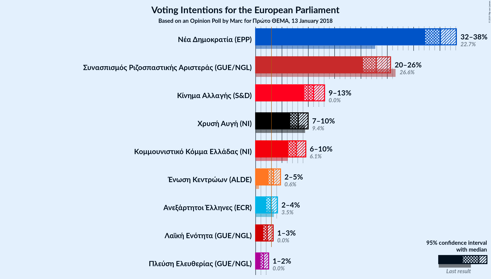

### Confidence Intervals

| Party | Last Result | Poll Result | 80% Confidence Interval | 90% Confidence Interval | 95% Confidence Interval | 99% Confidence Interval |
|:-----:|:-----------:|:-----------:|:-----------------------:|:-----------------------:|:-----------------------:|:-----------------------:|
| Νέα Δημοκρατία (EPP) | 22.7% | 35.1% | 33.2–37.1% |32.7–37.6% |32.2–38.1% |31.3–39.1% |
| Συνασπισμός Ριζοσπαστικής Αριστεράς (GUE/NGL) | 26.6% | 22.9% | 21.3–24.7% |20.8–25.2% |20.4–25.6% |19.6–26.5% |
| Κίνημα Αλλαγής (S&D) | 0.0% | 11.0% | 9.8–12.4% |9.5–12.8% |9.2–13.1% |8.7–13.8% |
| Χρυσή Αυγή (NI) | 9.4% | 8.1% | 7.1–9.3% |6.8–9.7% |6.6–10.0% |6.1–10.6% |
| Κομμουνιστικό Κόμμα Ελλάδας (NI) | 6.1% | 7.7% | 6.7–8.9% |6.4–9.2% |6.2–9.5% |5.8–10.1% |
| Ένωση Κεντρώων (ALDE) | 0.6% | 3.4% | 2.8–4.3% |2.6–4.5% |2.4–4.7% |2.2–5.2% |
| Ανεξάρτητοι Έλληνες (ECR) | 3.5% | 2.9% | 2.3–3.7% |2.2–3.9% |2.0–4.1% |1.8–4.6% |
| Λαϊκή Ενότητα (GUE/NGL) | 0.0% | 2.2% | 1.7–2.9% |1.6–3.1% |1.4–3.3% |1.2–3.7% |
| Πλεύση Ελευθερίας (GUE/NGL) | 0.0% | 1.5% | 1.1–2.1% |1.0–2.3% |0.9–2.5% |0.7–2.8% |

*Note:* The poll result column reflects the actual value used in the calculations. Published results may vary slightly, and in addition be rounded to fewer digits.

## Seats

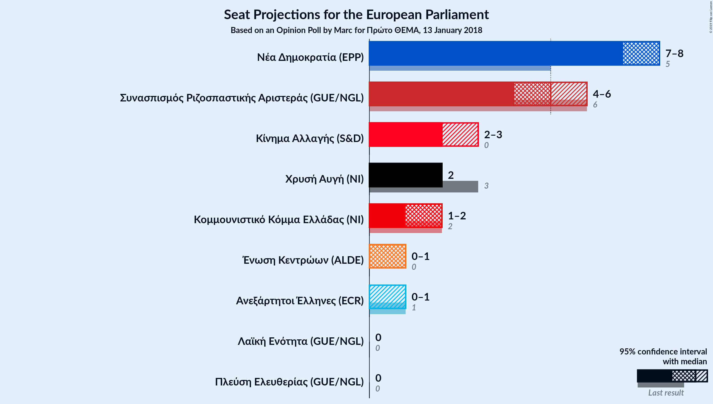

### Confidence Intervals

| Party | Last Result | Median | 80% Confidence Interval | 90% Confidence Interval | 95% Confidence Interval | 99% Confidence Interval |
|:-----:|:-----------:|:------:|:-----------------------:|:-----------------------:|:-----------------------:|:-----------------------:|
| <a href="#νέα-δημοκρατία-(epp)">Νέα Δημοκρατία (EPP)</a> | 5 | 8 | 7–8 |7–8 |7–8 |7–8 |
| <a href="#συνασπισμός-ριζοσπαστικής-αριστεράς-(gue/ngl)">Συνασπισμός Ριζοσπαστικής Αριστεράς (GUE/NGL)</a> | 6 | 5 | 5 |4–5 |4–6 |4–6 |
| <a href="#κίνημα-αλλαγής-(s&d)">Κίνημα Αλλαγής (S&D)</a> | 0 | 2 | 2–3 |2–3 |2–3 |2–3 |
| <a href="#χρυσή-αυγή-(ni)">Χρυσή Αυγή (NI)</a> | 3 | 2 | 2 |2 |2 |1–2 |
| <a href="#κομμουνιστικό-κόμμα-ελλάδας-(ni)">Κομμουνιστικό Κόμμα Ελλάδας (NI)</a> | 2 | 2 | 1–2 |1–2 |1–2 |1–2 |
| <a href="#ένωση-κεντρώων-(alde)">Ένωση Κεντρώων (ALDE)</a> | 0 | 1 | 0–1 |0–1 |0–1 |0–1 |
| <a href="#ανεξάρτητοι-έλληνες-(ecr)">Ανεξάρτητοι Έλληνες (ECR)</a> | 1 | 0 | 0–1 |0–1 |0–1 |0–1 |
| <a href="#λαϊκή-ενότητα-(gue/ngl)">Λαϊκή Ενότητα (GUE/NGL)</a> | 0 | 0 | 0 |0 |0 |0–1 |
| <a href="#πλεύση-ελευθερίας-(gue/ngl)">Πλεύση Ελευθερίας (GUE/NGL)</a> | 0 | 0 | 0 |0 |0 |0 |

### Νέα Δημοκρατία (EPP)

*For a full overview of the results for this party, see the [Νέα Δημοκρατία (EPP)](party-νέαδημοκρατίαepp.html) page.*

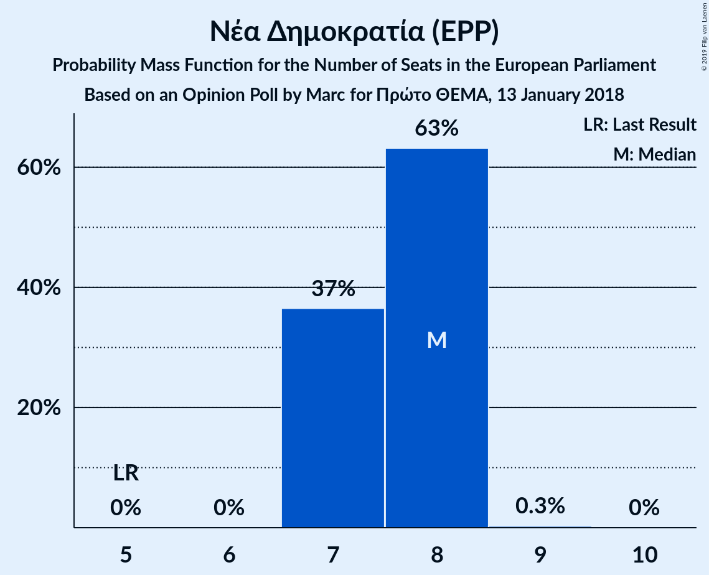

| Number of Seats | Probability | Accumulated | Special Marks |
|:---------------:|:-----------:|:-----------:|:-------------:|
| 5 | 0% | 100% | Last Result |
| 6 | 0% | 100% |  |
| 7 | 37% | 100% |  |
| 8 | 63% | 63% | Median |
| 9 | 0.3% | 0.3% |  |
| 10 | 0% | 0% |  |

### Συνασπισμός Ριζοσπαστικής Αριστεράς (GUE/NGL)

*For a full overview of the results for this party, see the [Συνασπισμός Ριζοσπαστικής Αριστεράς (GUE/NGL)](party-συνασπισμόςριζοσπαστικήςαριστεράςguengl.html) page.*

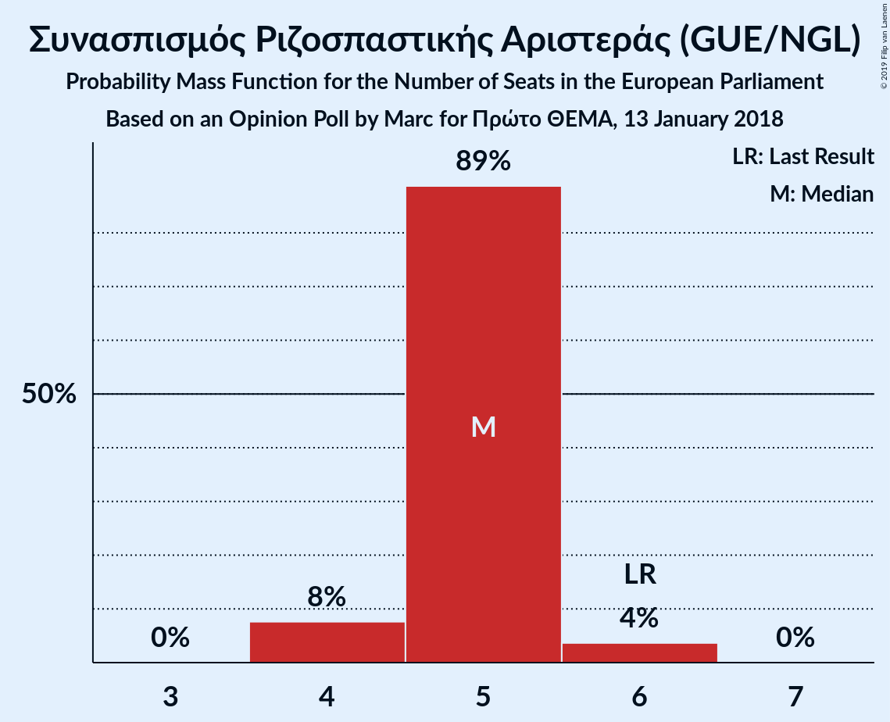

| Number of Seats | Probability | Accumulated | Special Marks |
|:---------------:|:-----------:|:-----------:|:-------------:|
| 4 | 8% | 100% |  |
| 5 | 89% | 92% | Median |
| 6 | 4% | 4% | Last Result |
| 7 | 0% | 0% |  |

### Κίνημα Αλλαγής (S&D)

*For a full overview of the results for this party, see the [Κίνημα Αλλαγής (S&D)](party-κίνημααλλαγήςsd.html) page.*

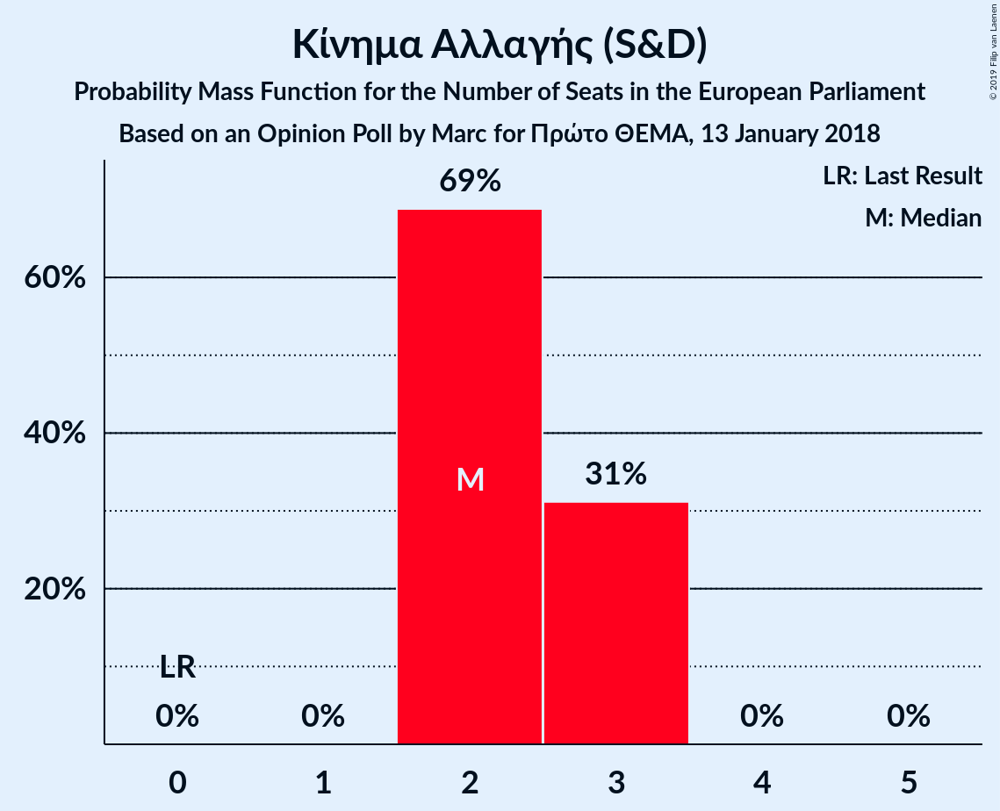

| Number of Seats | Probability | Accumulated | Special Marks |
|:---------------:|:-----------:|:-----------:|:-------------:|
| 0 | 0% | 100% | Last Result |
| 1 | 0% | 100% |  |
| 2 | 69% | 100% | Median |
| 3 | 31% | 31% |  |
| 4 | 0% | 0% |  |

### Χρυσή Αυγή (NI)

*For a full overview of the results for this party, see the [Χρυσή Αυγή (NI)](party-χρυσήαυγήni.html) page.*

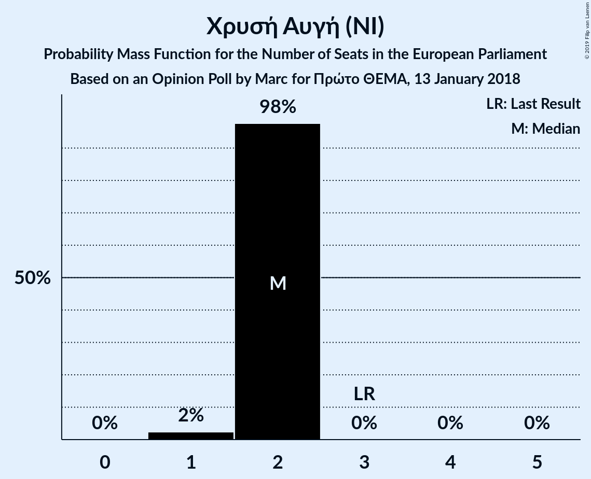

| Number of Seats | Probability | Accumulated | Special Marks |
|:---------------:|:-----------:|:-----------:|:-------------:|
| 1 | 2% | 100% |  |
| 2 | 98% | 98% | Median |
| 3 | 0% | 0% | Last Result |

### Κομμουνιστικό Κόμμα Ελλάδας (NI)

*For a full overview of the results for this party, see the [Κομμουνιστικό Κόμμα Ελλάδας (NI)](party-κομμουνιστικόκόμμαελλάδαςni.html) page.*

| Number of Seats | Probability | Accumulated | Special Marks |
|:---------------:|:-----------:|:-----------:|:-------------:|
| 1 | 13% | 100% |  |
| 2 | 87% | 87% | Last Result, Median |
| 3 | 0.1% | 0.1% |  |
| 4 | 0% | 0% |  |

### Ένωση Κεντρώων (ALDE)

*For a full overview of the results for this party, see the [Ένωση Κεντρώων (ALDE)](party-ένωσηκεντρώωνalde.html) page.*

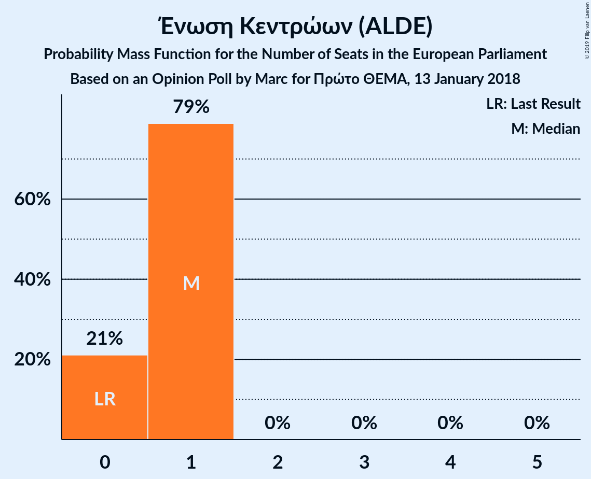

| Number of Seats | Probability | Accumulated | Special Marks |
|:---------------:|:-----------:|:-----------:|:-------------:|
| 0 | 21% | 100% | Last Result |
| 1 | 79% | 79% | Median |
| 2 | 0% | 0% |  |

### Ανεξάρτητοι Έλληνες (ECR)

*For a full overview of the results for this party, see the [Ανεξάρτητοι Έλληνες (ECR)](party-ανεξάρτητοιέλληνεςecr.html) page.*

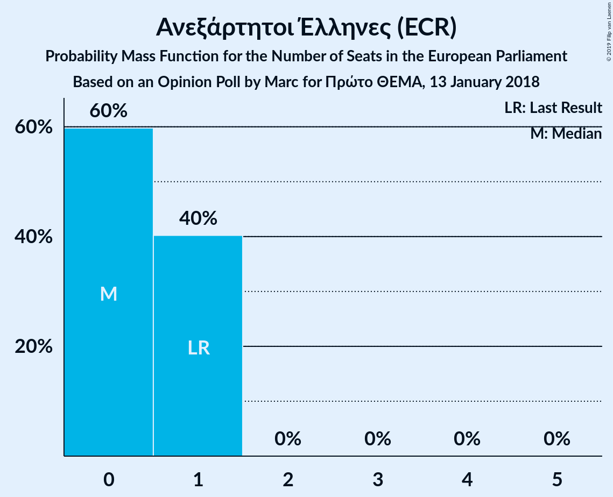

| Number of Seats | Probability | Accumulated | Special Marks |
|:---------------:|:-----------:|:-----------:|:-------------:|
| 0 | 60% | 100% | Median |
| 1 | 40% | 40% | Last Result |
| 2 | 0% | 0% |  |

### Λαϊκή Ενότητα (GUE/NGL)

*For a full overview of the results for this party, see the [Λαϊκή Ενότητα (GUE/NGL)](party-λαϊκήενότηταguengl.html) page.*

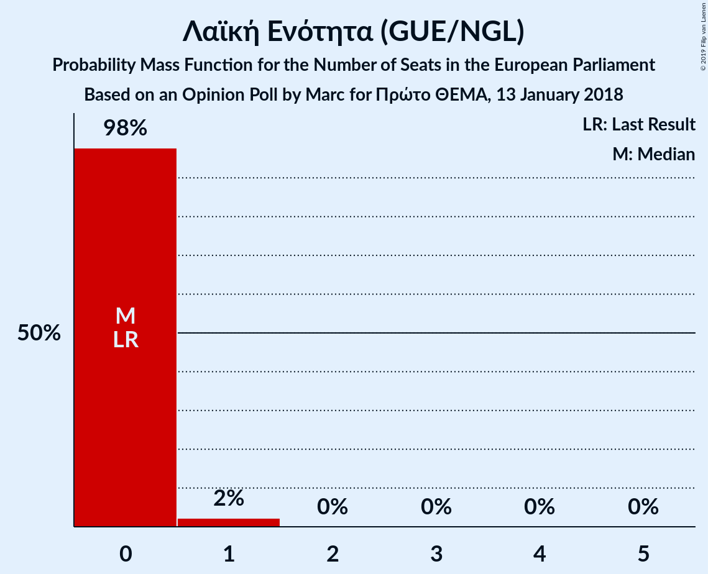

| Number of Seats | Probability | Accumulated | Special Marks |
|:---------------:|:-----------:|:-----------:|:-------------:|
| 0 | 98% | 100% | Last Result, Median |
| 1 | 2% | 2% |  |
| 2 | 0% | 0% |  |

### Πλεύση Ελευθερίας (GUE/NGL)

*For a full overview of the results for this party, see the [Πλεύση Ελευθερίας (GUE/NGL)](party-πλεύσηελευθερίαςguengl.html) page.*

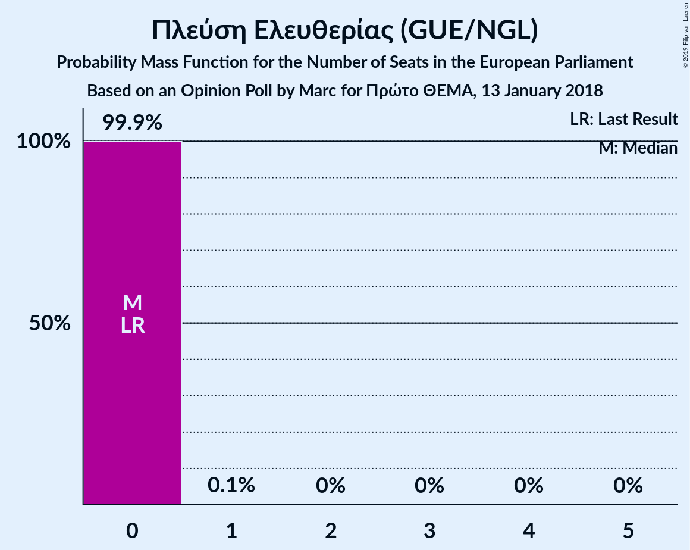

| Number of Seats | Probability | Accumulated | Special Marks |
|:---------------:|:-----------:|:-----------:|:-------------:|
| 0 | 99.9% | 100% | Last Result, Median |
| 1 | 0.1% | 0.1% |  |
| 2 | 0% | 0% |  |

## Coalitions

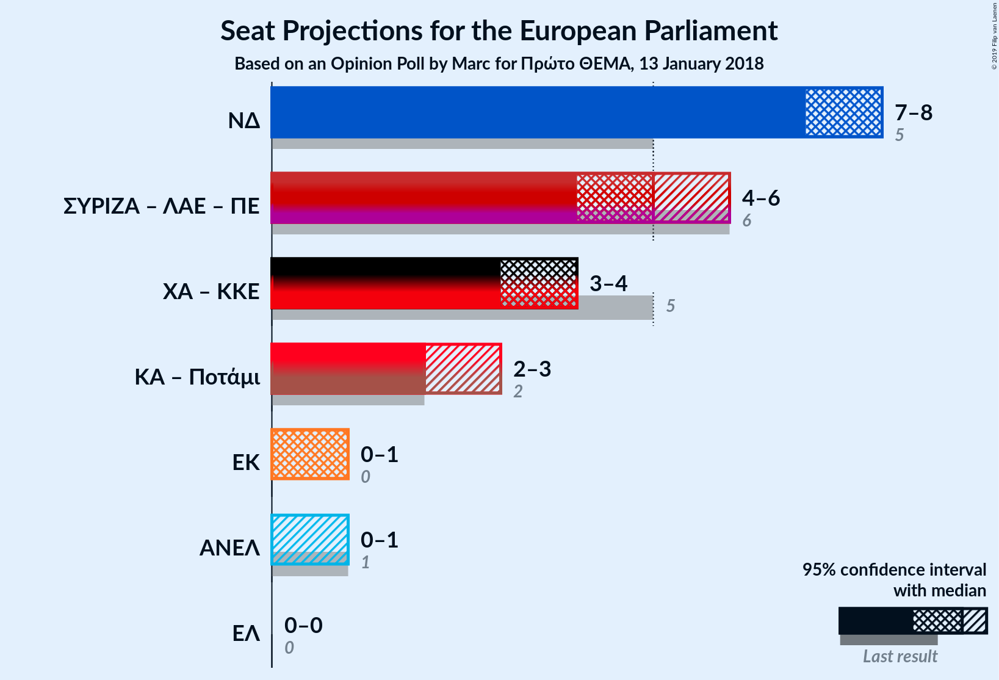

### Confidence Intervals

| Coalition | Last Result | Median | Majority? | 80% Confidence Interval | 90% Confidence Interval | 95% Confidence Interval | 99% Confidence Interval |
|:---------:|:-----------:|:------:|:---------:|:-----------------------:|:-----------------------:|:-----------------------:|:-----------------------:|
| Νέα Δημοκρατία (EPP) | 5 | 8 | 0% | 7–8 | 7–8 | 7–8 | 7–8 |
| Συνασπισμός Ριζοσπαστικής Αριστεράς (GUE/NGL) – Λαϊκή Ενότητα (GUE/NGL) – Πλεύση Ελευθερίας (GUE/NGL) | 6 | 5 | 0% | 5 | 4–6 | 4–6 | 4–6 |
| Χρυσή Αυγή (NI) – Κομμουνιστικό Κόμμα Ελλάδας (NI) | 5 | 4 | 0% | 3–4 | 3–4 | 3–4 | 3–4 |
| Ένωση Κεντρώων (ALDE) | 0 | 1 | 0% | 0–1 | 0–1 | 0–1 | 0–1 |
| Ανεξάρτητοι Έλληνες (ECR) | 1 | 0 | 0% | 0–1 | 0–1 | 0–1 | 0–1 |

### Νέα Δημοκρατία (EPP)

| Number of Seats | Probability | Accumulated | Special Marks |
|:---------------:|:-----------:|:-----------:|:-------------:|
| 5 | 0% | 100% | Last Result |
| 6 | 0% | 100% |  |
| 7 | 37% | 100% |  |
| 8 | 63% | 63% | Median |
| 9 | 0.3% | 0.3% |  |
| 10 | 0% | 0% |  |

### Συνασπισμός Ριζοσπαστικής Αριστεράς (GUE/NGL) – Λαϊκή Ενότητα (GUE/NGL) – Πλεύση Ελευθερίας (GUE/NGL)

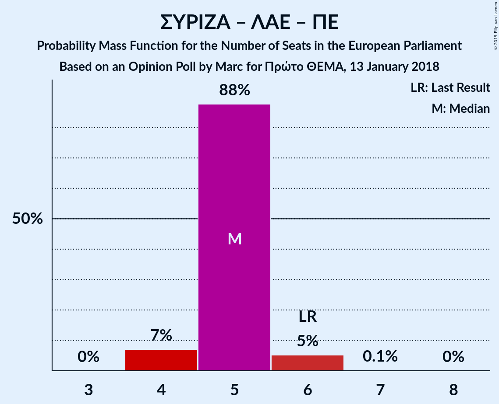

| Number of Seats | Probability | Accumulated | Special Marks |
|:---------------:|:-----------:|:-----------:|:-------------:|
| 4 | 7% | 100% |  |
| 5 | 88% | 93% | Median |
| 6 | 5% | 5% | Last Result |
| 7 | 0.1% | 0.1% |  |
| 8 | 0% | 0% |  |

### Χρυσή Αυγή (NI) – Κομμουνιστικό Κόμμα Ελλάδας (NI)

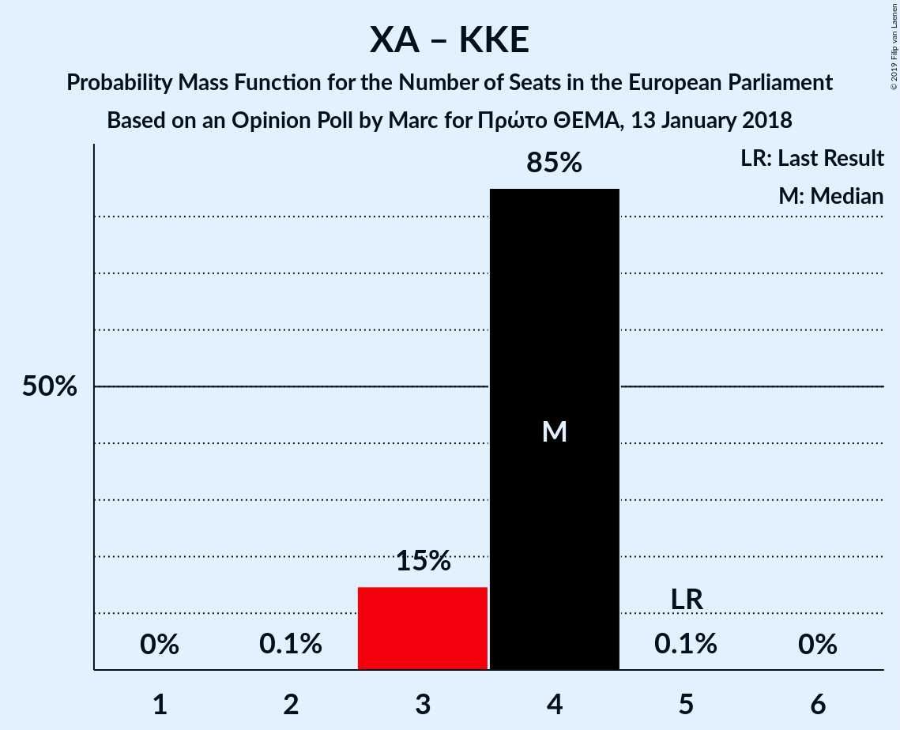

| Number of Seats | Probability | Accumulated | Special Marks |
|:---------------:|:-----------:|:-----------:|:-------------:|
| 2 | 0.1% | 100% |  |
| 3 | 15% | 99.9% |  |
| 4 | 85% | 85% | Median |
| 5 | 0.1% | 0.1% | Last Result |
| 6 | 0% | 0% |  |

### Ένωση Κεντρώων (ALDE)

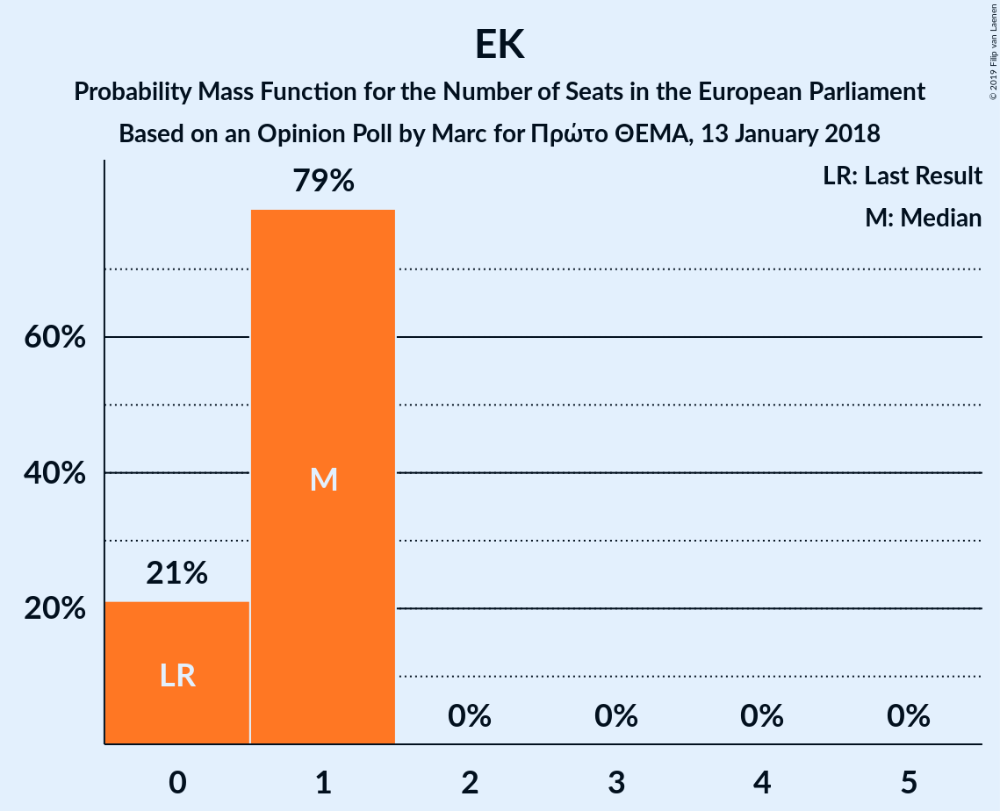

| Number of Seats | Probability | Accumulated | Special Marks |
|:---------------:|:-----------:|:-----------:|:-------------:|
| 0 | 21% | 100% | Last Result |
| 1 | 79% | 79% | Median |
| 2 | 0% | 0% |  |

### Ανεξάρτητοι Έλληνες (ECR)

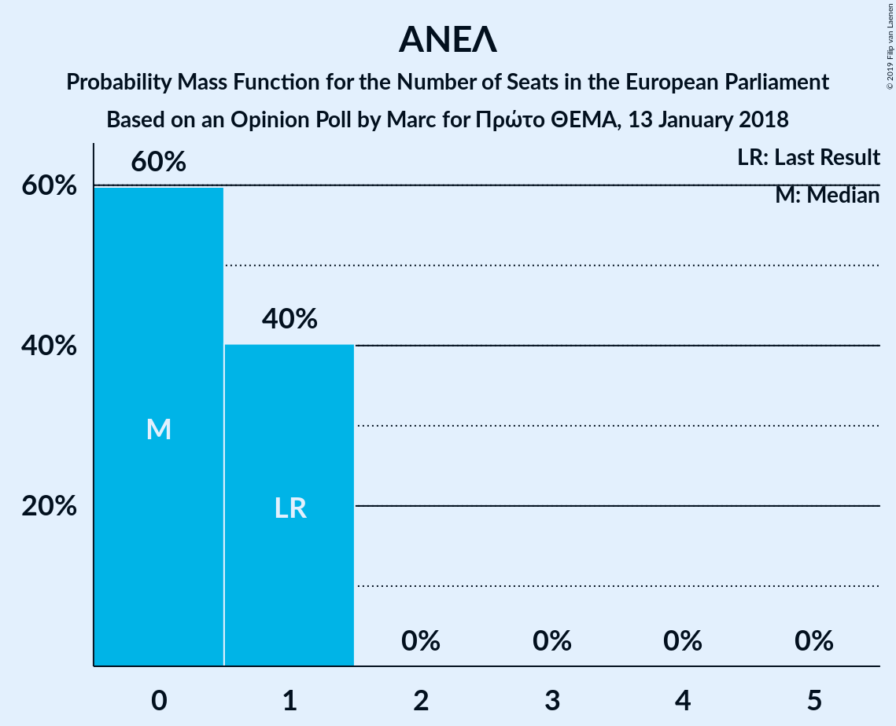

| Number of Seats | Probability | Accumulated | Special Marks |
|:---------------:|:-----------:|:-----------:|:-------------:|
| 0 | 60% | 100% | Median |
| 1 | 40% | 40% | Last Result |
| 2 | 0% | 0% |  |

## Technical Information

### Opinion Poll

+ **Polling firm:** Marc
+ **Commissioner(s):** Πρώτο ΘΕΜΑ
+ **Fieldwork period:** 13 January 2018

### Calculations

+ **Sample size:** 1000
+ **Simulations done:** 131,072
+ **Error estimate:** 1.91%

