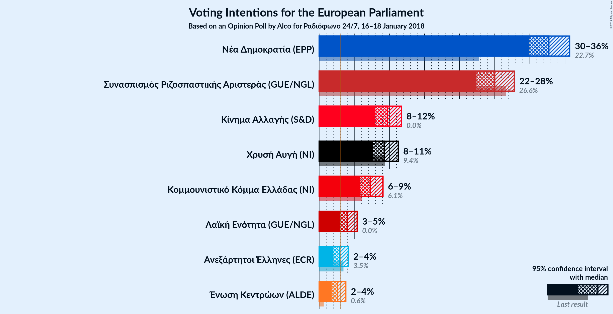
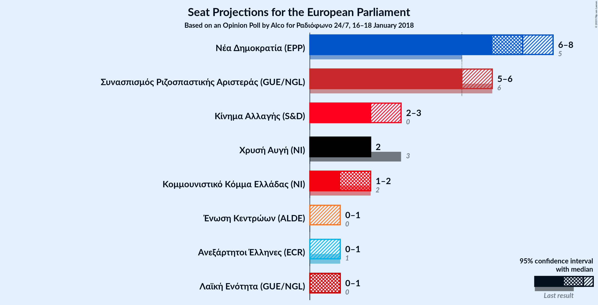
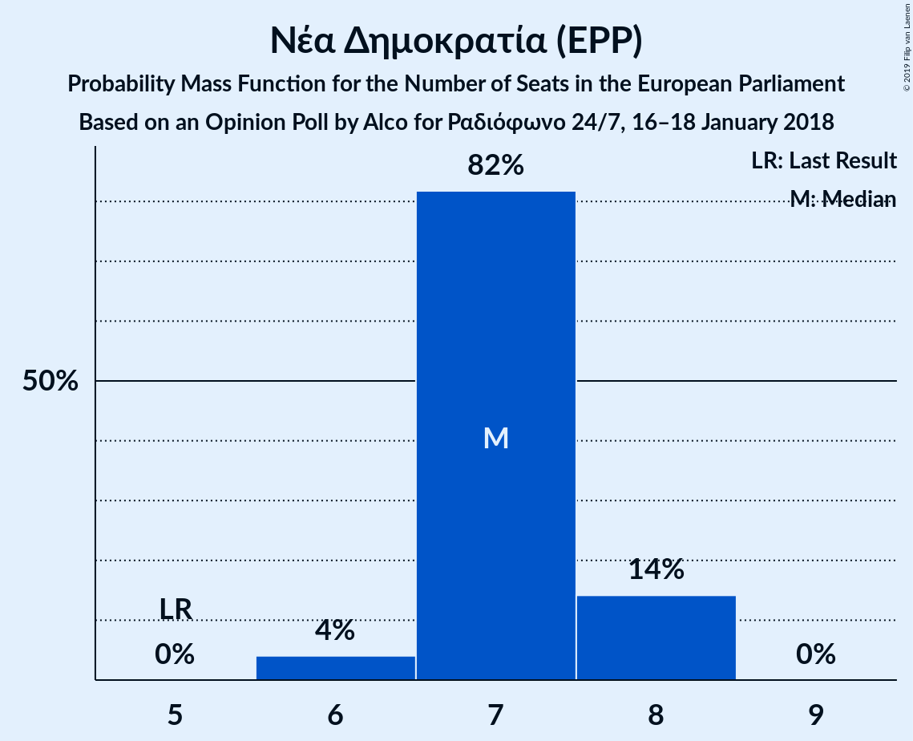
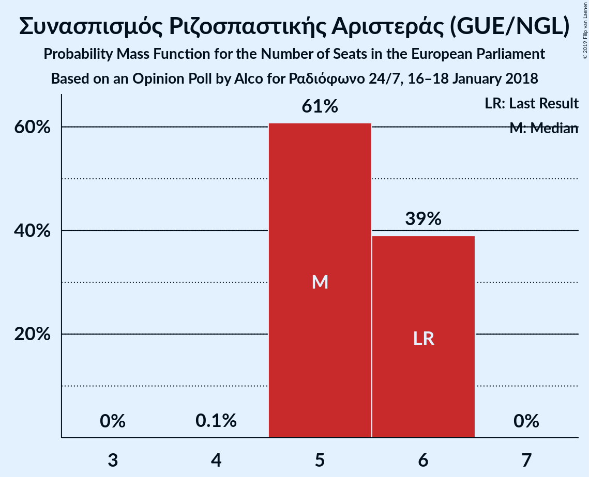
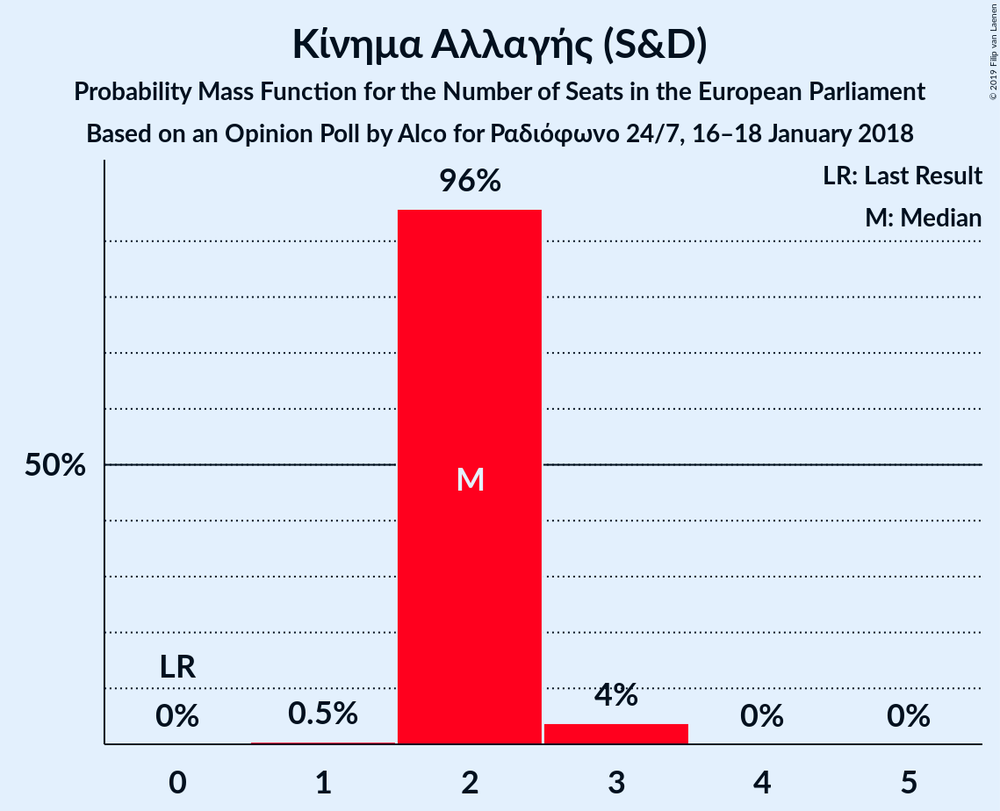
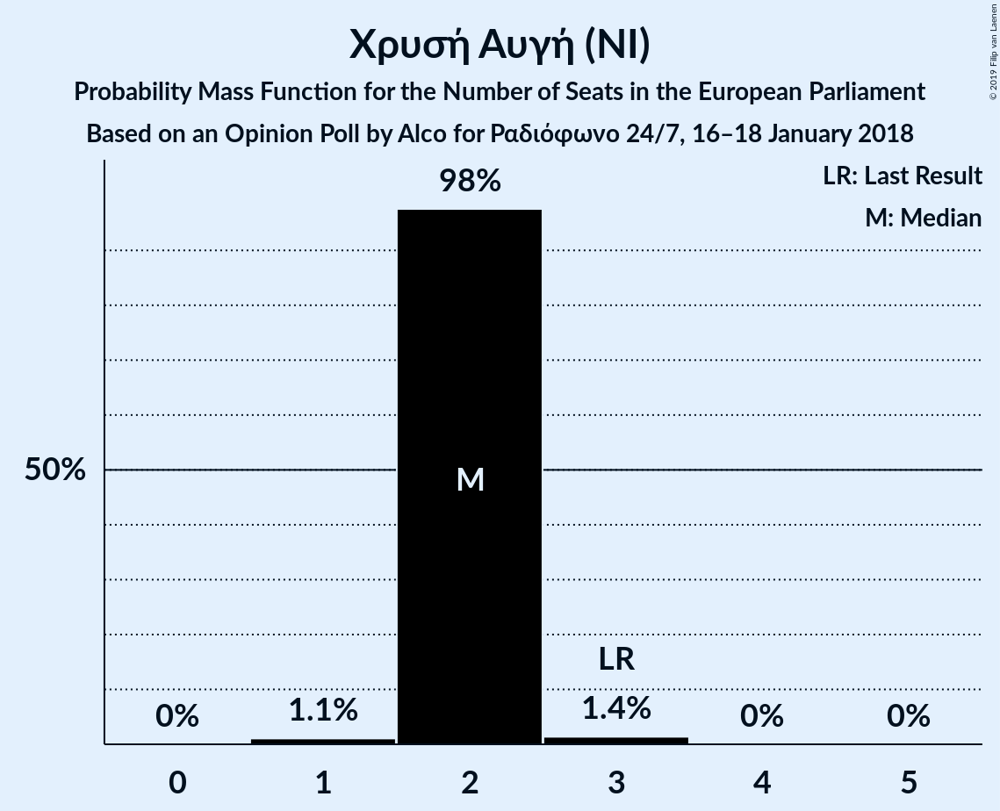
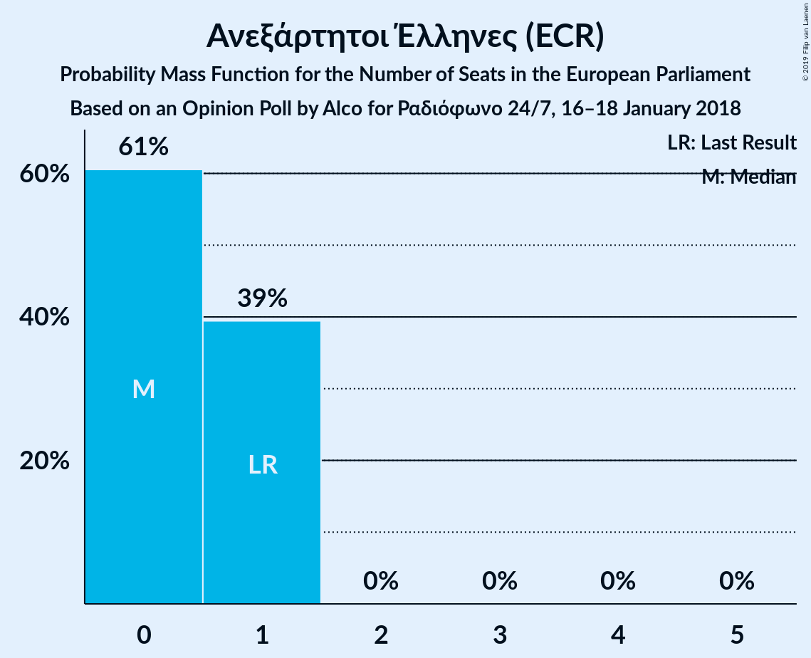
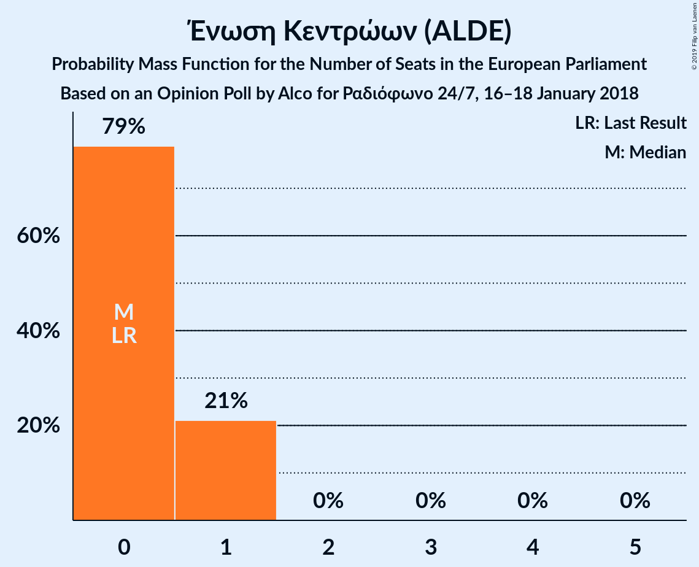
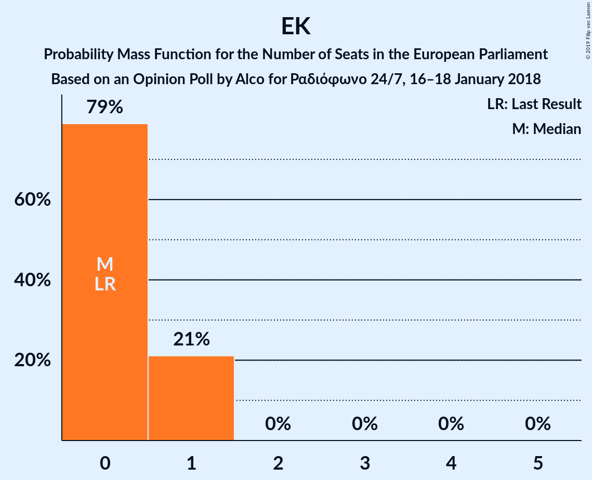
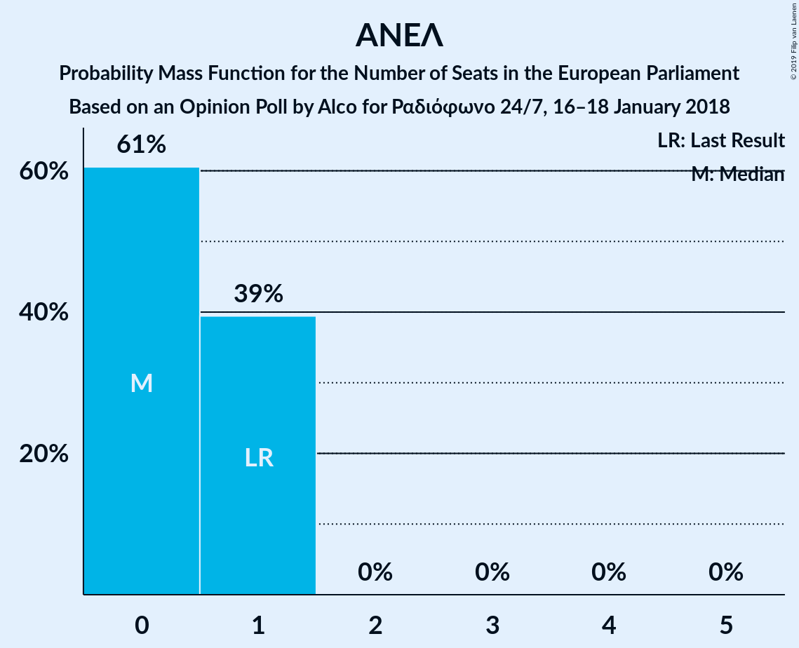

# Opinion Poll by Alco for Ραδιόφωνο 24/7, 16–18 January 2018

<a href="#voting-intentions">Voting Intentions</a> | <a href="#seats">Seats</a> | <a href="#coalitions">Coalitions</a> | <a href="#technical-information">Technical Information</a>

## Voting Intentions

### Confidence Intervals

| Party | Last Result | Poll Result | 80% Confidence Interval | 90% Confidence Interval | 95% Confidence Interval | 99% Confidence Interval |
|:-----:|:-----------:|:-----------:|:-----------------------:|:-----------------------:|:-----------------------:|:-----------------------:|
| Νέα Δημοκρατία (EPP) | 22.7% | 32.7% | 30.8–34.6% |30.3–35.2% |29.9–35.7% |29.0–36.6% |
| Συνασπισμός Ριζοσπαστικής Αριστεράς (GUE/NGL) | 26.6% | 25.0% | 23.3–26.8% |22.8–27.3% |22.4–27.8% |21.6–28.7% |
| Κίνημα Αλλαγής (S&D) | 0.0% | 9.7% | 8.6–11.0% |8.3–11.4% |8.0–11.7% |7.5–12.3% |
| Χρυσή Αυγή (NI) | 9.4% | 9.3% | 8.2–10.6% |7.9–10.9% |7.7–11.3% |7.2–11.9% |
| Κομμουνιστικό Κόμμα Ελλάδας (NI) | 6.1% | 7.3% | 6.3–8.5% |6.1–8.8% |5.8–9.1% |5.4–9.7% |
| Λαϊκή Ενότητα (GUE/NGL) | 0.0% | 4.0% | 3.3–4.9% |3.1–5.2% |2.9–5.4% |2.7–5.9% |
| Ανεξάρτητοι Έλληνες (ECR) | 3.5% | 2.9% | 2.3–3.7% |2.2–3.9% |2.0–4.1% |1.8–4.6% |
| Ένωση Κεντρώων (ALDE) | 0.6% | 2.6% | 2.1–3.4% |1.9–3.6% |1.8–3.8% |1.6–4.2% |

*Note:* The poll result column reflects the actual value used in the calculations. Published results may vary slightly, and in addition be rounded to fewer digits.

## Seats

### Confidence Intervals

| Party | Last Result | Median | 80% Confidence Interval | 90% Confidence Interval | 95% Confidence Interval | 99% Confidence Interval |
|:-----:|:-----------:|:------:|:-----------------------:|:-----------------------:|:-----------------------:|:-----------------------:|
| <a href="#νέα-δημοκρατία-(epp)">Νέα Δημοκρατία (EPP)</a> | 5 | 7 | 7 |7–8 |6–8 |6–8 |
| <a href="#συνασπισμός-ριζοσπαστικής-αριστεράς-(gue/ngl)">Συνασπισμός Ριζοσπαστικής Αριστεράς (GUE/NGL)</a> | 6 | 5 | 5–6 |5–6 |5–6 |5–6 |
| <a href="#κίνημα-αλλαγής-(s&d)">Κίνημα Αλλαγής (S&D)</a> | 0 | 2 | 2 |2 |2 |1–3 |
| <a href="#χρυσή-αυγή-(ni)">Χρυσή Αυγή (NI)</a> | 3 | 2 | 2 |2 |2 |2–3 |
| <a href="#κομμουνιστικό-κόμμα-ελλάδας-(ni)">Κομμουνιστικό Κόμμα Ελλάδας (NI)</a> | 2 | 2 | 1–2 |1–2 |1–2 |1–2 |
| <a href="#λαϊκή-ενότητα-(gue/ngl)">Λαϊκή Ενότητα (GUE/NGL)</a> | 0 | 1 | 1 |1 |1 |0–1 |
| <a href="#ανεξάρτητοι-έλληνες-(ecr)">Ανεξάρτητοι Έλληνες (ECR)</a> | 1 | 0 | 0–1 |0–1 |0–1 |0–1 |
| <a href="#ένωση-κεντρώων-(alde)">Ένωση Κεντρώων (ALDE)</a> | 0 | 0 | 0–1 |0–1 |0–1 |0–1 |

### Νέα Δημοκρατία (EPP)

*For a full overview of the results for this party, see the [Νέα Δημοκρατία (EPP)](party-νέαδημοκρατίαepp.html) page.*

| Number of Seats | Probability | Accumulated | Special Marks |
|:---------------:|:-----------:|:-----------:|:-------------:|
| 5 | 0% | 100% | Last Result |
| 6 | 3% | 100% |  |
| 7 | 89% | 97% | Median |
| 8 | 8% | 8% |  |
| 9 | 0% | 0% |  |

### Συνασπισμός Ριζοσπαστικής Αριστεράς (GUE/NGL)

*For a full overview of the results for this party, see the [Συνασπισμός Ριζοσπαστικής Αριστεράς (GUE/NGL)](party-συνασπισμόςριζοσπαστικήςαριστεράςguengl.html) page.*

| Number of Seats | Probability | Accumulated | Special Marks |
|:---------------:|:-----------:|:-----------:|:-------------:|
| 4 | 0.1% | 100% |  |
| 5 | 57% | 99.9% | Median |
| 6 | 43% | 43% | Last Result |
| 7 | 0% | 0% |  |

### Κίνημα Αλλαγής (S&D)

*For a full overview of the results for this party, see the [Κίνημα Αλλαγής (S&D)](party-κίνημααλλαγήςsd.html) page.*

| Number of Seats | Probability | Accumulated | Special Marks |
|:---------------:|:-----------:|:-----------:|:-------------:|
| 0 | 0% | 100% | Last Result |
| 1 | 0.5% | 100% |  |
| 2 | 98% | 99.5% | Median |
| 3 | 2% | 2% |  |
| 4 | 0% | 0% |  |

### Χρυσή Αυγή (NI)

*For a full overview of the results for this party, see the [Χρυσή Αυγή (NI)](party-χρυσήαυγήni.html) page.*

| Number of Seats | Probability | Accumulated | Special Marks |
|:---------------:|:-----------:|:-----------:|:-------------:|
| 1 | 0.3% | 100% |  |
| 2 | 98.9% | 99.7% | Median |
| 3 | 0.8% | 0.8% | Last Result |
| 4 | 0% | 0% |  |

### Κομμουνιστικό Κόμμα Ελλάδας (NI)

*For a full overview of the results for this party, see the [Κομμουνιστικό Κόμμα Ελλάδας (NI)](party-κομμουνιστικόκόμμαελλάδαςni.html) page.*

| Number of Seats | Probability | Accumulated | Special Marks |
|:---------------:|:-----------:|:-----------:|:-------------:|
| 1 | 39% | 100% |  |
| 2 | 61% | 61% | Last Result, Median |
| 3 | 0% | 0% |  |

### Λαϊκή Ενότητα (GUE/NGL)

*For a full overview of the results for this party, see the [Λαϊκή Ενότητα (GUE/NGL)](party-λαϊκήενότηταguengl.html) page.*

| Number of Seats | Probability | Accumulated | Special Marks |
|:---------------:|:-----------:|:-----------:|:-------------:|
| 0 | 2% | 100% | Last Result |
| 1 | 98% | 98% | Median |
| 2 | 0% | 0% |  |

### Ανεξάρτητοι Έλληνες (ECR)

*For a full overview of the results for this party, see the [Ανεξάρτητοι Έλληνες (ECR)](party-ανεξάρτητοιέλληνεςecr.html) page.*

| Number of Seats | Probability | Accumulated | Special Marks |
|:---------------:|:-----------:|:-----------:|:-------------:|
| 0 | 54% | 100% | Median |
| 1 | 46% | 46% | Last Result |
| 2 | 0% | 0% |  |

### Ένωση Κεντρώων (ALDE)

*For a full overview of the results for this party, see the [Ένωση Κεντρώων (ALDE)](party-ένωσηκεντρώωνalde.html) page.*

| Number of Seats | Probability | Accumulated | Special Marks |
|:---------------:|:-----------:|:-----------:|:-------------:|
| 0 | 79% | 100% | Last Result, Median |
| 1 | 21% | 21% |  |
| 2 | 0% | 0% |  |

## Coalitions

### Confidence Intervals

| Coalition | Last Result | Median | Majority? | 80% Confidence Interval | 90% Confidence Interval | 95% Confidence Interval | 99% Confidence Interval |
|:---------:|:-----------:|:------:|:---------:|:-----------------------:|:-----------------------:|:-----------------------:|:-----------------------:|
| Νέα Δημοκρατία (EPP) | 5 | 7 | 0% | 7 | 7–8 | 6–8 | 6–8 |
| Χρυσή Αυγή (NI) – Κομμουνιστικό Κόμμα Ελλάδας (NI) | 5 | 4 | 0% | 3–4 | 3–4 | 3–4 | 3–4 |
| Ένωση Κεντρώων (ALDE) | 0 | 0 | 0% | 0–1 | 0–1 | 0–1 | 0–1 |
| Ανεξάρτητοι Έλληνες (ECR) | 1 | 0 | 0% | 0–1 | 0–1 | 0–1 | 0–1 |

### Νέα Δημοκρατία (EPP)

| Number of Seats | Probability | Accumulated | Special Marks |
|:---------------:|:-----------:|:-----------:|:-------------:|
| 5 | 0% | 100% | Last Result |
| 6 | 3% | 100% |  |
| 7 | 89% | 97% | Median |
| 8 | 8% | 8% |  |
| 9 | 0% | 0% |  |

### Χρυσή Αυγή (NI) – Κομμουνιστικό Κόμμα Ελλάδας (NI)

| Number of Seats | Probability | Accumulated | Special Marks |
|:---------------:|:-----------:|:-----------:|:-------------:|
| 2 | 0.2% | 100% |  |
| 3 | 38% | 99.8% |  |
| 4 | 61% | 62% | Median |
| 5 | 0.3% | 0.3% | Last Result |
| 6 | 0% | 0% |  |

### Ένωση Κεντρώων (ALDE)

| Number of Seats | Probability | Accumulated | Special Marks |
|:---------------:|:-----------:|:-----------:|:-------------:|
| 0 | 79% | 100% | Last Result, Median |
| 1 | 21% | 21% |  |
| 2 | 0% | 0% |  |

### Ανεξάρτητοι Έλληνες (ECR)

| Number of Seats | Probability | Accumulated | Special Marks |
|:---------------:|:-----------:|:-----------:|:-------------:|
| 0 | 54% | 100% | Median |
| 1 | 46% | 46% | Last Result |
| 2 | 0% | 0% |  |

## Technical Information

### Opinion Poll

+ **Polling firm:** Alco
+ **Commissioner(s):** Ραδιόφωνο 24/7
+ **Fieldwork period:** 16–18 January 2018

### Calculations

+ **Sample size:** 1000
+ **Simulations done:** 131,072
+ **Error estimate:** 1.46%

