# Opinion Poll by Public Issue, 8–18 January 2018

<a href="#voting-intentions">Voting Intentions</a> | <a href="#seats">Seats</a> | <a href="#coalitions">Coalitions</a> | <a href="#technical-information">Technical Information</a>

## Voting Intentions

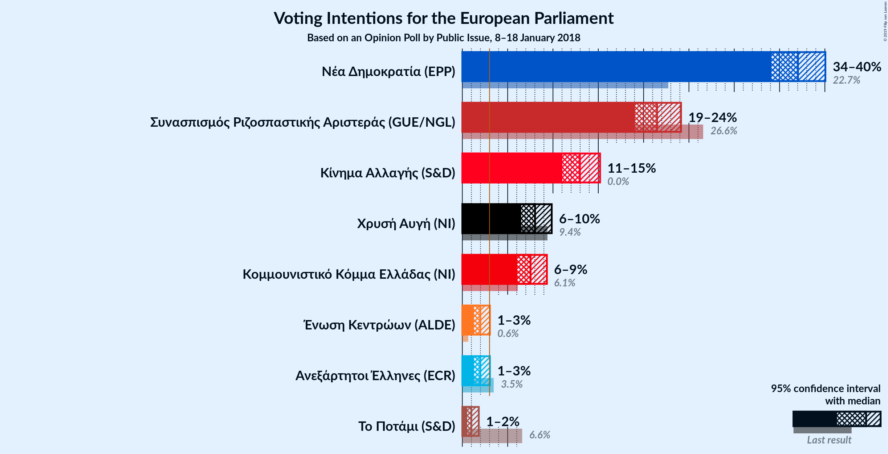

### Confidence Intervals

| Party | Last Result | Poll Result | 80% Confidence Interval | 90% Confidence Interval | 95% Confidence Interval | 99% Confidence Interval |
|:-----:|:-----------:|:-----------:|:-----------------------:|:-----------------------:|:-----------------------:|:-----------------------:|
| Νέα Δημοκρατία (EPP) | 22.7% | 37.0% | 35.1–39.0% |34.6–39.6% |34.1–40.1% |33.2–41.0% |
| Συνασπισμός Ριζοσπαστικής Αριστεράς (GUE/NGL) | 26.6% | 21.5% | 19.9–23.2% |19.4–23.7% |19.1–24.1% |18.3–25.0% |
| Κίνημα Αλλαγής (S&D) | 0.0% | 13.0% | 11.7–14.4% |11.3–14.8% |11.0–15.2% |10.5–15.9% |
| Χρυσή Αυγή (NI) | 9.4% | 8.0% | 7.0–9.2% |6.7–9.6% |6.5–9.9% |6.1–10.5% |
| Κομμουνιστικό Κόμμα Ελλάδας (NI) | 6.1% | 7.5% | 6.6–8.7% |6.3–9.0% |6.1–9.3% |5.6–9.9% |
| Ανεξάρτητοι Έλληνες (ECR) | 3.5% | 2.0% | 1.5–2.7% |1.4–2.9% |1.3–3.0% |1.1–3.4% |
| Ένωση Κεντρώων (ALDE) | 0.6% | 2.0% | 1.5–2.7% |1.4–2.9% |1.3–3.0% |1.1–3.4% |
| Το Ποτάμι (S&D) | 6.6% | 1.0% | 0.7–1.5% |0.6–1.7% |0.5–1.8% |0.4–2.1% |

*Note:* The poll result column reflects the actual value used in the calculations. Published results may vary slightly, and in addition be rounded to fewer digits.

## Seats

### Confidence Intervals

| Party | Last Result | Median | 80% Confidence Interval | 90% Confidence Interval | 95% Confidence Interval | 99% Confidence Interval |
|:-----:|:-----------:|:------:|:-----------------------:|:-----------------------:|:-----------------------:|:-----------------------:|
| <a href="#νέα-δημοκρατία-(epp)">Νέα Δημοκρατία (EPP)</a> | 5 | 8 | 8 |8 |7–8 |7–9 |
| <a href="#συνασπισμός-ριζοσπαστικής-αριστεράς-(gue/ngl)">Συνασπισμός Ριζοσπαστικής Αριστεράς (GUE/NGL)</a> | 6 | 5 | 4–5 |4–5 |4–5 |4–5 |
| <a href="#κίνημα-αλλαγής-(s&d)">Κίνημα Αλλαγής (S&D)</a> | 0 | 3 | 3 |3 |2–3 |2–3 |
| <a href="#χρυσή-αυγή-(ni)">Χρυσή Αυγή (NI)</a> | 3 | 2 | 1–2 |1–2 |1–2 |1–2 |
| <a href="#κομμουνιστικό-κόμμα-ελλάδας-(ni)">Κομμουνιστικό Κόμμα Ελλάδας (NI)</a> | 2 | 2 | 1–2 |1–2 |1–2 |1–2 |
| <a href="#ανεξάρτητοι-έλληνες-(ecr)">Ανεξάρτητοι Έλληνες (ECR)</a> | 1 | 0 | 0 |0 |0 |0–1 |
| <a href="#ένωση-κεντρώων-(alde)">Ένωση Κεντρώων (ALDE)</a> | 0 | 0 | 0 |0 |0 |0–1 |
| <a href="#το-ποτάμι-(s&d)">Το Ποτάμι (S&D)</a> | 2 | 0 | 0 |0 |0 |0 |

### Νέα Δημοκρατία (EPP)

*For a full overview of the results for this party, see the [Νέα Δημοκρατία (EPP)](party-νέαδημοκρατίαepp.html) page.*

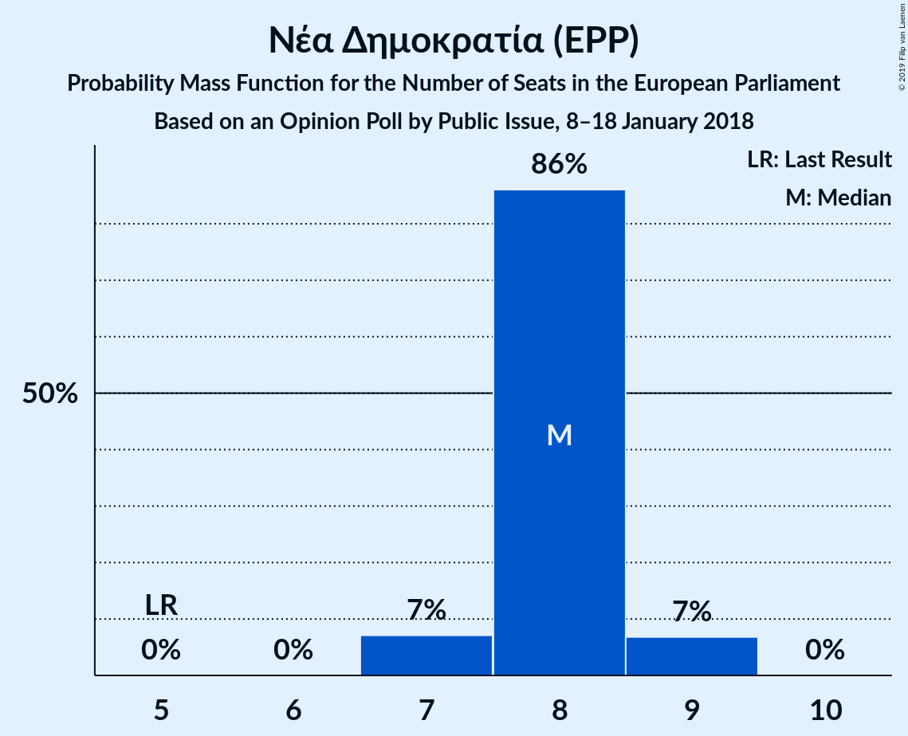

| Number of Seats | Probability | Accumulated | Special Marks |
|:---------------:|:-----------:|:-----------:|:-------------:|
| 5 | 0% | 100% | Last Result |
| 6 | 0% | 100% |  |
| 7 | 4% | 100% |  |
| 8 | 94% | 96% | Median |
| 9 | 2% | 2% |  |
| 10 | 0% | 0% |  |

### Συνασπισμός Ριζοσπαστικής Αριστεράς (GUE/NGL)

*For a full overview of the results for this party, see the [Συνασπισμός Ριζοσπαστικής Αριστεράς (GUE/NGL)](party-συνασπισμόςριζοσπαστικήςαριστεράςguengl.html) page.*

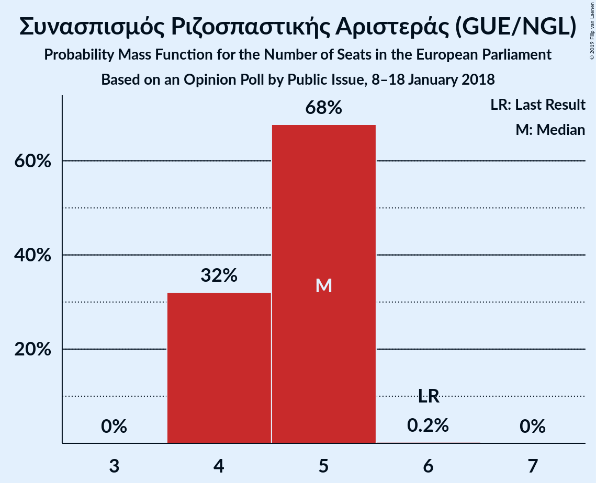

| Number of Seats | Probability | Accumulated | Special Marks |
|:---------------:|:-----------:|:-----------:|:-------------:|
| 4 | 33% | 100% |  |
| 5 | 67% | 67% | Median |
| 6 | 0.3% | 0.3% | Last Result |
| 7 | 0% | 0% |  |

### Κίνημα Αλλαγής (S&D)

*For a full overview of the results for this party, see the [Κίνημα Αλλαγής (S&D)](party-κίνημααλλαγήςsd.html) page.*

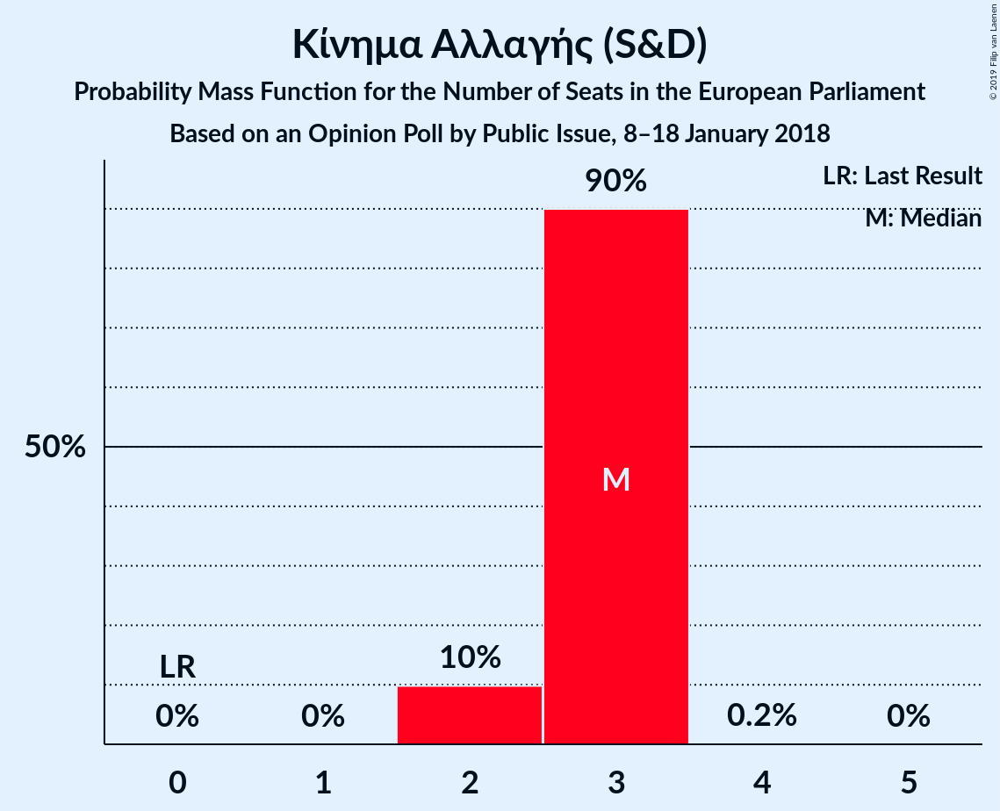

| Number of Seats | Probability | Accumulated | Special Marks |
|:---------------:|:-----------:|:-----------:|:-------------:|
| 0 | 0% | 100% | Last Result |
| 1 | 0% | 100% |  |
| 2 | 3% | 100% |  |
| 3 | 97% | 97% | Median |
| 4 | 0.3% | 0.3% |  |
| 5 | 0% | 0% |  |

### Χρυσή Αυγή (NI)

*For a full overview of the results for this party, see the [Χρυσή Αυγή (NI)](party-χρυσήαυγήni.html) page.*

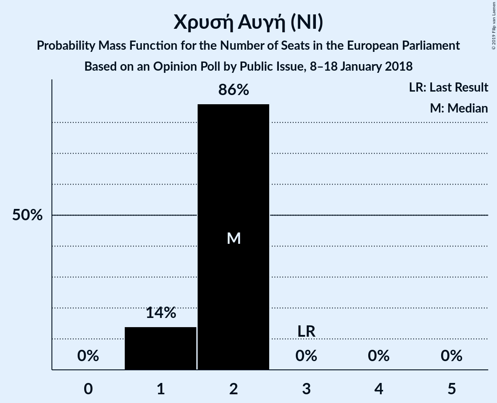

| Number of Seats | Probability | Accumulated | Special Marks |
|:---------------:|:-----------:|:-----------:|:-------------:|
| 1 | 12% | 100% |  |
| 2 | 88% | 88% | Median |
| 3 | 0% | 0% | Last Result |

### Κομμουνιστικό Κόμμα Ελλάδας (NI)

*For a full overview of the results for this party, see the [Κομμουνιστικό Κόμμα Ελλάδας (NI)](party-κομμουνιστικόκόμμαελλάδαςni.html) page.*

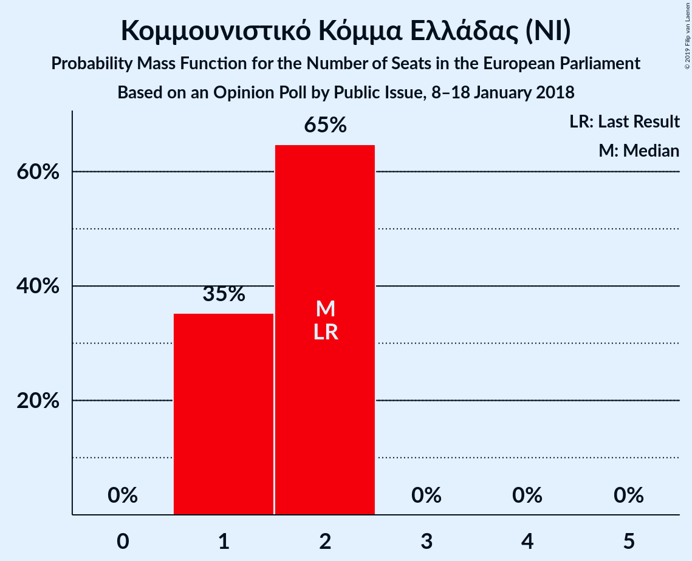

| Number of Seats | Probability | Accumulated | Special Marks |
|:---------------:|:-----------:|:-----------:|:-------------:|
| 1 | 49% | 100% |  |
| 2 | 51% | 51% | Last Result, Median |
| 3 | 0% | 0% |  |

### Ανεξάρτητοι Έλληνες (ECR)

*For a full overview of the results for this party, see the [Ανεξάρτητοι Έλληνες (ECR)](party-ανεξάρτητοιέλληνεςecr.html) page.*

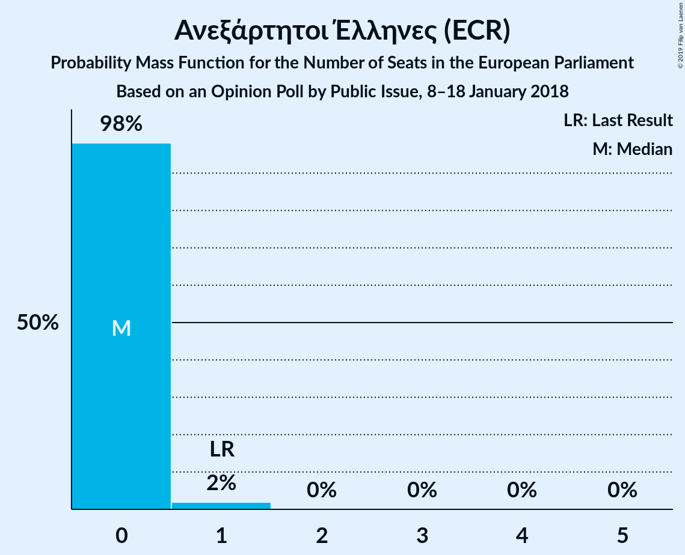

| Number of Seats | Probability | Accumulated | Special Marks |
|:---------------:|:-----------:|:-----------:|:-------------:|
| 0 | 98.6% | 100% | Median |
| 1 | 1.4% | 1.4% | Last Result |
| 2 | 0% | 0% |  |

### Ένωση Κεντρώων (ALDE)

*For a full overview of the results for this party, see the [Ένωση Κεντρώων (ALDE)](party-ένωσηκεντρώωνalde.html) page.*

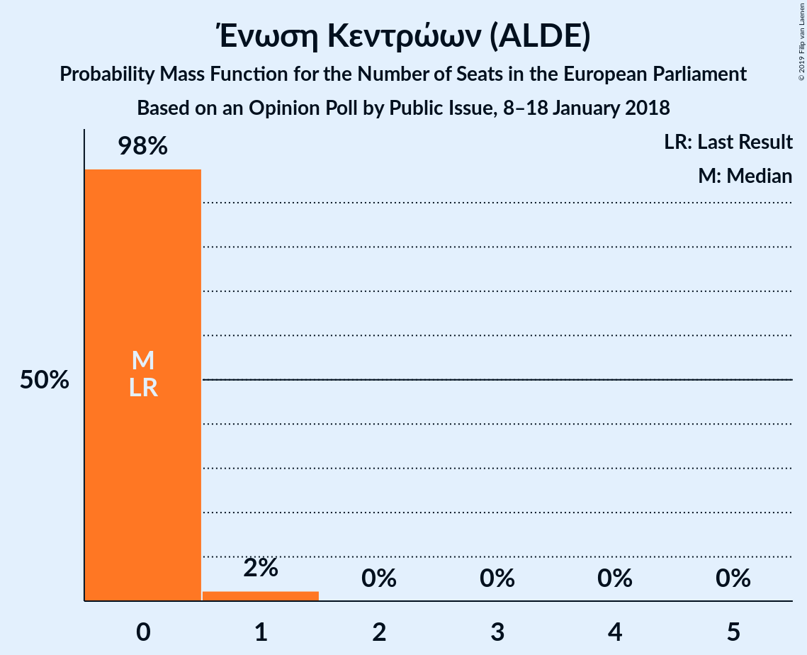

| Number of Seats | Probability | Accumulated | Special Marks |
|:---------------:|:-----------:|:-----------:|:-------------:|
| 0 | 98% | 100% | Last Result, Median |
| 1 | 2% | 2% |  |
| 2 | 0% | 0% |  |

### Το Ποτάμι (S&D)

*For a full overview of the results for this party, see the [Το Ποτάμι (S&D)](party-τοποτάμιsd.html) page.*

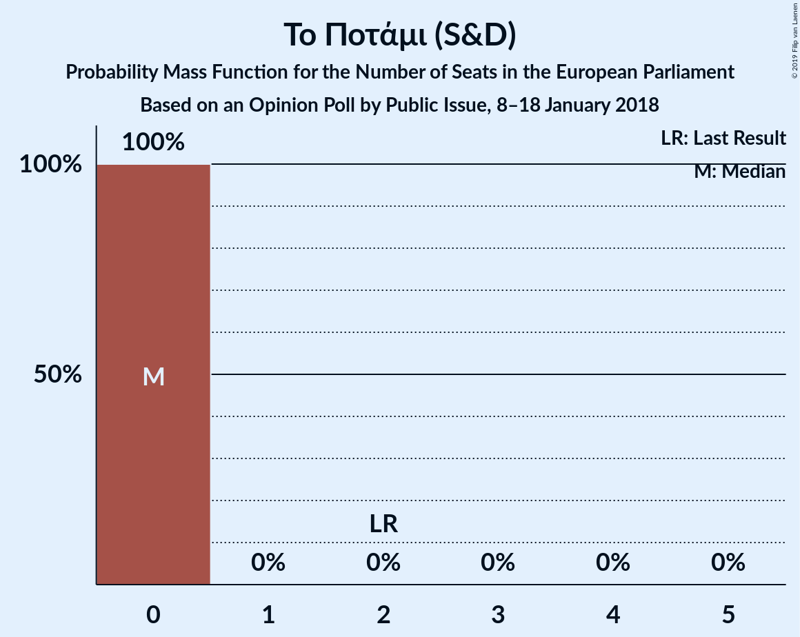

| Number of Seats | Probability | Accumulated | Special Marks |
|:---------------:|:-----------:|:-----------:|:-------------:|
| 0 | 100% | 100% | Median |
| 1 | 0% | 0% |  |
| 2 | 0% | 0% | Last Result |

## Coalitions

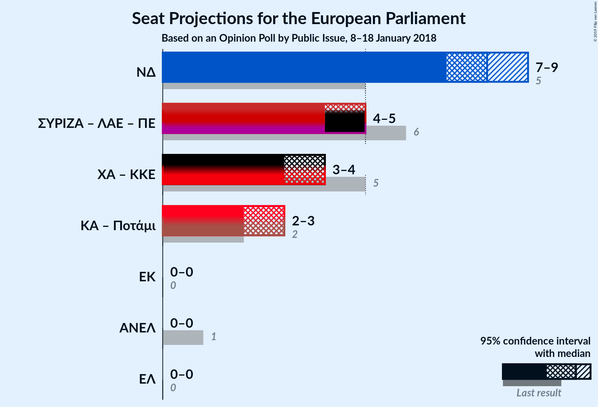

### Confidence Intervals

| Coalition | Last Result | Median | Majority? | 80% Confidence Interval | 90% Confidence Interval | 95% Confidence Interval | 99% Confidence Interval |
|:---------:|:-----------:|:------:|:---------:|:-----------------------:|:-----------------------:|:-----------------------:|:-----------------------:|
| Νέα Δημοκρατία (EPP) | 5 | 8 | 0% | 8 | 8 | 7–8 | 7–9 |
| Χρυσή Αυγή (NI) – Κομμουνιστικό Κόμμα Ελλάδας (NI) | 5 | 3 | 0% | 3–4 | 3–4 | 3–4 | 2–4 |
| Κίνημα Αλλαγής (S&D) – Το Ποτάμι (S&D) | 2 | 3 | 0% | 3 | 3 | 2–3 | 2–3 |
| Ένωση Κεντρώων (ALDE) | 0 | 0 | 0% | 0 | 0 | 0 | 0–1 |
| Ανεξάρτητοι Έλληνες (ECR) | 1 | 0 | 0% | 0 | 0 | 0 | 0–1 |

### Νέα Δημοκρατία (EPP)

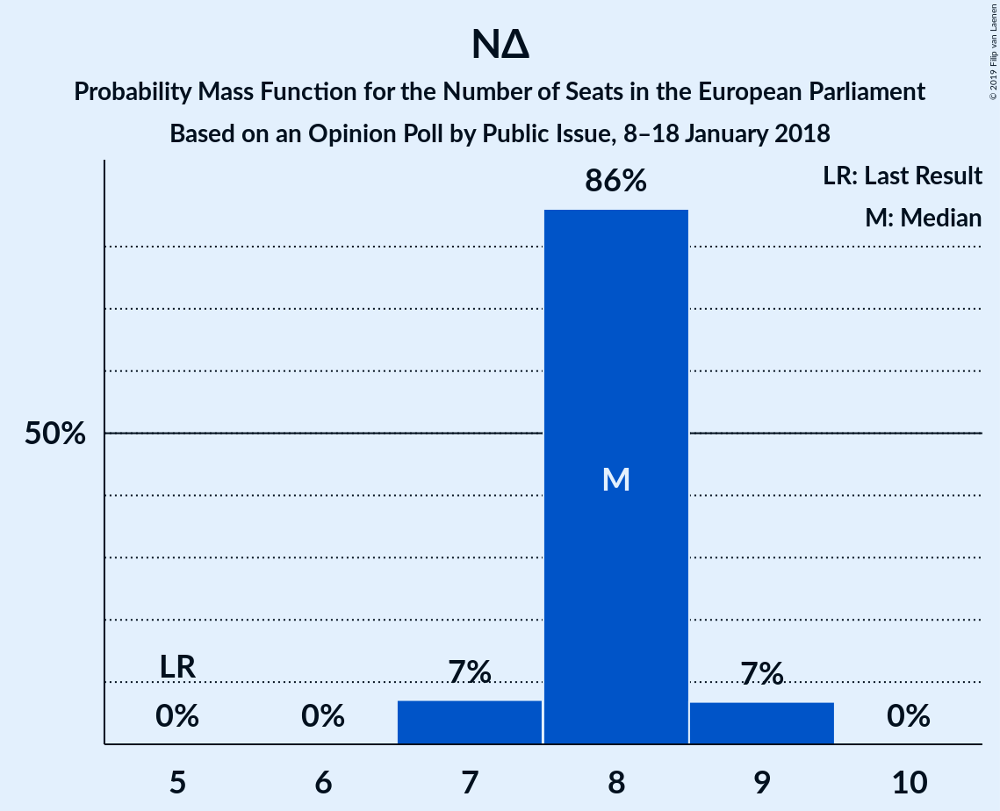

| Number of Seats | Probability | Accumulated | Special Marks |
|:---------------:|:-----------:|:-----------:|:-------------:|
| 5 | 0% | 100% | Last Result |
| 6 | 0% | 100% |  |
| 7 | 4% | 100% |  |
| 8 | 94% | 96% | Median |
| 9 | 2% | 2% |  |
| 10 | 0% | 0% |  |

### Χρυσή Αυγή (NI) – Κομμουνιστικό Κόμμα Ελλάδας (NI)

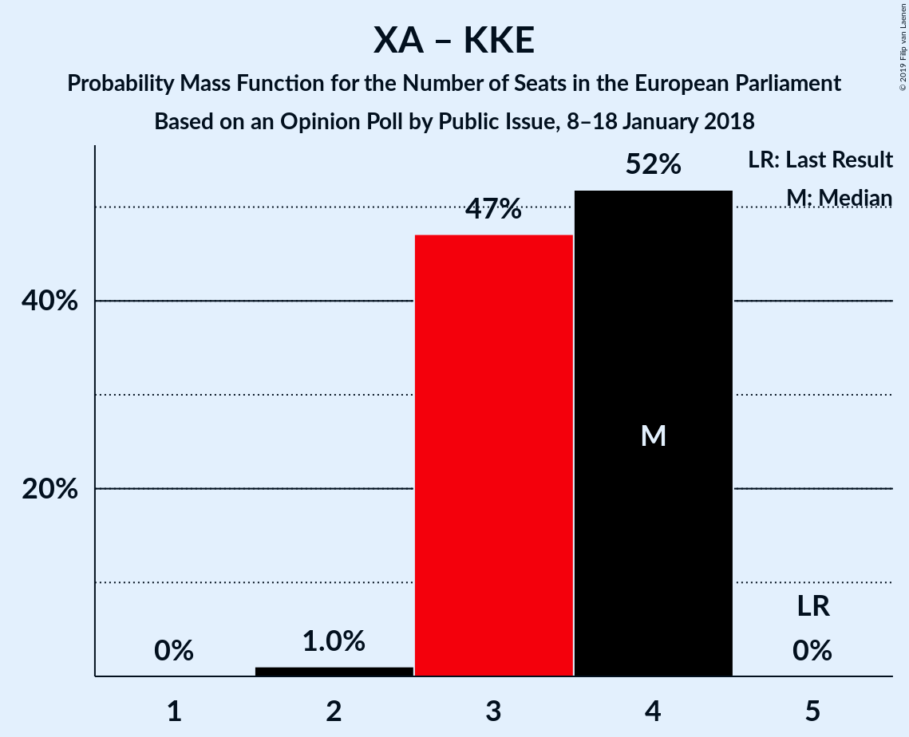

| Number of Seats | Probability | Accumulated | Special Marks |
|:---------------:|:-----------:|:-----------:|:-------------:|
| 2 | 1.1% | 100% |  |
| 3 | 59% | 98.9% |  |
| 4 | 40% | 40% | Median |
| 5 | 0% | 0% | Last Result |

### Κίνημα Αλλαγής (S&D) – Το Ποτάμι (S&D)

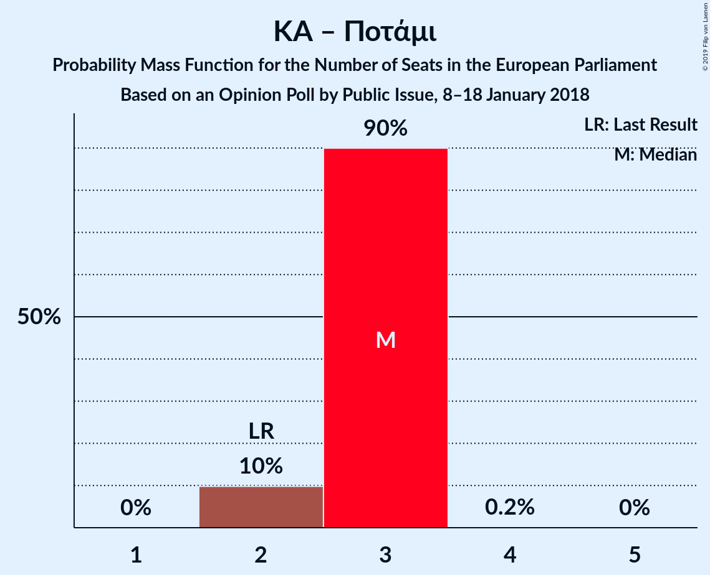

| Number of Seats | Probability | Accumulated | Special Marks |
|:---------------:|:-----------:|:-----------:|:-------------:|
| 2 | 3% | 100% | Last Result |
| 3 | 97% | 97% | Median |
| 4 | 0.3% | 0.3% |  |
| 5 | 0% | 0% |  |

### Ένωση Κεντρώων (ALDE)

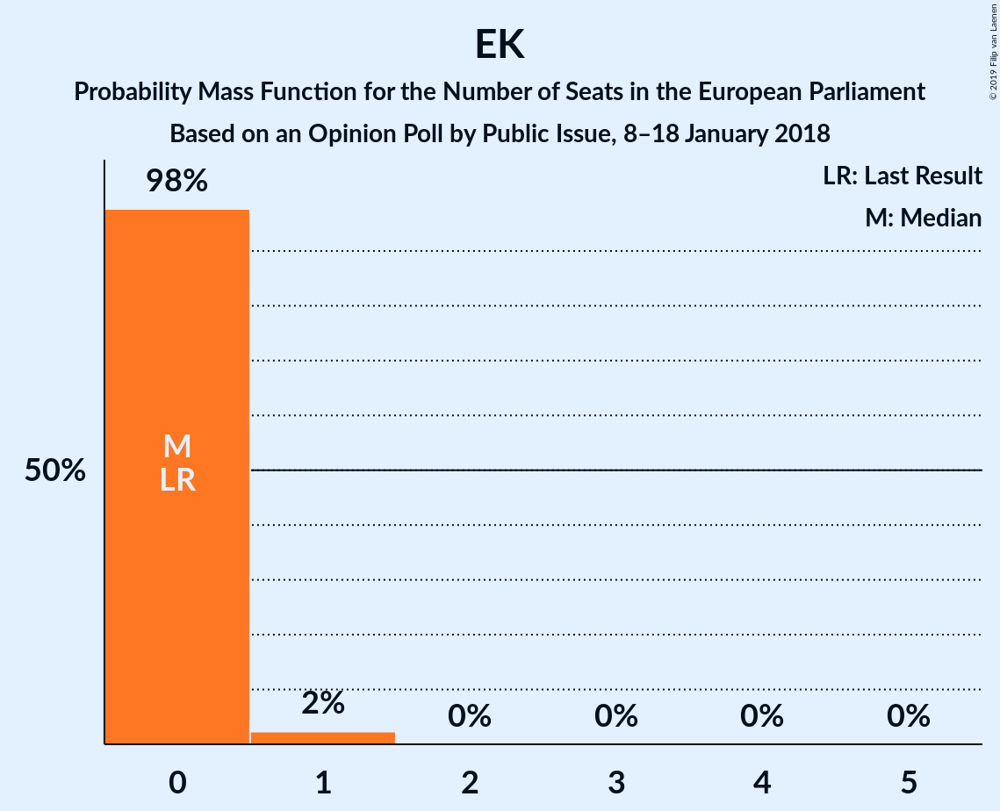

| Number of Seats | Probability | Accumulated | Special Marks |
|:---------------:|:-----------:|:-----------:|:-------------:|
| 0 | 98% | 100% | Last Result, Median |
| 1 | 2% | 2% |  |
| 2 | 0% | 0% |  |

### Ανεξάρτητοι Έλληνες (ECR)

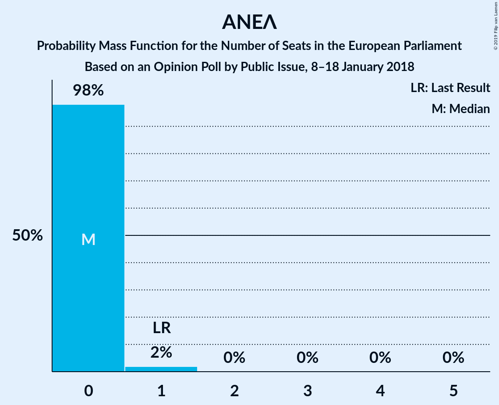

| Number of Seats | Probability | Accumulated | Special Marks |
|:---------------:|:-----------:|:-----------:|:-------------:|
| 0 | 98.6% | 100% | Median |
| 1 | 1.4% | 1.4% | Last Result |
| 2 | 0% | 0% |  |

## Technical Information

### Opinion Poll

+ **Polling firm:** Public Issue
+ **Commissioner(s):** —
+ **Fieldwork period:** 8–18 January 2018

### Calculations

+ **Sample size:** 1010
+ **Simulations done:** 131,072
+ **Error estimate:** 1.13%

