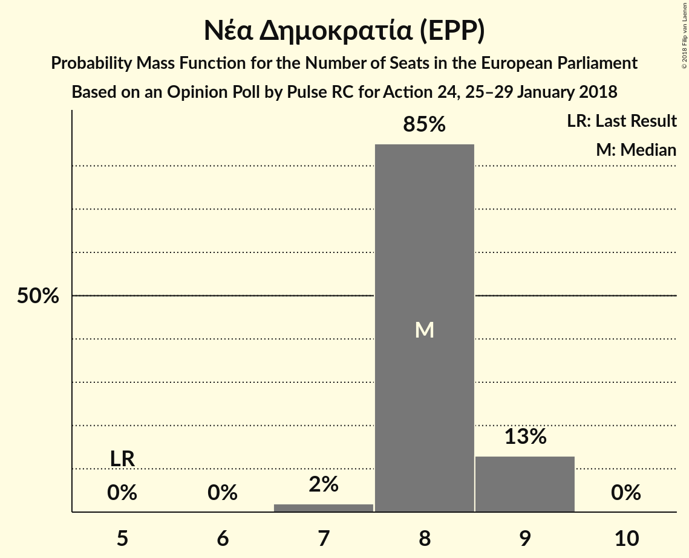
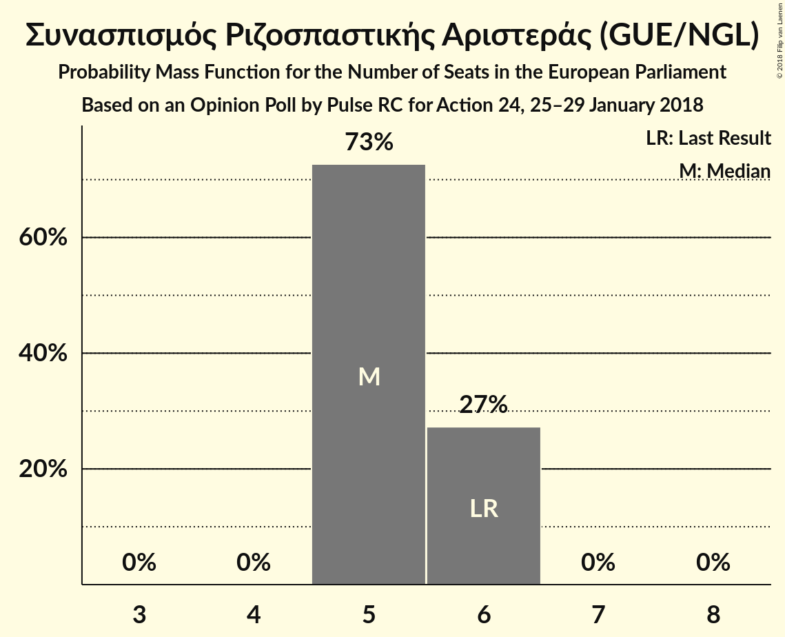
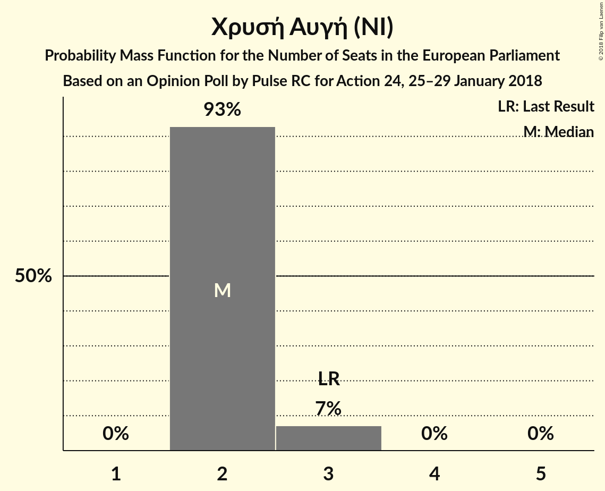
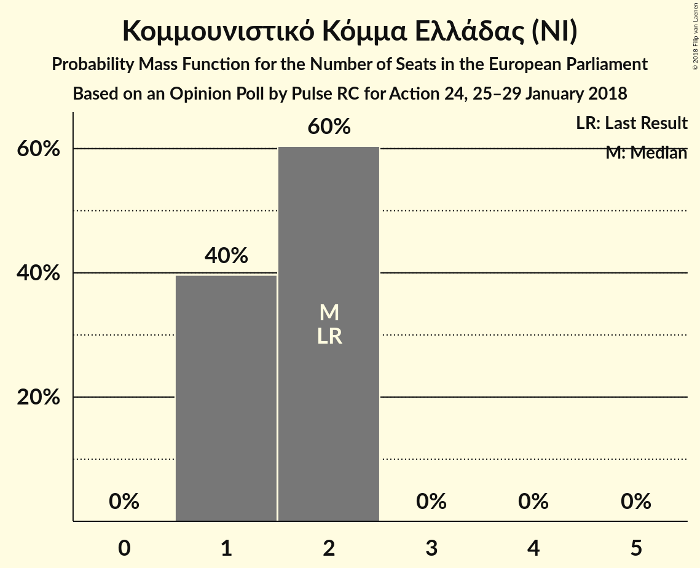
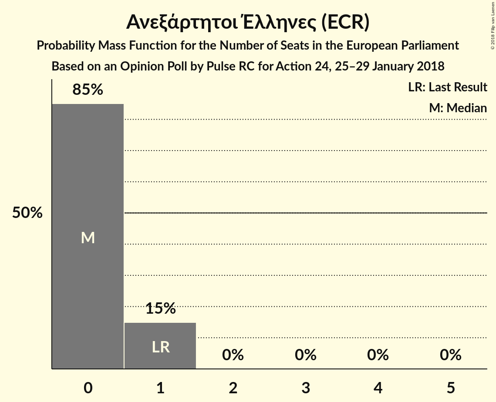
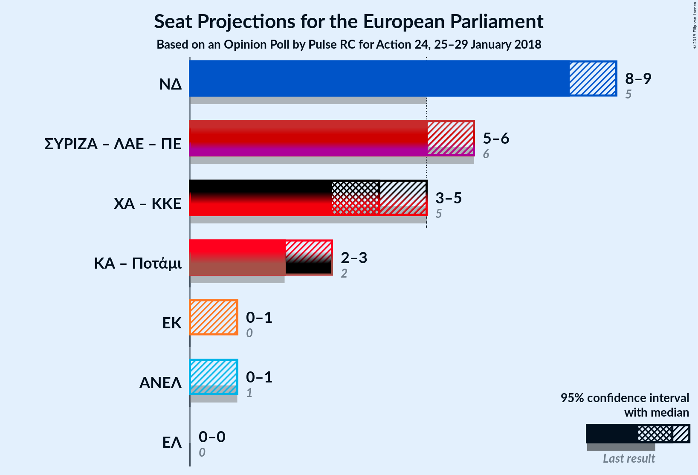

# Opinion Poll by Pulse RC for Action 24, 25–29 January 2018

<a href="#voting-intentions">Voting Intentions</a> | <a href="#seats">Seats</a> | <a href="#coalitions">Coalitions</a> | <a href="#technical-information">Technical Information</a>

## Voting Intentions

### Confidence Intervals

| Party | Last Result | Poll Result | 80% Confidence Interval | 90% Confidence Interval | 95% Confidence Interval | 99% Confidence Interval |
|:-----:|:-----------:|:-----------:|:-----------------------:|:-----------------------:|:-----------------------:|:-----------------------:|
| Νέα Δημοκρατία (EPP) | 22.7% | 36.5% | 34.9–38.1% |34.5–38.6% |34.1–39.0% |33.4–39.7% |
| Συνασπισμός Ριζοσπαστικής Αριστεράς (GUE/NGL) | 26.6% | 24.0% | 22.6–25.4% |22.2–25.8% |21.9–26.2% |21.2–26.9% |
| Κίνημα Αλλαγής (S&D) | 0.0% | 10.5% | 9.5–11.6% |9.3–11.9% |9.0–12.1% |8.6–12.7% |
| Χρυσή Αυγή (NI) | 9.4% | 9.5% | 8.6–10.5% |8.3–10.8% |8.1–11.1% |7.7–11.6% |
| Κομμουνιστικό Κόμμα Ελλάδας (NI) | 6.1% | 6.5% | 5.8–7.4% |5.6–7.7% |5.4–7.9% |5.0–8.3% |
| Ανεξάρτητοι Έλληνες (ECR) | 3.5% | 2.5% | 2.1–3.1% |1.9–3.3% |1.8–3.4% |1.6–3.7% |
| Ένωση Κεντρώων (ALDE) | 0.7% | 2.5% | 2.1–3.1% |1.9–3.3% |1.8–3.4% |1.6–3.7% |
| Λαϊκή Ενότητα (GUE/NGL) | 0.0% | 1.0% | 0.7–1.4% |0.7–1.5% |0.6–1.6% |0.5–1.9% |
| Πλεύση Ελευθερίας (GUE/NGL) | 0.0% | 1.0% | 0.7–1.4% |0.7–1.5% |0.6–1.6% |0.5–1.9% |

*Note:* The poll result column reflects the actual value used in the calculations. Published results may vary slightly, and in addition be rounded to fewer digits.

## Seats

### Confidence Intervals

| Party | Last Result | Median | 80% Confidence Interval | 90% Confidence Interval | 95% Confidence Interval | 99% Confidence Interval |
|:-----:|:-----------:|:------:|:-----------------------:|:-----------------------:|:-----------------------:|:-----------------------:|
| <a href="#Νέα-Δημοκρατία-(epp)">Νέα Δημοκρατία (EPP)</a> | 5 | 8 | 8 |8 |8 |8 |
| <a href="#Συνασπισμός-Ριζοσπαστικής-Αριστεράς-(gue/ngl)">Συνασπισμός Ριζοσπαστικής Αριστεράς (GUE/NGL)</a> | 6 | 5 | 5 |5 |5 |5 |
| <a href="#Κίνημα-Αλλαγής-(s&d)">Κίνημα Αλλαγής (S&D)</a> | 0 | 2 | 2 |2 |2 |2 |
| <a href="#Χρυσή-Αυγή-(ni)">Χρυσή Αυγή (NI)</a> | 3 | 2 | 2 |2 |2 |2 |
| <a href="#Κομμουνιστικό-Κόμμα-Ελλάδας-(ni)">Κομμουνιστικό Κόμμα Ελλάδας (NI)</a> | 2 | 1 | 1 |1 |1 |1 |
| <a href="#Ανεξάρτητοι-Έλληνες-(ecr)">Ανεξάρτητοι Έλληνες (ECR)</a> | 1 | 0 | 0 |0 |0 |0 |
| <a href="#Ένωση-Κεντρώων-(alde)">Ένωση Κεντρώων (ALDE)</a> | 0 | 1 | 1 |1 |1 |1 |
| <a href="#Λαϊκή-Ενότητα-(gue/ngl)">Λαϊκή Ενότητα (GUE/NGL)</a> | 0 | 0 | 0 |0 |0 |0 |
| <a href="#Πλεύση-Ελευθερίας-(gue/ngl)">Πλεύση Ελευθερίας (GUE/NGL)</a> | 0 | 0 | 0 |0 |0 |0 |

### Νέα Δημοκρατία (EPP)

*For a full overview of the results for this party, see the [Νέα Δημοκρατία (EPP)](party-ΝέαΔημοκρατίαepp.html) page.*

| Number of Seats | Probability | Accumulated | Special Marks |
|:---------------:|:-----------:|:-----------:|:-------------:|
| 5 | 0% | 100% | Last Result |
| 6 | 0% | 100% |  |
| 7 | 0% | 100% |  |
| 8 | 100% | 100% | Median |

### Συνασπισμός Ριζοσπαστικής Αριστεράς (GUE/NGL)

*For a full overview of the results for this party, see the [Συνασπισμός Ριζοσπαστικής Αριστεράς (GUE/NGL)](party-ΣυνασπισμόςΡιζοσπαστικήςΑριστεράςguengl.html) page.*

| Number of Seats | Probability | Accumulated | Special Marks |
|:---------------:|:-----------:|:-----------:|:-------------:|
| 5 | 99.9% | 100% | Median |
| 6 | 0.1% | 0.1% | Last Result |
| 7 | 0% | 0% |  |

### Κίνημα Αλλαγής (S&D)

*For a full overview of the results for this party, see the [Κίνημα Αλλαγής (S&D)](party-ΚίνημαΑλλαγήςsd.html) page.*

| Number of Seats | Probability | Accumulated | Special Marks |
|:---------------:|:-----------:|:-----------:|:-------------:|
| 0 | 0% | 100% | Last Result |
| 1 | 0% | 100% |  |
| 2 | 99.8% | 100% | Median |
| 3 | 0.2% | 0.2% |  |
| 4 | 0% | 0% |  |

### Χρυσή Αυγή (NI)

*For a full overview of the results for this party, see the [Χρυσή Αυγή (NI)](party-ΧρυσήΑυγήni.html) page.*

| Number of Seats | Probability | Accumulated | Special Marks |
|:---------------:|:-----------:|:-----------:|:-------------:|
| 2 | 100% | 100% | Median |
| 3 | 0% | 0% | Last Result |

### Κομμουνιστικό Κόμμα Ελλάδας (NI)

*For a full overview of the results for this party, see the [Κομμουνιστικό Κόμμα Ελλάδας (NI)](party-ΚομμουνιστικόΚόμμαΕλλάδαςni.html) page.*

| Number of Seats | Probability | Accumulated | Special Marks |
|:---------------:|:-----------:|:-----------:|:-------------:|
| 1 | 99.9% | 100% | Median |
| 2 | 0.1% | 0.1% | Last Result |
| 3 | 0% | 0% |  |

### Ανεξάρτητοι Έλληνες (ECR)

*For a full overview of the results for this party, see the [Ανεξάρτητοι Έλληνες (ECR)](party-ΑνεξάρτητοιΈλληνεςecr.html) page.*

| Number of Seats | Probability | Accumulated | Special Marks |
|:---------------:|:-----------:|:-----------:|:-------------:|
| 0 | 99.9% | 100% | Median |
| 1 | 0.1% | 0.1% | Last Result |
| 2 | 0% | 0% |  |

### Ένωση Κεντρώων (ALDE)

*For a full overview of the results for this party, see the [Ένωση Κεντρώων (ALDE)](party-ΈνωσηΚεντρώωνalde.html) page.*

| Number of Seats | Probability | Accumulated | Special Marks |
|:---------------:|:-----------:|:-----------:|:-------------:|
| 0 | 0.1% | 100% | Last Result |
| 1 | 99.9% | 99.9% | Median |
| 2 | 0% | 0% |  |

### Λαϊκή Ενότητα (GUE/NGL)

*For a full overview of the results for this party, see the [Λαϊκή Ενότητα (GUE/NGL)](party-ΛαϊκήΕνότηταguengl.html) page.*

| Number of Seats | Probability | Accumulated | Special Marks |
|:---------------:|:-----------:|:-----------:|:-------------:|
| 0 | 100% | 100% | Last Result, Median |

### Πλεύση Ελευθερίας (GUE/NGL)

*For a full overview of the results for this party, see the [Πλεύση Ελευθερίας (GUE/NGL)](party-ΠλεύσηΕλευθερίαςguengl.html) page.*

| Number of Seats | Probability | Accumulated | Special Marks |
|:---------------:|:-----------:|:-----------:|:-------------:|
| 0 | 100% | 100% | Last Result, Median |

## Coalitions

### Confidence Intervals

| Coalition | Last Result | Median | Majority? | 80% Confidence Interval | 90% Confidence Interval | 95% Confidence Interval | 99% Confidence Interval |
|:---------:|:-----------:|:------:|:---------:|:-----------------------:|:-----------------------:|:-----------------------:|:-----------------------:|
| Νέα Δημοκρατία (EPP) | 5 | 8 | 0% | 8 | 8 | 8 | 8 |
| Συνασπισμός Ριζοσπαστικής Αριστεράς (GUE/NGL) – Λαϊκή Ενότητα (GUE/NGL) – Πλεύση Ελευθερίας (GUE/NGL) | 6 | 5 | 0% | 5 | 5 | 5 | 5 |
| Χρυσή Αυγή (NI) – Κομμουνιστικό Κόμμα Ελλάδας (NI) | 5 | 3 | 0% | 3 | 3 | 3 | 3 |
| Ένωση Κεντρώων (ALDE) | 0 | 1 | 0% | 1 | 1 | 1 | 1 |
| Ανεξάρτητοι Έλληνες (ECR) | 1 | 0 | 0% | 0 | 0 | 0 | 0 |

### Νέα Δημοκρατία (EPP)

| Number of Seats | Probability | Accumulated | Special Marks |
|:---------------:|:-----------:|:-----------:|:-------------:|
| 5 | 0% | 100% | Last Result |
| 6 | 0% | 100% |  |
| 7 | 0% | 100% |  |
| 8 | 100% | 100% | Median |

### Συνασπισμός Ριζοσπαστικής Αριστεράς (GUE/NGL) – Λαϊκή Ενότητα (GUE/NGL) – Πλεύση Ελευθερίας (GUE/NGL)

| Number of Seats | Probability | Accumulated | Special Marks |
|:---------------:|:-----------:|:-----------:|:-------------:|
| 5 | 99.9% | 100% | Median |
| 6 | 0.1% | 0.1% | Last Result |
| 7 | 0% | 0% |  |

### Χρυσή Αυγή (NI) – Κομμουνιστικό Κόμμα Ελλάδας (NI)

| Number of Seats | Probability | Accumulated | Special Marks |
|:---------------:|:-----------:|:-----------:|:-------------:|
| 3 | 99.9% | 100% | Median |
| 4 | 0.1% | 0.1% |  |
| 5 | 0% | 0% | Last Result |

### Ένωση Κεντρώων (ALDE)

| Number of Seats | Probability | Accumulated | Special Marks |
|:---------------:|:-----------:|:-----------:|:-------------:|
| 0 | 0.1% | 100% | Last Result |
| 1 | 99.9% | 99.9% | Median |
| 2 | 0% | 0% |  |

### Ανεξάρτητοι Έλληνες (ECR)

| Number of Seats | Probability | Accumulated | Special Marks |
|:---------------:|:-----------:|:-----------:|:-------------:|
| 0 | 99.9% | 100% | Median |
| 1 | 0.1% | 0.1% | Last Result |
| 2 | 0% | 0% |  |

## Technical Information

### Opinion Poll

+ **Polling firm:** Pulse RC
+ **Commissioner(s):** Action 24
+ **Fieldwork period:** 25–29 January 2018

### Calculations

+ **Sample size:** 1518
+ **Simulations done:** 1,024
+ **Error estimate:** 1.87%

