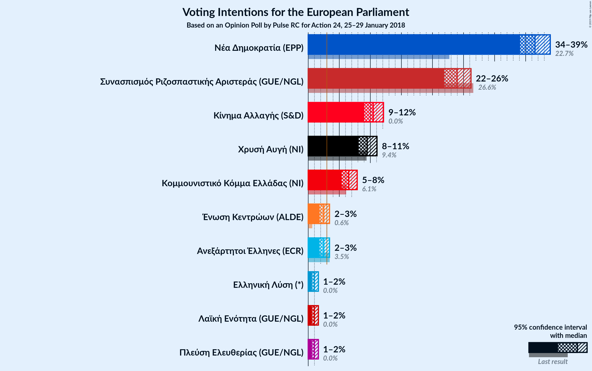
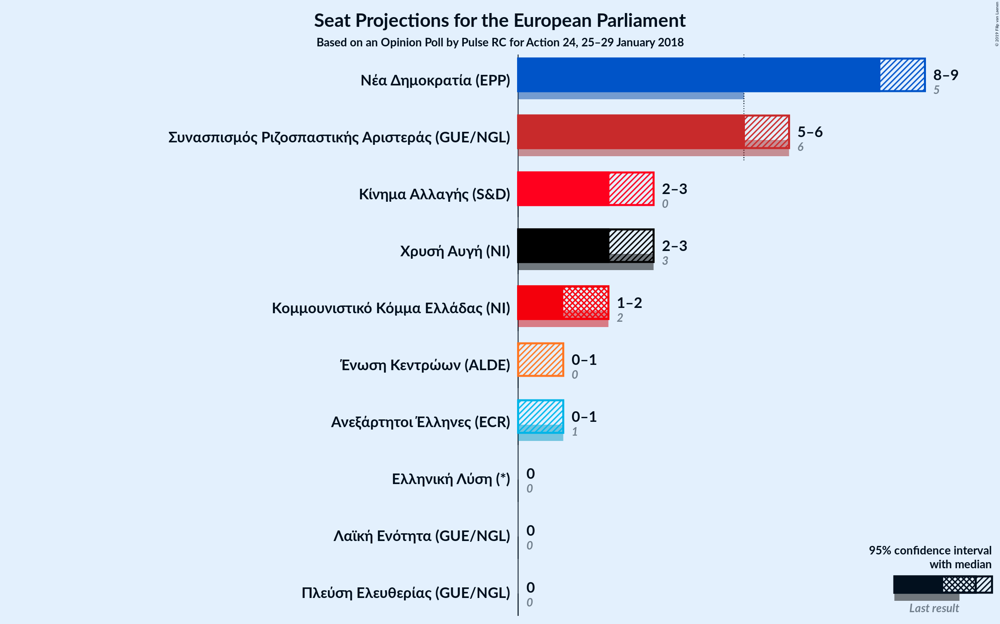

# Opinion Poll by Pulse RC for Action 24, 25–29 January 2018

<a href="#voting-intentions">Voting Intentions</a> | <a href="#seats">Seats</a> | <a href="#coalitions">Coalitions</a> | <a href="#technical-information">Technical Information</a>

## Voting Intentions

### Confidence Intervals

| Party | Last Result | Poll Result | 80% Confidence Interval | 90% Confidence Interval | 95% Confidence Interval | 99% Confidence Interval |
|:-----:|:-----------:|:-----------:|:-----------------------:|:-----------------------:|:-----------------------:|:-----------------------:|
| Νέα Δημοκρατία (EPP) | 22.7% | 36.5% | 34.9–38.1% |34.5–38.6% |34.1–39.0% |33.4–39.7% |
| Συνασπισμός Ριζοσπαστικής Αριστεράς (GUE/NGL) | 26.6% | 24.0% | 22.6–25.4% |22.2–25.8% |21.9–26.2% |21.2–26.9% |
| Κίνημα Αλλαγής (S&D) | 0.0% | 10.5% | 9.5–11.6% |9.3–11.9% |9.0–12.1% |8.6–12.7% |
| Χρυσή Αυγή (NI) | 9.4% | 9.5% | N/A |N/A |N/A |N/A |
| Κομμουνιστικό Κόμμα Ελλάδας (NI) | 6.1% | 6.5% | N/A |N/A |N/A |N/A |
| Ανεξάρτητοι Έλληνες (ECR) | 3.5% | 2.5% | 2.1–3.1% |1.9–3.3% |1.8–3.4% |1.6–3.7% |
| Ένωση Κεντρώων (ALDE) | 0.7% | 2.5% | 2.1–3.1% |1.9–3.3% |1.8–3.4% |1.6–3.7% |
| Λαϊκή Ενότητα (GUE/NGL) | 0.0% | 1.0% | 0.7–1.4% |0.7–1.5% |0.6–1.6% |0.5–1.9% |
| Πλεύση Ελευθερίας (GUE/NGL) | 0.0% | 1.0% | 0.7–1.4% |0.7–1.5% |0.6–1.6% |0.5–1.9% |

*Note:* The poll result column reflects the actual value used in the calculations. Published results may vary slightly, and in addition be rounded to fewer digits.

## Seats

### Confidence Intervals

| Party | Last Result | Median | 80% Confidence Interval | 90% Confidence Interval | 95% Confidence Interval | 99% Confidence Interval |
|:-----:|:-----------:|:------:|:-----------------------:|:-----------------------:|:-----------------------:|:-----------------------:|
| <a href="#Νέα-Δημοκρατία-(epp)">Νέα Δημοκρατία (EPP)</a> | 5 | 8 | 8–9 |8–9 |8–9 |7–9 |
| <a href="#Συνασπισμός-Ριζοσπαστικής-Αριστεράς-(gue/ngl)">Συνασπισμός Ριζοσπαστικής Αριστεράς (GUE/NGL)</a> | 6 | 5 | 5–6 |5–6 |5–6 |5–6 |
| <a href="#Κίνημα-Αλλαγής-(s&d)">Κίνημα Αλλαγής (S&D)</a> | 0 | 2 | 2–3 |2–3 |2–3 |2–3 |
| <a href="#Χρυσή-Αυγή-(ni)">Χρυσή Αυγή (NI)</a> | 3 | N/A | N/A |N/A |N/A |N/A |
| <a href="#Κομμουνιστικό-Κόμμα-Ελλάδας-(ni)">Κομμουνιστικό Κόμμα Ελλάδας (NI)</a> | 2 | N/A | N/A |N/A |N/A |N/A |
| <a href="#Ανεξάρτητοι-Έλληνες-(ecr)">Ανεξάρτητοι Έλληνες (ECR)</a> | 1 | 0 | 0–1 |0–1 |0–1 |0–1 |
| <a href="#Ένωση-Κεντρώων-(alde)">Ένωση Κεντρώων (ALDE)</a> | 0 | 0 | 0–1 |0–1 |0–1 |0–1 |
| <a href="#Λαϊκή-Ενότητα-(gue/ngl)">Λαϊκή Ενότητα (GUE/NGL)</a> | 0 | 0 | 0 |0 |0 |0 |
| <a href="#Πλεύση-Ελευθερίας-(gue/ngl)">Πλεύση Ελευθερίας (GUE/NGL)</a> | 0 | 0 | 0 |0 |0 |0 |

