# Poll Average

<a href="#voting-intentions">Voting Intentions</a> | <a href="#seats">Seats</a> | <a href="#coalitions">Coalitions</a> | <a href="#technical-information">Technical Information</a>

## Summary

The table below lists the polls on which the average is based. They are the most recent polls (less than 90 days old) registered and analyzed so far.

| Period     | Polling firm/Commissioner(s) | ΣΥΡΙΖΑ | ΝΔ | ΧΑ | Ποτάμι | ΚΚΕ | ΑΝΕΛ | ΕΚ | ΚΑ | ΛΑΕ | ΠΕ | ΕΛ |
|:----------:|:----------------------------:|:--:|:--:|:--:|:--:|:--:|:--:|:--:|:--:|:--:|:--:|:--:|
| 25 May 2014 | General Election | 26.6%   6 | 22.7%   5 | 9.4%   3 | 6.6%   2 | 6.1%   2 | 3.5%   1 | 0.6%   0 | 0.0%   0 | 0.0%   0 | 0.0%   0 | 0.0%   0 |
| N/A | Poll Average | 21–30%   5–6 | 28–44%   6–10 | 5–10%   1–2 | 0–2%   0 | 4–8%   1–2 | 0–2%   0 | 1–4%   0–1 | 4–9%   1–2 | 0–4%   0–1 | 1–3%   0 | 2–4%   0–1 |
| [1–3 April 2019](2019-04-03-MRB.html) | MRB   Star | N/A   N/A | N/A   N/A | N/A   N/A | N/A   N/A | N/A   N/A | N/A   N/A | N/A   N/A | N/A   N/A | N/A   N/A | N/A   N/A | N/A   N/A |
| [26 March–1 April 2019](2019-04-01-Marc.html) | Marc   Πρώτο ΘΕΜΑ | N/A   N/A | N/A   N/A | N/A   N/A | N/A   N/A | N/A   N/A | N/A   N/A | N/A   N/A | N/A   N/A | N/A   N/A | N/A   N/A | N/A   N/A |
| [26–28 March 2019](2019-03-28-RASS.html) | RASS   in.gr | N/A   N/A | N/A   N/A | N/A   N/A | N/A   N/A | N/A   N/A | N/A   N/A | N/A   N/A | N/A   N/A | N/A   N/A | N/A   N/A | N/A   N/A |
| [19–26 March 2019](2019-03-26-Alco.html) | Alco | 21–27%   5–6 | 30–36%   6–8 | 7–11%   2 | N/A   N/A | 6–9%   1–2 | N/A   N/A | 1–3%   0 | 6–9%   1–2 | 2–4%   0–1 | N/A   N/A | 2–4%   0–1 |
| [18–20 March 2019](2019-03-20-VoxPopAnalysis.html) | Vox Pop Analysis   Documento | 25–31%   5–7 | 28–33%   6–7 | 6–10%   1–2 | 0–2%   0 | 3–6%   1 | 0–1%   0 | 0–1%   0 | 5–7%   1–2 | N/A   N/A | N/A   N/A | N/A   N/A |
| [18–20 March 2019](2019-03-20-PulseRC.html) | Pulse RC | 22–26%   5–6 | 34–39%   7–8 | 6–8%   1–2 | N/A   N/A | 5–7%   1–2 | N/A   N/A | 1–3%   0 | 7–10%   1–2 | N/A   N/A | N/A   N/A | N/A   N/A |
| [18–20 March 2019](2019-03-20-MetronAnalysis.html) | Metron Analysis   Το Βήμα | 24–29%   5–6 | 34–40%   8–9 | 6–9%   1–2 | 1–2%   0 | 5–8%   1–2 | 1–2%   0 | 1–3%   0 | 6–9%   1–2 | 1–3%   0 | N/A   N/A | 1–3%   0–1 |
| [1–14 February 2019](2019-02-14-PublicIssue.html) | Public Issue | 22–27%   5–6 | 36–42%   8–9 | 6–9%   1–2 | 1–2%   0 | 6–9%   1–2 | 1–2%   0 | 2–4%   0–1 | 7–10%   1–2 | N/A   N/A | N/A   N/A | 2–4%   0–1 |
| [4–5 February 2019](2019-02-05-Interview.html) | Interview   Βεργίνα TV | 22–27%   5–6 | 34–40%   7–9 | 6–9%   1–2 | 1–2%   0 | 5–8%   1–2 | 1–3%   0 | 2–4%   0–1 | 5–8%   1–2 | 1–3%   0 | 1–2%   0 | 2–5%   0–1 |
| [1–4 February 2019](2019-02-04-Prorata.html) | Prorata   Η Εφημερίδα των Συντακτών | 22–27%   5–6 | 27–33%   6–7 | 6–9%   1–2 | 0–1%   0 | 4–7%   1–2 | N/A   N/A | 1–2%   0 | 5–8%   1–2 | 0–1%   0 | 1–2%   0 | 2–4%   0–1 |
| [10–16 January 2019](2019-01-16-OpinionPoll.html) | Opinion Poll | 20–25%   5–6 | 39–46%   9–10 | 5–7%   1–2 | 1–2%   0 | 4–7%   1–2 | 0–1%   0 | 1–3%   0 | 4–7%   1–2 | 1–3%   0 | 1–3%   0 | 2–4%   0–1 |
| 25 May 2014 | General Election | 26.6%   6 | 22.7%   5 | 9.4%   3 | 6.6%   2 | 6.1%   2 | 3.5%   1 | 0.6%   0 | 0.0%   0 | 0.0%   0 | 0.0%   0 | 0.0%   0 |

Only polls for which at least the sample size has been published are included in the table above.

**Legend:**
+ **Top half of each row:** Voting intentions (95% confidence interval)
+ **Bottom half of each row:** Seat projections for the European Parliament (95% confidence interval)
+ **ΣΥΡΙΖΑ:** Συνασπισμός Ριζοσπαστικής Αριστεράς (GUE/NGL)
+ **ΝΔ:** Νέα Δημοκρατία (EPP)
+ **ΧΑ:** Χρυσή Αυγή (NI)
+ **Ποτάμι:** Το Ποτάμι (S&D)
+ **ΚΚΕ:** Κομμουνιστικό Κόμμα Ελλάδας (NI)
+ **ΑΝΕΛ:** Ανεξάρτητοι Έλληνες (ECR)
+ **ΕΚ:** Ένωση Κεντρώων (ALDE)
+ **ΚΑ:** Κίνημα Αλλαγής (S&D)
+ **ΛΑΕ:** Λαϊκή Ενότητα (GUE/NGL)
+ **ΠΕ:** Πλεύση Ελευθερίας (GUE/NGL)
+ **ΕΛ:** Ελληνική Λύση (*)
+ **N/A (single party):** Party not included the published results
+ **N/A (entire row):** Calculation for this opinion poll not started yet

## Voting Intentions

### Confidence Intervals

| Party | Last Result | Median | 80% Confidence Interval | 90% Confidence Interval | 95% Confidence Interval | 99% Confidence Interval |
|:-----:|:-----------:|:------:|:-----------------------:|:-----------------------:|:-----------------------:|:-----------------------:|
| <a href="#συνασπισμός-ριζοσπαστικής-αριστεράς-(gue/ngl)">Συνασπισμός Ριζοσπαστικής Αριστεράς (GUE/NGL)</a> | 26.6% | 24.6% | 22.2–27.7% |21.5–28.7% | 20.9–29.5% | 19.8–30.8% |
| <a href="#νέα-δημοκρατία-(epp)">Νέα Δημοκρατία (EPP)</a> | 22.7% | 35.9% | 29.9–41.5% |29.0–42.9% | 28.4–43.8% | 27.3–45.3% |
| <a href="#χρυσή-αυγή-(ni)">Χρυσή Αυγή (NI)</a> | 9.4% | 7.4% | 6.0–9.0% |5.6–9.5% | 5.2–9.9% | 4.6–10.7% |
| <a href="#το-ποτάμι-(s&d)">Το Ποτάμι (S&D)</a> | 6.6% | 1.1% | 0.5–1.8% |0.4–1.9% | 0.3–2.1% | 0.2–2.5% |
| <a href="#κομμουνιστικό-κόμμα-ελλάδας-(ni)">Κομμουνιστικό Κόμμα Ελλάδας (NI)</a> | 6.1% | 6.1% | 4.6–7.7% |4.2–8.1% | 3.9–8.5% | 3.4–9.2% |
| <a href="#ανεξάρτητοι-έλληνες-(ecr)">Ανεξάρτητοι Έλληνες (ECR)</a> | 3.5% | 1.0% | 0.4–1.9% |0.3–2.1% | 0.2–2.3% | 0.2–2.7% |
| <a href="#ένωση-κεντρώων-(alde)">Ένωση Κεντρώων (ALDE)</a> | 0.6% | 2.0% | 1.0–2.9% |0.7–3.2% | 0.6–3.5% | 0.4–4.0% |
| <a href="#κίνημα-αλλαγής-(s&d)">Κίνημα Αλλαγής (S&D)</a> | 0.0% | 6.7% | 5.1–8.6% |4.8–9.0% | 4.5–9.4% | 4.0–10.2% |
| <a href="#λαϊκή-ενότητα-(gue/ngl)">Λαϊκή Ενότητα (GUE/NGL)</a> | 0.0% | 1.7% | 0.6–3.1% |0.4–3.5% | 0.3–3.7% | 0.2–4.2% |
| <a href="#πλεύση-ελευθερίας-(gue/ngl)">Πλεύση Ελευθερίας (GUE/NGL)</a> | 0.0% | 1.5% | 0.9–2.4% |0.8–2.6% | 0.7–2.8% | 0.5–3.2% |
| <a href="#ελληνική-λύση-(*)">Ελληνική Λύση (*)</a> | 0.0% | 2.9% | 2.0–3.7% |1.8–4.0% | 1.7–4.2% | 1.4–4.7% |

### Συνασπισμός Ριζοσπαστικής Αριστεράς (GUE/NGL)

*For a full overview of the results for this party, see the [Συνασπισμός Ριζοσπαστικής Αριστεράς (GUE/NGL)](party-συνασπισμόςριζοσπαστικήςαριστεράςguengl.html) page.*

| Voting Intentions | Probability | Accumulated | Special Marks |
|:-----------------:|:-----------:|:-----------:|:-------------:|
| 17.5–18.5% | 0% | 100% |  |
| 18.5–19.5% | 0.3% | 100% |  |
| 19.5–20.5% | 1.3% | 99.7% |  |
| 20.5–21.5% | 4% | 98% |  |
| 21.5–22.5% | 8% | 95% |  |
| 22.5–23.5% | 15% | 86% |  |
| 23.5–24.5% | 21% | 72% |  |
| 24.5–25.5% | 19% | 51% | Median |
| 25.5–26.5% | 13% | 32% |  |
| 26.5–27.5% | 8% | 19% | Last Result |
| 27.5–28.5% | 5% | 11% |  |
| 28.5–29.5% | 3% | 6% |  |
| 29.5–30.5% | 2% | 2% |  |
| 30.5–31.5% | 0.5% | 0.7% |  |
| 31.5–32.5% | 0.1% | 0.1% |  |
| 32.5–33.5% | 0% | 0% |  |

### Νέα Δημοκρατία (EPP)

*For a full overview of the results for this party, see the [Νέα Δημοκρατία (EPP)](party-νέαδημοκρατίαepp.html) page.*

| Voting Intentions | Probability | Accumulated | Special Marks |
|:-----------------:|:-----------:|:-----------:|:-------------:|
| 22.5–23.5% | 0% | 100% | Last Result |
| 23.5–24.5% | 0% | 100% |  |
| 24.5–25.5% | 0% | 100% |  |
| 25.5–26.5% | 0.1% | 100% |  |
| 26.5–27.5% | 0.6% | 99.9% |  |
| 27.5–28.5% | 2% | 99.2% |  |
| 28.5–29.5% | 5% | 97% |  |
| 29.5–30.5% | 7% | 92% |  |
| 30.5–31.5% | 7% | 85% |  |
| 31.5–32.5% | 6% | 78% |  |
| 32.5–33.5% | 5% | 72% |  |
| 33.5–34.5% | 5% | 67% |  |
| 34.5–35.5% | 8% | 61% |  |
| 35.5–36.5% | 11% | 54% | Median |
| 36.5–37.5% | 11% | 43% |  |
| 37.5–38.5% | 8% | 32% |  |
| 38.5–39.5% | 6% | 23% |  |
| 39.5–40.5% | 4% | 18% |  |
| 40.5–41.5% | 4% | 13% |  |
| 41.5–42.5% | 4% | 10% |  |
| 42.5–43.5% | 3% | 6% |  |
| 43.5–44.5% | 2% | 3% |  |
| 44.5–45.5% | 0.9% | 1.2% |  |
| 45.5–46.5% | 0.3% | 0.3% |  |
| 46.5–47.5% | 0.1% | 0.1% |  |
| 47.5–48.5% | 0% | 0% |  |

### Χρυσή Αυγή (NI)

*For a full overview of the results for this party, see the [Χρυσή Αυγή (NI)](party-χρυσήαυγήni.html) page.*

| Voting Intentions | Probability | Accumulated | Special Marks |
|:-----------------:|:-----------:|:-----------:|:-------------:|
| 2.5–3.5% | 0% | 100% |  |
| 3.5–4.5% | 0.4% | 100% |  |
| 4.5–5.5% | 4% | 99.6% |  |
| 5.5–6.5% | 16% | 95% |  |
| 6.5–7.5% | 34% | 79% | Median |
| 7.5–8.5% | 29% | 45% |  |
| 8.5–9.5% | 12% | 17% | Last Result |
| 9.5–10.5% | 4% | 4% |  |
| 10.5–11.5% | 0.7% | 0.8% |  |
| 11.5–12.5% | 0.1% | 0.1% |  |
| 12.5–13.5% | 0% | 0% |  |

### Το Ποτάμι (S&D)

*For a full overview of the results for this party, see the [Το Ποτάμι (S&D)](party-τοποτάμιsd.html) page.*

| Voting Intentions | Probability | Accumulated | Special Marks |
|:-----------------:|:-----------:|:-----------:|:-------------:|
| 0.0–0.5% | 10% | 100% |  |
| 0.5–1.5% | 71% | 90% | Median |
| 1.5–2.5% | 18% | 19% |  |
| 2.5–3.5% | 0.3% | 0.3% |  |
| 3.5–4.5% | 0% | 0% |  |
| 4.5–5.5% | 0% | 0% |  |
| 5.5–6.5% | 0% | 0% |  |
| 6.5–7.5% | 0% | 0% | Last Result |

### Κομμουνιστικό Κόμμα Ελλάδας (NI)

*For a full overview of the results for this party, see the [Κομμουνιστικό Κόμμα Ελλάδας (NI)](party-κομμουνιστικόκόμμαελλάδαςni.html) page.*

| Voting Intentions | Probability | Accumulated | Special Marks |
|:-----------------:|:-----------:|:-----------:|:-------------:|
| 1.5–2.5% | 0% | 100% |  |
| 2.5–3.5% | 0.9% | 100% |  |
| 3.5–4.5% | 8% | 99.1% |  |
| 4.5–5.5% | 21% | 91% |  |
| 5.5–6.5% | 34% | 70% | Last Result, Median |
| 6.5–7.5% | 24% | 36% |  |
| 7.5–8.5% | 10% | 12% |  |
| 8.5–9.5% | 2% | 2% |  |
| 9.5–10.5% | 0.2% | 0.2% |  |
| 10.5–11.5% | 0% | 0% |  |

### Ανεξάρτητοι Έλληνες (ECR)

*For a full overview of the results for this party, see the [Ανεξάρτητοι Έλληνες (ECR)](party-ανεξάρτητοιέλληνεςecr.html) page.*

| Voting Intentions | Probability | Accumulated | Special Marks |
|:-----------------:|:-----------:|:-----------:|:-------------:|
| 0.0–0.5% | 23% | 100% |  |
| 0.5–1.5% | 53% | 77% | Median |
| 1.5–2.5% | 23% | 24% |  |
| 2.5–3.5% | 1.1% | 1.1% | Last Result |
| 3.5–4.5% | 0% | 0% |  |

### Ένωση Κεντρώων (ALDE)

*For a full overview of the results for this party, see the [Ένωση Κεντρώων (ALDE)](party-ένωσηκεντρώωνalde.html) page.*

| Voting Intentions | Probability | Accumulated | Special Marks |
|:-----------------:|:-----------:|:-----------:|:-------------:|
| 0.0–0.5% | 2% | 100% |  |
| 0.5–1.5% | 22% | 98% | Last Result |
| 1.5–2.5% | 54% | 75% | Median |
| 2.5–3.5% | 20% | 22% |  |
| 3.5–4.5% | 2% | 2% |  |
| 4.5–5.5% | 0% | 0% |  |
| 5.5–6.5% | 0% | 0% |  |

### Κίνημα Αλλαγής (S&D)

*For a full overview of the results for this party, see the [Κίνημα Αλλαγής (S&D)](party-κίνημααλλαγήςsd.html) page.*

| Voting Intentions | Probability | Accumulated | Special Marks |
|:-----------------:|:-----------:|:-----------:|:-------------:|
| 0.0–0.5% | 0% | 100% | Last Result |
| 0.5–1.5% | 0% | 100% |  |
| 1.5–2.5% | 0% | 100% |  |
| 2.5–3.5% | 0.1% | 100% |  |
| 3.5–4.5% | 3% | 99.9% |  |
| 4.5–5.5% | 16% | 97% |  |
| 5.5–6.5% | 26% | 81% |  |
| 6.5–7.5% | 24% | 55% | Median |
| 7.5–8.5% | 20% | 31% |  |
| 8.5–9.5% | 9% | 11% |  |
| 9.5–10.5% | 2% | 2% |  |
| 10.5–11.5% | 0.2% | 0.2% |  |
| 11.5–12.5% | 0% | 0% |  |

### Λαϊκή Ενότητα (GUE/NGL)

*For a full overview of the results for this party, see the [Λαϊκή Ενότητα (GUE/NGL)](party-λαϊκήενότηταguengl.html) page.*

| Voting Intentions | Probability | Accumulated | Special Marks |
|:-----------------:|:-----------:|:-----------:|:-------------:|
| 0.0–0.5% | 9% | 100% | Last Result |
| 0.5–1.5% | 31% | 91% |  |
| 1.5–2.5% | 41% | 60% | Median |
| 2.5–3.5% | 15% | 19% |  |
| 3.5–4.5% | 4% | 4% |  |
| 4.5–5.5% | 0.2% | 0.2% |  |
| 5.5–6.5% | 0% | 0% |  |

### Ελληνική Λύση (*)

*For a full overview of the results for this party, see the [Ελληνική Λύση (*)](party-ελληνικήλύση.html) page.*

| Voting Intentions | Probability | Accumulated | Special Marks |
|:-----------------:|:-----------:|:-----------:|:-------------:|
| 0.0–0.5% | 0% | 100% | Last Result |
| 0.5–1.5% | 1.2% | 100% |  |
| 1.5–2.5% | 30% | 98.8% |  |
| 2.5–3.5% | 53% | 68% | Median |
| 3.5–4.5% | 15% | 16% |  |
| 4.5–5.5% | 0.8% | 0.8% |  |
| 5.5–6.5% | 0% | 0% |  |

### Πλεύση Ελευθερίας (GUE/NGL)

*For a full overview of the results for this party, see the [Πλεύση Ελευθερίας (GUE/NGL)](party-πλεύσηελευθερίαςguengl.html) page.*

| Voting Intentions | Probability | Accumulated | Special Marks |
|:-----------------:|:-----------:|:-----------:|:-------------:|
| 0.0–0.5% | 0.8% | 100% | Last Result |
| 0.5–1.5% | 49% | 99.2% |  |
| 1.5–2.5% | 44% | 50% | Median |
| 2.5–3.5% | 6% | 6% |  |
| 3.5–4.5% | 0.1% | 0.1% |  |
| 4.5–5.5% | 0% | 0% |  |

## Seats

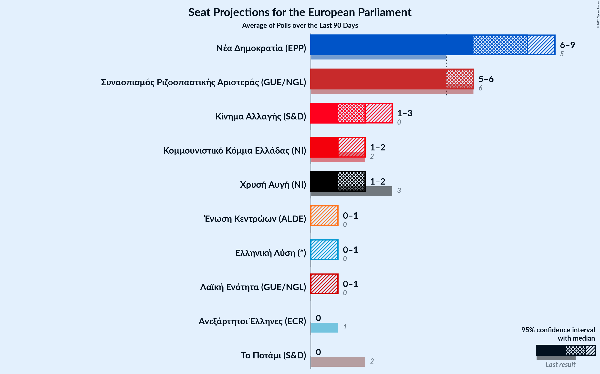

### Confidence Intervals

| Party | Last Result | Median | 80% Confidence Interval | 90% Confidence Interval | 95% Confidence Interval | 99% Confidence Interval |
|:-----:|:-----------:|:------:|:-----------------------:|:-----------------------:|:-----------------------:|:-----------------------:|
| <a href="#συνασπισμός-ριζοσπαστικής-αριστεράς-(gue/ngl)">Συνασπισμός Ριζοσπαστικής Αριστεράς (GUE/NGL)</a> | 6 | 5 | 5–6 |5–6 | 5–6 | 4–7 |
| <a href="#νέα-δημοκρατία-(epp)">Νέα Δημοκρατία (EPP)</a> | 5 | 8 | 6–9 |6–9 | 6–10 | 6–10 |
| <a href="#χρυσή-αυγή-(ni)">Χρυσή Αυγή (NI)</a> | 3 | 2 | 1–2 |1–2 | 1–2 | 1–2 |
| <a href="#το-ποτάμι-(s&d)">Το Ποτάμι (S&D)</a> | 2 | 0 | 0 |0 | 0 | 0 |
| <a href="#κομμουνιστικό-κόμμα-ελλάδας-(ni)">Κομμουνιστικό Κόμμα Ελλάδας (NI)</a> | 2 | 1 | 1–2 |1–2 | 1–2 | 1–2 |
| <a href="#ανεξάρτητοι-έλληνες-(ecr)">Ανεξάρτητοι Έλληνες (ECR)</a> | 1 | 0 | 0 |0 | 0 | 0 |
| <a href="#ένωση-κεντρώων-(alde)">Ένωση Κεντρώων (ALDE)</a> | 0 | 0 | 0 |0–1 | 0–1 | 0–1 |
| <a href="#κίνημα-αλλαγής-(s&d)">Κίνημα Αλλαγής (S&D)</a> | 0 | 2 | 1–2 |1–2 | 1–2 | 1–2 |
| <a href="#λαϊκή-ενότητα-(gue/ngl)">Λαϊκή Ενότητα (GUE/NGL)</a> | 0 | 0 | 0–1 |0–1 | 0–1 | 0–1 |
| <a href="#πλεύση-ελευθερίας-(gue/ngl)">Πλεύση Ελευθερίας (GUE/NGL)</a> | 0 | 0 | 0 |0 | 0 | 0 |
| <a href="#ελληνική-λύση-(*)">Ελληνική Λύση (*)</a> | 0 | 0 | 0–1 |0–1 | 0–1 | 0–1 |

### Συνασπισμός Ριζοσπαστικής Αριστεράς (GUE/NGL)

*For a full overview of the results for this party, see the [Συνασπισμός Ριζοσπαστικής Αριστεράς (GUE/NGL)](party-συνασπισμόςριζοσπαστικήςαριστεράςguengl.html) page.*

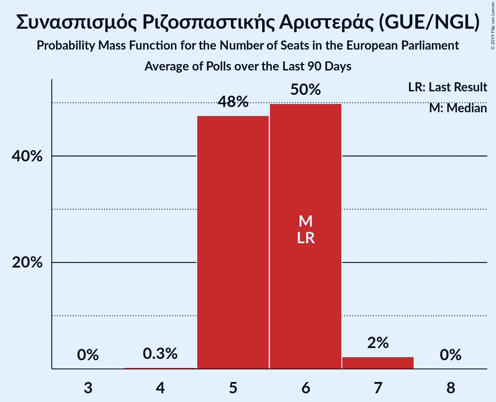

| Number of Seats | Probability | Accumulated | Special Marks |
|:---------------:|:-----------:|:-----------:|:-------------:|
| 4 | 0.6% | 100% |  |
| 5 | 60% | 99.4% | Median |
| 6 | 37% | 39% | Last Result |
| 7 | 2% | 2% |  |
| 8 | 0% | 0% |  |

### Νέα Δημοκρατία (EPP)

*For a full overview of the results for this party, see the [Νέα Δημοκρατία (EPP)](party-νέαδημοκρατίαepp.html) page.*

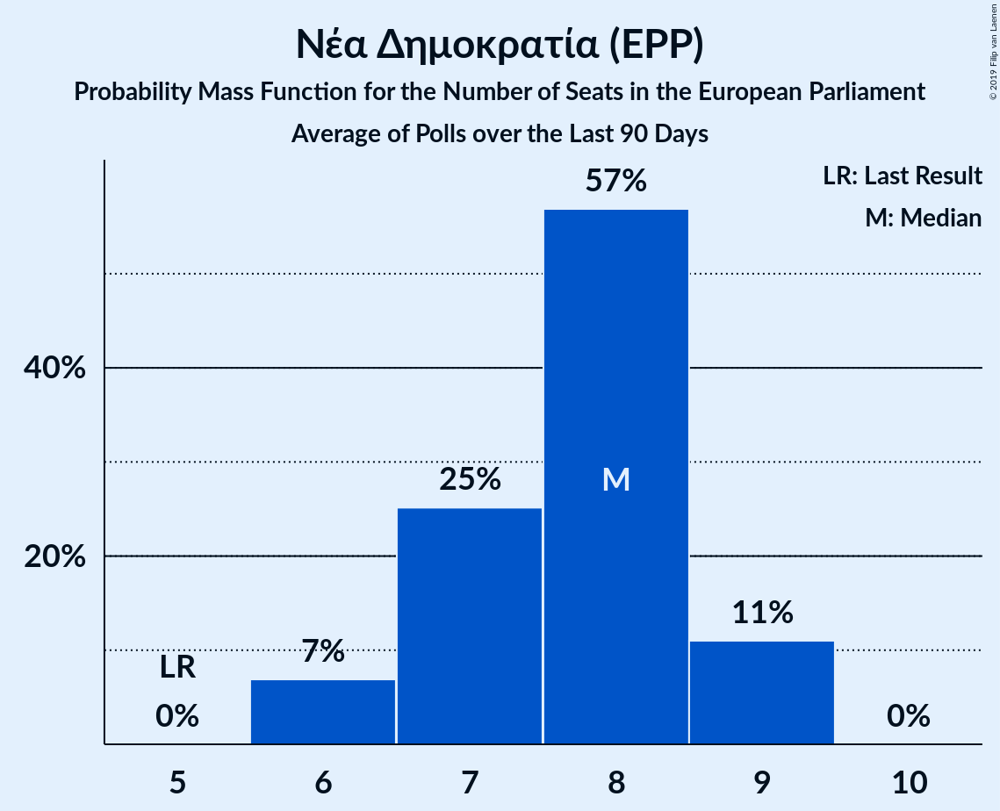

| Number of Seats | Probability | Accumulated | Special Marks |
|:---------------:|:-----------:|:-----------:|:-------------:|
| 5 | 0% | 100% | Last Result |
| 6 | 11% | 100% |  |
| 7 | 27% | 89% |  |
| 8 | 40% | 62% | Median |
| 9 | 18% | 21% |  |
| 10 | 3% | 3% |  |
| 11 | 0% | 0% | Majority |

### Χρυσή Αυγή (NI)

*For a full overview of the results for this party, see the [Χρυσή Αυγή (NI)](party-χρυσήαυγήni.html) page.*

| Number of Seats | Probability | Accumulated | Special Marks |
|:---------------:|:-----------:|:-----------:|:-------------:|
| 1 | 29% | 100% |  |
| 2 | 70% | 71% | Median |
| 3 | 0.1% | 0.1% | Last Result |
| 4 | 0% | 0% |  |

### Το Ποτάμι (S&D)

*For a full overview of the results for this party, see the [Το Ποτάμι (S&D)](party-τοποτάμιsd.html) page.*

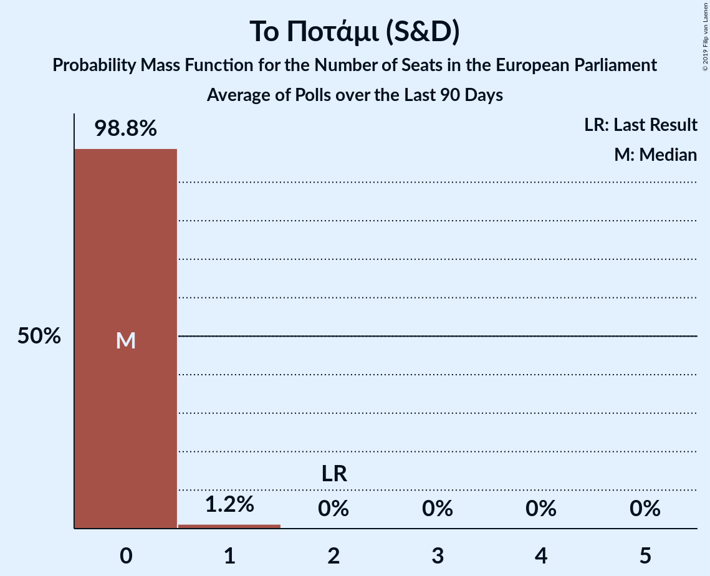

| Number of Seats | Probability | Accumulated | Special Marks |
|:---------------:|:-----------:|:-----------:|:-------------:|
| 0 | 100% | 100% | Median |
| 1 | 0% | 0% |  |
| 2 | 0% | 0% | Last Result |

### Κομμουνιστικό Κόμμα Ελλάδας (NI)

*For a full overview of the results for this party, see the [Κομμουνιστικό Κόμμα Ελλάδας (NI)](party-κομμουνιστικόκόμμαελλάδαςni.html) page.*

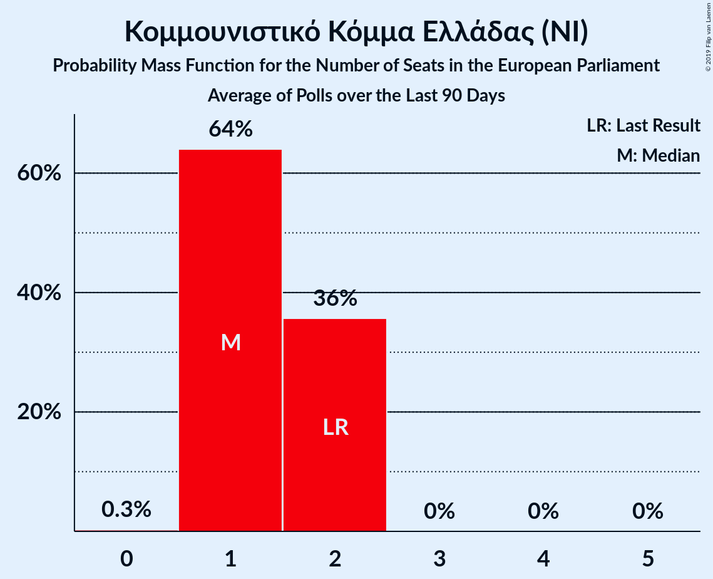

| Number of Seats | Probability | Accumulated | Special Marks |
|:---------------:|:-----------:|:-----------:|:-------------:|
| 0 | 0.2% | 100% |  |
| 1 | 66% | 99.8% | Median |
| 2 | 34% | 34% | Last Result |
| 3 | 0% | 0% |  |

### Ανεξάρτητοι Έλληνες (ECR)

*For a full overview of the results for this party, see the [Ανεξάρτητοι Έλληνες (ECR)](party-ανεξάρτητοιέλληνεςecr.html) page.*

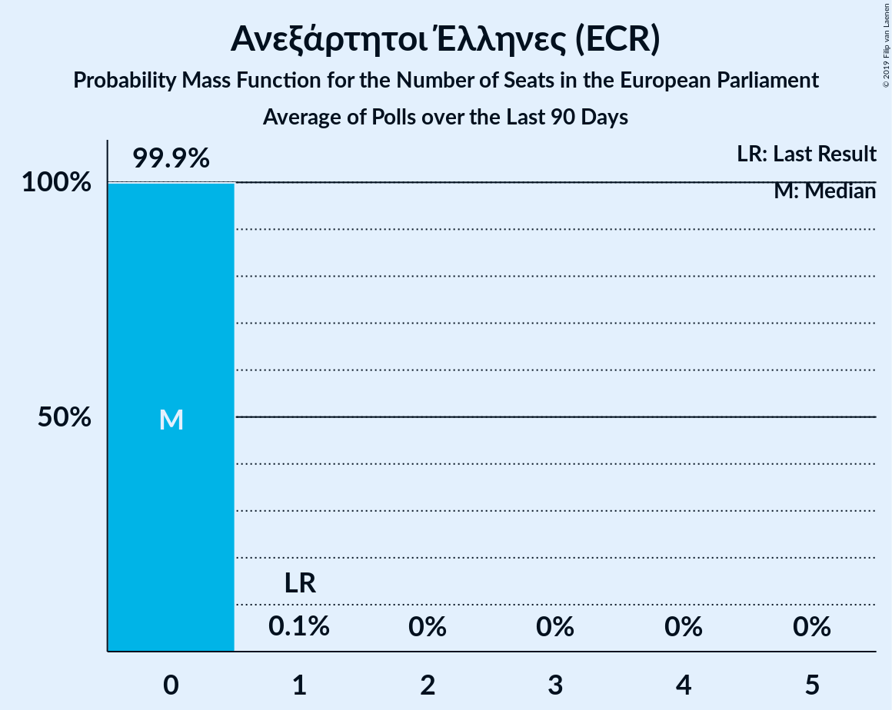

| Number of Seats | Probability | Accumulated | Special Marks |
|:---------------:|:-----------:|:-----------:|:-------------:|
| 0 | 99.9% | 100% | Median |
| 1 | 0.1% | 0.1% | Last Result |
| 2 | 0% | 0% |  |

### Ένωση Κεντρώων (ALDE)

*For a full overview of the results for this party, see the [Ένωση Κεντρώων (ALDE)](party-ένωσηκεντρώωνalde.html) page.*

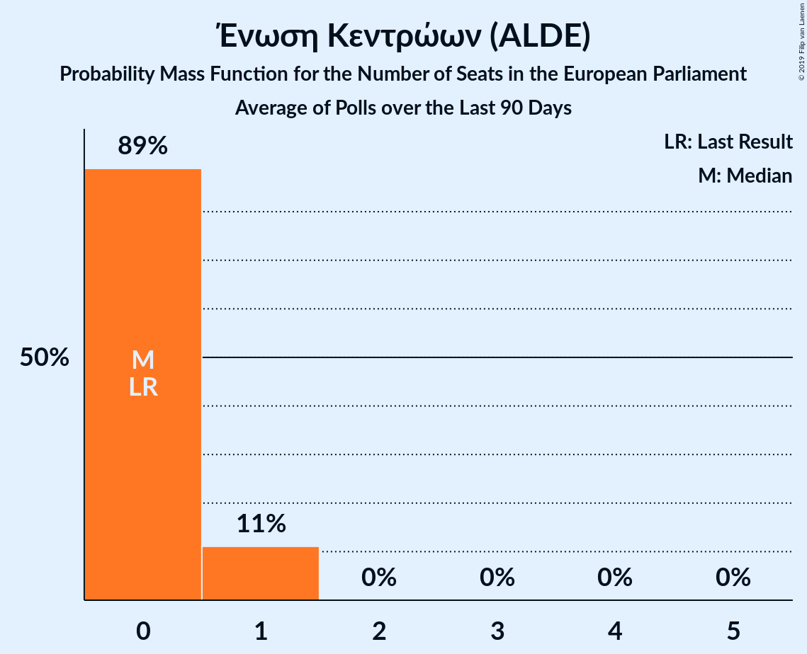

| Number of Seats | Probability | Accumulated | Special Marks |
|:---------------:|:-----------:|:-----------:|:-------------:|
| 0 | 93% | 100% | Last Result, Median |
| 1 | 7% | 7% |  |
| 2 | 0% | 0% |  |

### Κίνημα Αλλαγής (S&D)

*For a full overview of the results for this party, see the [Κίνημα Αλλαγής (S&D)](party-κίνημααλλαγήςsd.html) page.*

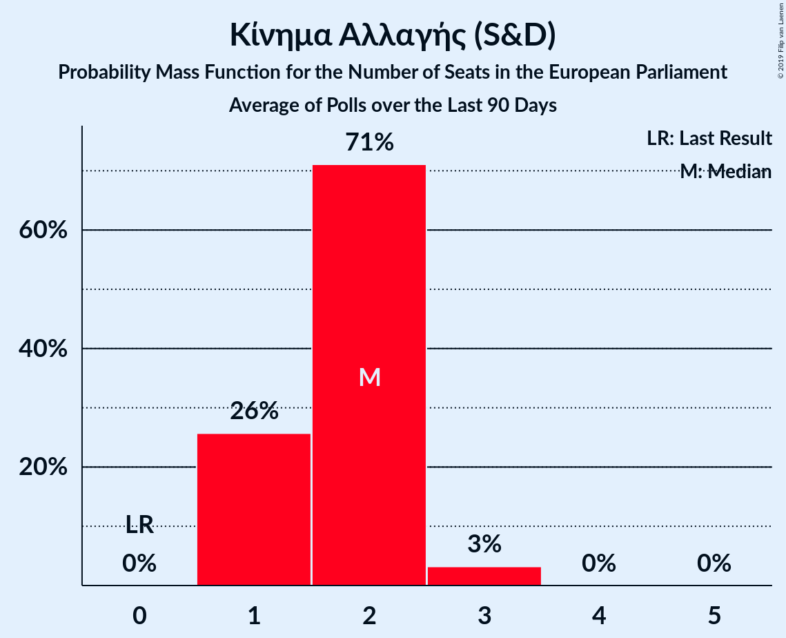

| Number of Seats | Probability | Accumulated | Special Marks |
|:---------------:|:-----------:|:-----------:|:-------------:|
| 0 | 0% | 100% | Last Result |
| 1 | 44% | 100% |  |
| 2 | 56% | 56% | Median |
| 3 | 0% | 0% |  |

### Λαϊκή Ενότητα (GUE/NGL)

*For a full overview of the results for this party, see the [Λαϊκή Ενότητα (GUE/NGL)](party-λαϊκήενότηταguengl.html) page.*

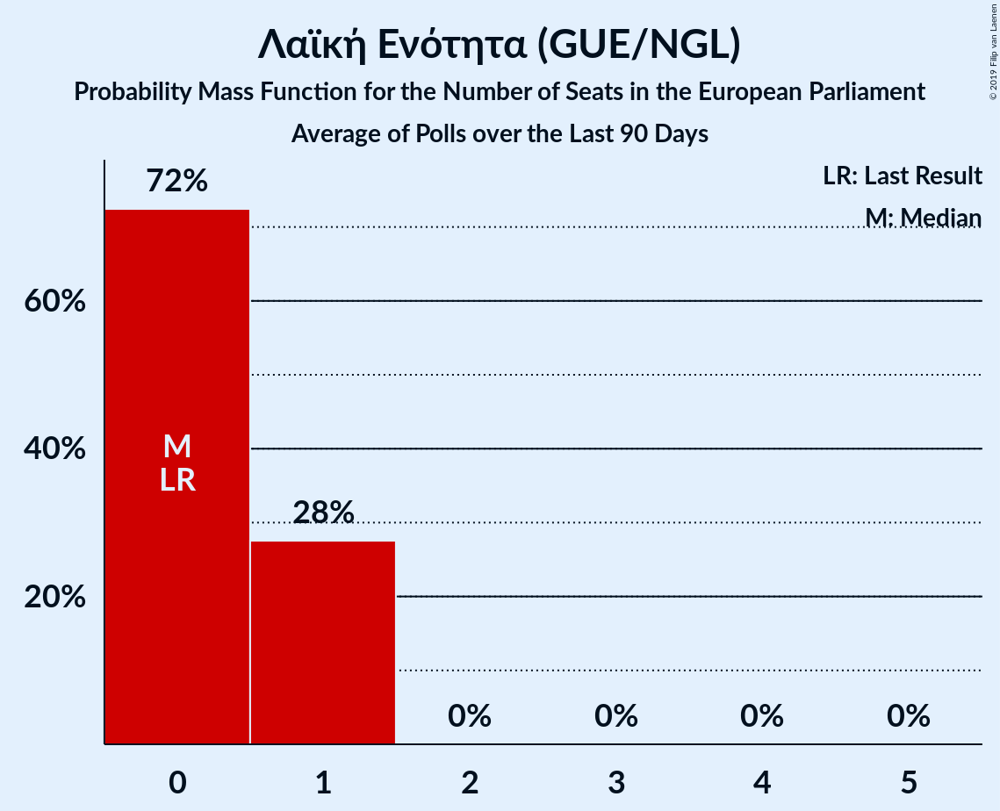

| Number of Seats | Probability | Accumulated | Special Marks |
|:---------------:|:-----------:|:-----------:|:-------------:|
| 0 | 89% | 100% | Last Result, Median |
| 1 | 11% | 11% |  |
| 2 | 0% | 0% |  |

### Ελληνική Λύση (*)

*For a full overview of the results for this party, see the [Ελληνική Λύση (*)](party-ελληνικήλύση.html) page.*

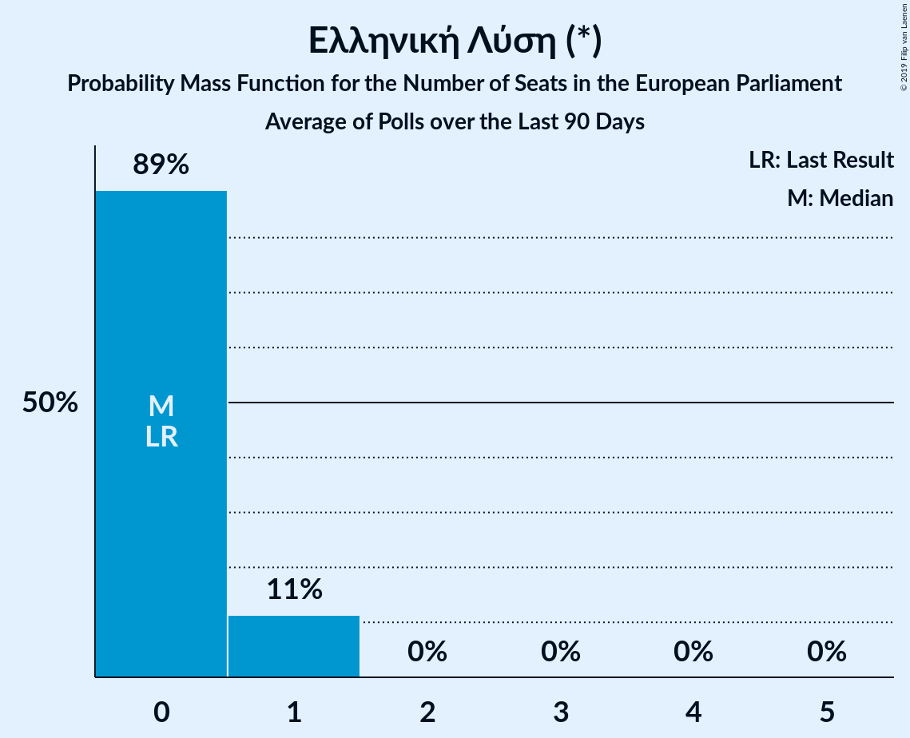

| Number of Seats | Probability | Accumulated | Special Marks |
|:---------------:|:-----------:|:-----------:|:-------------:|
| 0 | 58% | 100% | Last Result, Median |
| 1 | 42% | 42% |  |
| 2 | 0% | 0% |  |

### Πλεύση Ελευθερίας (GUE/NGL)

*For a full overview of the results for this party, see the [Πλεύση Ελευθερίας (GUE/NGL)](party-πλεύσηελευθερίαςguengl.html) page.*

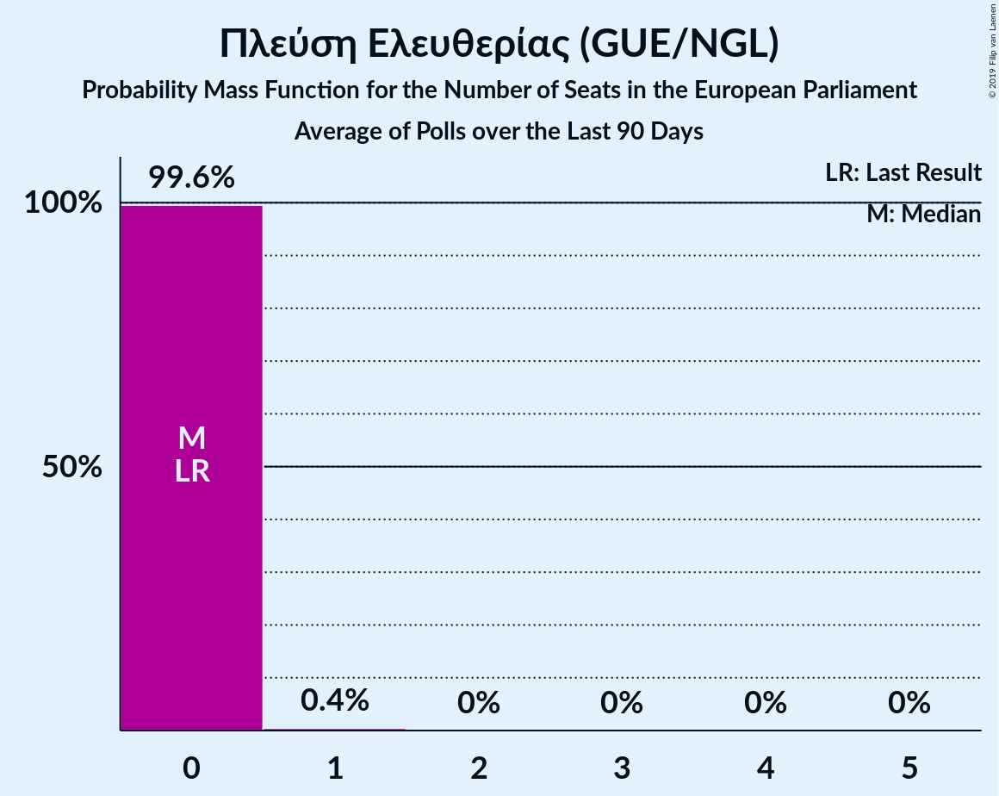

| Number of Seats | Probability | Accumulated | Special Marks |
|:---------------:|:-----------:|:-----------:|:-------------:|
| 0 | 99.6% | 100% | Last Result, Median |
| 1 | 0.4% | 0.4% |  |
| 2 | 0% | 0% |  |

## Coalitions

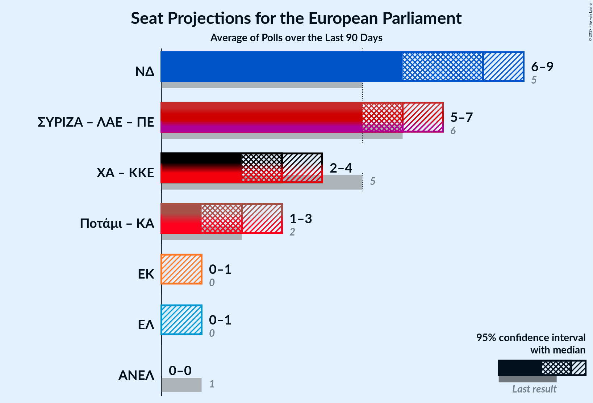

### Confidence Intervals

| Coalition | Last Result | Median | Majority? | 80% Confidence Interval | 90% Confidence Interval | 95% Confidence Interval | 99% Confidence Interval |
|:---------:|:-----------:|:------:|:---------:|:-----------------------:|:-----------------------:|:-----------------------:|:-----------------------:|
| Νέα Δημοκρατία (EPP) | 5 | 8 | 0% | 6–9 | 6–9 | 6–10 | 6–10 |
| Συνασπισμός Ριζοσπαστικής Αριστεράς (GUE/NGL) – Λαϊκή Ενότητα (GUE/NGL) – Πλεύση Ελευθερίας (GUE/NGL) | 6 | 5 | 0% | 5–6 | 5–6 | 5–7 | 5–7 |
| Χρυσή Αυγή (NI) – Κομμουνιστικό Κόμμα Ελλάδας (NI) | 5 | 3 | 0% | 2–4 | 2–4 | 2–4 | 2–4 |
| Το Ποτάμι (S&D) – Κίνημα Αλλαγής (S&D) | 2 | 2 | 0% | 1–2 | 1–2 | 1–2 | 1–2 |
| Ένωση Κεντρώων (ALDE) | 0 | 0 | 0% | 0 | 0–1 | 0–1 | 0–1 |
| Ελληνική Λύση (*) | 0 | 0 | 0% | 0–1 | 0–1 | 0–1 | 0–1 |
| Ανεξάρτητοι Έλληνες (ECR) | 1 | 0 | 0% | 0 | 0 | 0 | 0 |

### Νέα Δημοκρατία (EPP)

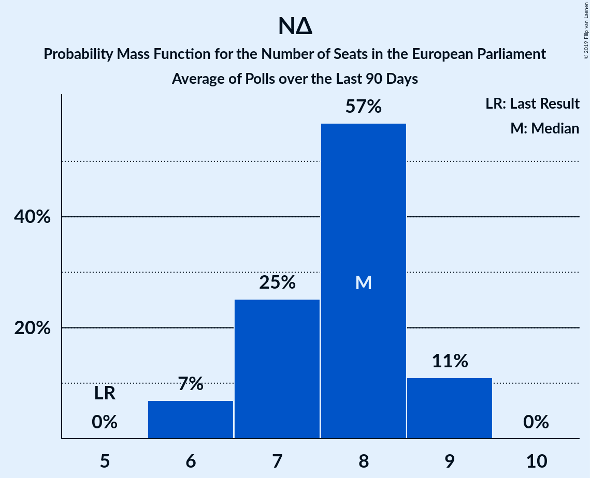

| Number of Seats | Probability | Accumulated | Special Marks |
|:---------------:|:-----------:|:-----------:|:-------------:|
| 5 | 0% | 100% | Last Result |
| 6 | 11% | 100% |  |
| 7 | 27% | 89% |  |
| 8 | 40% | 62% | Median |
| 9 | 18% | 21% |  |
| 10 | 3% | 3% |  |
| 11 | 0% | 0% | Majority |

### Συνασπισμός Ριζοσπαστικής Αριστεράς (GUE/NGL) – Λαϊκή Ενότητα (GUE/NGL) – Πλεύση Ελευθερίας (GUE/NGL)

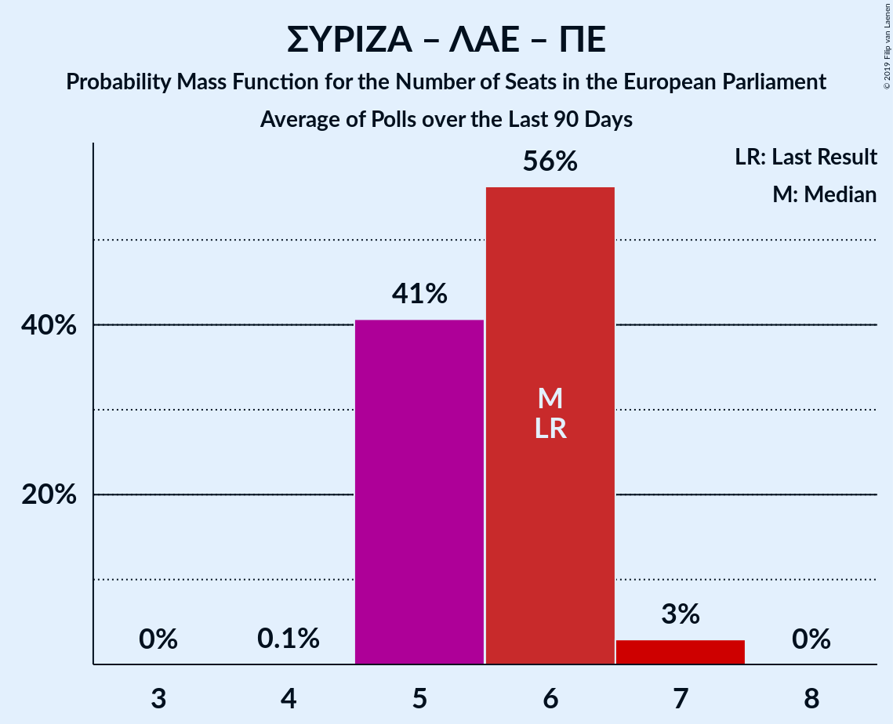

| Number of Seats | Probability | Accumulated | Special Marks |
|:---------------:|:-----------:|:-----------:|:-------------:|
| 4 | 0.4% | 100% |  |
| 5 | 54% | 99.6% | Median |
| 6 | 43% | 45% | Last Result |
| 7 | 3% | 3% |  |
| 8 | 0% | 0% |  |

### Χρυσή Αυγή (NI) – Κομμουνιστικό Κόμμα Ελλάδας (NI)

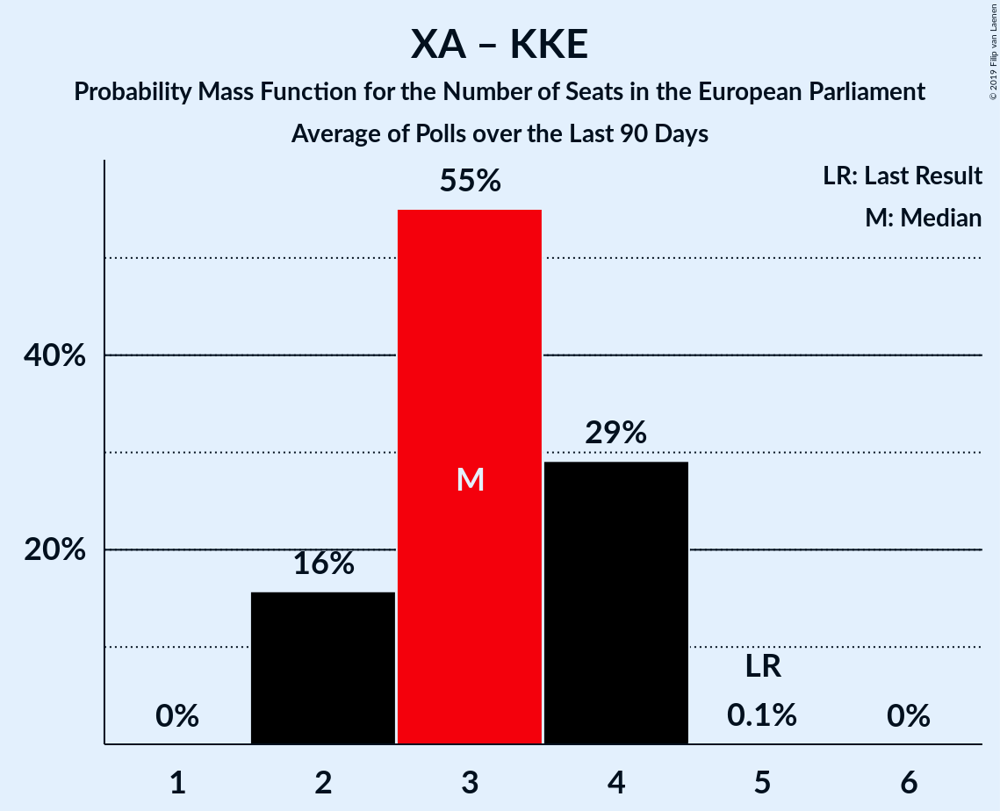

| Number of Seats | Probability | Accumulated | Special Marks |
|:---------------:|:-----------:|:-----------:|:-------------:|
| 2 | 23% | 100% |  |
| 3 | 50% | 77% | Median |
| 4 | 27% | 27% |  |
| 5 | 0.1% | 0.1% | Last Result |
| 6 | 0% | 0% |  |

### Το Ποτάμι (S&D) – Κίνημα Αλλαγής (S&D)

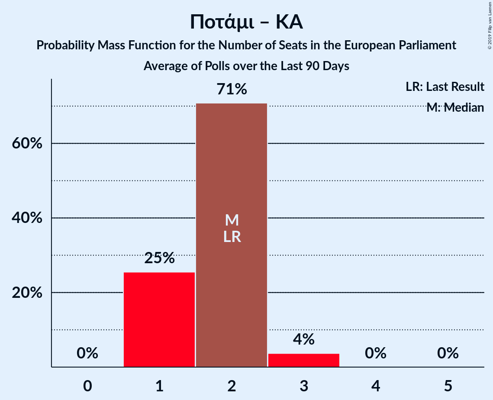

| Number of Seats | Probability | Accumulated | Special Marks |
|:---------------:|:-----------:|:-----------:|:-------------:|
| 1 | 44% | 100% |  |
| 2 | 56% | 56% | Last Result, Median |
| 3 | 0% | 0% |  |

### Ένωση Κεντρώων (ALDE)

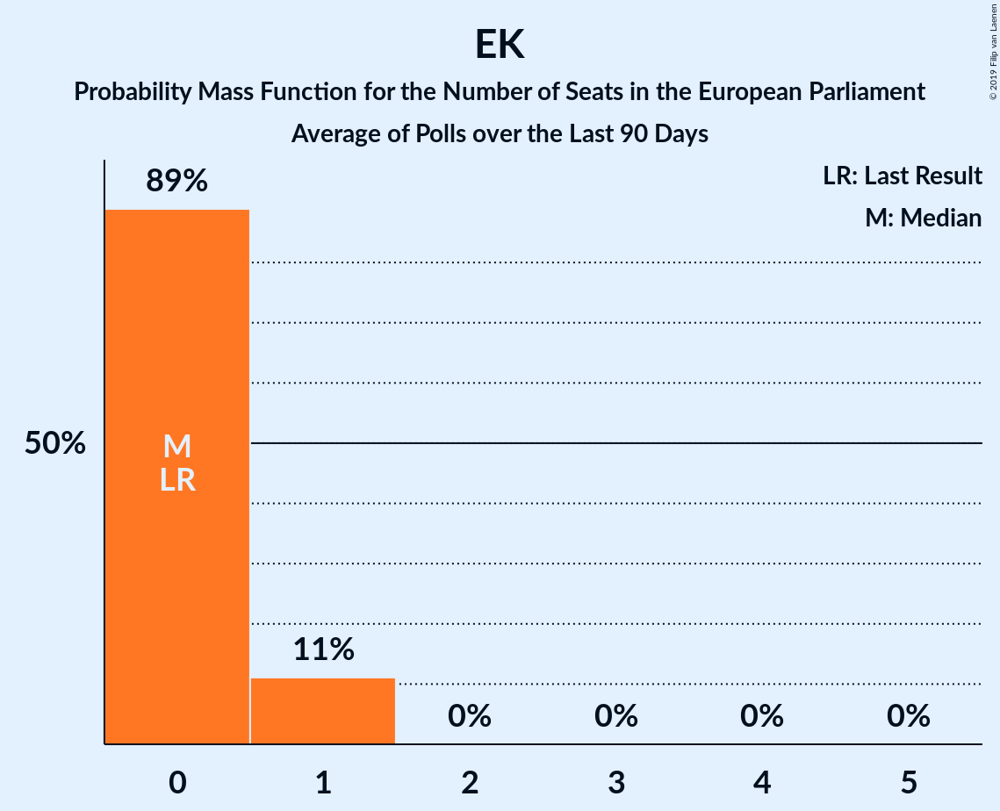

| Number of Seats | Probability | Accumulated | Special Marks |
|:---------------:|:-----------:|:-----------:|:-------------:|
| 0 | 93% | 100% | Last Result, Median |
| 1 | 7% | 7% |  |
| 2 | 0% | 0% |  |

### Ελληνική Λύση (*)

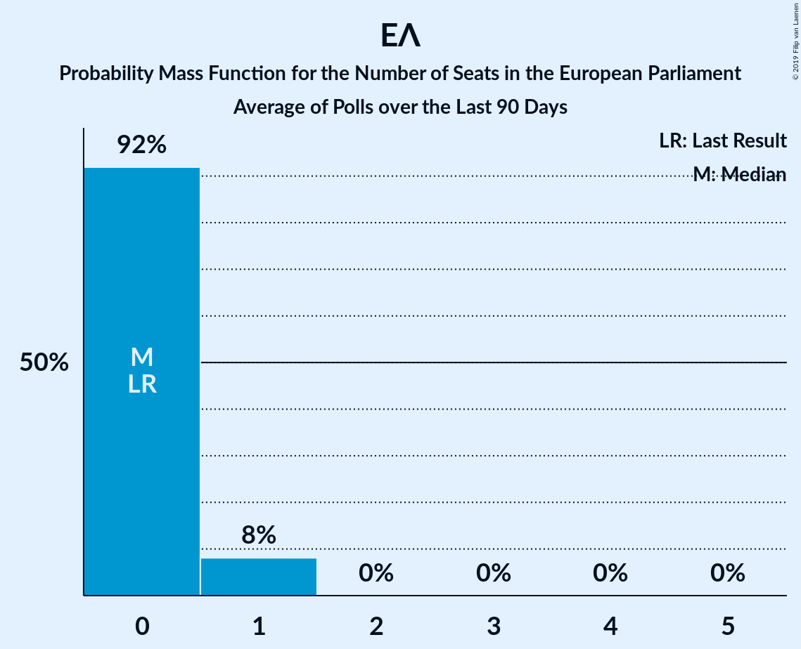

| Number of Seats | Probability | Accumulated | Special Marks |
|:---------------:|:-----------:|:-----------:|:-------------:|
| 0 | 69% | 100% | Last Result, Median |
| 1 | 31% | 31% |  |
| 2 | 0% | 0% |  |

### Ανεξάρτητοι Έλληνες (ECR)

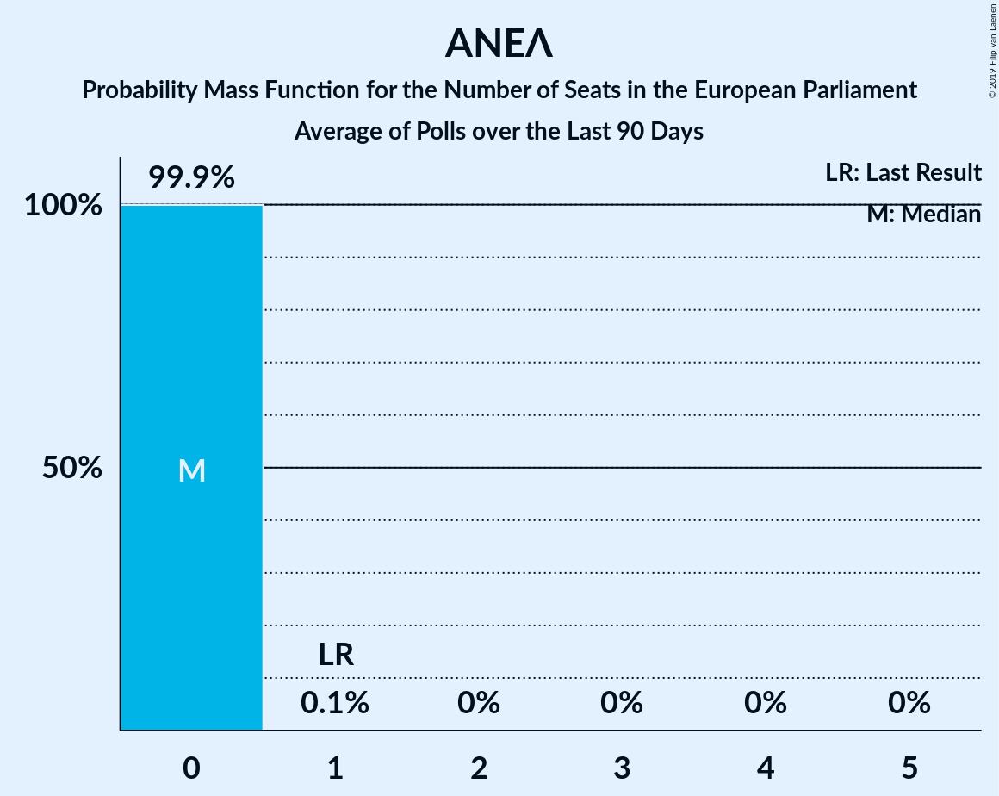

| Number of Seats | Probability | Accumulated | Special Marks |
|:---------------:|:-----------:|:-----------:|:-------------:|
| 0 | 100% | 100% | Median |
| 1 | 0% | 0% | Last Result |

## Technical Information

+ **Number of polls included in this average:** 11
+ **Lowest number of simulations done in a poll included in this average:** 0
+ **Total number of simulations done in the polls included in this average:** 8,388,608
+ **Error estimate:** 2.56%
