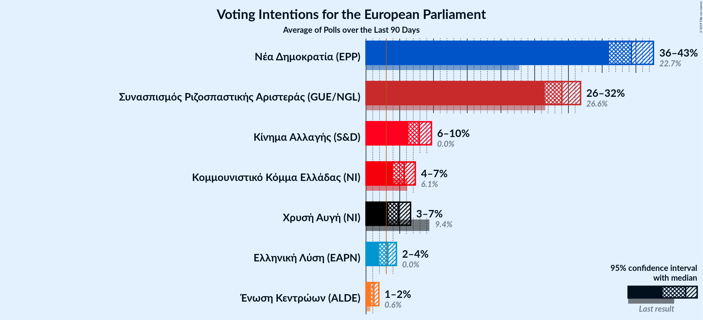
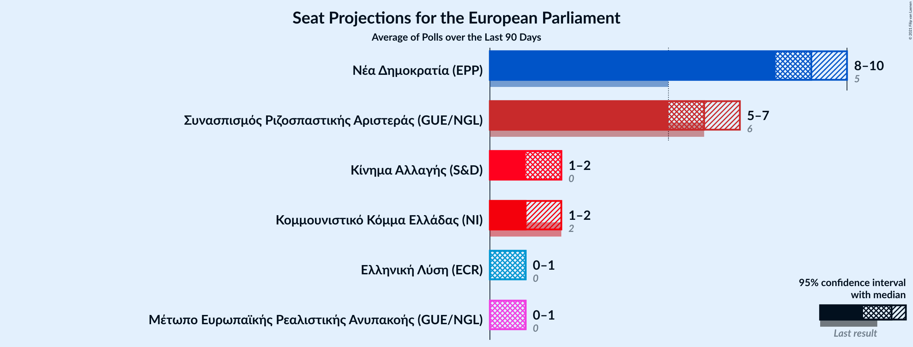
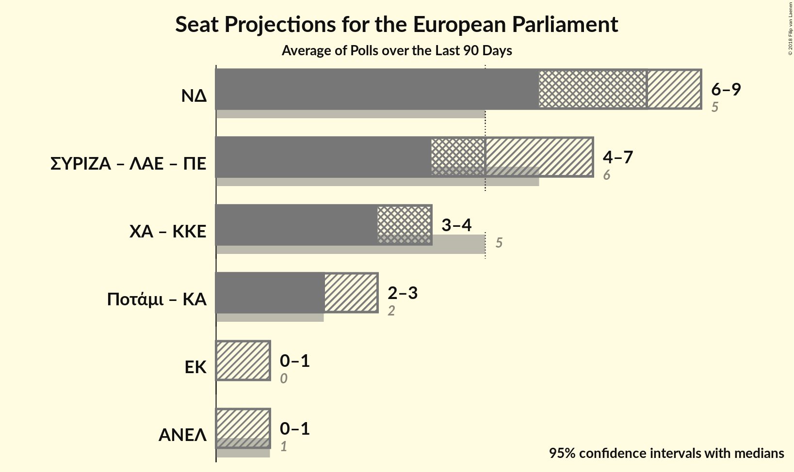

# Overview

The table below lists the most recent polls (less than 90 days old) registered and analyzed so far.

| Period     | Polling firm/Commissioner(s) | ΣΥΡΙΖΑ | ΝΔ | ΧΑ | Ποτάμι | ΚΚΕ | ΑΝΕΛ | ΕΚ | ΚΑ | ΛΑΕ | ΠΕ |
|:----------:|:----------------------------:|:--:|:--:|:--:|:--:|:--:|:--:|:--:|:--:|:--:|:--:|
| 25 May 2014 | General Election | 26.6%   6 | 22.7%   5 | 9.4%   3 | 6.6%   2 | 6.1%   2 | 3.5%   1 | 0.7%   0 | 0.0%   0 | 0.0%   0 | 0.0%   0 |
| N/A | [Poll Average](average.html) | 20–27%   4–6 | 30–39%   6–9 | 7–12%   1–3 | 0–2%   0 | 6–9%   1–2 | 2–4%   0–1 | 2–4%   0–1 | 8–14%   2–3 | 1–4%   0–1 | 1–2%   0 |
| [22–24 February 2018](2018-02-24-Alco.html) | Alco   ΕΘΝΟΣ | 22–27%   5–6 | 29–35%   6–8 | 9–12%   2–3 | N/A   N/A | 6–9%   1–2 | 2–4%   0–1 | 2–4%   0–1 | 8–11%   2 | 2–4%   0–1 | N/A   N/A |
| [12–23 February 2018](2018-02-23-MetronAnalysis.html) | Metron Analysis   Το Βήμα | 23–27%   5–6 | 33–37%   7–8 | 8–11%   2 | N/A   N/A | 6–8%   1–2 | 2–3%   0–1 | 2–4%   0–1 | 7–10%   2 | 1–3%   0 | N/A   N/A |
| [25–29 January 2018](2018-01-29-PulseRC.html) | Pulse RC   Action 24 | 22–26%   5–6 | 34–39%   8–9 | 8–11%   2–3 | N/A   N/A | 5–8%   1–2 | 2–3%   0–1 | 2–3%   0–1 | 9–12%   2–3 | 1–2%   0 | 1–2%   0 |
| [8–18 January 2018](2018-01-18-PublicIssue.html) | Public Issue | 19–24%   4–5 | 34–40%   7–9 | 6–10%   1–2 | 1–2%   0 | 6–9%   1–2 | 1–3%   0 | 1–3%   0 | 11–15%   2–3 | N/A   N/A | N/A   N/A |
| 25 May 2014 | General Election | 26.6%   6 | 22.7%   5 | 9.4%   3 | 6.6%   2 | 6.1%   2 | 3.5%   1 | 0.7%   0 | 0.0%   0 | 0.0%   0 | 0.0%   0 |

Only polls for which at least the sample size has been published are included in the table above.

**Legend:**
+ **Top half of each row:** Voting intentions (95% confidence interval)
+ **Bottom half of each row:** Seat projections for the European Parliament (95% confidence interval)
+ **ΣΥΡΙΖΑ:** Συνασπισμός Ριζοσπαστικής Αριστεράς (GUE/NGL)
+ **ΝΔ:** Νέα Δημοκρατία (EPP)
+ **ΧΑ:** Χρυσή Αυγή (—)
+ **Ποτάμι:** Το Ποτάμι (S&D)
+ **ΚΚΕ:** Κομμουνιστικό Κόμμα Ελλάδας (—)
+ **ΑΝΕΛ:** Ανεξάρτητοι Έλληνες (ECR)
+ **ΕΚ:** Ένωση Κεντρώων (ALDE)
+ **ΚΑ:** Κίνημα Αλλαγής (S&D)
+ **ΛΑΕ:** Λαϊκή Ενότητα (GUE/NGL)
+ **ΠΕ:** Πλεύση Ελευθερίας (GUE/NGL)
+ **N/A (single party):** Party not included the published results
+ **N/A (entire row):** Calculation for this opinion poll not started yet

