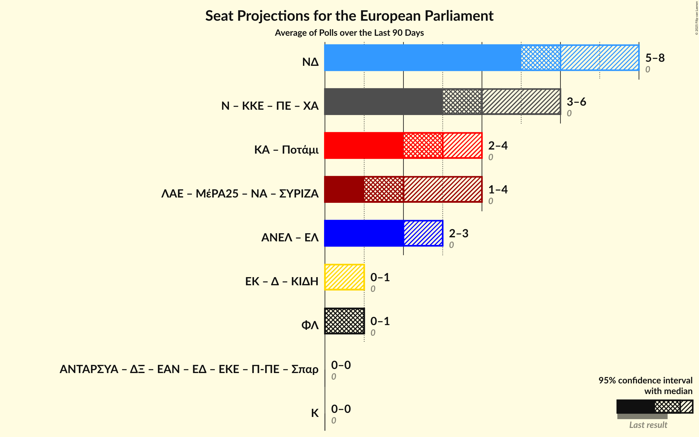

# Overview

The table below lists the most recent polls (less than 60 days old) registered and analyzed so far.

| Period     | Polling firm/Commissioner(s) | ΣΥΡΙΖΑ | ΝΔ | ΧΑ | Ποτάμι | ΚΚΕ | ΑΝΕΛ | ΕΚ | ΚΑ | ΛΑΕ | ΠΕ | ΕΛ |
|:----------:|:----------------------------:|:--:|:--:|:--:|:--:|:--:|:--:|:--:|:--:|:--:|:--:|:--:|
| 25 May 2014 | General Election | 26.6%   6 | 22.7%   5 | 9.4%   3 | 6.6%   2 | 6.1%   2 | 3.5%   1 | 0.6%   0 | 0.0%   0 | 0.0%   0 | 0.0%   0 | 0.0%   0 |
| N/A | [Poll Average](average.html) | 24–33%   5–7 | 30–38%   6–8 | 6–9%   1–2 | 1–4%   0–1 | 4–9%   1–2 | 0–3%   0 | 1–4%   0–1 | 5–11%   1–2 | 1–3%   0 | 0–2%   0 | 2–5%   0–1 |
| [21–22 May 2019](2019-05-22-ΚάπαResearch.html) | Κάπα Research | 25–31%   6 | 29–35%   6–7 | 6–10%   2 | 2–4%   0–1 | 5–8%   1–2 | 1–3%   0 | 1–3%   0 | 6–9%   2 | 1–2%   0 | 1–2%   0 | 2–5%   1 |
| [16–20 May 2019](2019-05-20-MetronAnalysis.html) | Metron Analysis | N/A   N/A | N/A   N/A | N/A   N/A | N/A   N/A | N/A   N/A | N/A   N/A | N/A   N/A | N/A   N/A | N/A   N/A | N/A   N/A | N/A   N/A |
| [15–19 May 2019](2019-05-19-Alco.html) | Alco | 24–30%   5–7 | 31–37%   7–8 | 5–8%   1–2 | 1–3%   0–1 | 4–7%   1–2 | 1–3%   0 | 2–4%   0–1 | 5–8%   1–2 | 1–3%   0–1 | 1–2%   0 | 2–4%   0–1 |
| [15–18 May 2019](2019-05-18-Prorata.html) | Prorata | 26–32%   6–7 | 32–38%   7–8 | 7–10%   2 | 1–2%   0 | 6–9%   1–2 | 0–1%   0 | 1–3%   0 | 6–10%   1–2 | 1–2%   0 | 0–1%   0 | 2–4%   0–1 |
| [15–17 May 2019](2019-05-17-RASS.html) | RASS | 24–29%   5–6 | 33–39%   7–9 | 6–9%   1–2 | N/A   N/A | 6–9%   1–2 | 1–3%   0 | 2–4%   0–1 | 8–12%   2–3 | N/A   N/A | N/A   N/A | 2–4%   0–1 |
| [14–17 May 2019](2019-05-17-PalmosAnalysis.html) | Palmos Analysis | 27–32%   6–7 | 31–37%   7–8 | 5–8%   1–2 | 2–4%   0–1 | 6–9%   1–2 | 0–1%   0 | 1–3%   0 | 5–8%   1–2 | 1–2%   0 | 0–1%   0 | 3–5%   0–1 |
| [13–16 May 2019](2019-05-16-MRB.html) | MRB | 24–30%   5–7 | 32–38%   7–8 | 6–9%   1–2 | 2–4%   0–1 | 5–9%   1–2 | 1–2%   0 | 2–4%   0–1 | 6–9%   1–2 | N/A   N/A | N/A   N/A | 1–3%   0 |
| [14–16 May 2019](2019-05-16-MARC.html) | MARC | 24–29%   5–6 | 32–37%   7–8 | 6–9%   1–2 | 1–2%   0 | 5–8%   1–2 | 1–2%   0 | 2–3%   0–1 | 6–9%   1–2 | 1–3%   0 | N/A   N/A | 2–4%   0–1 |
| [10–14 May 2019](2019-05-14-Interview.html) | Interview | 23–29%   5–6 | 32–38%   7–8 | 6–9%   1–2 | 1–2%   0 | 6–9%   1–2 | 1–2%   0 | 1–3%   0–1 | 6–10%   1–2 | 1–2%   0 | 1–2%   0 | 2–4%   0–1 |
| [6–8 May 2019](2019-05-08-VoxPopAnalysis.html) | Vox Pop Analysis   Documento | 30–35%   7–8 | 32–38%   7–8 | 6–9%   1–2 | 0–1%   0 | 4–6%   1 | 0–1%   0 | 1–2%   0 | 5–7%   1–2 | 1–2%   0 | 1–2%   0 | 1–3%   0 |
| 25 May 2014 | General Election | 26.6%   6 | 22.7%   5 | 9.4%   3 | 6.6%   2 | 6.1%   2 | 3.5%   1 | 0.6%   0 | 0.0%   0 | 0.0%   0 | 0.0%   0 | 0.0%   0 |

Only polls for which at least the sample size has been published are included in the table above.

**Legend:**
+ **Top half of each row:** Voting intentions (95% confidence interval)
+ **Bottom half of each row:** Seat projections for the European Parliament (95% confidence interval)
+ **ΣΥΡΙΖΑ:** Συνασπισμός Ριζοσπαστικής Αριστεράς (GUE/NGL)
+ **ΝΔ:** Νέα Δημοκρατία (EPP)
+ **ΧΑ:** Χρυσή Αυγή (NI)
+ **Ποτάμι:** Το Ποτάμι (S&D)
+ **ΚΚΕ:** Κομμουνιστικό Κόμμα Ελλάδας (NI)
+ **ΑΝΕΛ:** Ανεξάρτητοι Έλληνες (ECR)
+ **ΕΚ:** Ένωση Κεντρώων (ALDE)
+ **ΚΑ:** Κίνημα Αλλαγής (S&D)
+ **ΛΑΕ:** Λαϊκή Ενότητα (GUE/NGL)
+ **ΠΕ:** Πλεύση Ελευθερίας (GUE/NGL)
+ **ΕΛ:** Ελληνική Λύση (EAPN)
+ **N/A (single party):** Party not included the published results
+ **N/A (entire row):** Calculation for this opinion poll not started yet

