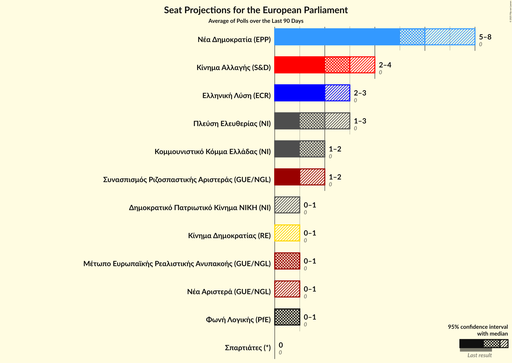

# Overview

The table below lists the most recent polls (less than 30 days old) registered and analyzed so far.

| Period     | Polling firm/Commissioner(s) | ΣΥΡΙΖΑ | ΝΔ | ΧΑ | Ποτάμι | ΚΚΕ | ΑΝΕΛ | ΕΚ | ΚΑ | ΛΑΕ | ΠΕ | ΕΛ | ΜέΡΑ25 | ΕΚΕ | ΕΔ | Ν | ΕΑΝ | Σπαρ | ΝΑ | ΑΝΤΑΡΣΥΑ | ΦΛ | Δ | ΔΞ | Κ |
|:----------:|:----------------------------:|:--:|:--:|:--:|:--:|:--:|:--:|:--:|:--:|:--:|:--:|:--:|:--:|:--:|:--:|:--:|:--:|:--:|:--:|:--:|:--:|:--:|:--:|:--:|
| 26 May 2019 | General Election | 26.6%   6 | 22.7%   5 | 9.4%   3 | 6.6%   2 | 6.1%   2 | 3.5%   1 | 0.6%   0 | 0.0%   0 | 0.0%   0 | 0.0%   0 | 0.0%   0 | 0.0%   0 | 0.0%   0 | 0.0%   0 | 0.0%   0 | 0.0%   0 | 0.0%   0 | 0.0%   0 | 0.0%   0 | 0.0%   0 | 0.0%   0 | 0.0%   0 | 0.0%   0 |
| N/A | [Poll Average](average.html) | 14–19%   3–4 | 30–37%   7–8 | N/A   N/A | N/A   N/A | 6–11%   1–3 | N/A   N/A | N/A   N/A | 10–16%   2–4 | N/A   N/A | 2–5%   0–1 | 7–12%   2–3 | 1–4%   0–1 | N/A   N/A | N/A   N/A | 2–5%   0–1 | N/A   N/A | N/A   N/A | 2–6%   0–2 | N/A   N/A | 1–4%   0–1 | 2–4%   0–1 | 1–2%   0 | 1–2%   0 |
| [13–15 May 2024](2024-05-15-PulseRC.html) | Pulse RC   ΣΚΑΪ | 14–19%   3–4 | 30–36%   7–8 | N/A   N/A | N/A   N/A | 6–10%   1–2 | N/A   N/A | N/A   N/A | 11–15%   2–3 | N/A   N/A | 2–5%   0–1 | 7–11%   1–3 | 2–4%   0–1 | N/A   N/A | N/A   N/A | 2–5%   0–1 | N/A   N/A | N/A   N/A | 2–4%   0–1 | N/A   N/A | 2–4%   0–1 | 1–3%   0–1 | N/A   N/A | N/A   N/A |
| [10–15 May 2024](2024-05-15-Marc.html) | Marc   ANT1 | 13–17%   3–4 | 33–38%   7–8 | N/A   N/A | N/A   N/A | 7–10%   1–2 | N/A   N/A | N/A   N/A | 10–14%   2–3 | N/A   N/A | 3–6%   1 | 7–10%   1–2 | 2–4%   0–1 | N/A   N/A | N/A   N/A | 2–4%   0–1 | N/A   N/A | N/A   N/A | 2–4%   0–1 | N/A   N/A | 2–4%   0–1 | 2–3%   0–1 | N/A   N/A | N/A   N/A |
| [10–14 May 2024](2024-05-14-MRB.html) | MRB   Open TV | 14–19%   3–4 | 29–35%   6–8 | N/A   N/A | N/A   N/A | 6–10%   1–3 | N/A   N/A | N/A   N/A | 12–16%   3–4 | N/A   N/A | 2–5%   0–1 | 8–12%   2–3 | 1–3%   0–1 | N/A   N/A | N/A   N/A | 2–4%   0–1 | N/A   N/A | N/A   N/A | 3–5%   0–1 | N/A   N/A | 2–4%   0–1 | 2–4%   0–1 | N/A   N/A | N/A   N/A |
| [8–13 May 2024](2024-05-13-Interview.html) | Interview   Politic.gr | 16–19%   4–5 | 31–35%   7–8 | N/A   N/A | N/A   N/A | 6–8%   1–2 | N/A   N/A | N/A   N/A | 11–14%   2–3 | N/A   N/A | 2–4%   0–1 | 7–9%   2 | 2–3%   0–1 | N/A   N/A | N/A   N/A | 3–4%   0–1 | N/A   N/A | N/A   N/A | 4–6%   1–2 | N/A   N/A | 2–4%   0–1 | 2–3%   0–1 | 1–2%   0 | N/A   N/A |
| [20–22 April 2024](2024-04-22-OpinionPoll.html) | Opinion Poll   Action 24 | 13–18%   3–4 | 30–36%   6–8 | N/A   N/A | N/A   N/A | 7–11%   2 | N/A   N/A | N/A   N/A | 10–15%   2–3 | N/A   N/A | 3–6%   1 | 9–13%   2–3 | 1–3%   0 | N/A   N/A | N/A   N/A | 3–5%   0–1 | N/A   N/A | N/A   N/A | 2–4%   0–1 | N/A   N/A | 1–3%   0 | 2–4%   0–1 | N/A   N/A | N/A   N/A |
| [17–22 April 2024](2024-04-22-GPO.html) | GPO   Παραπολιτικά | 15–19%   3–4 | 32–37%   7–8 | N/A   N/A | N/A   N/A | 8–11%   2–3 | N/A   N/A | N/A   N/A | 12–16%   3–4 | N/A   N/A | 2–4%   0–1 | 8–11%   2–3 | 2–3%   0–1 | N/A   N/A | N/A   N/A | 3–5%   0–1 | N/A   N/A | N/A   N/A | 2–4%   0–1 | N/A   N/A | N/A   N/A | 1–3%   0–1 | N/A   N/A | N/A   N/A |
| [10–16 April 2024](2024-04-16-MetronAnalysis.html) | Metron Analysis   Mega TV | 14–18%   3–4 | 30–36%   7–8 | N/A   N/A | N/A   N/A | 8–12%   2–3 | N/A   N/A | N/A   N/A | 10–14%   2–3 | N/A   N/A | 3–6%   1 | 7–10%   2–3 | 1–3%   0 | N/A   N/A | N/A   N/A | 3–5%   1 | N/A   N/A | N/A   N/A | 2–4%   0–1 | N/A   N/A | 1–2%   0 | 1–3%   0 | N/A   N/A | 1–2%   0 |
| 26 May 2019 | General Election | 26.6%   6 | 22.7%   5 | 9.4%   3 | 6.6%   2 | 6.1%   2 | 3.5%   1 | 0.6%   0 | 0.0%   0 | 0.0%   0 | 0.0%   0 | 0.0%   0 | 0.0%   0 | 0.0%   0 | 0.0%   0 | 0.0%   0 | 0.0%   0 | 0.0%   0 | 0.0%   0 | 0.0%   0 | 0.0%   0 | 0.0%   0 | 0.0%   0 | 0.0%   0 |

Only polls for which at least the sample size has been published are included in the table above.

**Legend:**
+ **Top half of each row:** Voting intentions (95% confidence interval)
+ **Bottom half of each row:** Seat projections for the European Parliament (95% confidence interval)
+ **ΣΥΡΙΖΑ:** Συνασπισμός Ριζοσπαστικής Αριστεράς (GUE/NGL)
+ **ΝΔ:** Νέα Δημοκρατία (EPP)
+ **ΧΑ:** Χρυσή Αυγή (NI)
+ **Ποτάμι:** Το Ποτάμι (S&D)
+ **ΚΚΕ:** Κομμουνιστικό Κόμμα Ελλάδας (NI)
+ **ΑΝΕΛ:** Ανεξάρτητοι Έλληνες (ECR)
+ **ΕΚ:** Ένωση Κεντρώων (RE)
+ **ΚΑ:** Κίνημα Αλλαγής (S&D)
+ **ΛΑΕ:** Λαϊκή Ενότητα (GUE/NGL)
+ **ΠΕ:** Πλεύση Ελευθερίας (*)
+ **ΕΛ:** Ελληνική Λύση (ECR)
+ **ΜέΡΑ25:** Μέτωπο Ευρωπαϊκής Ρεαλιστικής Ανυπακοής (GUE/NGL)
+ **ΕΚΕ:** Εθνικό Κόμμα – Έλληνες (*)
+ **ΕΔ:** Εθνική Δημιουργία (ID)
+ **Ν:** Δημοκρατικό Πατριωτικό Κίνημα ΝΙΚΗ (NI)
+ **ΕΑΝ:** ΕΑΝ… (*)
+ **Σπαρ:** Σπαρτιάτες (*)
+ **ΝΑ:** Νέα Αριστερά (GUE/NGL)
+ **ΑΝΤΑΡΣΥΑ:** Αντικαπιταλιστική Αριστερή Συνεργασία για την Ανατροπή (*)
+ **ΦΛ:** Φωνή Λογικής (*)
+ **Δ:** Δημοκράτες (RE)
+ **ΔΞ:** Δημιουργία, Ξανά (*)
+ **Κ:** Κόσμος (Greens/EFA)
+ **N/A (single party):** Party not included the published results
+ **N/A (entire row):** Calculation for this opinion poll not started yet

