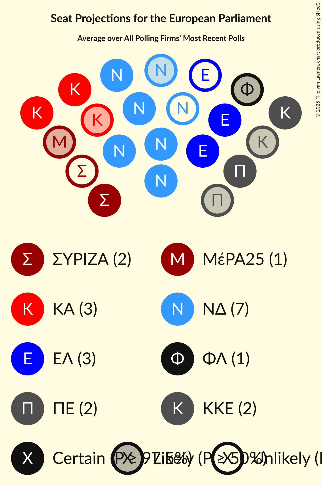

# Overview

The table below lists the most recent polls (less than 90 days old) registered and analyzed so far.

| Period     | Polling firm/Commissioner(s) | ΣΥΡΙΖΑ | ΛΑΕ | ΜέΡΑ25 | ΝΑ | Κ | Ποτάμι | ΚΑ | Δ | ΕΚ | ΚΙΔΗ | ΝΔ | ΑΝΕΛ | ΕΛ | ΦΛ | ΧΑ | ΚΚΕ | Ν | ΠΕ | ΕΚΕ | ΕΔ | ΕΑΝ | Σπαρ | ΑΝΤΑΡΣΥΑ | ΔΞ | Π-ΠΕ |
|:----------:|:----------------------------:|:--:|:--:|:--:|:--:|:--:|:--:|:--:|:--:|:--:|:--:|:--:|:--:|:--:|:--:|:--:|:--:|:--:|:--:|:--:|:--:|:--:|:--:|:--:|:--:|:--:|
| 9 June 2024 | General Election | 0.0%   0 | 0.0%   0 | 0.0%   0 | 0.0%   0 | 0.0%   0 | 0.0%   0 | 0.0%   0 | 0.0%   0 | 0.0%   0 | 0.0%   0 | 0.0%   0 | 0.0%   0 | 0.0%   0 | 0.0%   0 | 0.0%   0 | 0.0%   0 | 0.0%   0 | 0.0%   0 | 0.0%   0 | 0.0%   0 | 0.0%   0 | 0.0%   0 | 0.0%   0 | 0.0%   0 | 0.0%   0 |
| N/A | [Poll Average](average.html) | 3–8%   1–2 | N/A   N/A | 2–6%   0–1 | 1–3%   0–1 | N/A   N/A | N/A   N/A | 12–17%   2–4 | N/A   N/A | N/A   N/A | 2–5%   0–1 | 27–33%   6–7 | N/A   N/A | 8–14%   2–3 | 3–7%   0–2 | N/A   N/A | 6–11%   1–2 | 1–4%   0–1 | 5–11%   1–2 | N/A   N/A | N/A   N/A | N/A   N/A | 0–3%   0 | 1–2%   0 | N/A   N/A | N/A   N/A |
| [18–20 November 2025](2025-11-20-MRB.html) | MRB   Open TV | 3–7%   1 | N/A   N/A | 2–4%   0–1 | 1–3%   0–1 | N/A   N/A | N/A   N/A | 11–16%   2–4 | N/A   N/A | N/A   N/A | 2–4%   0–1 | 26–32%   6–7 | N/A   N/A | 10–14%   2–3 | 4–8%   1–2 | N/A   N/A | 7–11%   1–2 | 2–5%   0–1 | 7–12%   2–3 | N/A   N/A | N/A   N/A | N/A   N/A | N/A   N/A | N/A   N/A | N/A   N/A | N/A   N/A |
| [12–19 November 2025](2025-11-19-PalmosAnalysis.html) | Palmos Analysis   Ελεύθερος Τύπος | N/A   N/A | N/A   N/A | N/A   N/A | N/A   N/A | N/A   N/A | N/A   N/A | N/A   N/A | N/A   N/A | N/A   N/A | N/A   N/A | N/A   N/A | N/A   N/A | N/A   N/A | N/A   N/A | N/A   N/A | N/A   N/A | N/A   N/A | N/A   N/A | N/A   N/A | N/A   N/A | N/A   N/A | N/A   N/A | N/A   N/A | N/A   N/A | N/A   N/A |
| [16–18 November 2025](2025-11-18-PulseRC.html) | Pulse RC   ΣΚΑΪ | 5–9%   1–2 | N/A   N/A | 3–5%   0–1 | 2–4%   0–1 | N/A   N/A | N/A   N/A | 12–16%   3–4 | N/A   N/A | N/A   N/A | 2–4%   0–1 | 27–33%   6–7 | N/A   N/A | 8–12%   2–3 | 3–5%   0–1 | N/A   N/A | 7–11%   2 | 2–4%   0–1 | 7–11%   1–2 | N/A   N/A | N/A   N/A | N/A   N/A | 1–3%   0–1 | N/A   N/A | N/A   N/A | N/A   N/A |
| [11–18 November 2025](2025-11-18-MetronAnalysis.html) | Metron Analysis   Mega TV | 5–8%   1–2 | N/A   N/A | 3–5%   1 | 1–3%   0–1 | N/A   N/A | N/A   N/A | 12–16%   3 | N/A   N/A | N/A   N/A | 2–4%   0–1 | 27–32%   6–7 | N/A   N/A | 8–12%   2–3 | 3–6%   1 | N/A   N/A | 6–9%   1–2 | 1–3%   0 | 8–12%   2–3 | N/A   N/A | N/A   N/A | N/A   N/A | 0–2%   0 | 1–2%   0 | N/A   N/A | N/A   N/A |
| [10–11 November 2025](2025-11-11-OpinionPoll.html) | Opinion Poll   Action 24 | 3–6%   0–1 | N/A   N/A | 2–5%   0–1 | 1–2%   0 | N/A   N/A | N/A   N/A | 12–16%   2–4 | N/A   N/A | N/A   N/A | 2–4%   0–1 | 27–33%   6–7 | N/A   N/A | 9–13%   2–3 | 3–6%   1 | N/A   N/A | 6–10%   1–2 | 2–4%   0–1 | 7–11%   1–2 | N/A   N/A | N/A   N/A | N/A   N/A | 1–2%   0 | N/A   N/A | N/A   N/A | N/A   N/A |
| [9–10 November 2025](2025-11-10-RealPolls.html) | Real Polls   Protagon | 3–6%   1 | N/A   N/A | 3–5%   1 | 1–3%   0 | N/A   N/A | N/A   N/A | 11–15%   3 | N/A   N/A | N/A   N/A | 2–3%   0–1 | 28–33%   6–7 | N/A   N/A | 8–11%   2 | 4–7%   1–2 | N/A   N/A | 6–9%   1–2 | 1–3%   0 | 6–9%   1–2 | N/A   N/A | N/A   N/A | N/A   N/A | 1–2%   0 | N/A   N/A | N/A   N/A | N/A   N/A |
| [6–10 November 2025](2025-11-10-Interview.html) | Interview   Politic.gr | 3–5%   0–1 | N/A   N/A | 4–6%   1 | 1–2%   0 | N/A   N/A | N/A   N/A | 14–16%   3–4 | N/A   N/A | N/A   N/A | 4–6%   1 | 28–32%   6–7 | N/A   N/A | 7–9%   2 | 6–7%   1–2 | N/A   N/A | 7–9%   2 | 1–2%   0 | 5–7%   1–2 | N/A   N/A | N/A   N/A | N/A   N/A | N/A   N/A | N/A   N/A | N/A   N/A | N/A   N/A |
| [29 October–2 November 2025](2025-11-02-Alco.html) | Alco   Alpha TV | 5–8%   1–2 | N/A   N/A | 2–5%   0–1 | 1–3%   0 | N/A   N/A | N/A   N/A | 12–18%   3–4 | N/A   N/A | N/A   N/A | 2–5%   0–1 | 26–33%   6–7 | N/A   N/A | 9–14%   2–3 | 3–6%   1 | N/A   N/A | 7–11%   2–3 | 2–4%   0–1 | 6–10%   1–2 | N/A   N/A | N/A   N/A | N/A   N/A | N/A   N/A | N/A   N/A | N/A   N/A | N/A   N/A |
| 9 June 2024 | General Election | 0.0%   0 | 0.0%   0 | 0.0%   0 | 0.0%   0 | 0.0%   0 | 0.0%   0 | 0.0%   0 | 0.0%   0 | 0.0%   0 | 0.0%   0 | 0.0%   0 | 0.0%   0 | 0.0%   0 | 0.0%   0 | 0.0%   0 | 0.0%   0 | 0.0%   0 | 0.0%   0 | 0.0%   0 | 0.0%   0 | 0.0%   0 | 0.0%   0 | 0.0%   0 | 0.0%   0 | 0.0%   0 |

Only polls for which at least the sample size has been published are included in the table above.

**Legend:**
+ **Top half of each row:** Voting intentions (95% confidence interval)
+ **Bottom half of each row:** Seat projections for the European Parliament (95% confidence interval)
+ **ΣΥΡΙΖΑ:** Συνασπισμός Ριζοσπαστικής Αριστεράς (GUE/NGL)
+ **ΛΑΕ:** Λαϊκή Ενότητα (GUE/NGL)
+ **ΜέΡΑ25:** Μέτωπο Ευρωπαϊκής Ρεαλιστικής Ανυπακοής (GUE/NGL)
+ **ΝΑ:** Νέα Αριστερά (GUE/NGL)
+ **Κ:** Κόσμος (Greens/EFA)
+ **Ποτάμι:** Το Ποτάμι (S&D)
+ **ΚΑ:** Κίνημα Αλλαγής (S&D)
+ **Δ:** Δημοκράτες (RE)
+ **ΕΚ:** Ένωση Κεντρώων (RE)
+ **ΚΙΔΗ:** Κίνημα Δημοκρατίας (RE)
+ **ΝΔ:** Νέα Δημοκρατία (EPP)
+ **ΑΝΕΛ:** Ανεξάρτητοι Έλληνες (ECR)
+ **ΕΛ:** Ελληνική Λύση (ECR)
+ **ΦΛ:** Φωνή Λογικής (PfE)
+ **ΧΑ:** Χρυσή Αυγή (NI)
+ **ΚΚΕ:** Κομμουνιστικό Κόμμα Ελλάδας (NI)
+ **Ν:** Δημοκρατικό Πατριωτικό Κίνημα ΝΙΚΗ (NI)
+ **ΠΕ:** Πλεύση Ελευθερίας (NI)
+ **ΕΚΕ:** Εθνικό Κόμμα – Έλληνες (*)
+ **ΕΔ:** Εθνική Δημιουργία (*)
+ **ΕΑΝ:** ΕΑΝ… (*)
+ **Σπαρ:** Σπαρτιάτες (*)
+ **ΑΝΤΑΡΣΥΑ:** Αντικαπιταλιστική Αριστερή Συνεργασία για την Ανατροπή (*)
+ **ΔΞ:** Δημιουργία, Ξανά (*)
+ **Π-ΠΕ:** Πατριώτες (*)
+ **N/A (single party):** Party not included the published results
+ **N/A (entire row):** Calculation for this opinion poll not started yet

