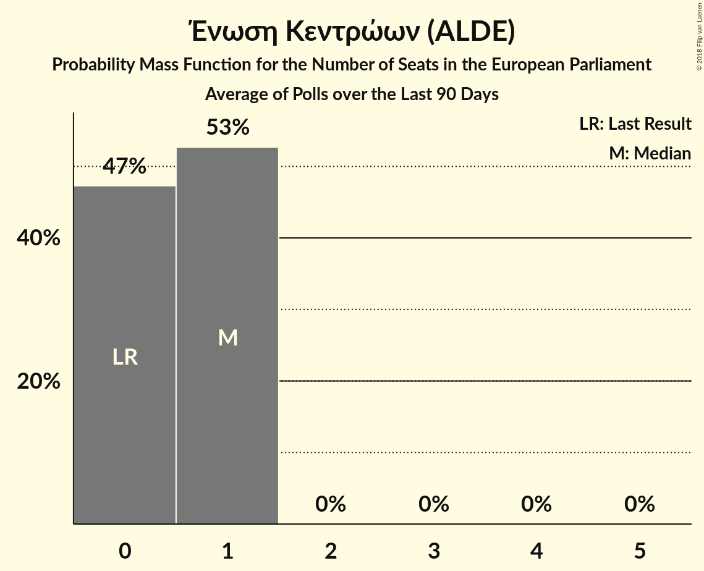

# Ένωση Κεντρώων (ALDE)

<a href="#voting-intentions">Voting Intentions</a> | <a href="#seats">Seats</a>

## Voting Intentions

Last result: **0.7%** (General Election of 25 May 2014)

### Confidence Intervals

| Period     | Polling firm/Commissioner(s) | Median | 80% Confidence Interval | 90% Confidence Interval | 95% Confidence Interval | 99% Confidence Interval |
|:----------:|:----------------:|:-----------:|:-----------------------:|:-----------------------:|:-----------------------:|:-----------------------:|
| N/A | [Poll Average](average.html) | 2.8% | 1.9–3.6% | 1.7–3.9% | 1.6–4.1% | 1.3–4.6% |
| [11–13 March 2018](2018-03-13-PulseRC.html) | Pulse RC   ΣΚΑΪ | 2.5% | 2.0–3.2% | 1.9–3.4% | 1.8–3.5% | 1.6–3.9% |
| [6–8 March 2018](2018-03-08-RASS.html) | RASS   Πρώτο Θέμα | 3.3% | 2.7–4.1% | 2.5–4.4% | 2.3–4.6% | 2.1–5.0% |
| [22–24 February 2018](2018-02-24-Alco.html) | Alco   ΕΘΝΟΣ | 2.7% | 2.1–3.5% | 2.0–3.7% | 1.9–3.9% | 1.6–4.3% |
| [12–23 February 2018](2018-02-23-MetronAnalysis.html) | Metron Analysis   Το Βήμα | 3.0% | 2.6–3.5% | 2.5–3.7% | 2.4–3.8% | 2.2–4.0% |
| [25–29 January 2018](2018-01-29-PulseRC.html) | Pulse RC   Action 24 | 2.5% | 2.1–3.1% | 1.9–3.3% | 1.8–3.4% | 1.6–3.7% |
| [8–18 January 2018](2018-01-18-PublicIssue.html) | Public Issue | 2.0% | 1.5–2.7% | 1.4–2.9% | 1.3–3.0% | 1.1–3.4% |
| [16–18 January 2018](2018-01-18-Alco.html) | Alco   Ραδιόφωνο 24/7 | 2.6% | 2.1–3.4% | 1.9–3.6% | 1.8–3.8% | 1.6–4.2% |
| [8–10 January 2018](2018-01-10-PulseRC.html) | Pulse RC   bankingnews.gr | 2.5% | 2.0–3.2% | 1.9–3.4% | 1.7–3.5% | 1.5–3.9% |

### Probability Mass Function

The following table shows the probability mass function per percentage block of voting intentions for the [poll average](average.html) for Ένωση Κεντρώων (ALDE).

| Voting Intentions | Probability | Accumulated | Special Marks |
|:-----------------:|:-----------:|:-----------:|:-------------:|
| 0.0–0.5% | 0% | 100% |  |
| 0.5–1.5% | 2% | 100% | Last Result |
| 1.5–2.5% | 33% | 98% |  |
| 2.5–3.5% | 53% | 64% | Median |
| 3.5–4.5% | 11% | 11% |  |
| 4.5–5.5% | 0.6% | 0.6% |  |
| 5.5–6.5% | 0% | 0% |  |

## Seats

Last result: **0** seats (General Election of 25 May 2014)

### Confidence Intervals

| Period     | Polling firm/Commissioner(s) | Median | 80% Confidence Interval | 90% Confidence Interval | 95% Confidence Interval | 99% Confidence Interval |
|:----------:|:----------------:|:------:|:-----------------------:|:-----------------------:|:-----------------------:|:-----------------------:|
| N/A | [Poll Average](average.html) | 0 | 0–1 | 0–1 | 0–1 | 0–1 |
| [11–13 March 2018](2018-03-13-PulseRC.html) | Pulse RC   ΣΚΑΪ | 0 | 0–1 | 0–1 | 0–1 | 0–1 |
| [6–8 March 2018](2018-03-08-RASS.html) | RASS   Πρώτο Θέμα | 1 | 0–1 | 0–1 | 0–1 | 0–1 |
| [22–24 February 2018](2018-02-24-Alco.html) | Alco   ΕΘΝΟΣ | 0 | 0–1 | 0–1 | 0–1 | 0–1 |
| [12–23 February 2018](2018-02-23-MetronAnalysis.html) | Metron Analysis   Το Βήμα | 1 | 0–1 | 0–1 | 0–1 | 0–1 |
| [25–29 January 2018](2018-01-29-PulseRC.html) | Pulse RC   Action 24 | 0 | 0–1 | 0–1 | 0–1 | 0–1 |
| [8–18 January 2018](2018-01-18-PublicIssue.html) | Public Issue | 0 | 0 | 0 | 0 | 0–1 |
| [16–18 January 2018](2018-01-18-Alco.html) | Alco   Ραδιόφωνο 24/7 | 0 | 0–1 | 0–1 | 0–1 | 0–1 |
| [8–10 January 2018](2018-01-10-PulseRC.html) | Pulse RC   bankingnews.gr | 0 | 0–1 | 0–1 | 0–1 | 0–1 |

### Probability Mass Function

The following table shows the probability mass function per seat for the [poll average](average.html) for Ένωση Κεντρώων (ALDE).

| Number of Seats | Probability | Accumulated | Special Marks |
|:---------------:|:-----------:|:-----------:|:-------------:|
| 0 | 67% | 100% | Last Result, Median |
| 1 | 33% | 33% |  |
| 2 | 0% | 0% |  |

