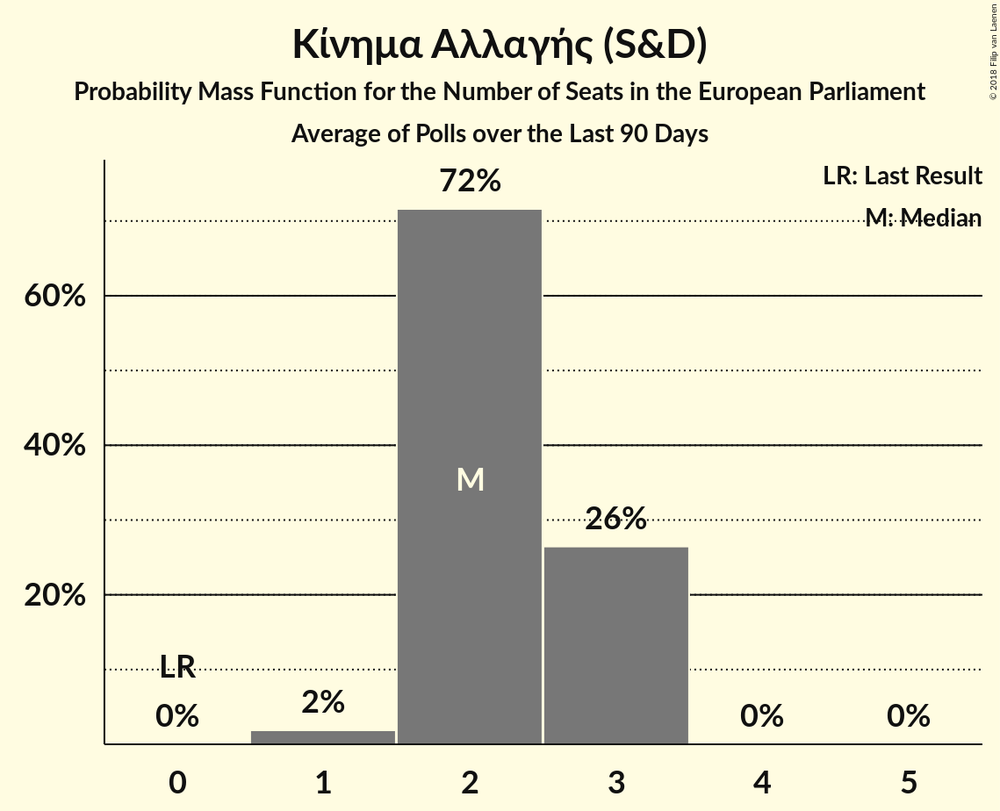

# Κίνημα Αλλαγής (S&D)

<a href="#voting-intentions">Voting Intentions</a> | <a href="#seats">Seats</a>

## Voting Intentions

Last result: **0.0%** (General Election of 25 May 2014)

### Confidence Intervals

| Period     | Polling firm/Commissioner(s) | Median | 80% Confidence Interval | 90% Confidence Interval | 95% Confidence Interval | 99% Confidence Interval |
|:----------:|:----------------:|:-----------:|:-----------------------:|:-----------------------:|:-----------------------:|:-----------------------:|
| N/A | [Poll Average](average.html) | 10.2% | 7.9–13.1% | 7.5–13.8% | 7.1–14.2% | 6.5–15.1% |
| [15–17 April 2018](2018-04-17-PulseRC.html) | Pulse RC   ΣΚΑΪ | 10.5% | 9.5–11.6% | 9.2–11.9% | 8.9–12.2% | 8.5–12.8% |
| [11–16 April 2018](2018-04-16-Alco.html) | Alco   Ραδιόφωνο 24/7 | 7.9% | 6.9–9.1% | 6.6–9.4% | 6.4–9.7% | 5.9–10.3% |
| [12–15 April 2018](2018-04-15-PalmosAnalysis.html) | Palmos Analysis   TVXS | 9.5% | 8.4–10.8% | 8.1–11.2% | 7.8–11.5% | 7.4–12.1% |
| [3 April 2018](2018-04-03-ΚάπαResearch.html) | Κάπα Research   ΕΘΝΟΣ | 10.3% | 9.9–10.8% | 9.8–10.9% | 9.6–11.0% | 9.4–11.2% |
| [11–13 March 2018](2018-03-13-PulseRC.html) | Pulse RC   ΣΚΑΪ | 10.0% | 9.0–11.1% | 8.7–11.4% | 8.5–11.7% | 8.0–12.3% |
| [6–8 March 2018](2018-03-08-RASS.html) | RASS   Πρώτο Θέμα | 12.4% | 11.1–13.8% | 10.8–14.2% | 10.5–14.6% | 9.9–15.3% |
| [22–24 February 2018](2018-02-24-Alco.html) | Alco   ΕΘΝΟΣ | 9.3% | 8.2–10.6% | 7.9–10.9% | 7.7–11.3% | 7.2–11.9% |
| [12–23 February 2018](2018-02-23-MetronAnalysis.html) | Metron Analysis   Το Βήμα | 8.4% | 7.7–9.2% | 7.5–9.4% | 7.3–9.6% | 7.0–10.0% |
| [25–29 January 2018](2018-01-29-PulseRC.html) | Pulse RC   Action 24 | 10.5% | 9.5–11.6% | 9.3–11.9% | 9.0–12.1% | 8.6–12.7% |
| [8–18 January 2018](2018-01-18-PublicIssue.html) | Public Issue | 13.0% | 11.7–14.4% | 11.3–14.8% | 11.0–15.2% | 10.5–15.9% |
| [16–18 January 2018](2018-01-18-Alco.html) | Alco   Ραδιόφωνο 24/7 | 9.7% | 8.6–11.0% | 8.3–11.4% | 8.0–11.7% | 7.5–12.3% |
| [8–10 January 2018](2018-01-10-PulseRC.html) | Pulse RC   bankingnews.gr | 10.0% | 9.0–11.2% | 8.7–11.6% | 8.4–11.9% | 8.0–12.5% |

### Probability Mass Function

The following table shows the probability mass function per percentage block of voting intentions for the [poll average](average.html) for Κίνημα Αλλαγής (S&D).

| Voting Intentions | Probability | Accumulated | Special Marks |
|:-----------------:|:-----------:|:-----------:|:-------------:|
| 0.0–0.5% | 0% | 100% | Last Result |
| 0.5–1.5% | 0% | 100% |  |
| 1.5–2.5% | 0% | 100% |  |
| 2.5–3.5% | 0% | 100% |  |
| 3.5–4.5% | 0% | 100% |  |
| 4.5–5.5% | 0% | 100% |  |
| 5.5–6.5% | 0.6% | 100% |  |
| 6.5–7.5% | 5% | 99.4% |  |
| 7.5–8.5% | 16% | 95% |  |
| 8.5–9.5% | 15% | 79% |  |
| 9.5–10.5% | 23% | 63% | Median |
| 10.5–11.5% | 14% | 41% |  |
| 11.5–12.5% | 10% | 27% |  |
| 12.5–13.5% | 10% | 16% |  |
| 13.5–14.5% | 5% | 7% |  |
| 14.5–15.5% | 1.3% | 1.5% |  |
| 15.5–16.5% | 0.2% | 0.2% |  |
| 16.5–17.5% | 0% | 0% |  |

## Seats

Last result: **0** seats (General Election of 25 May 2014)

### Confidence Intervals

| Period     | Polling firm/Commissioner(s) | Median | 80% Confidence Interval | 90% Confidence Interval | 95% Confidence Interval | 99% Confidence Interval |
|:----------:|:----------------:|:------:|:-----------------------:|:-----------------------:|:-----------------------:|:-----------------------:|
| N/A | [Poll Average](average.html) | 2 | 2–3 | 2–3 | 2–3 | 1–3 |
| [15–17 April 2018](2018-04-17-PulseRC.html) | Pulse RC   ΣΚΑΪ | 2 | 2–3 | 2–3 | 2–3 | 2–3 |
| [11–16 April 2018](2018-04-16-Alco.html) | Alco   Ραδιόφωνο 24/7 | 2 | 2 | 1–2 | 1–2 | 1–3 |
| [12–15 April 2018](2018-04-15-PalmosAnalysis.html) | Palmos Analysis   TVXS | 2 | 2 | 2 | 2 | 1–3 |
| [3 April 2018](2018-04-03-ΚάπαResearch.html) | Κάπα Research   ΕΘΝΟΣ | 2 | 2–3 | 2–3 | 2–3 | 2–3 |
| [11–13 March 2018](2018-03-13-PulseRC.html) | Pulse RC   ΣΚΑΪ | 2 | 2 | 2–3 | 2–3 | 2–3 |
| [6–8 March 2018](2018-03-08-RASS.html) | RASS   Πρώτο Θέμα | 3 | 2–3 | 2–3 | 2–3 | 2–3 |
| [22–24 February 2018](2018-02-24-Alco.html) | Alco   ΕΘΝΟΣ | 2 | 2 | 2 | 2 | 1–3 |
| [12–23 February 2018](2018-02-23-MetronAnalysis.html) | Metron Analysis   Το Βήμα | 2 | 2 | 2 | 2 | 1–2 |
| [25–29 January 2018](2018-01-29-PulseRC.html) | Pulse RC   Action 24 | 2 | 2–3 | 2–3 | 2–3 | 2–3 |
| [8–18 January 2018](2018-01-18-PublicIssue.html) | Public Issue | 3 | 3 | 2–3 | 2–3 | 2–3 |
| [16–18 January 2018](2018-01-18-Alco.html) | Alco   Ραδιόφωνο 24/7 | 2 | 2 | 2 | 2–3 | 2–3 |
| [8–10 January 2018](2018-01-10-PulseRC.html) | Pulse RC   bankingnews.gr | 2 | 2 | 2–3 | 2–3 | 2–3 |

### Probability Mass Function

The following table shows the probability mass function per seat for the [poll average](average.html) for Κίνημα Αλλαγής (S&D).

| Number of Seats | Probability | Accumulated | Special Marks |
|:---------------:|:-----------:|:-----------:|:-------------:|
| 0 | 0% | 100% | Last Result |
| 1 | 1.3% | 100% |  |
| 2 | 72% | 98.7% | Median |
| 3 | 27% | 27% |  |
| 4 | 0% | 0% |  |

