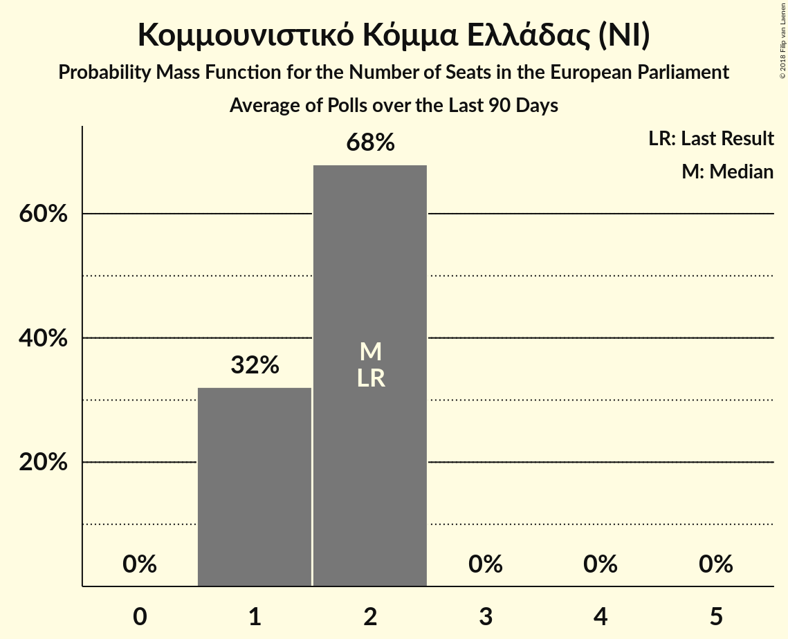

# Κομμουνιστικό Κόμμα Ελλάδας (NI)

<a href="#voting-intentions">Voting Intentions</a> | <a href="#seats">Seats</a>

## Voting Intentions

Last result: **6.1%** (General Election of 25 May 2014)

### Confidence Intervals

| Period     | Polling firm/Commissioner(s) | Median | 80% Confidence Interval | 90% Confidence Interval | 95% Confidence Interval | 99% Confidence Interval |
|:----------:|:----------------:|:-----------:|:-----------------------:|:-----------------------:|:-----------------------:|:-----------------------:|
| N/A | [Poll Average](average.html) | 7.3% | 6.4–8.4% | 6.1–8.8% | 5.9–9.1% | 5.5–9.8% |
| [11–13 March 2018](2018-03-13-PulseRC.html) | Pulse RC   ΣΚΑΪ | 7.0% | 6.1–8.0% | 5.9–8.2% | 5.7–8.5% | 5.3–9.0% |
| [6–8 March 2018](2018-03-08-RASS.html) | RASS   Πρώτο Θέμα | 7.7% | 6.7–8.9% | 6.4–9.2% | 6.2–9.5% | 5.7–10.1% |
| [22–24 February 2018](2018-02-24-Alco.html) | Alco   ΕΘΝΟΣ | 7.5% | 6.5–8.7% | 6.2–9.0% | 6.0–9.3% | 5.6–9.9% |
| [12–23 February 2018](2018-02-23-MetronAnalysis.html) | Metron Analysis   Το Βήμα | 7.0% | 6.4–7.7% | 6.2–7.9% | 6.0–8.1% | 5.7–8.5% |
| [25–29 January 2018](2018-01-29-PulseRC.html) | Pulse RC   Action 24 | 6.5% | N/A | N/A | N/A | N/A |
| [8–18 January 2018](2018-01-18-PublicIssue.html) | Public Issue | 7.5% | N/A | N/A | N/A | N/A |
| [16–18 January 2018](2018-01-18-Alco.html) | Alco   Ραδιόφωνο 24/7 | 7.3% | N/A | N/A | N/A | N/A |
| [8–10 January 2018](2018-01-10-PulseRC.html) | Pulse RC   bankingnews.gr | 6.5% | N/A | N/A | N/A | N/A |

### Probability Mass Function

The following table shows the probability mass function per percentage block of voting intentions for the [poll average](average.html) for Κομμουνιστικό Κόμμα Ελλάδας (NI).

| Voting Intentions | Probability | Accumulated | Special Marks |
|:-----------------:|:-----------:|:-----------:|:-------------:|
| 3.5–4.5% | 0% | 100% |  |
| 4.5–5.5% | 0.5% | 100% |  |
| 5.5–6.5% | 15% | 99.5% | Last Result |
| 6.5–7.5% | 47% | 85% | Median |
| 7.5–8.5% | 29% | 38% |  |
| 8.5–9.5% | 7% | 8% |  |
| 9.5–10.5% | 0.8% | 0.9% |  |
| 10.5–11.5% | 0% | 0% |  |
| 11.5–12.5% | 0% | 0% |  |

## Seats

Last result: **2** seats (General Election of 25 May 2014)

### Confidence Intervals

| Period     | Polling firm/Commissioner(s) | Median | 80% Confidence Interval | 90% Confidence Interval | 95% Confidence Interval | 99% Confidence Interval |
|:----------:|:----------------:|:------:|:-----------------------:|:-----------------------:|:-----------------------:|:-----------------------:|
| N/A | [Poll Average](average.html) | 1 | 1–2 | 1–2 | 1–2 | 1–2 |
| [11–13 March 2018](2018-03-13-PulseRC.html) | Pulse RC   ΣΚΑΪ | 2 | 1–2 | 1–2 | 1–2 | 1–2 |
| [6–8 March 2018](2018-03-08-RASS.html) | RASS   Πρώτο Θέμα | 1 | 1–2 | 1–2 | 1–2 | 1–2 |
| [22–24 February 2018](2018-02-24-Alco.html) | Alco   ΕΘΝΟΣ | 1 | 1–2 | 1–2 | 1–2 | 1–2 |
| [12–23 February 2018](2018-02-23-MetronAnalysis.html) | Metron Analysis   Το Βήμα | 2 | 1–2 | 1–2 | 1–2 | 1–2 |
| [25–29 January 2018](2018-01-29-PulseRC.html) | Pulse RC   Action 24 |  |  |  |  |  |
| [8–18 January 2018](2018-01-18-PublicIssue.html) | Public Issue |  |  |  |  |  |
| [16–18 January 2018](2018-01-18-Alco.html) | Alco   Ραδιόφωνο 24/7 |  |  |  |  |  |
| [8–10 January 2018](2018-01-10-PulseRC.html) | Pulse RC   bankingnews.gr |  |  |  |  |  |

### Probability Mass Function

The following table shows the probability mass function per seat for the [poll average](average.html) for Κομμουνιστικό Κόμμα Ελλάδας (NI).

| Number of Seats | Probability | Accumulated | Special Marks |
|:---------------:|:-----------:|:-----------:|:-------------:|
| 1 | 59% | 100% | Median |
| 2 | 41% | 41% | Last Result |
| 3 | 0% | 0% |  |

