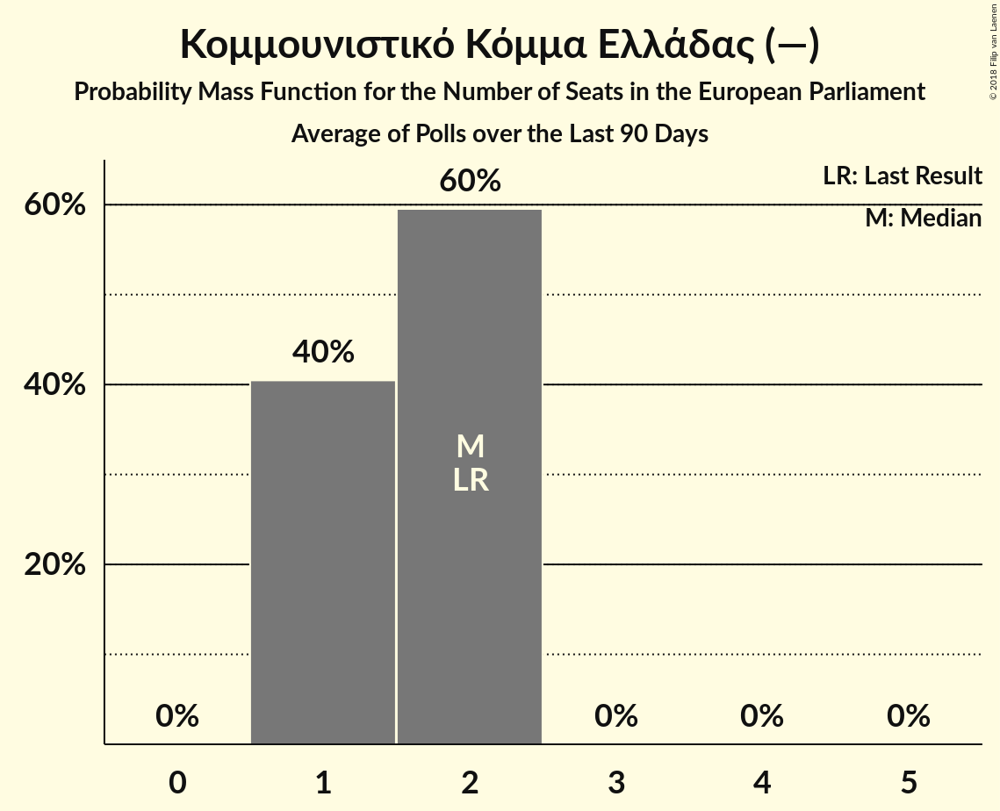

# Κομμουνιστικό Κόμμα Ελλάδας (—)

<a href="#voting-intentions">Voting Intentions</a> | <a href="#seats">Seats</a>

## Voting Intentions

Last result: **6.1%** (General Election of 25 May 2014)

### Confidence Intervals

| Period     | Polling firm/Commissioner(s) | Median | 80% Confidence Interval | 90% Confidence Interval | 95% Confidence Interval | 99% Confidence Interval |
|:----------:|:----------------:|:-----------:|:-----------------------:|:-----------------------:|:-----------------------:|:-----------------------:|
| N/A | [Poll Average](average.html) | 7.1% | 6.1–8.4% | 5.8–8.7% | 5.6–9.0% | 5.2–9.7% |
| [25–29 January 2018](2018-01-29-PulseRC.html) | Pulse RC   Action 24 | 6.5% | 5.8–7.4% | 5.6–7.7% | 5.4–7.9% | 5.0–8.3% |
| [8–18 January 2018](2018-01-18-PublicIssue.html) | Public Issue | 7.5% | 6.6–8.7% | 6.3–9.0% | 6.1–9.3% | 5.6–9.9% |
| [16–18 January 2018](2018-01-18-Alco.html) | Alco   Ραδιόφωνο 24/7 | 7.3% | 6.3–8.5% | 6.1–8.8% | 5.8–9.1% | 5.4–9.7% |
| [8–10 January 2018](2018-01-10-PulseRC.html) | Pulse RC   bankingnews.gr | 6.5% | 5.6–7.5% | 5.4–7.7% | 5.2–8.0% | 4.8–8.5% |

### Probability Mass Function

The following table shows the probability mass function per percentage block of voting intentions for the [poll average](average.html) for Κομμουνιστικό Κόμμα Ελλάδας (—).

| Voting Intentions | Probability | Accumulated | Special Marks |
|:-----------------:|:-----------:|:-----------:|:-------------:|
| 3.5–4.5% | 0% | 100% |  |
| 4.5–5.5% | 2% | 100% |  |
| 5.5–6.5% | 23% | 98% | Last Result |
| 6.5–7.5% | 42% | 75% | Median |
| 7.5–8.5% | 26% | 33% |  |
| 8.5–9.5% | 7% | 7% |  |
| 9.5–10.5% | 0.7% | 0.7% |  |
| 10.5–11.5% | 0% | 0% |  |

## Seats

Last result: **2** seats (General Election of 25 May 2014)

### Confidence Intervals

| Period     | Polling firm/Commissioner(s) | Median | 80% Confidence Interval | 90% Confidence Interval | 95% Confidence Interval | 99% Confidence Interval |
|:----------:|:----------------:|:------:|:-----------------------:|:-----------------------:|:-----------------------:|:-----------------------:|
| N/A | [Poll Average](average.html) | 2 | 1–2 | 1–2 | 1–2 | 1–2 |
| [25–29 January 2018](2018-01-29-PulseRC.html) | Pulse RC   Action 24 | 2 | 1–2 | 1–2 | 1–2 | 1–2 |
| [8–18 January 2018](2018-01-18-PublicIssue.html) | Public Issue | 2 | 1–2 | 1–2 | 1–2 | 1–2 |
| [16–18 January 2018](2018-01-18-Alco.html) | Alco   Ραδιόφωνο 24/7 | 2 | 1–2 | 1–2 | 1–2 | 1–2 |
| [8–10 January 2018](2018-01-10-PulseRC.html) | Pulse RC   bankingnews.gr | 1 | 1–2 | 1–2 | 1–2 | 1–2 |

### Probability Mass Function

The following table shows the probability mass function per seat for the [poll average](average.html) for Κομμουνιστικό Κόμμα Ελλάδας (—).

| Number of Seats | Probability | Accumulated | Special Marks |
|:---------------:|:-----------:|:-----------:|:-------------:|
| 1 | 38% | 100% |  |
| 2 | 62% | 62% | Last Result, Median |
| 3 | 0% | 0% |  |

