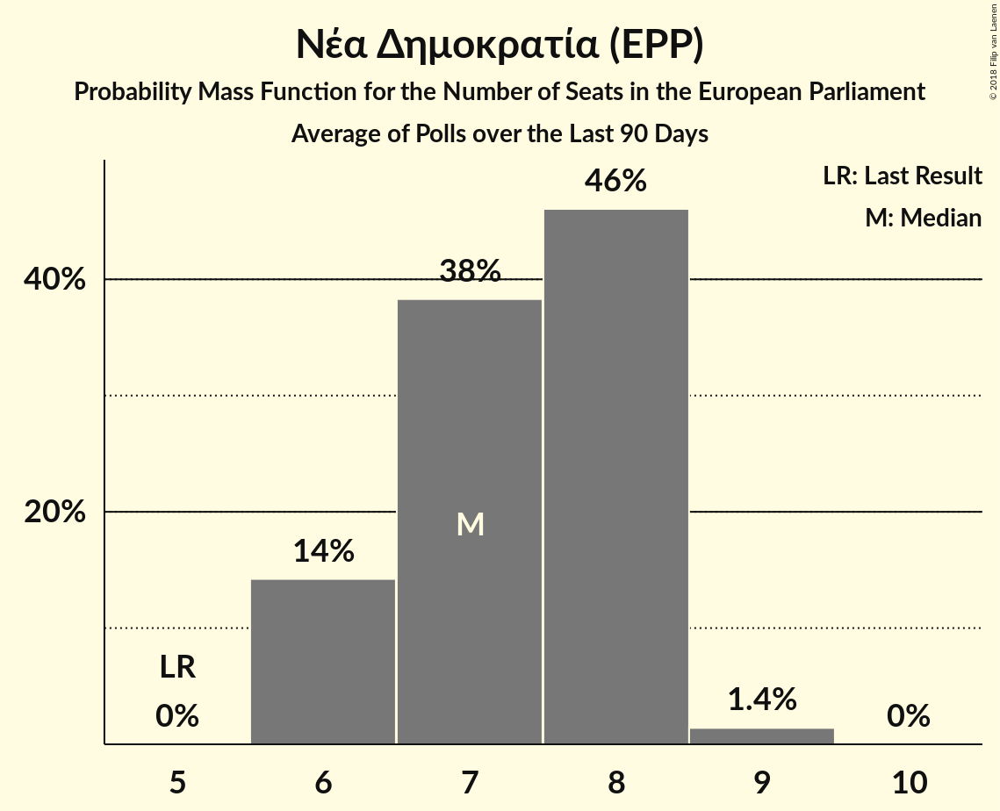

# Νέα Δημοκρατία (EPP)

<a href="#voting-intentions">Voting Intentions</a> | <a href="#seats">Seats</a>

## Voting Intentions

Last result: **22.7%** (General Election of 25 May 2014)

### Confidence Intervals

| Period     | Polling firm/Commissioner(s) | Median | 80% Confidence Interval | 90% Confidence Interval | 95% Confidence Interval | 99% Confidence Interval |
|:----------:|:----------------:|:-----------:|:-----------------------:|:-----------------------:|:-----------------------:|:-----------------------:|
| N/A | [Poll Average](average.html) | 35.4% | 32.0–37.8% | 31.0–38.5% | 30.3–39.0% | 29.2–40.2% |
| [11–13 March 2018](2018-03-13-PulseRC.html) | Pulse RC   ΣΚΑΪ | 36.0% | 34.3–37.7% | 33.8–38.2% | 33.4–38.6% | 32.6–39.4% |
| [6–8 March 2018](2018-03-08-RASS.html) | RASS   Πρώτο Θέμα | 35.8% | 33.9–37.8% | 33.4–38.4% | 32.9–38.9% | 32.0–39.8% |
| [22–24 February 2018](2018-02-24-Alco.html) | Alco   ΕΘΝΟΣ | 32.0% | 30.1–33.9% | 29.6–34.5% | 29.2–35.0% | 28.3–35.9% |
| [12–23 February 2018](2018-02-23-MetronAnalysis.html) | Metron Analysis   Το Βήμα | 34.9% | 33.7–36.2% | 33.3–36.6% | 33.0–36.9% | 32.4–37.5% |
| [25–29 January 2018](2018-01-29-PulseRC.html) | Pulse RC   Action 24 | 36.5% | 34.9–38.1% | 34.5–38.6% | 34.1–39.0% | 33.4–39.7% |
| [8–18 January 2018](2018-01-18-PublicIssue.html) | Public Issue | 37.0% | 35.1–39.0% | 34.6–39.6% | 34.1–40.1% | 33.2–41.0% |
| [16–18 January 2018](2018-01-18-Alco.html) | Alco   Ραδιόφωνο 24/7 | 32.7% | 30.8–34.6% | 30.3–35.2% | 29.9–35.7% | 29.0–36.6% |
| [8–10 January 2018](2018-01-10-PulseRC.html) | Pulse RC   bankingnews.gr | 36.5% | 34.8–38.3% | 34.3–38.9% | 33.9–39.3% | 33.0–40.2% |

### Probability Mass Function

The following table shows the probability mass function per percentage block of voting intentions for the [poll average](average.html) for Νέα Δημοκρατία (EPP).

| Voting Intentions | Probability | Accumulated | Special Marks |
|:-----------------:|:-----------:|:-----------:|:-------------:|
| 22.5–23.5% | 0% | 100% | Last Result |
| 23.5–24.5% | 0% | 100% |  |
| 24.5–25.5% | 0% | 100% |  |
| 25.5–26.5% | 0% | 100% |  |
| 26.5–27.5% | 0% | 100% |  |
| 27.5–28.5% | 0.1% | 100% |  |
| 28.5–29.5% | 0.7% | 99.8% |  |
| 29.5–30.5% | 2% | 99.1% |  |
| 30.5–31.5% | 4% | 97% |  |
| 31.5–32.5% | 6% | 92% |  |
| 32.5–33.5% | 7% | 87% |  |
| 33.5–34.5% | 13% | 79% |  |
| 34.5–35.5% | 20% | 66% | Median |
| 35.5–36.5% | 20% | 47% |  |
| 36.5–37.5% | 14% | 27% |  |
| 37.5–38.5% | 8% | 12% |  |
| 38.5–39.5% | 3% | 5% |  |
| 39.5–40.5% | 1.0% | 1.3% |  |
| 40.5–41.5% | 0.2% | 0.3% |  |
| 41.5–42.5% | 0% | 0% |  |

## Seats

Last result: **5** seats (General Election of 25 May 2014)

### Confidence Intervals

| Period     | Polling firm/Commissioner(s) | Median | 80% Confidence Interval | 90% Confidence Interval | 95% Confidence Interval | 99% Confidence Interval |
|:----------:|:----------------:|:------:|:-----------------------:|:-----------------------:|:-----------------------:|:-----------------------:|
| N/A | [Poll Average](average.html) | 8 | 7–8 | 7–8 | 6–8 | 6–9 |
| [11–13 March 2018](2018-03-13-PulseRC.html) | Pulse RC   ΣΚΑΪ | 8 | 7–8 | 7–8 | 7–8 | 7–9 |
| [6–8 March 2018](2018-03-08-RASS.html) | RASS   Πρώτο Θέμα | 8 | 7–8 | 7–8 | 7–8 | 7–9 |
| [22–24 February 2018](2018-02-24-Alco.html) | Alco   ΕΘΝΟΣ | 7 | 6–7 | 6–8 | 6–8 | 6–8 |
| [12–23 February 2018](2018-02-23-MetronAnalysis.html) | Metron Analysis   Το Βήμα | 8 | 7–8 | 7–8 | 7–8 | 7–8 |
| [25–29 January 2018](2018-01-29-PulseRC.html) | Pulse RC   Action 24 | 8 | 8 | 8 | 8 | 8 |
| [8–18 January 2018](2018-01-18-PublicIssue.html) | Public Issue | 8 | 8 | 7–9 | 7–9 | 7–9 |
| [16–18 January 2018](2018-01-18-Alco.html) | Alco   Ραδιόφωνο 24/7 | 7 | 7 | 7–8 | 6–8 | 6–8 |
| [8–10 January 2018](2018-01-10-PulseRC.html) | Pulse RC   bankingnews.gr | 8 | 8 | 7–9 | 7–9 | 7–9 |

### Probability Mass Function

The following table shows the probability mass function per seat for the [poll average](average.html) for Νέα Δημοκρατία (EPP).

| Number of Seats | Probability | Accumulated | Special Marks |
|:---------------:|:-----------:|:-----------:|:-------------:|
| 5 | 0% | 100% | Last Result |
| 6 | 3% | 100% |  |
| 7 | 32% | 97% |  |
| 8 | 63% | 65% | Median |
| 9 | 2% | 2% |  |
| 10 | 0% | 0% |  |

