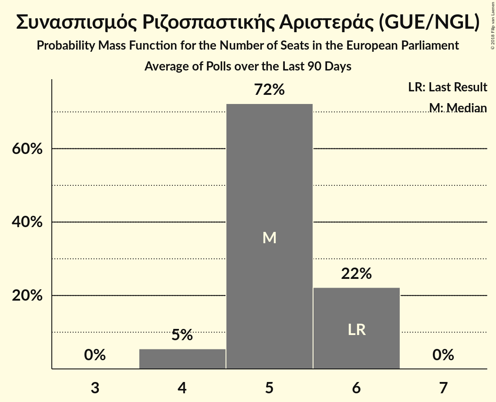

# Συνασπισμός Ριζοσπαστικής Αριστεράς (GUE/NGL)

<a href="#voting-intentions">Voting Intentions</a> | <a href="#seats">Seats</a>

## Voting Intentions

Last result: **26.6%** (General Election of 25 May 2014)

### Confidence Intervals

| Period     | Polling firm/Commissioner(s) | Median | 80% Confidence Interval | 90% Confidence Interval | 95% Confidence Interval | 99% Confidence Interval |
|:----------:|:----------------:|:-----------:|:-----------------------:|:-----------------------:|:-----------------------:|:-----------------------:|
| N/A | [Poll Average](average.html) | 24.2% | 21.2–26.0% | 20.4–26.5% | 19.9–26.9% | 19.0–27.7% |
| [22–24 February 2018](2018-02-24-Alco.html) | Alco   ΕΘΝΟΣ | 24.7% | 23.0–26.5% | 22.5–27.0% | 22.1–27.5% | 21.3–28.4% |
| [12–23 February 2018](2018-02-23-MetronAnalysis.html) | Metron Analysis   Το Βήμα | 25.2% | 24.1–26.4% | 23.8–26.7% | 23.5–27.0% | 22.9–27.6% |
| [25–29 January 2018](2018-01-29-PulseRC.html) | Pulse RC   Action 24 | 24.0% | 22.6–25.4% | 22.2–25.8% | 21.9–26.2% | 21.2–26.9% |
| [8–18 January 2018](2018-01-18-PublicIssue.html) | Public Issue | 21.5% | 19.9–23.2% | 19.4–23.7% | 19.1–24.1% | 18.3–25.0% |
| [16–18 January 2018](2018-01-18-Alco.html) | Alco   Ραδιόφωνο 24/7 | 25.0% | 23.3–26.8% | 22.8–27.3% | 22.4–27.8% | 21.6–28.7% |
| [8–10 January 2018](2018-01-10-PulseRC.html) | Pulse RC   bankingnews.gr | 25.0% | 23.5–26.7% | 23.0–27.1% | 22.6–27.6% | 21.9–28.3% |

### Probability Mass Function

The following table shows the probability mass function per percentage block of voting intentions for the [poll average](average.html) for Συνασπισμός Ριζοσπαστικής Αριστεράς (GUE/NGL).

| Voting Intentions | Probability | Accumulated | Special Marks |
|:-----------------:|:-----------:|:-----------:|:-------------:|
| 16.5–17.5% | 0% | 100% |  |
| 17.5–18.5% | 0.2% | 100% |  |
| 18.5–19.5% | 1.3% | 99.8% |  |
| 19.5–20.5% | 4% | 98.5% |  |
| 20.5–21.5% | 8% | 94% |  |
| 21.5–22.5% | 10% | 87% |  |
| 22.5–23.5% | 14% | 77% |  |
| 23.5–24.5% | 21% | 63% | Median |
| 24.5–25.5% | 23% | 41% |  |
| 25.5–26.5% | 14% | 18% |  |
| 26.5–27.5% | 4% | 5% | Last Result |
| 27.5–28.5% | 0.6% | 0.7% |  |
| 28.5–29.5% | 0.1% | 0.1% |  |
| 29.5–30.5% | 0% | 0% |  |

## Seats

Last result: **6** seats (General Election of 25 May 2014)

### Confidence Intervals

| Period     | Polling firm/Commissioner(s) | Median | 80% Confidence Interval | 90% Confidence Interval | 95% Confidence Interval | 99% Confidence Interval |
|:----------:|:----------------:|:------:|:-----------------------:|:-----------------------:|:-----------------------:|:-----------------------:|
| N/A | [Poll Average](average.html) | 5 | 5–6 | 4–6 | 4–6 | 4–6 |
| [22–24 February 2018](2018-02-24-Alco.html) | Alco   ΕΘΝΟΣ | 6 | 5–6 | 5–6 | 5–6 | 5–6 |
| [12–23 February 2018](2018-02-23-MetronAnalysis.html) | Metron Analysis   Το Βήμα | 5 | 5–6 | 5–6 | 5–6 | 5–6 |
| [25–29 January 2018](2018-01-29-PulseRC.html) | Pulse RC   Action 24 | 5 | 5–6 | 5–6 | 5–6 | 5–6 |
| [8–18 January 2018](2018-01-18-PublicIssue.html) | Public Issue | 5 | 4–5 | 4–5 | 4–5 | 4–5 |
| [16–18 January 2018](2018-01-18-Alco.html) | Alco   Ραδιόφωνο 24/7 | 5 | 5–6 | 5–6 | 5–6 | 5–6 |
| [8–10 January 2018](2018-01-10-PulseRC.html) | Pulse RC   bankingnews.gr | 5 | 5–6 | 5–6 | 5–6 | 5–6 |

### Probability Mass Function

The following table shows the probability mass function per seat for the [poll average](average.html) for Συνασπισμός Ριζοσπαστικής Αριστεράς (GUE/NGL).

| Number of Seats | Probability | Accumulated | Special Marks |
|:---------------:|:-----------:|:-----------:|:-------------:|
| 4 | 8% | 100% |  |
| 5 | 61% | 92% | Median |
| 6 | 31% | 31% | Last Result |
| 7 | 0% | 0% |  |

