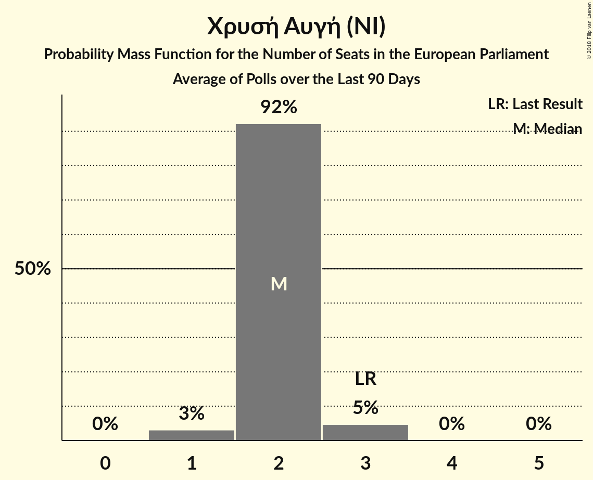

# Χρυσή Αυγή (NI)

<a href="#voting-intentions">Voting Intentions</a> | <a href="#seats">Seats</a>

## Voting Intentions

Last result: **9.4%** (General Election of 25 May 2014)

### Confidence Intervals

| Period     | Polling firm/Commissioner(s) | Median | 80% Confidence Interval | 90% Confidence Interval | 95% Confidence Interval | 99% Confidence Interval |
|:----------:|:----------------:|:-----------:|:-----------------------:|:-----------------------:|:-----------------------:|:-----------------------:|
| N/A | [Poll Average](average.html) | 9.4% | 8.2–10.8% | 7.9–11.2% | 7.6–11.7% | 7.0–12.4% |
| [11–13 March 2018](2018-03-13-PulseRC.html) | Pulse RC   ΣΚΑΪ | 9.0% | 8.0–10.1% | 7.8–10.4% | 7.5–10.7% | 7.1–11.2% |
| [6–8 March 2018](2018-03-08-RASS.html) | RASS   Πρώτο Θέμα | 8.8% | 7.7–10.0% | 7.4–10.4% | 7.2–10.7% | 6.7–11.3% |
| [22–24 February 2018](2018-02-24-Alco.html) | Alco   ΕΘΝΟΣ | 10.3% | 9.2–11.6% | 8.8–12.0% | 8.6–12.3% | 8.0–13.0% |
| [12–23 February 2018](2018-02-23-MetronAnalysis.html) | Metron Analysis   Το Βήμα | 9.4% | 8.6–10.2% | 8.4–10.5% | 8.3–10.7% | 7.9–11.1% |
| [25–29 January 2018](2018-01-29-PulseRC.html) | Pulse RC   Action 24 | 9.5% | 8.6–10.5% | 8.3–10.8% | 8.1–11.1% | 7.7–11.6% |
| [8–18 January 2018](2018-01-18-PublicIssue.html) | Public Issue | 8.0% | N/A | N/A | N/A | N/A |
| [16–18 January 2018](2018-01-18-Alco.html) | Alco   Ραδιόφωνο 24/7 | 9.3% | N/A | N/A | N/A | N/A |
| [8–10 January 2018](2018-01-10-PulseRC.html) | Pulse RC   bankingnews.gr | 8.5% | N/A | N/A | N/A | N/A |

### Probability Mass Function

The following table shows the probability mass function per percentage block of voting intentions for the [poll average](average.html) for Χρυσή Αυγή (NI).

| Voting Intentions | Probability | Accumulated | Special Marks |
|:-----------------:|:-----------:|:-----------:|:-------------:|
| 5.5–6.5% | 0.1% | 100% |  |
| 6.5–7.5% | 2% | 99.9% |  |
| 7.5–8.5% | 16% | 98% |  |
| 8.5–9.5% | 39% | 81% | Last Result, Median |
| 9.5–10.5% | 29% | 42% |  |
| 10.5–11.5% | 10% | 13% |  |
| 11.5–12.5% | 3% | 3% |  |
| 12.5–13.5% | 0.4% | 0.4% |  |
| 13.5–14.5% | 0% | 0% |  |

## Seats

Last result: **3** seats (General Election of 25 May 2014)

### Confidence Intervals

| Period     | Polling firm/Commissioner(s) | Median | 80% Confidence Interval | 90% Confidence Interval | 95% Confidence Interval | 99% Confidence Interval |
|:----------:|:----------------:|:------:|:-----------------------:|:-----------------------:|:-----------------------:|:-----------------------:|
| N/A | [Poll Average](average.html) | 2 | 2 | 2–3 | 1–3 | 1–3 |
| [11–13 March 2018](2018-03-13-PulseRC.html) | Pulse RC   ΣΚΑΪ | 2 | 1–3 | 1–3 | 1–3 | 1–3 |
| [6–8 March 2018](2018-03-08-RASS.html) | RASS   Πρώτο Θέμα | 2 | 2 | 2 | 2 | 1–2 |
| [22–24 February 2018](2018-02-24-Alco.html) | Alco   ΕΘΝΟΣ | 2 | 2–3 | 2–3 | 2–3 | 2–3 |
| [12–23 February 2018](2018-02-23-MetronAnalysis.html) | Metron Analysis   Το Βήμα | 2 | 2 | 2 | 2 | 2 |
| [25–29 January 2018](2018-01-29-PulseRC.html) | Pulse RC   Action 24 | 2 | 2 | 2 | 2 | 2 |
| [8–18 January 2018](2018-01-18-PublicIssue.html) | Public Issue |  |  |  |  |  |
| [16–18 January 2018](2018-01-18-Alco.html) | Alco   Ραδιόφωνο 24/7 |  |  |  |  |  |
| [8–10 January 2018](2018-01-10-PulseRC.html) | Pulse RC   bankingnews.gr |  |  |  |  |  |

### Probability Mass Function

The following table shows the probability mass function per seat for the [poll average](average.html) for Χρυσή Αυγή (NI).

| Number of Seats | Probability | Accumulated | Special Marks |
|:---------------:|:-----------:|:-----------:|:-------------:|
| 1 | 4% | 100% |  |
| 2 | 86% | 96% | Median |
| 3 | 10% | 10% | Last Result |
| 4 | 0% | 0% |  |

