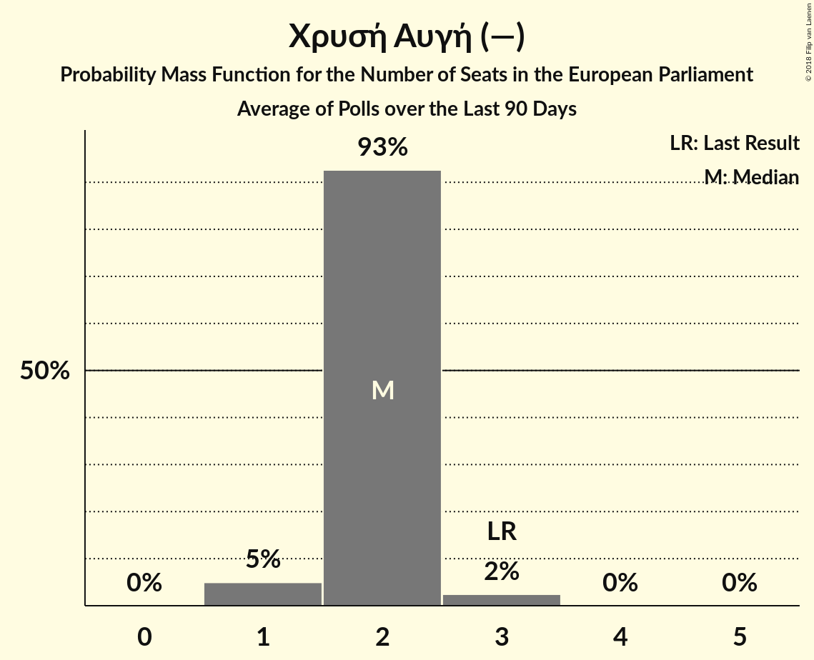

# Χρυσή Αυγή (—)

<a href="#voting-intentions">Voting Intentions</a> | <a href="#seats">Seats</a>

## Voting Intentions

Last result: **9.4%** (General Election of 25 May 2014)

### Confidence Intervals

| Period     | Polling firm/Commissioner(s) | Median | 80% Confidence Interval | 90% Confidence Interval | 95% Confidence Interval | 99% Confidence Interval |
|:----------:|:----------------:|:-----------:|:-----------------------:|:-----------------------:|:-----------------------:|:-----------------------:|
| N/A | [Poll Average](average.html) | 9.1% | 7.6–10.3% | 7.2–10.7% | 6.9–11.0% | 6.3–11.6% |
| [25–29 January 2018](2018-01-29-PulseRC.html) | Pulse RC   Action 24 | 9.5% | 8.6–10.5% | 8.3–10.8% | 8.1–11.1% | 7.7–11.6% |
| [8–18 January 2018](2018-01-18-PublicIssue.html) | Public Issue | 8.0% | 7.0–9.2% | 6.7–9.6% | 6.5–9.9% | 6.1–10.5% |
| [16–18 January 2018](2018-01-18-Alco.html) | Alco   Ραδιόφωνο 24/7 | 9.3% | 8.2–10.6% | 7.9–10.9% | 7.7–11.3% | 7.2–11.9% |
| [8–10 January 2018](2018-01-10-PulseRC.html) | Pulse RC   bankingnews.gr | 8.5% | 7.6–9.7% | 7.3–10.0% | 7.1–10.3% | 6.6–10.8% |

### Probability Mass Function

The following table shows the probability mass function per percentage block of voting intentions for the [poll average](average.html) for Χρυσή Αυγή (—).

| Voting Intentions | Probability | Accumulated | Special Marks |
|:-----------------:|:-----------:|:-----------:|:-------------:|
| 4.5–5.5% | 0% | 100% |  |
| 5.5–6.5% | 1.0% | 100% |  |
| 6.5–7.5% | 8% | 99.0% |  |
| 7.5–8.5% | 23% | 91% |  |
| 8.5–9.5% | 36% | 67% | Last Result, Median |
| 9.5–10.5% | 25% | 32% |  |
| 10.5–11.5% | 6% | 7% |  |
| 11.5–12.5% | 0.6% | 0.6% |  |
| 12.5–13.5% | 0% | 0% |  |

## Seats

Last result: **3** seats (General Election of 25 May 2014)

### Confidence Intervals

| Period     | Polling firm/Commissioner(s) | Median | 80% Confidence Interval | 90% Confidence Interval | 95% Confidence Interval | 99% Confidence Interval |
|:----------:|:----------------:|:------:|:-----------------------:|:-----------------------:|:-----------------------:|:-----------------------:|
| N/A | [Poll Average](average.html) | 2 | 2 | 2 | 1–3 | 1–3 |
| [25–29 January 2018](2018-01-29-PulseRC.html) | Pulse RC   Action 24 | 2 | 2 | 2–3 | 2–3 | 2–3 |
| [8–18 January 2018](2018-01-18-PublicIssue.html) | Public Issue | 2 | 1–2 | 1–2 | 1–2 | 1–2 |
| [16–18 January 2018](2018-01-18-Alco.html) | Alco   Ραδιόφωνο 24/7 | 2 | 2 | 2 | 2 | 1–3 |
| [8–10 January 2018](2018-01-10-PulseRC.html) | Pulse RC   bankingnews.gr | 2 | 2 | 2 | 1–2 | 1–2 |

### Probability Mass Function

The following table shows the probability mass function per seat for the [poll average](average.html) for Χρυσή Αυγή (—).

| Number of Seats | Probability | Accumulated | Special Marks |
|:---------------:|:-----------:|:-----------:|:-------------:|
| 1 | 5% | 100% |  |
| 2 | 92% | 95% | Median |
| 3 | 3% | 3% | Last Result |
| 4 | 0% | 0% |  |

