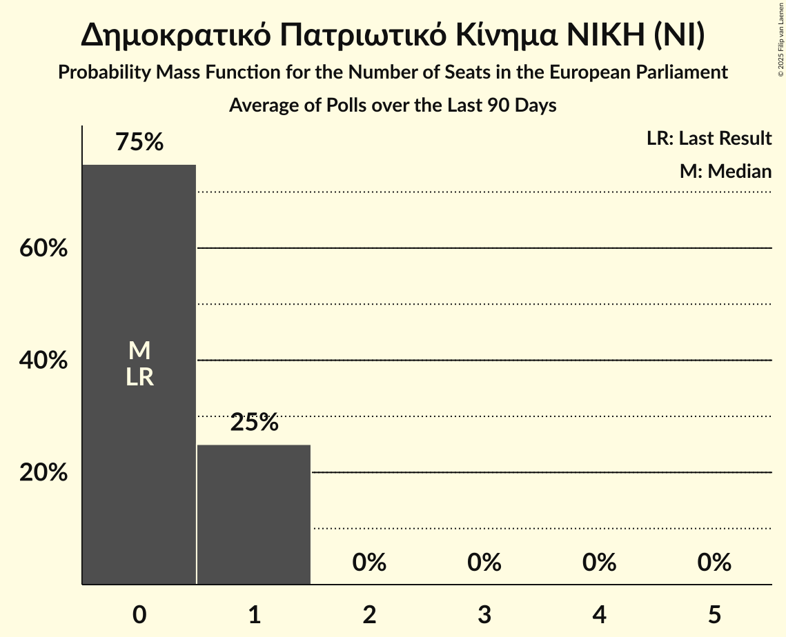

# Δημοκρατικό Πατριωτικό Κίνημα ΝΙΚΗ (NI)

<a href="#voting-intentions">Voting Intentions</a> | <a href="#seats">Seats</a>

## Voting Intentions

Last result: **0.0%** (General Election of 9 June 2024)

### Confidence Intervals

| Period     | Polling firm/Commissioner(s) | Median | 80% Confidence Interval | 90% Confidence Interval | 95% Confidence Interval | 99% Confidence Interval |
|:----------:|:----------------:|:-----------:|:-----------------------:|:-----------------------:|:-----------------------:|:-----------------------:|
| N/A | [Poll Average](average.html) | 3.1% | 2.2–4.1% | 2.1–4.4% | 1.9–4.6% | 1.7–5.1% |
| [2–4 July 2025](2025-07-04-OpinionPoll.html) | Opinion Poll   Action 24 | 3.1% | 2.5–4.1% | 2.3–4.3% | 2.1–4.5% | 1.9–5.0% |
| [27 June–1 July 2025](2025-07-01-PulseRC.html) | Pulse RC   ΣΚΑΪ | 3.5% | 2.9–4.3% | 2.7–4.6% | 2.5–4.8% | 2.3–5.2% |
| [18–24 June 2025](2025-06-24-MetronAnalysis.html) | Metron Analysis   Mega TV | 3.7% | 3.0–4.6% | 2.9–4.8% | 2.7–5.1% | 2.4–5.5% |
| [19–23 June 2025](2025-06-23-Interview.html) | Interview   Politic.gr | 2.4% | 2.0–3.0% | 1.8–3.1% | 1.7–3.3% | 1.6–3.6% |
| [11–20 June 2025](2025-06-20-MRB.html) | MRB   Open TV | 2.9% | 2.4–3.5% | 2.3–3.7% | 2.1–3.8% | 1.9–4.1% |
| [10–14 June 2025](2025-06-14-Alco.html) | Alco   Alpha TV | 3.1% | 2.4–4.1% | 2.2–4.4% | 2.1–4.6% | 1.8–5.2% |
| [10–13 June 2025](2025-06-13-GPO.html) | GPO   Παραπολιτικά | 2.6% | 2.0–3.4% | 1.8–3.6% | 1.7–3.9% | 1.5–4.3% |
| [4–9 June 2025](2025-06-09-Interview.html) | Interview   Political | 3.1% | 2.6–3.7% | 2.5–3.9% | 2.3–4.1% | 2.1–4.4% |
| [2–5 June 2025](2025-06-05-OpinionPoll.html) | Opinion Poll   Libre | 3.2% | 2.5–4.2% | 2.3–4.5% | 2.2–4.7% | 1.9–5.2% |
| [30 May–3 June 2025](2025-06-03-GPO.html) | GPO   Star TV | 2.3% | 1.8–3.0% | 1.7–3.2% | 1.6–3.4% | 1.3–3.8% |
| [29 May–3 June 2025](2025-06-03-Alco.html) | Alco   Epikaira.gr | 3.5% | 2.8–4.4% | 2.6–4.7% | 2.4–4.9% | 2.1–5.4% |
| [26–28 May 2025](2025-05-28-MRB.html) | MRB   Open TV | 3.5% | 2.8–4.5% | 2.6–4.8% | 2.4–5.1% | 2.1–5.6% |
| [24–27 May 2025](2025-05-27-PulseRC.html) | Pulse RC   ΣΚΑΪ | 3.6% | 3.0–4.5% | 2.8–4.8% | 2.6–5.0% | 2.3–5.5% |
| [21–26 May 2025](2025-05-26-Interview.html) | Interview   Politic.gr | 3.8% | 3.2–4.5% | 3.1–4.6% | 3.0–4.8% | 2.7–5.2% |
| [19–21 May 2025](2025-05-21-OpinionPoll.html) | Opinion Poll   Action 24 | 3.0% | 2.3–3.9% | 2.2–4.1% | 2.0–4.4% | 1.8–4.8% |
| [12–15 May 2025](2025-05-15-MetronAnalysis.html) | Metron Analysis   Mega TV | 3.1% | 2.5–3.9% | 2.3–4.2% | 2.2–4.4% | 1.9–4.8% |
| [12–15 May 2025](2025-05-15-Marc.html) | Marc   Πρώτο ΘΕΜΑ | 3.0% | 2.4–3.9% | 2.3–4.1% | 2.1–4.3% | 1.9–4.8% |
| [6–11 May 2025](2025-05-11-Interview.html) | Interview   Political | 3.9% | N/A | N/A | N/A | N/A |
| [28 April–3 May 2025](2025-05-03-Alco.html) | Alco   Alpha TV | 3.8% | 3.0–4.8% | 2.8–5.1% | 2.7–5.4% | 2.3–5.9% |
| [28 April–2 May 2025](2025-05-02-OpinionPoll.html) | Opinion Poll   Action 24 | 3.2% | N/A | N/A | N/A | N/A |
| [28–30 April 2025](2025-04-30-GPO.html) | GPO   Παραπολιτικά | 3.2% | 2.6–4.1% | 2.4–4.4% | 2.2–4.6% | 2.0–5.1% |
| [25–28 April 2025](2025-04-28-PulseRC.html) | Pulse RC   ΣΚΑΪ | 3.6% | N/A | N/A | N/A | N/A |
| [24–28 April 2025](2025-04-28-Interview.html) | Interview   Politic.gr | 3.7% | N/A | N/A | N/A | N/A |
| [7–9 April 2025](2025-04-09-MRB.html) | MRB   Open TV | 4.0% | N/A | N/A | N/A | N/A |
| [2–8 April 2025](2025-04-08-MetronAnalysis.html) | Metron Analysis   Mega TV | 2.1% | N/A | N/A | N/A | N/A |
| [4–8 April 2025](2025-04-08-Interview.html) | Interview   Political | 4.0% | N/A | N/A | N/A | N/A |
| [4–7 April 2025](2025-04-07-RealPolls.html) | Real Polls   Protagon | 2.3% | 1.9–2.9% | 1.8–3.1% | 1.7–3.2% | 1.5–3.5% |
| [3–7 April 2025](2025-04-07-Prorata.html) | Prorata   Attica TV | 2.8% | 2.2–3.7% | 2.0–3.9% | 1.9–4.1% | 1.7–4.6% |
| [31 March–4 April 2025](2025-04-04-GPO.html) | GPO   Παραπολιτικά | 3.1% | N/A | N/A | N/A | N/A |
| [27 March–1 April 2025](2025-04-01-Marc.html) | Marc   ANT1 | 2.6% | N/A | N/A | N/A | N/A |
| [21–26 March 2025](2025-03-26-Interview.html) | Interview   Politic.gr | 3.4% | N/A | N/A | N/A | N/A |
| [18–19 March 2025](2025-03-19-GPO.html) | GPO   Παραπολιτικά | 3.2% | N/A | N/A | N/A | N/A |
| [16–18 March 2025](2025-03-18-PulseRC.html) | Pulse RC   ΣΚΑΪ | 4.2% | N/A | N/A | N/A | N/A |
| [14–18 March 2025](2025-03-18-OpinionPoll.html) | Opinion Poll   Action 24 | 3.1% | N/A | N/A | N/A | N/A |
| [12–18 March 2025](2025-03-18-MetronAnalysis.html) | Metron Analysis   Mega TV | 4.8% | N/A | N/A | N/A | N/A |
| [12–16 March 2025](2025-03-16-Alco.html) | Alco   Alpha TV | 3.2% | N/A | N/A | N/A | N/A |
| [10–12 March 2025](2025-03-12-Interview.html) | Interview   Politic.gr | 2.9% | N/A | N/A | N/A | N/A |
| [6–10 March 2025](2025-03-10-GPO.html) | GPO   Flash | 2.7% | N/A | N/A | N/A | N/A |
| [4–6 March 2025](2025-03-06-MRB.html) | MRB   Open TV | 3.1% | N/A | N/A | N/A | N/A |
| [1–4 March 2025](2025-03-04-GPO.html) | GPO   Star TV | 2.6% | N/A | N/A | N/A | N/A |
| [21–24 February 2025](2025-02-24-PulseRC.html) | Pulse RC   ΣΚΑΪ | 2.9% | N/A | N/A | N/A | N/A |
| [20–24 February 2025](2025-02-24-Prorata.html) | Prorata   Attica TV | 2.2% | N/A | N/A | N/A | N/A |
| [19–24 February 2025](2025-02-24-Interview.html) | Interview   Politic.gr | 3.3% | N/A | N/A | N/A | N/A |
| [12–18 February 2025](2025-02-18-MetronAnalysis.html) | Metron Analysis   Mega TV | 2.5% | N/A | N/A | N/A | N/A |
| [11–16 February 2025](2025-02-16-Alco.html) | Alco   Alpha TV | 3.9% | N/A | N/A | N/A | N/A |
| [10–14 February 2025](2025-02-14-GPO.html) | GPO   Παραπολιτικά | 2.2% | N/A | N/A | N/A | N/A |
| [30 January–4 February 2025](2025-02-04-Interview.html) | Interview   Political | 3.5% | N/A | N/A | N/A | N/A |
| [27–29 January 2025](2025-01-29-MRB.html) | MRB   Open TV | 3.1% | N/A | N/A | N/A | N/A |
| [28–29 January 2025](2025-01-29-GPO.html) | GPO   Παραπολιτικά | 2.4% | N/A | N/A | N/A | N/A |
| [20–22 January 2025](2025-01-22-GPO.html) | GPO   Star TV | 2.8% | N/A | N/A | N/A | N/A |
| [19–21 January 2025](2025-01-21-PulseRC.html) | Pulse RC   ΣΚΑΪ | 3.1% | N/A | N/A | N/A | N/A |
| [15–21 January 2025](2025-01-21-MetronAnalysis.html) | Metron Analysis   Mega TV | 3.0% | N/A | N/A | N/A | N/A |
| [14–20 January 2025](2025-01-20-Interview.html) | Interview   Politic.gr | 3.4% | N/A | N/A | N/A | N/A |
| [15–19 January 2025](2025-01-19-Alco.html) | Alco   Alpha TV | 3.9% | N/A | N/A | N/A | N/A |
| [8–10 January 2025](2025-01-10-OpinionPoll.html) | Opinion Poll   Action 24 | 2.9% | N/A | N/A | N/A | N/A |
| [7–10 January 2025](2025-01-10-Marc.html) | Marc   ANT1 | 2.9% | N/A | N/A | N/A | N/A |
| [16–23 December 2024](2024-12-23-PalmosAnalysis.html) | Palmos Analysis   Ελεύθερος Τύπος | 3.1% | N/A | N/A | N/A | N/A |
| [15–17 December 2024](2024-12-17-PulseRC.html) | Pulse RC   ΣΚΑΪ | 3.6% | N/A | N/A | N/A | N/A |
| [11–17 December 2024](2024-12-17-MetronAnalysis.html) | Metron Analysis   Mega TV | 3.0% | N/A | N/A | N/A | N/A |
| [11–16 December 2024](2024-12-16-Interview.html) | Interview   Politic.gr | 3.7% | N/A | N/A | N/A | N/A |
| [11–13 December 2024](2024-12-13-OpinionPoll.html) | Opinion Poll   Manifesto | 4.2% | N/A | N/A | N/A | N/A |
| [4–13 December 2024](2024-12-13-MRB.html) | MRB     | 3.3% | N/A | N/A | N/A | N/A |
| [9–13 December 2024](2024-12-13-GPO.html) | GPO   Παραπολιτικά | 3.3% | N/A | N/A | N/A | N/A |
| [3–9 December 2024](2024-12-09-Prorata.html) | Prorata   Attica TV | 3.4% | N/A | N/A | N/A | N/A |
| [25–28 November 2024](2024-11-28-Marc.html) | Marc   Πρώτο ΘΕΜΑ | 3.0% | N/A | N/A | N/A | N/A |
| [24–26 November 2024](2024-11-26-PulseRC.html) | Pulse RC   ΣΚΑΪ | 3.7% | N/A | N/A | N/A | N/A |
| [20–26 November 2024](2024-11-26-MetronAnalysis.html) | Metron Analysis   Mega TV | 3.5% | N/A | N/A | N/A | N/A |
| [21–25 November 2024](2024-11-25-Interview.html) | Interview   Politic.gr | 3.2% | N/A | N/A | N/A | N/A |
| [18–22 November 2024](2024-11-22-GPO.html) | GPO   Παραπολιτικά | 3.8% | N/A | N/A | N/A | N/A |
| [11–15 November 2024](2024-11-15-GPO.html) | GPO   Παραπολιτικά | 3.7% | N/A | N/A | N/A | N/A |
| [7–12 November 2024](2024-11-12-OpinionPoll.html) | Opinion Poll   Action 24 | 3.0% | N/A | N/A | N/A | N/A |
| [22–26 October 2024](2024-10-26-Marc.html) | Marc   ANT1 | 3.1% | N/A | N/A | N/A | N/A |
| [21–23 October 2024](2024-10-23-MRB.html) | MRB   Open TV | 3.8% | N/A | N/A | N/A | N/A |
| [16–22 October 2024](2024-10-22-MetronAnalysis.html) | Metron Analysis   Mega TV | 2.5% | N/A | N/A | N/A | N/A |
| [16–21 October 2024](2024-10-21-Interview.html) | Interview   Politic.gr | 5.1% | N/A | N/A | N/A | N/A |
| [15–19 October 2024](2024-10-19-Alco.html) | Alco   Alpha TV | 4.7% | N/A | N/A | N/A | N/A |
| [14–16 October 2024](2024-10-16-GPO.html) | GPO   Star TV | 3.7% | N/A | N/A | N/A | N/A |
| [26 September–2 October 2024](2024-10-02-MetronAnalysis.html) | Metron Analysis   Mega TV | 3.4% | N/A | N/A | N/A | N/A |
| [30 September–2 October 2024](2024-10-02-MRB.html) | MRB   Open TV | 3.9% | N/A | N/A | N/A | N/A |
| [29 September–1 October 2024](2024-10-01-PulseRC.html) | Pulse RC   ΣΚΑΪ | 3.6% | N/A | N/A | N/A | N/A |
| [24–28 September 2024](2024-09-28-PalmosAnalysis.html) | Palmos Analysis   Tvxs.gr | 5.2% | N/A | N/A | N/A | N/A |
| [24–27 September 2024](2024-09-27-OpinionPoll.html) | Opinion Poll   Action 24 | 4.0% | N/A | N/A | N/A | N/A |
| [13–23 September 2024](2024-09-23-MetronAnalysis.html) | Metron Analysis   Mega TV | 3.7% | N/A | N/A | N/A | N/A |
| [19–23 September 2024](2024-09-23-Interview.html) | Interview   Politic.gr | 3.8% | N/A | N/A | N/A | N/A |
| [16–21 September 2024](2024-09-21-Prorata.html) | Prorata   Attica TV | 4.0% | N/A | N/A | N/A | N/A |
| [13–18 September 2024](2024-09-18-MRB.html) | MRB   Open TV | 4.0% | N/A | N/A | N/A | N/A |
| [13–16 September 2024](2024-09-16-PulseRC.html) | Pulse RC   ΣΚΑΪ | 4.3% | N/A | N/A | N/A | N/A |
| [9–14 September 2024](2024-09-14-Alco.html) | Alco   Alpha TV | 4.5% | N/A | N/A | N/A | N/A |
| [2–11 September 2024](2024-09-11-DataRC.html) | Data RC   Peloponnisos | 4.0% | N/A | N/A | N/A | N/A |
| [4–10 September 2024](2024-09-10-MetronAnalysis.html) | Metron Analysis   Mega TV | 4.5% | N/A | N/A | N/A | N/A |
| [8–10 September 2024](2024-09-10-GPO.html) | GPO   Star TV | 3.4% | N/A | N/A | N/A | N/A |
| [2–6 September 2024](2024-09-06-Interview.html) | Interview   Political | 4.6% | N/A | N/A | N/A | N/A |
| [27–30 August 2024](2024-08-30-OpinionPoll.html) | Opinion Poll   Action 24 | 3.9% | N/A | N/A | N/A | N/A |
| [26–30 August 2024](2024-08-30-MRB.html) | MRB   Open TV | 4.1% | N/A | N/A | N/A | N/A |
| [21–26 August 2024](2024-08-26-Interview.html) | Interview   Politic.gr | 3.9% | N/A | N/A | N/A | N/A |
| [27 June–4 July 2024](2024-07-04-MRB.html) | MRB | 3.5% | N/A | N/A | N/A | N/A |
| [21 June–1 July 2024](2024-07-01-MetronAnalysis.html) | Metron Analysis   Mega TV | 3.0% | N/A | N/A | N/A | N/A |
| [25–28 June 2024](2024-06-28-ΚάπαResearch.html) | Κάπα Research | 3.9% | N/A | N/A | N/A | N/A |
| [17–19 June 2024](2024-06-19-GPO.html) | GPO   Star TV | 3.8% | N/A | N/A | N/A | N/A |

### Probability Mass Function

The following table shows the probability mass function per percentage block of voting intentions for the [poll average](average.html) for Δημοκρατικό Πατριωτικό Κίνημα ΝΙΚΗ (NI).

| Voting Intentions | Probability | Accumulated | Special Marks |
|:-----------------:|:-----------:|:-----------:|:-------------:|
| 0.0–0.5% | 0% | 100% | Last Result |
| 0.5–1.5% | 0.2% | 100% |  |
| 1.5–2.5% | 22% | 99.8% |  |
| 2.5–3.5% | 51% | 78% | Median |
| 3.5–4.5% | 24% | 27% |  |
| 4.5–5.5% | 3% | 3% |  |
| 5.5–6.5% | 0.1% | 0.1% |  |
| 6.5–7.5% | 0% | 0% |  |

## Seats

Last result: **0** seats (General Election of 9 June 2024)

### Confidence Intervals

| Period     | Polling firm/Commissioner(s) | Median | 80% Confidence Interval | 90% Confidence Interval | 95% Confidence Interval | 99% Confidence Interval |
|:----------:|:----------------:|:------:|:-----------------------:|:-----------------------:|:-----------------------:|:-----------------------:|
| N/A | [Poll Average](average.html) | 1 | 0–1 | 0–1 | 0–1 | 0–1 |
| [2–4 July 2025](2025-07-04-OpinionPoll.html) | Opinion Poll   Action 24 | 1 | 0–1 | 0–1 | 0–1 | 0–1 |
| [27 June–1 July 2025](2025-07-01-PulseRC.html) | Pulse RC   ΣΚΑΪ | 1 | 1 | 1 | 0–1 | 0–1 |
| [18–24 June 2025](2025-06-24-MetronAnalysis.html) | Metron Analysis   Mega TV | 1 | 0–1 | 0–1 | 0–1 | 0–1 |
| [19–23 June 2025](2025-06-23-Interview.html) | Interview   Politic.gr | 0 | 0 | 0 | 0–1 | 0–1 |
| [11–20 June 2025](2025-06-20-MRB.html) | MRB   Open TV | 0 | 0–1 | 0–1 | 0–1 | 0–1 |
| [10–14 June 2025](2025-06-14-Alco.html) | Alco   Alpha TV | 1 | 0–1 | 0–1 | 0–1 | 0–1 |
| [10–13 June 2025](2025-06-13-GPO.html) | GPO   Παραπολιτικά | 0 | 0–1 | 0–1 | 0–1 | 0–1 |
| [4–9 June 2025](2025-06-09-Interview.html) | Interview   Political | 1 | 0–1 | 0–1 | 0–1 | 0–1 |
| [2–5 June 2025](2025-06-05-OpinionPoll.html) | Opinion Poll   Libre | 1 | 0–1 | 0–1 | 0–1 | 0–1 |
| [30 May–3 June 2025](2025-06-03-GPO.html) | GPO   Star TV | 0 | 0 | 0–1 | 0–1 | 0–1 |
| [29 May–3 June 2025](2025-06-03-Alco.html) | Alco   Epikaira.gr | 1 | 0–1 | 0–1 | 0–1 | 0–1 |
| [26–28 May 2025](2025-05-28-MRB.html) | MRB   Open TV | 1 | 0–1 | 0–1 | 0–1 | 0–1 |
| [24–27 May 2025](2025-05-27-PulseRC.html) | Pulse RC   ΣΚΑΪ | 1 | 0–1 | 0–1 | 0–1 | 0–1 |
| [21–26 May 2025](2025-05-26-Interview.html) | Interview   Politic.gr | 1 | 1 | 1 | 0–1 | 0–1 |
| [19–21 May 2025](2025-05-21-OpinionPoll.html) | Opinion Poll   Action 24 | 1 | 0–1 | 0–1 | 0–1 | 0–1 |
| [12–15 May 2025](2025-05-15-MetronAnalysis.html) | Metron Analysis   Mega TV | 1 | 0–1 | 0–1 | 0–1 | 0–1 |
| [12–15 May 2025](2025-05-15-Marc.html) | Marc   Πρώτο ΘΕΜΑ | 1 | 0–1 | 0–1 | 0–1 | 0–1 |
| [6–11 May 2025](2025-05-11-Interview.html) | Interview   Political |  |  |  |  |  |
| [28 April–3 May 2025](2025-05-03-Alco.html) | Alco   Alpha TV | 1 | 1 | 0–1 | 0–1 | 0–1 |
| [28 April–2 May 2025](2025-05-02-OpinionPoll.html) | Opinion Poll   Action 24 |  |  |  |  |  |
| [28–30 April 2025](2025-04-30-GPO.html) | GPO   Παραπολιτικά | 1 | 0–1 | 0–1 | 0–1 | 0–1 |
| [25–28 April 2025](2025-04-28-PulseRC.html) | Pulse RC   ΣΚΑΪ |  |  |  |  |  |
| [24–28 April 2025](2025-04-28-Interview.html) | Interview   Politic.gr |  |  |  |  |  |
| [7–9 April 2025](2025-04-09-MRB.html) | MRB   Open TV |  |  |  |  |  |
| [2–8 April 2025](2025-04-08-MetronAnalysis.html) | Metron Analysis   Mega TV |  |  |  |  |  |
| [4–8 April 2025](2025-04-08-Interview.html) | Interview   Political |  |  |  |  |  |
| [4–7 April 2025](2025-04-07-RealPolls.html) | Real Polls   Protagon | 0 | 0–1 | 0–1 | 0–1 | 0–1 |
| [3–7 April 2025](2025-04-07-Prorata.html) | Prorata   Attica TV | 0 | 0–1 | 0–1 | 0–1 | 0–1 |
| [31 March–4 April 2025](2025-04-04-GPO.html) | GPO   Παραπολιτικά |  |  |  |  |  |
| [27 March–1 April 2025](2025-04-01-Marc.html) | Marc   ANT1 |  |  |  |  |  |
| [21–26 March 2025](2025-03-26-Interview.html) | Interview   Politic.gr |  |  |  |  |  |
| [18–19 March 2025](2025-03-19-GPO.html) | GPO   Παραπολιτικά |  |  |  |  |  |
| [16–18 March 2025](2025-03-18-PulseRC.html) | Pulse RC   ΣΚΑΪ |  |  |  |  |  |
| [14–18 March 2025](2025-03-18-OpinionPoll.html) | Opinion Poll   Action 24 |  |  |  |  |  |
| [12–18 March 2025](2025-03-18-MetronAnalysis.html) | Metron Analysis   Mega TV |  |  |  |  |  |
| [12–16 March 2025](2025-03-16-Alco.html) | Alco   Alpha TV |  |  |  |  |  |
| [10–12 March 2025](2025-03-12-Interview.html) | Interview   Politic.gr |  |  |  |  |  |
| [6–10 March 2025](2025-03-10-GPO.html) | GPO   Flash |  |  |  |  |  |
| [4–6 March 2025](2025-03-06-MRB.html) | MRB   Open TV |  |  |  |  |  |
| [1–4 March 2025](2025-03-04-GPO.html) | GPO   Star TV |  |  |  |  |  |
| [21–24 February 2025](2025-02-24-PulseRC.html) | Pulse RC   ΣΚΑΪ |  |  |  |  |  |
| [20–24 February 2025](2025-02-24-Prorata.html) | Prorata   Attica TV |  |  |  |  |  |
| [19–24 February 2025](2025-02-24-Interview.html) | Interview   Politic.gr |  |  |  |  |  |
| [12–18 February 2025](2025-02-18-MetronAnalysis.html) | Metron Analysis   Mega TV |  |  |  |  |  |
| [11–16 February 2025](2025-02-16-Alco.html) | Alco   Alpha TV |  |  |  |  |  |
| [10–14 February 2025](2025-02-14-GPO.html) | GPO   Παραπολιτικά |  |  |  |  |  |
| [30 January–4 February 2025](2025-02-04-Interview.html) | Interview   Political |  |  |  |  |  |
| [27–29 January 2025](2025-01-29-MRB.html) | MRB   Open TV |  |  |  |  |  |
| [28–29 January 2025](2025-01-29-GPO.html) | GPO   Παραπολιτικά |  |  |  |  |  |
| [20–22 January 2025](2025-01-22-GPO.html) | GPO   Star TV |  |  |  |  |  |
| [19–21 January 2025](2025-01-21-PulseRC.html) | Pulse RC   ΣΚΑΪ |  |  |  |  |  |
| [15–21 January 2025](2025-01-21-MetronAnalysis.html) | Metron Analysis   Mega TV |  |  |  |  |  |
| [14–20 January 2025](2025-01-20-Interview.html) | Interview   Politic.gr |  |  |  |  |  |
| [15–19 January 2025](2025-01-19-Alco.html) | Alco   Alpha TV |  |  |  |  |  |
| [8–10 January 2025](2025-01-10-OpinionPoll.html) | Opinion Poll   Action 24 |  |  |  |  |  |
| [7–10 January 2025](2025-01-10-Marc.html) | Marc   ANT1 |  |  |  |  |  |
| [16–23 December 2024](2024-12-23-PalmosAnalysis.html) | Palmos Analysis   Ελεύθερος Τύπος |  |  |  |  |  |
| [15–17 December 2024](2024-12-17-PulseRC.html) | Pulse RC   ΣΚΑΪ |  |  |  |  |  |
| [11–17 December 2024](2024-12-17-MetronAnalysis.html) | Metron Analysis   Mega TV |  |  |  |  |  |
| [11–16 December 2024](2024-12-16-Interview.html) | Interview   Politic.gr |  |  |  |  |  |
| [11–13 December 2024](2024-12-13-OpinionPoll.html) | Opinion Poll   Manifesto |  |  |  |  |  |
| [4–13 December 2024](2024-12-13-MRB.html) | MRB     |  |  |  |  |  |
| [9–13 December 2024](2024-12-13-GPO.html) | GPO   Παραπολιτικά |  |  |  |  |  |
| [3–9 December 2024](2024-12-09-Prorata.html) | Prorata   Attica TV |  |  |  |  |  |
| [25–28 November 2024](2024-11-28-Marc.html) | Marc   Πρώτο ΘΕΜΑ |  |  |  |  |  |
| [24–26 November 2024](2024-11-26-PulseRC.html) | Pulse RC   ΣΚΑΪ |  |  |  |  |  |
| [20–26 November 2024](2024-11-26-MetronAnalysis.html) | Metron Analysis   Mega TV |  |  |  |  |  |
| [21–25 November 2024](2024-11-25-Interview.html) | Interview   Politic.gr |  |  |  |  |  |
| [18–22 November 2024](2024-11-22-GPO.html) | GPO   Παραπολιτικά |  |  |  |  |  |
| [11–15 November 2024](2024-11-15-GPO.html) | GPO   Παραπολιτικά |  |  |  |  |  |
| [7–12 November 2024](2024-11-12-OpinionPoll.html) | Opinion Poll   Action 24 |  |  |  |  |  |
| [22–26 October 2024](2024-10-26-Marc.html) | Marc   ANT1 |  |  |  |  |  |
| [21–23 October 2024](2024-10-23-MRB.html) | MRB   Open TV |  |  |  |  |  |
| [16–22 October 2024](2024-10-22-MetronAnalysis.html) | Metron Analysis   Mega TV |  |  |  |  |  |
| [16–21 October 2024](2024-10-21-Interview.html) | Interview   Politic.gr |  |  |  |  |  |
| [15–19 October 2024](2024-10-19-Alco.html) | Alco   Alpha TV |  |  |  |  |  |
| [14–16 October 2024](2024-10-16-GPO.html) | GPO   Star TV |  |  |  |  |  |
| [26 September–2 October 2024](2024-10-02-MetronAnalysis.html) | Metron Analysis   Mega TV |  |  |  |  |  |
| [30 September–2 October 2024](2024-10-02-MRB.html) | MRB   Open TV |  |  |  |  |  |
| [29 September–1 October 2024](2024-10-01-PulseRC.html) | Pulse RC   ΣΚΑΪ |  |  |  |  |  |
| [24–28 September 2024](2024-09-28-PalmosAnalysis.html) | Palmos Analysis   Tvxs.gr |  |  |  |  |  |
| [24–27 September 2024](2024-09-27-OpinionPoll.html) | Opinion Poll   Action 24 |  |  |  |  |  |
| [13–23 September 2024](2024-09-23-MetronAnalysis.html) | Metron Analysis   Mega TV |  |  |  |  |  |
| [19–23 September 2024](2024-09-23-Interview.html) | Interview   Politic.gr |  |  |  |  |  |
| [16–21 September 2024](2024-09-21-Prorata.html) | Prorata   Attica TV |  |  |  |  |  |
| [13–18 September 2024](2024-09-18-MRB.html) | MRB   Open TV |  |  |  |  |  |
| [13–16 September 2024](2024-09-16-PulseRC.html) | Pulse RC   ΣΚΑΪ |  |  |  |  |  |
| [9–14 September 2024](2024-09-14-Alco.html) | Alco   Alpha TV |  |  |  |  |  |
| [2–11 September 2024](2024-09-11-DataRC.html) | Data RC   Peloponnisos |  |  |  |  |  |
| [4–10 September 2024](2024-09-10-MetronAnalysis.html) | Metron Analysis   Mega TV |  |  |  |  |  |
| [8–10 September 2024](2024-09-10-GPO.html) | GPO   Star TV |  |  |  |  |  |
| [2–6 September 2024](2024-09-06-Interview.html) | Interview   Political |  |  |  |  |  |
| [27–30 August 2024](2024-08-30-OpinionPoll.html) | Opinion Poll   Action 24 |  |  |  |  |  |
| [26–30 August 2024](2024-08-30-MRB.html) | MRB   Open TV |  |  |  |  |  |
| [21–26 August 2024](2024-08-26-Interview.html) | Interview   Politic.gr |  |  |  |  |  |
| [27 June–4 July 2024](2024-07-04-MRB.html) | MRB |  |  |  |  |  |
| [21 June–1 July 2024](2024-07-01-MetronAnalysis.html) | Metron Analysis   Mega TV |  |  |  |  |  |
| [25–28 June 2024](2024-06-28-ΚάπαResearch.html) | Κάπα Research |  |  |  |  |  |
| [17–19 June 2024](2024-06-19-GPO.html) | GPO   Star TV |  |  |  |  |  |

### Probability Mass Function

The following table shows the probability mass function per seat for the [poll average](average.html) for Δημοκρατικό Πατριωτικό Κίνημα ΝΙΚΗ (NI).

| Number of Seats | Probability | Accumulated | Special Marks |
|:---------------:|:-----------:|:-----------:|:-------------:|
| 0 | 45% | 100% | Last Result |
| 1 | 55% | 55% | Median |
| 2 | 0% | 0% |  |

