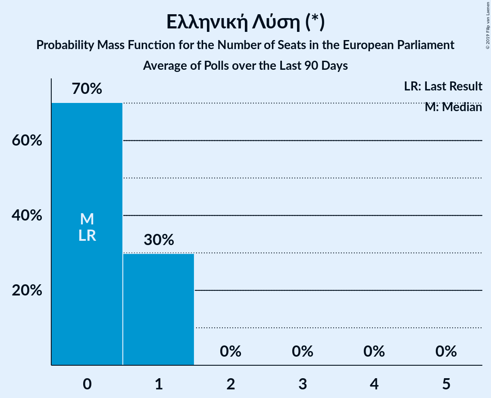

# Ελληνική Λύση (*)

<a href="#voting-intentions">Voting Intentions</a> | <a href="#seats">Seats</a>

## Voting Intentions

Last result: **0.0%** (General Election of 25 May 2014)

### Confidence Intervals

| Period     | Polling firm/Commissioner(s) | Median | 80% Confidence Interval | 90% Confidence Interval | 95% Confidence Interval | 99% Confidence Interval |
|:----------:|:----------------:|:-----------:|:-----------------------:|:-----------------------:|:-----------------------:|:-----------------------:|
| N/A | [Poll Average](average.html) | 2.4% | 1.9–3.1% | 1.7–3.3% | 1.6–3.5% | 1.4–3.8% |
| [15–19 May 2019](2019-05-19-Alco.html) | Alco | 2.9% | N/A | N/A | N/A | N/A |
| [15–18 May 2019](2019-05-18-Prorata.html) | Prorata | 2.5% | N/A | N/A | N/A | N/A |
| [15–17 May 2019](2019-05-17-RASS.html) | RASS | 2.4% | N/A | N/A | N/A | N/A |
| [14–17 May 2019](2019-05-17-PalmosAnalysis.html) | Palmos Analysis | 4.0% | N/A | N/A | N/A | N/A |
| [14–16 May 2019](2019-05-16-MetronAnalysis.html) | Metron Analysis   Το Βήμα | 2.1% | N/A | N/A | N/A | N/A |
| [13–16 May 2019](2019-05-16-MRB.html) | MRB | 1.9% | N/A | N/A | N/A | N/A |
| [14–16 May 2019](2019-05-16-MARC.html) | MARC | 2.9% | N/A | N/A | N/A | N/A |
| [10–14 May 2019](2019-05-14-MARC.html) | MARC | 3.0% | 2.5–3.7% | 2.3–3.9% | 2.2–4.1% | 2.0–4.5% |
| [10–14 May 2019](2019-05-14-Interview.html) | Interview | 3.0% | 2.4–3.8% | 2.2–4.1% | 2.1–4.3% | 1.9–4.7% |
| [6–8 May 2019](2019-05-08-VoxPopAnalysis.html) | Vox Pop Analysis   Documento | 2.0% | 1.6–2.6% | 1.5–2.8% | 1.4–3.0% | 1.2–3.3% |
| [6–8 May 2019](2019-05-08-MRB.html) | MRB   Star | 2.0% | 1.6–2.7% | 1.4–2.9% | 1.3–3.0% | 1.2–3.4% |
| [3–6 May 2019](2019-05-06-Alco.html) | Alco | 3.0% | 2.4–3.8% | 2.2–4.1% | 2.1–4.3% | 1.9–4.7% |
| [18–20 April 2019](2019-04-20-PulseRC.html) | Pulse RC   ΣΚΑΪ | 2.5% | 2.0–3.2% | 1.8–3.4% | 1.7–3.6% | 1.5–4.0% |
| [15–17 April 2019](2019-04-17-Opinion.html) | Opinion   ΘΕΜΑ 104.6 | 2.3% | 1.8–3.0% | 1.7–3.2% | 1.6–3.4% | 1.4–3.7% |
| [15–17 April 2019](2019-04-17-MetronAnalysis.html) | Metron Analysis   Alpha TV | 2.3% | 1.9–3.0% | 1.7–3.2% | 1.6–3.4% | 1.4–3.7% |
| [15–17 April 2019](2019-04-17-Interview.html) | Interview   Βεργίνα TV | 2.3% | 1.8–3.0% | 1.6–3.2% | 1.5–3.4% | 1.3–3.8% |
| [1–3 April 2019](2019-04-03-MRB.html) | MRB   Star | 1.9% | 1.4–2.6% | 1.3–2.8% | 1.2–2.9% | 1.0–3.3% |
| [26 March–1 April 2019](2019-04-01-Marc.html) | Marc   Πρώτο ΘΕΜΑ | 2.0% | 1.6–2.6% | 1.4–2.8% | 1.3–3.0% | 1.2–3.3% |
| [26–28 March 2019](2019-03-28-RASS.html) | RASS   in.gr | 2.0% | 1.5–2.7% | 1.4–2.9% | 1.3–3.1% | 1.1–3.4% |
| [19–26 March 2019](2019-03-26-Alco.html) | Alco | 3.0% | 2.4–3.8% | 2.2–4.1% | 2.1–4.3% | 1.9–4.7% |
| [18–20 March 2019](2019-03-20-VoxPopAnalysis.html) | Vox Pop Analysis   Documento | 0.0% | N/A | N/A | N/A | N/A |
| [18–20 March 2019](2019-03-20-PulseRC.html) | Pulse RC | 0.0% | N/A | N/A | N/A | N/A |
| [18–20 March 2019](2019-03-20-MetronAnalysis.html) | Metron Analysis   Το Βήμα | 2.1% | 1.6–2.7% | 1.5–2.9% | 1.4–3.0% | 1.2–3.4% |
| [24–26 February 2019](2019-02-26-PulseRC.html) | Pulse RC   ΣΚΑΪ | 3.0% | 2.5–3.7% | 2.3–3.9% | 2.2–4.1% | 2.0–4.5% |
| [18–23 February 2019](2019-02-23-Alco.html) | Alco   Open | 1.9% | 1.4–2.6% | 1.3–2.8% | 1.2–3.0% | 1.0–3.3% |
| [1–14 February 2019](2019-02-14-PublicIssue.html) | Public Issue | 3.0% | 2.4–3.8% | 2.2–4.0% | 2.1–4.3% | 1.8–4.7% |
| [4–5 February 2019](2019-02-05-Interview.html) | Interview   Βεργίνα TV | 3.3% | 2.7–4.1% | 2.5–4.4% | 2.4–4.6% | 2.1–5.0% |
| [1–4 February 2019](2019-02-04-Prorata.html) | Prorata   Η Εφημερίδα των Συντακτών | 2.5% | 2.0–3.3% | 1.8–3.5% | 1.7–3.7% | 1.5–4.1% |
| [1–2 February 2019](2019-02-02-VoxPopAnalysis.html) | Vox Pop Analysis   Documento | 2.8% | 2.3–3.5% | 2.1–3.7% | 2.0–3.9% | 1.8–4.3% |
| [28–29 January 2019](2019-01-29-MetronAnalysis.html) | Metron Analysis   Το Βήμα | 2.2% | 2.0–2.4% | 1.9–2.5% | 1.9–2.6% | 1.8–2.7% |
| [21–24 January 2019](2019-01-24-RASS.html) | RASS   in.gr | 2.6% | 2.0–3.4% | 1.9–3.6% | 1.8–3.8% | 1.5–4.2% |
| [20–22 January 2019](2019-01-22-PulseRC.html) | Pulse RC   ΣΚΑΪ | 2.0% | 1.6–2.6% | 1.5–2.7% | 1.4–2.9% | 1.2–3.2% |
| [14–17 January 2019](2019-01-17-Marc.html) | Marc   Πρώτο ΘΕΜΑ | 2.6% | 2.1–3.4% | 1.9–3.6% | 1.8–3.8% | 1.5–4.2% |
| [10–16 January 2019](2019-01-16-OpinionPoll.html) | Opinion Poll | 2.9% | 2.3–3.7% | 2.2–3.9% | 2.0–4.1% | 1.8–4.6% |
| [16–18 December 2018](2018-12-18-PulseRC.html) | Pulse RC   ΣΚΑΪ | 2.0% | 1.6–2.6% | 1.5–2.7% | 1.4–2.9% | 1.2–3.2% |
| [5–10 December 2018](2018-12-10-Alco.html) | Alco   Open | 2.4% | 1.9–3.2% | 1.7–3.4% | 1.6–3.6% | 1.4–3.9% |
| [4–6 December 2018](2018-12-06-ΚάπαResearch.html) | Κάπα Research   thebest.gr | 2.3% | 1.8–3.0% | 1.6–3.2% | 1.5–3.4% | 1.3–3.8% |
| [28 November–6 December 2018](2018-12-06-MRB.html) | MRB   real.gr | 1.5% | 1.2–1.9% | 1.1–2.0% | 1.1–2.1% | 0.9–2.4% |
| [20–23 November 2018](2018-11-23-PalmosAnalysis.html) | Palmos Analysis   TVXS | 2.0% | 1.6–2.7% | 1.4–2.9% | 1.3–3.1% | 1.1–3.5% |
| [19–21 November 2018](2018-11-21-MetronAnalysis.html) | Metron Analysis   Τα Νέα | 2.0% | 1.6–2.6% | 1.4–2.8% | 1.3–3.0% | 1.2–3.3% |
| [18–20 November 2018](2018-11-20-PulseRC.html) | Pulse RC   ΣΚΑΪ | 2.0% | 1.6–2.6% | 1.5–2.7% | 1.4–2.9% | 1.2–3.2% |
| [6–16 November 2018](2018-11-16-PublicIssue.html) | Public Issue | 0.0% | N/A | N/A | N/A | N/A |
| [22–24 October 2018](2018-10-24-Marc.html) | Marc   Πρώτο ΘΕΜΑ | 2.2% | 1.7–2.9% | 1.6–3.1% | 1.4–3.3% | 1.2–3.7% |
| [14–16 October 2018](2018-10-16-PulseRC.html) | Pulse RC   ΣΚΑΪ | 2.5% | 2.0–3.2% | 1.9–3.3% | 1.8–3.5% | 1.6–3.8% |
| [18–21 September 2018](2018-09-21-PalmosAnalysis.html) | Palmos Analysis   TVXS | 0.0% | N/A | N/A | N/A | N/A |
| [18–20 September 2018](2018-09-20-MetronAnalysis.html) | Metron Analysis   Τα Νέα | 1.4% | 1.0–2.0% | 0.9–2.2% | 0.8–2.3% | 0.7–2.7% |
| [17–19 September 2018](2018-09-19-MRB.html) | MRB   Star | 1.6% | 1.2–2.2% | 1.1–2.4% | 1.0–2.6% | 0.8–2.9% |
| [17–19 September 2018](2018-09-19-Alco.html) | Alco   Kontra Channel | 1.5% | 1.1–2.1% | 1.0–2.3% | 0.9–2.5% | 0.7–2.8% |
| [17–18 September 2018](2018-09-18-ΚάπαResearch.html) | Κάπα Research   ΕΘΝΟΣ | 1.9% | 1.4–2.6% | 1.3–2.8% | 1.2–2.9% | 1.0–3.3% |
| [16–18 September 2018](2018-09-18-PulseRC.html) | Pulse RC   ΣΚΑΪ | 2.5% | 2.0–3.2% | 1.9–3.3% | 1.8–3.5% | 1.6–3.8% |
| [8 September 2018](2018-09-08-Marc.html) | Marc   Πρώτο ΘΕΜΑ | 2.5% | 2.0–3.3% | 1.8–3.5% | 1.7–3.7% | 1.5–4.1% |
| [25 June–2 July 2018](2018-07-02-ΚάπαResearch.html) | Κάπα Research   ΕΘΝΟΣ | 2.8% | 2.2–3.6% | 2.1–3.8% | 1.9–4.0% | 1.7–4.4% |
| [22–29 June 2018](2018-06-29-MRB.html) | MRB   Real | 1.3% | 1.0–1.7% | 0.9–1.8% | 0.9–1.9% | 0.8–2.1% |
| [26–28 June 2018](2018-06-28-MetronAnalysis.html) | Metron Analysis   Τα Νέα | 2.8% | 2.2–3.6% | 2.1–3.8% | 1.9–4.0% | 1.7–4.4% |
| [23–27 June 2018](2018-06-27-Alco.html) | Alco   Kontra Channel | 2.2% | 1.7–2.9% | 1.6–3.1% | 1.4–3.3% | 1.2–3.7% |
| [24–26 June 2018](2018-06-26-PulseRC.html) | Pulse RC   ΣΚΑΪ | 2.0% | 1.6–2.6% | 1.4–2.7% | 1.3–2.9% | 1.2–3.2% |
| [13–15 June 2018](2018-06-15-Marc.html) | Marc   Πρώτο ΘΕΜΑ | 2.1% | 1.6–2.8% | 1.5–3.0% | 1.4–3.2% | 1.2–3.6% |
| [29–31 May 2018](2018-05-31-RASS.html) | RASS   Action 24 | 0.0% | N/A | N/A | N/A | N/A |
| [16–20 May 2018](2018-05-20-Alco.html) | Alco   Kontra Channel | 1.6% | 1.2–2.3% | 1.1–2.6% | 0.9–2.8% | 0.8–3.2% |
| [13–15 May 2018](2018-05-15-PulseRC.html) | Pulse RC   ΣΚΑΪ | 1.5% | 1.1–2.0% | 1.0–2.2% | 1.0–2.3% | 0.8–2.6% |
| [23 April–7 May 2018](2018-05-07-PublicIssue.html) | Public Issue | 0.0% | N/A | N/A | N/A | N/A |
| [21 April 2018](2018-04-21-MetronAnalysis.html) | Metron Analysis   Τα Νέα | 1.6% | 1.2–2.2% | 1.1–2.4% | 1.0–2.6% | 0.8–2.9% |
| [15–17 April 2018](2018-04-17-PulseRC.html) | Pulse RC   ΣΚΑΪ | 1.5% | 1.1–2.0% | 1.0–2.1% | 1.0–2.3% | 0.8–2.5% |
| [11–16 April 2018](2018-04-16-Alco.html) | Alco   Ραδιόφωνο 24/7 | 0.0% | N/A | N/A | N/A | N/A |
| [12–15 April 2018](2018-04-15-PalmosAnalysis.html) | Palmos Analysis   TVXS | 0.0% | N/A | N/A | N/A | N/A |
| [3 April 2018](2018-04-03-ΚάπαResearch.html) | Κάπα Research   ΕΘΝΟΣ | 2.2% | 2.0–2.4% | 1.9–2.5% | 1.9–2.5% | 1.8–2.7% |
| [1–23 March 2018](2018-03-23-Marc.html) | Marc   Πρώτο ΘΕΜΑ | 1.3% | 0.9–1.9% | 0.8–2.1% | 0.8–2.2% | 0.6–2.5% |
| [11–13 March 2018](2018-03-13-PulseRC.html) | Pulse RC   ΣΚΑΪ | 1.0% | 0.7–1.5% | 0.6–1.6% | 0.6–1.7% | 0.5–2.0% |
| [6–8 March 2018](2018-03-08-RASS.html) | RASS   Πρώτο Θέμα | 0.0% | N/A | N/A | N/A | N/A |
| [3 March 2018](2018-03-03-PulseRC.html) | Pulse RC   Δημοκρατία | 1.0% | 0.7–1.5% | 0.6–1.6% | 0.6–1.7% | 0.5–2.0% |
| [3 March 2018](2018-03-03-OpinionPoll.html) | Opinion Poll   Παρασκήνιο | 0.0% | N/A | N/A | N/A | N/A |
| [22–24 February 2018](2018-02-24-Alco.html) | Alco   ΕΘΝΟΣ | 0.0% | N/A | N/A | N/A | N/A |
| [12–23 February 2018](2018-02-23-MetronAnalysis.html) | Metron Analysis   Το Βήμα | 1.5% | 1.2–1.9% | 1.2–2.0% | 1.1–2.1% | 1.0–2.3% |
| [25–29 January 2018](2018-01-29-PulseRC.html) | Pulse RC   Action 24 | 1.0% | 0.7–1.4% | 0.7–1.5% | 0.6–1.6% | 0.5–1.9% |
| [20 January 2018](2018-01-20-MetronAnalysis.html) | Metron Analysis   Τα Νέα | 1.9% | 1.4–2.6% | 1.3–2.8% | 1.2–3.0% | 1.0–3.3% |
| [8–18 January 2018](2018-01-18-PublicIssue.html) | Public Issue | 0.0% | N/A | N/A | N/A | N/A |
| [16–18 January 2018](2018-01-18-Alco.html) | Alco   Ραδιόφωνο 24/7 | 0.0% | N/A | N/A | N/A | N/A |
| [13 January 2018](2018-01-13-Marc.html) | Marc   Πρώτο ΘΕΜΑ | 0.0% | N/A | N/A | N/A | N/A |
| [8–10 January 2018](2018-01-10-PulseRC.html) | Pulse RC   bankingnews.gr | 0.0% | N/A | N/A | N/A | N/A |

### Probability Mass Function

The following table shows the probability mass function per percentage block of voting intentions for the [poll average](average.html) for Ελληνική Λύση (*).

| Voting Intentions | Probability | Accumulated | Special Marks |
|:-----------------:|:-----------:|:-----------:|:-------------:|
| 0.0–0.5% | 0% | 100% | Last Result |
| 0.5–1.5% | 2% | 100% |  |
| 1.5–2.5% | 59% | 98% | Median |
| 2.5–3.5% | 37% | 39% |  |
| 3.5–4.5% | 2% | 2% |  |
| 4.5–5.5% | 0% | 0% |  |

## Seats

Last result: **0** seats (General Election of 25 May 2014)

### Confidence Intervals

| Period     | Polling firm/Commissioner(s) | Median | 80% Confidence Interval | 90% Confidence Interval | 95% Confidence Interval | 99% Confidence Interval |
|:----------:|:----------------:|:------:|:-----------------------:|:-----------------------:|:-----------------------:|:-----------------------:|
| N/A | [Poll Average](average.html) | 0 | 0–1 | 0–1 | 0–1 | 0–1 |
| [15–19 May 2019](2019-05-19-Alco.html) | Alco |  |  |  |  |  |
| [15–18 May 2019](2019-05-18-Prorata.html) | Prorata |  |  |  |  |  |
| [15–17 May 2019](2019-05-17-RASS.html) | RASS |  |  |  |  |  |
| [14–17 May 2019](2019-05-17-PalmosAnalysis.html) | Palmos Analysis |  |  |  |  |  |
| [14–16 May 2019](2019-05-16-MetronAnalysis.html) | Metron Analysis   Το Βήμα |  |  |  |  |  |
| [13–16 May 2019](2019-05-16-MRB.html) | MRB |  |  |  |  |  |
| [14–16 May 2019](2019-05-16-MARC.html) | MARC |  |  |  |  |  |
| [10–14 May 2019](2019-05-14-MARC.html) | MARC | 1 | 0–1 | 0–1 | 0–1 | 0–1 |
| [10–14 May 2019](2019-05-14-Interview.html) | Interview | 0 | 0–1 | 0–1 | 0–1 | 0–1 |
| [6–8 May 2019](2019-05-08-VoxPopAnalysis.html) | Vox Pop Analysis   Documento | 0 | 0 | 0 | 0 | 0–1 |
| [6–8 May 2019](2019-05-08-MRB.html) | MRB   Star | 0 | 0 | 0 | 0 | 0–1 |
| [3–6 May 2019](2019-05-06-Alco.html) | Alco | 1 | 0–1 | 0–1 | 0–1 | 0–1 |
| [18–20 April 2019](2019-04-20-PulseRC.html) | Pulse RC   ΣΚΑΪ | 0 | 0–1 | 0–1 | 0–1 | 0–1 |
| [15–17 April 2019](2019-04-17-Opinion.html) | Opinion   ΘΕΜΑ 104.6 | 0 | 0–1 | 0–1 | 0–1 | 0–1 |
| [15–17 April 2019](2019-04-17-MetronAnalysis.html) | Metron Analysis   Alpha TV | 0 | 0 | 0–1 | 0–1 | 0–1 |
| [15–17 April 2019](2019-04-17-Interview.html) | Interview   Βεργίνα TV | 0 | 0–1 | 0–1 | 0–1 | 0–1 |
| [1–3 April 2019](2019-04-03-MRB.html) | MRB   Star | 0 | 0 | 0 | 0 | 0–1 |
| [26 March–1 April 2019](2019-04-01-Marc.html) | Marc   Πρώτο ΘΕΜΑ | 0 | 0 | 0 | 0 | 0–1 |
| [26–28 March 2019](2019-03-28-RASS.html) | RASS   in.gr | 0 | 0 | 0 | 0 | 0–1 |
| [19–26 March 2019](2019-03-26-Alco.html) | Alco | 0 | 0–1 | 0–1 | 0–1 | 0–1 |
| [18–20 March 2019](2019-03-20-VoxPopAnalysis.html) | Vox Pop Analysis   Documento |  |  |  |  |  |
| [18–20 March 2019](2019-03-20-PulseRC.html) | Pulse RC |  |  |  |  |  |
| [18–20 March 2019](2019-03-20-MetronAnalysis.html) | Metron Analysis   Το Βήμα | 0 | 0 | 0 | 0–1 | 0–1 |
| [24–26 February 2019](2019-02-26-PulseRC.html) | Pulse RC   ΣΚΑΪ | 1 | 0–1 | 0–1 | 0–1 | 0–1 |
| [18–23 February 2019](2019-02-23-Alco.html) | Alco   Open | 0 | 0 | 0 | 0 | 0–1 |
| [1–14 February 2019](2019-02-14-PublicIssue.html) | Public Issue | 1 | 0–1 | 0–1 | 0–1 | 0–1 |
| [4–5 February 2019](2019-02-05-Interview.html) | Interview   Βεργίνα TV | 1 | 0–1 | 0–1 | 0–1 | 0–1 |
| [1–4 February 2019](2019-02-04-Prorata.html) | Prorata   Η Εφημερίδα των Συντακτών | 0 | 0 | 0–1 | 0–1 | 0–1 |
| [1–2 February 2019](2019-02-02-VoxPopAnalysis.html) | Vox Pop Analysis   Documento | 0 | 0–1 | 0–1 | 0–1 | 0–1 |
| [28–29 January 2019](2019-01-29-MetronAnalysis.html) | Metron Analysis   Το Βήμα | 0 | 0 | 0 | 0 | 0 |
| [21–24 January 2019](2019-01-24-RASS.html) | RASS   in.gr | 0 | 0–1 | 0–1 | 0–1 | 0–1 |
| [20–22 January 2019](2019-01-22-PulseRC.html) | Pulse RC   ΣΚΑΪ | 0 | 0 | 0 | 0 | 0 |
| [14–17 January 2019](2019-01-17-Marc.html) | Marc   Πρώτο ΘΕΜΑ | 0 | 0–1 | 0–1 | 0–1 | 0–1 |
| [10–16 January 2019](2019-01-16-OpinionPoll.html) | Opinion Poll | 1 | 0–1 | 0–1 | 0–1 | 0–1 |
| [16–18 December 2018](2018-12-18-PulseRC.html) | Pulse RC   ΣΚΑΪ | 0 | 0 | 0 | 0 | 0–1 |
| [5–10 December 2018](2018-12-10-Alco.html) | Alco   Open | 0 | 0 | 0–1 | 0–1 | 0–1 |
| [4–6 December 2018](2018-12-06-ΚάπαResearch.html) | Κάπα Research   thebest.gr | 0 | 0 | 0–1 | 0–1 | 0–1 |
| [28 November–6 December 2018](2018-12-06-MRB.html) | MRB   real.gr | 0 | 0 | 0 | 0 | 0 |
| [20–23 November 2018](2018-11-23-PalmosAnalysis.html) | Palmos Analysis   TVXS | 0 | 0 | 0 | 0–1 | 0–1 |
| [19–21 November 2018](2018-11-21-MetronAnalysis.html) | Metron Analysis   Τα Νέα | 0 | 0 | 0 | 0 | 0–1 |
| [18–20 November 2018](2018-11-20-PulseRC.html) | Pulse RC   ΣΚΑΪ | 0 | 0 | 0 | 0 | 0–1 |
| [6–16 November 2018](2018-11-16-PublicIssue.html) | Public Issue |  |  |  |  |  |
| [22–24 October 2018](2018-10-24-Marc.html) | Marc   Πρώτο ΘΕΜΑ | 0 | 0 | 0–1 | 0–1 | 0–1 |
| [14–16 October 2018](2018-10-16-PulseRC.html) | Pulse RC   ΣΚΑΪ | 0 | 0–1 | 0–1 | 0–1 | 0–1 |
| [18–21 September 2018](2018-09-21-PalmosAnalysis.html) | Palmos Analysis   TVXS |  |  |  |  |  |
| [18–20 September 2018](2018-09-20-MetronAnalysis.html) | Metron Analysis   Τα Νέα | 0 | 0 | 0 | 0 | 0 |
| [17–19 September 2018](2018-09-19-MRB.html) | MRB   Star | 0 | 0 | 0 | 0 | 0 |
| [17–19 September 2018](2018-09-19-Alco.html) | Alco   Kontra Channel | 0 | 0 | 0 | 0 | 0 |
| [17–18 September 2018](2018-09-18-ΚάπαResearch.html) | Κάπα Research   ΕΘΝΟΣ | 0 | 0 | 0 | 0 | 0–1 |
| [16–18 September 2018](2018-09-18-PulseRC.html) | Pulse RC   ΣΚΑΪ | 0 | 0–1 | 0–1 | 0–1 | 0–1 |
| [8 September 2018](2018-09-08-Marc.html) | Marc   Πρώτο ΘΕΜΑ | 0 | 0–1 | 0–1 | 0–1 | 0–1 |
| [25 June–2 July 2018](2018-07-02-ΚάπαResearch.html) | Κάπα Research   ΕΘΝΟΣ | 0 | 0–1 | 0–1 | 0–1 | 0–1 |
| [22–29 June 2018](2018-06-29-MRB.html) | MRB   Real | 0 | 0 | 0 | 0 | 0 |
| [26–28 June 2018](2018-06-28-MetronAnalysis.html) | Metron Analysis   Τα Νέα | 0 | 0–1 | 0–1 | 0–1 | 0–1 |
| [23–27 June 2018](2018-06-27-Alco.html) | Alco   Kontra Channel | 0 | 0 | 0–1 | 0–1 | 0–1 |
| [24–26 June 2018](2018-06-26-PulseRC.html) | Pulse RC   ΣΚΑΪ | 0 | 0 | 0 | 0 | 0 |
| [13–15 June 2018](2018-06-15-Marc.html) | Marc   Πρώτο ΘΕΜΑ | 0 | 0 | 0 | 0–1 | 0–1 |
| [29–31 May 2018](2018-05-31-RASS.html) | RASS   Action 24 |  |  |  |  |  |
| [16–20 May 2018](2018-05-20-Alco.html) | Alco   Kontra Channel | 0 | 0 | 0 | 0 | 0–1 |
| [13–15 May 2018](2018-05-15-PulseRC.html) | Pulse RC   ΣΚΑΪ | 0 | 0 | 0 | 0 | 0 |
| [23 April–7 May 2018](2018-05-07-PublicIssue.html) | Public Issue |  |  |  |  |  |
| [21 April 2018](2018-04-21-MetronAnalysis.html) | Metron Analysis   Τα Νέα | 0 | 0 | 0 | 0 | 0 |
| [15–17 April 2018](2018-04-17-PulseRC.html) | Pulse RC   ΣΚΑΪ | 0 | 0 | 0 | 0 | 0 |
| [11–16 April 2018](2018-04-16-Alco.html) | Alco   Ραδιόφωνο 24/7 |  |  |  |  |  |
| [12–15 April 2018](2018-04-15-PalmosAnalysis.html) | Palmos Analysis   TVXS |  |  |  |  |  |
| [3 April 2018](2018-04-03-ΚάπαResearch.html) | Κάπα Research   ΕΘΝΟΣ | 0 | 0 | 0 | 0 | 0 |
| [1–23 March 2018](2018-03-23-Marc.html) | Marc   Πρώτο ΘΕΜΑ | 0 | 0 | 0 | 0 | 0 |
| [11–13 March 2018](2018-03-13-PulseRC.html) | Pulse RC   ΣΚΑΪ | 0 | 0 | 0 | 0 | 0 |
| [6–8 March 2018](2018-03-08-RASS.html) | RASS   Πρώτο Θέμα |  |  |  |  |  |
| [3 March 2018](2018-03-03-PulseRC.html) | Pulse RC   Δημοκρατία | 0 | 0 | 0 | 0 | 0 |
| [3 March 2018](2018-03-03-OpinionPoll.html) | Opinion Poll   Παρασκήνιο |  |  |  |  |  |
| [22–24 February 2018](2018-02-24-Alco.html) | Alco   ΕΘΝΟΣ |  |  |  |  |  |
| [12–23 February 2018](2018-02-23-MetronAnalysis.html) | Metron Analysis   Το Βήμα | 0 | 0 | 0 | 0 | 0 |
| [25–29 January 2018](2018-01-29-PulseRC.html) | Pulse RC   Action 24 | 0 | 0 | 0 | 0 | 0 |
| [20 January 2018](2018-01-20-MetronAnalysis.html) | Metron Analysis   Τα Νέα | 0 | 0 | 0 | 0 | 0–1 |
| [8–18 January 2018](2018-01-18-PublicIssue.html) | Public Issue |  |  |  |  |  |
| [16–18 January 2018](2018-01-18-Alco.html) | Alco   Ραδιόφωνο 24/7 |  |  |  |  |  |
| [13 January 2018](2018-01-13-Marc.html) | Marc   Πρώτο ΘΕΜΑ |  |  |  |  |  |
| [8–10 January 2018](2018-01-10-PulseRC.html) | Pulse RC   bankingnews.gr |  |  |  |  |  |

### Probability Mass Function

The following table shows the probability mass function per seat for the [poll average](average.html) for Ελληνική Λύση (*).

| Number of Seats | Probability | Accumulated | Special Marks |
|:---------------:|:-----------:|:-----------:|:-------------:|
| 0 | 89% | 100% | Last Result, Median |
| 1 | 11% | 11% |  |
| 2 | 0% | 0% |  |

