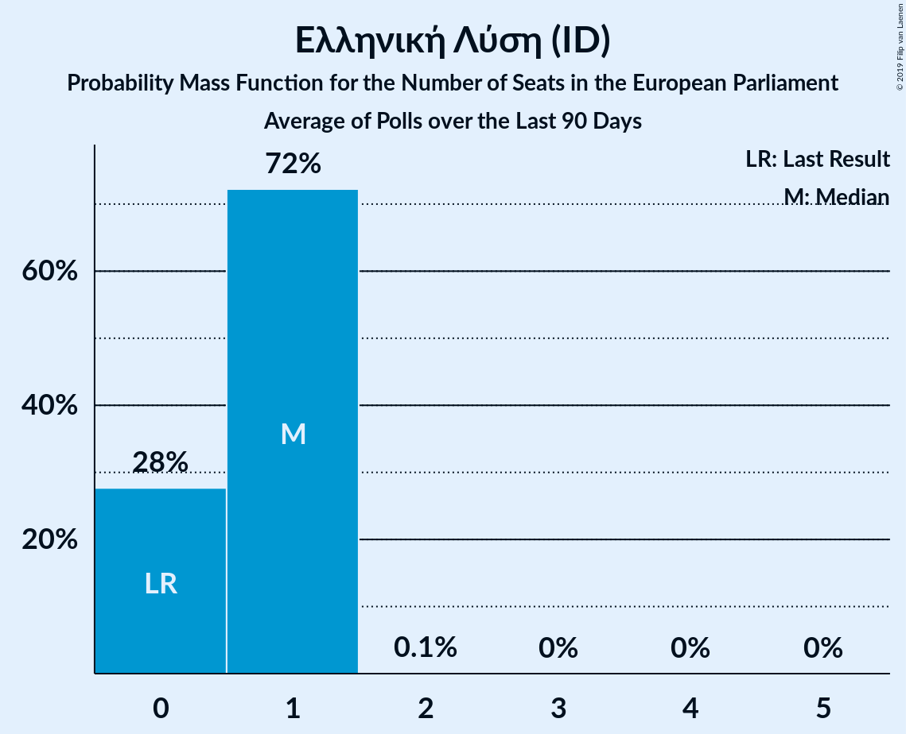

# Ελληνική Λύση (ID)

<a href="#voting-intentions">Voting Intentions</a> | <a href="#seats">Seats</a>

## Voting Intentions

Last result: **0.0%** (General Election of 26 May 2019)

### Confidence Intervals

| Period     | Polling firm/Commissioner(s) | Median | 80% Confidence Interval | 90% Confidence Interval | 95% Confidence Interval | 99% Confidence Interval |
|:----------:|:----------------:|:-----------:|:-----------------------:|:-----------------------:|:-----------------------:|:-----------------------:|
| N/A | [Poll Average](average.html) | 3.6% | 2.6–4.8% | 2.4–5.1% | 2.2–5.4% | 1.9–6.0% |
| [24–26 June 2019](2019-06-26-PulseRC.html) | Pulse RC   ΣΚΑΪ | 3.9% | 3.3–4.6% | 3.2–4.8% | 3.0–5.0% | 2.8–5.4% |
| [24–26 June 2019](2019-06-26-Interview.html) | Interview | 4.5% | 3.7–5.4% | 3.5–5.7% | 3.4–5.9% | 3.0–6.4% |
| [19–23 June 2019](2019-06-23-Marc.html) | Marc | 3.6% | 3.0–4.4% | 2.9–4.6% | 2.7–4.8% | 2.4–5.2% |
| [19–21 June 2019](2019-06-21-PalmosAnalysis.html) | Palmos Analysis | 4.6% | 3.8–5.5% | 3.6–5.8% | 3.4–6.0% | 3.1–6.5% |
| [18–20 June 2019](2019-06-20-Prorata.html) | Prorata | 2.9% | 2.3–3.7% | 2.2–3.9% | 2.0–4.1% | 1.8–4.6% |
| [18–20 June 2019](2019-06-20-Interview.html) | Interview   Βεργίνα TV | 3.8% | 3.1–4.7% | 2.9–5.0% | 2.8–5.2% | 2.5–5.6% |
| [18–19 June 2019](2019-06-19-PulseRC.html) | Pulse RC   ΣΚΑΪ | 4.0% | 3.4–4.9% | 3.3–5.2% | 3.1–5.4% | 2.8–5.8% |
| [17–19 June 2019](2019-06-19-OpinionPoll.html) | Opinion Poll | 3.6% | 2.9–4.5% | 2.8–4.7% | 2.6–5.0% | 2.3–5.4% |
| [14–19 June 2019](2019-06-19-MetronAnalysis.html) | Metron Analysis   Το Βήμα | 2.8% | 2.2–3.6% | 2.1–3.8% | 1.9–4.0% | 1.7–4.4% |
| [13–19 June 2019](2019-06-19-Alco.html) | Alco | 3.0% | 2.4–3.8% | 2.2–4.1% | 2.1–4.3% | 1.9–4.7% |
| [10–13 June 2019](2019-06-13-Marc.html) | Marc | 3.5% | 2.9–4.3% | 2.7–4.5% | 2.6–4.8% | 2.3–5.2% |
| [10–12 June 2019](2019-06-12-PulseRC.html) | Pulse RC   ΣΚΑΪ | 3.4% | 2.8–4.1% | 2.7–4.3% | 2.5–4.5% | 2.3–4.9% |
| [10–12 June 2019](2019-06-12-MRB.html) | MRB   Star | 3.0% | 2.4–3.8% | 2.2–4.0% | 2.1–4.3% | 1.8–4.7% |
| [3–5 June 2019](2019-06-05-MetronAnalysis.html) | Metron Analysis   Alpha TV | 2.5% | 2.0–3.2% | 1.9–3.4% | 1.8–3.6% | 1.5–3.9% |
| [30 May–1 June 2019](2019-06-01-PulseRC.html) | Pulse RC   ΣΚΑΪ | 4.3% | 3.6–5.1% | 3.5–5.3% | 3.3–5.5% | 3.0–5.9% |

### Probability Mass Function

The following table shows the probability mass function per percentage block of voting intentions for the [poll average](average.html) for Ελληνική Λύση (ID).

| Voting Intentions | Probability | Accumulated | Special Marks |
|:-----------------:|:-----------:|:-----------:|:-------------:|
| 0.0–0.5% | 0% | 100% | Last Result |
| 0.5–1.5% | 0% | 100% |  |
| 1.5–2.5% | 9% | 100% |  |
| 2.5–3.5% | 41% | 91% |  |
| 3.5–4.5% | 36% | 50% | Median |
| 4.5–5.5% | 13% | 15% |  |
| 5.5–6.5% | 2% | 2% |  |
| 6.5–7.5% | 0.1% | 0.1% |  |
| 7.5–8.5% | 0% | 0% |  |

## Seats

Last result: **0** seats (General Election of 26 May 2019)

### Confidence Intervals

| Period     | Polling firm/Commissioner(s) | Median | 80% Confidence Interval | 90% Confidence Interval | 95% Confidence Interval | 99% Confidence Interval |
|:----------:|:----------------:|:------:|:-----------------------:|:-----------------------:|:-----------------------:|:-----------------------:|
| N/A | [Poll Average](average.html) | 1 | 0–1 | 0–1 | 0–1 | 0–1 |
| [24–26 June 2019](2019-06-26-PulseRC.html) | Pulse RC   ΣΚΑΪ | 1 | 1 | 1 | 0–1 | 0–1 |
| [24–26 June 2019](2019-06-26-Interview.html) | Interview | 1 | 1 | 1 | 1 | 0–1 |
| [19–23 June 2019](2019-06-23-Marc.html) | Marc | 1 | 0–1 | 0–1 | 0–1 | 0–1 |
| [19–21 June 2019](2019-06-21-PalmosAnalysis.html) | Palmos Analysis | 1 | 1 | 1 | 1 | 1–2 |
| [18–20 June 2019](2019-06-20-Prorata.html) | Prorata | 1 | 0–1 | 0–1 | 0–1 | 0–1 |
| [18–20 June 2019](2019-06-20-Interview.html) | Interview   Βεργίνα TV | 1 | 1 | 0–1 | 0–1 | 0–1 |
| [18–19 June 2019](2019-06-19-PulseRC.html) | Pulse RC   ΣΚΑΪ | 1 | 1 | 1 | 1 | 0–1 |
| [17–19 June 2019](2019-06-19-OpinionPoll.html) | Opinion Poll | 1 | 0–1 | 0–1 | 0–1 | 0–1 |
| [14–19 June 2019](2019-06-19-MetronAnalysis.html) | Metron Analysis   Το Βήμα | 0 | 0–1 | 0–1 | 0–1 | 0–1 |
| [13–19 June 2019](2019-06-19-Alco.html) | Alco | 0 | 0–1 | 0–1 | 0–1 | 0–1 |
| [10–13 June 2019](2019-06-13-Marc.html) | Marc | 1 | 0–1 | 0–1 | 0–1 | 0–1 |
| [10–12 June 2019](2019-06-12-PulseRC.html) | Pulse RC   ΣΚΑΪ | 1 | 0–1 | 0–1 | 0–1 | 0–1 |
| [10–12 June 2019](2019-06-12-MRB.html) | MRB   Star | 1 | 0–1 | 0–1 | 0–1 | 0–1 |
| [3–5 June 2019](2019-06-05-MetronAnalysis.html) | Metron Analysis   Alpha TV | 0 | 0–1 | 0–1 | 0–1 | 0–1 |
| [30 May–1 June 2019](2019-06-01-PulseRC.html) | Pulse RC   ΣΚΑΪ | 1 | 1 | 1 | 1 | 0–1 |

### Probability Mass Function

The following table shows the probability mass function per seat for the [poll average](average.html) for Ελληνική Λύση (ID).

| Number of Seats | Probability | Accumulated | Special Marks |
|:---------------:|:-----------:|:-----------:|:-------------:|
| 0 | 27% | 100% | Last Result |
| 1 | 73% | 73% | Median |
| 2 | 0.1% | 0.1% |  |
| 3 | 0% | 0% |  |

