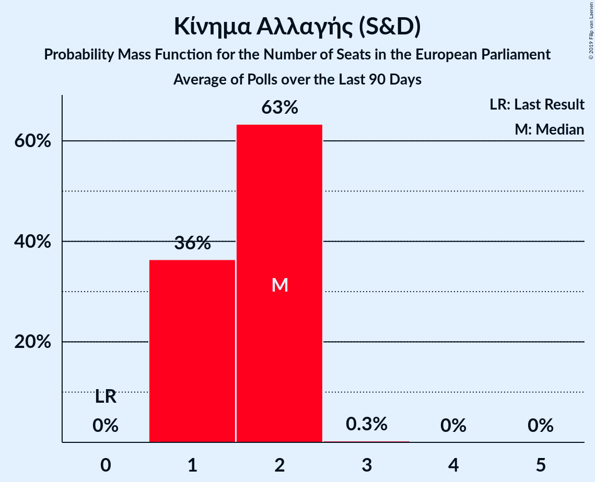

# Κίνημα Αλλαγής (S&D)

<a href="#voting-intentions">Voting Intentions</a> | <a href="#seats">Seats</a>

## Voting Intentions

Last result: **0.0%** (General Election of 26 May 2019)

### Confidence Intervals

| Period     | Polling firm/Commissioner(s) | Median | 80% Confidence Interval | 90% Confidence Interval | 95% Confidence Interval | 99% Confidence Interval |
|:----------:|:----------------:|:-----------:|:-----------------------:|:-----------------------:|:-----------------------:|:-----------------------:|
| N/A | [Poll Average](average.html) | 7.1% | 6.0–8.4% | 5.7–8.8% | 5.4–9.1% | 5.0–9.7% |
| [25–28 November 2019](2019-11-28-OpinionPoll.html) | Opinion Poll | 6.4% | 5.5–7.5% | 5.3–7.8% | 5.1–8.1% | 4.7–8.6% |
| [18–20 November 2019](2019-11-20-PulseRC.html) | Pulse RC   ΣΚΑΪ | 6.9% | 6.1–8.0% | 5.8–8.3% | 5.6–8.5% | 5.2–9.0% |
| [18–20 November 2019](2019-11-20-MetronAnalysis.html) | Metron Analysis   Το Βήμα | 7.5% | 6.6–8.6% | 6.3–8.9% | 6.1–9.1% | 5.7–9.6% |
| [29–31 October 2019](2019-10-31-Marc.html) | Marc   Proto Thema | 6.7% | 5.8–7.8% | 5.5–8.1% | 5.3–8.4% | 4.9–9.0% |
| [22–23 October 2019](2019-10-23-PulseRC.html) | Pulse RC   ΣΚΑΪ | 7.0% | 6.1–8.1% | 5.8–8.4% | 5.6–8.6% | 5.2–9.2% |
| [17–18 September 2019](2019-09-18-PulseRC.html) | Pulse RC   ΣΚΑΪ | 7.0% | 6.1–8.1% | 5.9–8.4% | 5.7–8.7% | 5.3–9.2% |
| [16–18 September 2019](2019-09-18-MetronAnalysis.html) | Metron Analysis   Το Βήμα | 7.1% | 6.2–8.1% | 6.0–8.4% | 5.7–8.7% | 5.4–9.2% |
| [14–16 September 2019](2019-09-16-MRB.html) | MRB   Star | 7.8% | 6.9–9.0% | 6.6–9.4% | 6.3–9.7% | 5.9–10.3% |
| [2–5 September 2019](2019-09-05-Marc.html) | Marc   Proto Thema | 7.4% | 6.4–8.6% | 6.2–8.9% | 5.9–9.2% | 5.5–9.8% |
| [2–4 September 2019](2019-09-04-OpinionPoll.html) | Opinion Poll | 6.2% | 5.3–7.2% | 5.1–7.5% | 4.9–7.8% | 4.5–8.3% |
| [1–5 July 2019](2019-07-05-ΚάπαResearch.html) | Κάπα Research   ΕΘΝΟΣ | 7.3% | 6.5–8.4% | 6.2–8.7% | 6.0–8.9% | 5.6–9.4% |
| [1–5 July 2019](2019-07-05-MetronAnalysis.html) | Metron Analysis | 7.7% | 6.9–8.7% | 6.7–9.0% | 6.5–9.2% | 6.1–9.7% |
| [1–4 July 2019](2019-07-04-RASS.html) | RASS   Action24 | 8.2% | 7.2–9.4% | 6.9–9.7% | 6.6–10.0% | 6.2–10.7% |
| [2–4 July 2019](2019-07-04-Marc.html) | Marc   ANT1 | 7.0% | 6.2–8.0% | 6.0–8.2% | 5.8–8.5% | 5.4–8.9% |
| [1–4 July 2019](2019-07-04-MRB.html) | MRB   Star | 7.8% | 6.9–8.9% | 6.6–9.2% | 6.4–9.5% | 6.0–10.0% |
| [2–3 July 2019](2019-07-03-PulseRC.html) | Pulse RC   ΣΚΑΪ | 7.6% | 6.7–8.7% | 6.5–9.0% | 6.2–9.3% | 5.9–9.8% |
| [18 June–3 July 2019](2019-07-03-PublicIssue.html) | Public Issue | 8.0% | 7.0–9.2% | 6.7–9.5% | 6.4–9.8% | 6.0–10.4% |
| [1–3 July 2019](2019-07-03-Interview.html) | Interview   Βεργίνα TV | 7.2% | 6.2–8.3% | 5.9–8.6% | 5.7–8.9% | 5.3–9.5% |
| [28 June–2 July 2019](2019-07-02-Alco.html) | Alco   Open TV | 8.0% | 7.0–9.2% | 6.7–9.6% | 6.5–9.9% | 6.0–10.5% |
| [28 June–1 July 2019](2019-07-01-Prorata.html) | Prorata | 7.0% | 6.1–8.2% | 5.8–8.5% | 5.6–8.8% | 5.2–9.3% |
| [27 June–1 July 2019](2019-07-01-MetronAnalysis.html) | Metron Analysis   Alpha TV | 7.5% | 6.6–8.6% | 6.4–8.9% | 6.2–9.2% | 5.8–9.7% |
| [24–27 June 2019](2019-06-27-RASS.html) | RASS   in.gr | 9.5% | 8.4–10.8% | 8.1–11.1% | 7.8–11.5% | 7.3–12.1% |
| [24–26 June 2019](2019-06-26-PulseRC.html) | Pulse RC   ΣΚΑΪ | 7.2% | 6.4–8.1% | 6.2–8.4% | 6.0–8.6% | 5.6–9.1% |
| [24–26 June 2019](2019-06-26-MRB.html) | MRB   Τα Νέα | 8.1% | 7.1–9.3% | 6.8–9.6% | 6.6–9.9% | 6.1–10.5% |
| [24–26 June 2019](2019-06-26-Interview.html) | Interview   Politik | 7.3% | 6.3–8.4% | 6.0–8.7% | 5.8–9.0% | 5.4–9.6% |
| [19–23 June 2019](2019-06-23-Marc.html) | Marc   ANT1 | 7.5% | 6.6–8.6% | 6.4–8.9% | 6.1–9.1% | 5.7–9.6% |
| [18–20 June 2019](2019-06-20-Prorata.html) | Prorata   Newpost | 7.5% | 6.5–8.7% | 6.2–9.0% | 6.0–9.3% | 5.6–9.9% |
| [18–20 June 2019](2019-06-20-Interview.html) | Interview   Βεργίνα TV | 6.0% | 5.1–7.1% | 4.9–7.4% | 4.7–7.7% | 4.3–8.2% |
| [18–19 June 2019](2019-06-19-PulseRC.html) | Pulse RC   ΣΚΑΪ | 8.4% | 7.6–9.6% | 7.3–10.0% | 7.1–10.2% | 6.6–10.8% |
| [17–19 June 2019](2019-06-19-OpinionPoll.html) | Opinion Poll | 6.4% | 5.5–7.5% | 5.3–7.8% | 5.0–8.1% | 4.6–8.7% |
| [14–19 June 2019](2019-06-19-MetronAnalysis.html) | Metron Analysis   Το Βήμα | 8.0% | 7.0–9.2% | 6.7–9.5% | 6.5–9.8% | 6.0–10.5% |
| [13–19 June 2019](2019-06-19-Alco.html) | Alco | 6.5% | 5.6–7.6% | 5.3–7.9% | 5.1–8.2% | 4.7–8.8% |
| [10–13 June 2019](2019-06-13-Marc.html) | Marc | 8.3% | 7.4–9.5% | 7.1–9.8% | 6.9–10.1% | 6.4–10.7% |
| [10–12 June 2019](2019-06-12-PulseRC.html) | Pulse RC   ΣΚΑΪ | 7.3% | 6.5–8.3% | 6.2–8.6% | 6.0–8.8% | 5.7–9.3% |
| [10–12 June 2019](2019-06-12-MRB.html) | MRB   Star | 7.3% | 6.3–8.4% | 6.1–8.8% | 5.8–9.1% | 5.4–9.6% |
| [3–5 June 2019](2019-06-05-MetronAnalysis.html) | Metron Analysis   Alpha TV | 7.8% | 6.9–8.9% | 6.6–9.2% | 6.4–9.5% | 6.0–10.0% |
| [30 May–1 June 2019](2019-06-01-PulseRC.html) | Pulse RC   ΣΚΑΪ | 8.6% | 7.7–9.7% | 7.5–10.0% | 7.2–10.2% | 6.8–10.8% |

### Probability Mass Function

The following table shows the probability mass function per percentage block of voting intentions for the [poll average](average.html) for Κίνημα Αλλαγής (S&D).

| Voting Intentions | Probability | Accumulated | Special Marks |
|:-----------------:|:-----------:|:-----------:|:-------------:|
| 0.0–0.5% | 0% | 100% | Last Result |
| 0.5–1.5% | 0% | 100% |  |
| 1.5–2.5% | 0% | 100% |  |
| 2.5–3.5% | 0% | 100% |  |
| 3.5–4.5% | 0.1% | 100% |  |
| 4.5–5.5% | 3% | 99.9% |  |
| 5.5–6.5% | 24% | 97% |  |
| 6.5–7.5% | 40% | 73% | Median |
| 7.5–8.5% | 25% | 33% |  |
| 8.5–9.5% | 7% | 7% |  |
| 9.5–10.5% | 0.8% | 0.8% |  |
| 10.5–11.5% | 0% | 0% |  |
| 11.5–12.5% | 0% | 0% |  |

## Seats

Last result: **0** seats (General Election of 26 May 2019)

### Confidence Intervals

| Period     | Polling firm/Commissioner(s) | Median | 80% Confidence Interval | 90% Confidence Interval | 95% Confidence Interval | 99% Confidence Interval |
|:----------:|:----------------:|:------:|:-----------------------:|:-----------------------:|:-----------------------:|:-----------------------:|
| N/A | [Poll Average](average.html) | 1 | 1–2 | 1–2 | 1–2 | 1–2 |
| [25–28 November 2019](2019-11-28-OpinionPoll.html) | Opinion Poll | 1 | 1–2 | 1–2 | 1–2 | 1–2 |
| [18–20 November 2019](2019-11-20-PulseRC.html) | Pulse RC   ΣΚΑΪ | 1 | 1–2 | 1–2 | 1–2 | 1–2 |
| [18–20 November 2019](2019-11-20-MetronAnalysis.html) | Metron Analysis   Το Βήμα | 2 | 1–2 | 1–2 | 1–2 | 1–2 |
| [29–31 October 2019](2019-10-31-Marc.html) | Marc   Proto Thema | 2 | 1–2 | 1–2 | 1–2 | 1–2 |
| [22–23 October 2019](2019-10-23-PulseRC.html) | Pulse RC   ΣΚΑΪ | 1 | 1–2 | 1–2 | 1–2 | 1–2 |
| [17–18 September 2019](2019-09-18-PulseRC.html) | Pulse RC   ΣΚΑΪ | 1 | 1–2 | 1–2 | 1–2 | 1–2 |
| [16–18 September 2019](2019-09-18-MetronAnalysis.html) | Metron Analysis   Το Βήμα | 2 | 1–2 | 1–2 | 1–2 | 1–2 |
| [14–16 September 2019](2019-09-16-MRB.html) | MRB   Star | 2 | 1–2 | 1–2 | 1–2 | 1–2 |
| [2–5 September 2019](2019-09-05-Marc.html) | Marc   Proto Thema | 2 | 1–2 | 1–2 | 1–2 | 1–2 |
| [2–4 September 2019](2019-09-04-OpinionPoll.html) | Opinion Poll | 1 | 1–2 | 1–2 | 1–2 | 1–2 |
| [1–5 July 2019](2019-07-05-ΚάπαResearch.html) | Κάπα Research   ΕΘΝΟΣ | 2 | 1–2 | 1–2 | 1–2 | 1–2 |
| [1–5 July 2019](2019-07-05-MetronAnalysis.html) | Metron Analysis | 2 | 1–2 | 1–2 | 1–2 | 1–2 |
| [1–4 July 2019](2019-07-04-RASS.html) | RASS   Action24 | 2 | 2 | 2 | 1–2 | 1–3 |
| [2–4 July 2019](2019-07-04-Marc.html) | Marc   ANT1 | 1 | 1–2 | 1–2 | 1–2 | 1–2 |
| [1–4 July 2019](2019-07-04-MRB.html) | MRB   Star | 2 | 1–2 | 1–2 | 1–2 | 1–2 |
| [2–3 July 2019](2019-07-03-PulseRC.html) | Pulse RC   ΣΚΑΪ | 2 | 1–2 | 1–2 | 1–2 | 1–2 |
| [18 June–3 July 2019](2019-07-03-PublicIssue.html) | Public Issue | 2 | 1–2 | 1–2 | 1–2 | 1–2 |
| [1–3 July 2019](2019-07-03-Interview.html) | Interview   Βεργίνα TV | 2 | 1–2 | 1–2 | 1–2 | 1–2 |
| [28 June–2 July 2019](2019-07-02-Alco.html) | Alco   Open TV | 2 | 1–2 | 1–2 | 1–2 | 1–2 |
| [28 June–1 July 2019](2019-07-01-Prorata.html) | Prorata | 1 | 1–2 | 1–2 | 1–2 | 1–2 |
| [27 June–1 July 2019](2019-07-01-MetronAnalysis.html) | Metron Analysis   Alpha TV | 2 | 1–2 | 1–2 | 1–2 | 1–2 |
| [24–27 June 2019](2019-06-27-RASS.html) | RASS   in.gr | 2 | 2 | 2 | 2 | 1–3 |
| [24–26 June 2019](2019-06-26-PulseRC.html) | Pulse RC   ΣΚΑΪ | 1 | 1–2 | 1–2 | 1–2 | 1–2 |
| [24–26 June 2019](2019-06-26-MRB.html) | MRB   Τα Νέα | 2 | 1–2 | 1–2 | 1–2 | 1–2 |
| [24–26 June 2019](2019-06-26-Interview.html) | Interview   Politik | 2 | 1–2 | 1–2 | 1–2 | 1–2 |
| [19–23 June 2019](2019-06-23-Marc.html) | Marc   ANT1 | 2 | 1–2 | 1–2 | 1–2 | 1–2 |
| [18–20 June 2019](2019-06-20-Prorata.html) | Prorata   Newpost | 2 | 1–2 | 1–2 | 1–2 | 1–2 |
| [18–20 June 2019](2019-06-20-Interview.html) | Interview   Βεργίνα TV | 1 | 1–2 | 1–2 | 1–2 | 1–2 |
| [18–19 June 2019](2019-06-19-PulseRC.html) | Pulse RC   ΣΚΑΪ | 2 | 2 | 2 | 1–2 | 1–2 |
| [17–19 June 2019](2019-06-19-OpinionPoll.html) | Opinion Poll | 1 | 1–2 | 1–2 | 1–2 | 1–2 |
| [14–19 June 2019](2019-06-19-MetronAnalysis.html) | Metron Analysis   Το Βήμα | 2 | 1–2 | 1–2 | 1–2 | 1–2 |
| [13–19 June 2019](2019-06-19-Alco.html) | Alco | 1 | 1–2 | 1–2 | 1–2 | 1–2 |
| [10–13 June 2019](2019-06-13-Marc.html) | Marc | 2 | 1–2 | 1–2 | 1–2 | 1–2 |
| [10–12 June 2019](2019-06-12-PulseRC.html) | Pulse RC   ΣΚΑΪ | 2 | 1–2 | 1–2 | 1–2 | 1–2 |
| [10–12 June 2019](2019-06-12-MRB.html) | MRB   Star | 2 | 1–2 | 1–2 | 1–2 | 1–2 |
| [3–5 June 2019](2019-06-05-MetronAnalysis.html) | Metron Analysis   Alpha TV | 2 | 1–2 | 1–2 | 1–2 | 1–2 |
| [30 May–1 June 2019](2019-06-01-PulseRC.html) | Pulse RC   ΣΚΑΪ | 2 | 2 | 2 | 2 | 2 |

### Probability Mass Function

The following table shows the probability mass function per seat for the [poll average](average.html) for Κίνημα Αλλαγής (S&D).

| Number of Seats | Probability | Accumulated | Special Marks |
|:---------------:|:-----------:|:-----------:|:-------------:|
| 0 | 0% | 100% | Last Result |
| 1 | 50% | 100% | Median |
| 2 | 50% | 50% |  |
| 3 | 0% | 0% |  |

