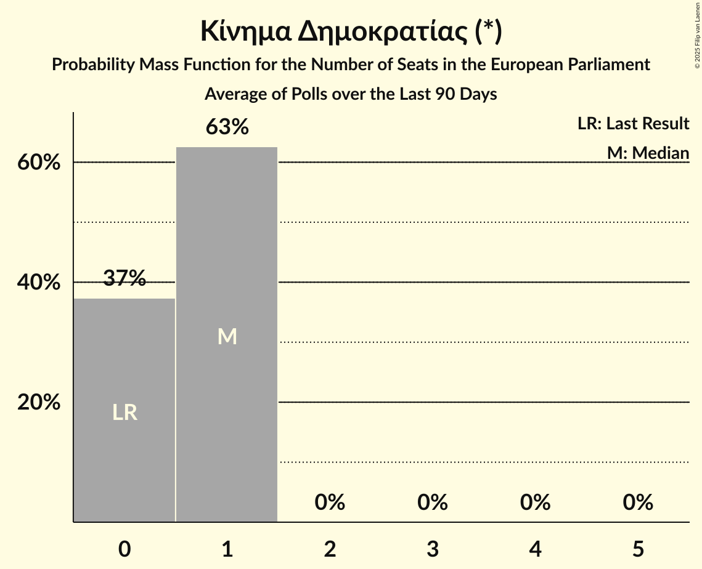

# Κίνημα Δημοκρατίας (*)

<a href="#voting-intentions">Voting Intentions</a> | <a href="#seats">Seats</a>

## Voting Intentions

Last result: **0.0%** (General Election of 9 June 2024)

### Confidence Intervals

| Period     | Polling firm/Commissioner(s) | Median | 80% Confidence Interval | 90% Confidence Interval | 95% Confidence Interval | 99% Confidence Interval |
|:----------:|:----------------:|:-----------:|:-----------------------:|:-----------------------:|:-----------------------:|:-----------------------:|
| N/A | [Poll Average](average.html) | 4.0% | 2.9–5.4% | 2.7–5.8% | 2.5–6.0% | 2.1–6.5% |
| [20–22 January 2025](2025-01-22-GPO.html) | GPO   Star TV | 3.6% | 2.9–4.4% | 2.7–4.7% | 2.6–4.9% | 2.3–5.3% |
| [19–21 January 2025](2025-01-21-PulseRC.html) | Pulse RC   ΣΚΑΪ | 4.1% | 3.4–5.1% | 3.2–5.3% | 3.0–5.6% | 2.7–6.1% |
| [15–21 January 2025](2025-01-21-MetronAnalysis.html) | Metron Analysis   Mega TV | 3.0% | 2.4–3.8% | 2.3–4.1% | 2.1–4.3% | 1.9–4.7% |
| [14–20 January 2025](2025-01-20-Interview.html) | Interview   Politic.gr | 5.2% | 4.7–5.9% | 4.5–6.0% | 4.4–6.2% | 4.1–6.5% |
| [15–19 January 2025](2025-01-19-Alco.html) | Alco   Alpha TV | 3.3% | 2.7–4.3% | 2.5–4.6% | 2.3–4.8% | 2.0–5.3% |
| [8–10 January 2025](2025-01-10-OpinionPoll.html) | Opinion Poll   Action 24 | 4.2% | 3.4–5.2% | 3.2–5.5% | 3.0–5.8% | 2.7–6.3% |
| [7–10 January 2025](2025-01-10-Marc.html) | Marc   ANT1 | 5.1% | 4.3–6.1% | 4.1–6.4% | 3.9–6.7% | 3.6–7.2% |
| [16–23 December 2024](2024-12-23-PalmosAnalysis.html) | Palmos Analysis   Ελεύθερος Τύπος | 3.8% | 3.0–4.7% | 2.9–5.0% | 2.7–5.2% | 2.4–5.7% |
| [15–17 December 2024](2024-12-17-PulseRC.html) | Pulse RC   ΣΚΑΪ | 4.8% | 4.0–5.8% | 3.8–6.1% | 3.6–6.3% | 3.2–6.9% |
| [11–17 December 2024](2024-12-17-MetronAnalysis.html) | Metron Analysis   Mega TV | 4.1% | 3.4–5.0% | 3.2–5.2% | 3.0–5.4% | 2.7–5.9% |
| [11–16 December 2024](2024-12-16-Interview.html) | Interview   Politic.gr | 7.1% | 6.4–7.8% | 6.3–8.0% | 6.1–8.2% | 5.8–8.6% |
| [11–13 December 2024](2024-12-13-OpinionPoll.html) | Opinion Poll   Manifesto | 5.0% | 4.2–6.2% | 3.9–6.5% | 3.7–6.8% | 3.3–7.4% |
| [4–13 December 2024](2024-12-13-MRB.html) | MRB     | 4.3% | 3.7–5.0% | 3.6–5.3% | 3.4–5.4% | 3.2–5.8% |
| [9–13 December 2024](2024-12-13-GPO.html) | GPO   Παραπολιτικά | 4.4% | 3.6–5.5% | 3.4–5.8% | 3.2–6.0% | 2.9–6.6% |
| [3–9 December 2024](2024-12-09-Prorata.html) | Prorata   Attica TV | 2.9% | 2.3–3.7% | 2.1–4.0% | 2.0–4.2% | 1.8–4.6% |
| [25–28 November 2024](2024-11-28-Marc.html) | Marc   Πρώτο ΘΕΜΑ | 5.1% | 4.3–6.2% | 4.1–6.5% | 3.9–6.7% | 3.5–7.3% |
| [24–26 November 2024](2024-11-26-PulseRC.html) | Pulse RC   ΣΚΑΪ | 4.9% | 4.1–5.9% | 3.8–6.2% | 3.6–6.4% | 3.3–7.0% |
| [20–26 November 2024](2024-11-26-MetronAnalysis.html) | Metron Analysis   Mega TV | 2.2% | 1.7–2.9% | 1.6–3.1% | 1.5–3.2% | 1.3–3.6% |
| [21–25 November 2024](2024-11-25-Interview.html) | Interview   Politic.gr | 6.5% | 5.9–7.1% | 5.7–7.3% | 5.6–7.5% | 5.3–7.8% |
| [18–22 November 2024](2024-11-22-GPO.html) | GPO   Παραπολιτικά | 1.8% | 1.3–2.5% | 1.2–2.7% | 1.1–2.9% | 0.9–3.3% |
| [11–15 November 2024](2024-11-15-GPO.html) | GPO   Παραπολιτικά | 3.1% | N/A | N/A | N/A | N/A |
| [7–12 November 2024](2024-11-12-OpinionPoll.html) | Opinion Poll   Action 24 | 0.0% | N/A | N/A | N/A | N/A |
| [22–26 October 2024](2024-10-26-Marc.html) | Marc   ANT1 | 0.0% | N/A | N/A | N/A | N/A |
| [21–23 October 2024](2024-10-23-MRB.html) | MRB   Open TV | 0.0% | N/A | N/A | N/A | N/A |
| [16–22 October 2024](2024-10-22-MetronAnalysis.html) | Metron Analysis   Mega TV | 0.0% | N/A | N/A | N/A | N/A |
| [16–21 October 2024](2024-10-21-Interview.html) | Interview   Politic.gr | 0.0% | N/A | N/A | N/A | N/A |
| [15–19 October 2024](2024-10-19-Alco.html) | Alco   Alpha TV | 0.0% | N/A | N/A | N/A | N/A |
| [14–16 October 2024](2024-10-16-GPO.html) | GPO   Star TV | 0.0% | N/A | N/A | N/A | N/A |
| [26 September–2 October 2024](2024-10-02-MetronAnalysis.html) | Metron Analysis   Mega TV | 0.0% | N/A | N/A | N/A | N/A |
| [30 September–2 October 2024](2024-10-02-MRB.html) | MRB   Open TV | 0.0% | N/A | N/A | N/A | N/A |
| [29 September–1 October 2024](2024-10-01-PulseRC.html) | Pulse RC   ΣΚΑΪ | 0.0% | N/A | N/A | N/A | N/A |
| [24–28 September 2024](2024-09-28-PalmosAnalysis.html) | Palmos Analysis   Tvxs.gr | 0.0% | N/A | N/A | N/A | N/A |
| [24–27 September 2024](2024-09-27-OpinionPoll.html) | Opinion Poll   Action 24 | 0.0% | N/A | N/A | N/A | N/A |
| [13–23 September 2024](2024-09-23-MetronAnalysis.html) | Metron Analysis   Mega TV | 0.0% | N/A | N/A | N/A | N/A |
| [19–23 September 2024](2024-09-23-Interview.html) | Interview   Politic.gr | 0.0% | N/A | N/A | N/A | N/A |
| [16–21 September 2024](2024-09-21-Prorata.html) | Prorata   Attica TV | 0.0% | N/A | N/A | N/A | N/A |
| [13–18 September 2024](2024-09-18-MRB.html) | MRB   Open TV | 0.0% | N/A | N/A | N/A | N/A |
| [13–16 September 2024](2024-09-16-PulseRC.html) | Pulse RC   ΣΚΑΪ | 0.0% | N/A | N/A | N/A | N/A |
| [9–14 September 2024](2024-09-14-Alco.html) | Alco   Alpha TV | 0.0% | N/A | N/A | N/A | N/A |
| [2–11 September 2024](2024-09-11-DataRC.html) | Data RC   Peloponnisos | 0.0% | N/A | N/A | N/A | N/A |
| [4–10 September 2024](2024-09-10-MetronAnalysis.html) | Metron Analysis   Mega TV | 0.0% | N/A | N/A | N/A | N/A |
| [8–10 September 2024](2024-09-10-GPO.html) | GPO   Star TV | 0.0% | N/A | N/A | N/A | N/A |
| [2–6 September 2024](2024-09-06-Interview.html) | Interview   Political | 0.0% | N/A | N/A | N/A | N/A |
| [27–30 August 2024](2024-08-30-OpinionPoll.html) | Opinion Poll   Action 24 | 0.0% | N/A | N/A | N/A | N/A |
| [26–30 August 2024](2024-08-30-MRB.html) | MRB   Open TV | 0.0% | N/A | N/A | N/A | N/A |
| [21–26 August 2024](2024-08-26-Interview.html) | Interview   Politic.gr | 0.0% | N/A | N/A | N/A | N/A |
| [27 June–4 July 2024](2024-07-04-MRB.html) | MRB | 0.0% | N/A | N/A | N/A | N/A |
| [21 June–1 July 2024](2024-07-01-MetronAnalysis.html) | Metron Analysis   Mega TV | 0.0% | N/A | N/A | N/A | N/A |
| [25–28 June 2024](2024-06-28-ΚάπαResearch.html) | Κάπα Research | 0.0% | N/A | N/A | N/A | N/A |
| [17–19 June 2024](2024-06-19-GPO.html) | GPO   Star TV | 0.0% | N/A | N/A | N/A | N/A |

### Probability Mass Function

The following table shows the probability mass function per percentage block of voting intentions for the [poll average](average.html) for Κίνημα Δημοκρατίας (*).

| Voting Intentions | Probability | Accumulated | Special Marks |
|:-----------------:|:-----------:|:-----------:|:-------------:|
| 0.0–0.5% | 0% | 100% | Last Result |
| 0.5–1.5% | 0% | 100% |  |
| 1.5–2.5% | 3% | 100% |  |
| 2.5–3.5% | 28% | 97% |  |
| 3.5–4.5% | 36% | 69% | Median |
| 4.5–5.5% | 25% | 33% |  |
| 5.5–6.5% | 7% | 8% |  |
| 6.5–7.5% | 0.5% | 0.5% |  |
| 7.5–8.5% | 0% | 0% |  |

## Seats

Last result: **0** seats (General Election of 9 June 2024)

### Confidence Intervals

| Period     | Polling firm/Commissioner(s) | Median | 80% Confidence Interval | 90% Confidence Interval | 95% Confidence Interval | 99% Confidence Interval |
|:----------:|:----------------:|:------:|:-----------------------:|:-----------------------:|:-----------------------:|:-----------------------:|
| N/A | [Poll Average](average.html) | 1 | 0–1 | 0–1 | 0–1 | 0–1 |
| [20–22 January 2025](2025-01-22-GPO.html) | GPO   Star TV | 1 | 1 | 0–1 | 0–1 | 0–1 |
| [19–21 January 2025](2025-01-21-PulseRC.html) | Pulse RC   ΣΚΑΪ | 1 | 1 | 1 | 1 | 0–1 |
| [15–21 January 2025](2025-01-21-MetronAnalysis.html) | Metron Analysis   Mega TV | 1 | 0–1 | 0–1 | 0–1 | 0–1 |
| [14–20 January 2025](2025-01-20-Interview.html) | Interview   Politic.gr | 1 | 1 | 1 | 1 | 1 |
| [15–19 January 2025](2025-01-19-Alco.html) | Alco   Alpha TV | 1 | 0–1 | 0–1 | 0–1 | 0–1 |
| [8–10 January 2025](2025-01-10-OpinionPoll.html) | Opinion Poll   Action 24 | 1 | 1 | 1 | 0–1 | 0–2 |
| [7–10 January 2025](2025-01-10-Marc.html) | Marc   ANT1 | 1 | 1 | 1 | 1 | 1–2 |
| [16–23 December 2024](2024-12-23-PalmosAnalysis.html) | Palmos Analysis   Ελεύθερος Τύπος | 1 | 1 | 0–1 | 0–1 | 0–1 |
| [15–17 December 2024](2024-12-17-PulseRC.html) | Pulse RC   ΣΚΑΪ | 1 | 1 | 1 | 1 | 1–2 |
| [11–17 December 2024](2024-12-17-MetronAnalysis.html) | Metron Analysis   Mega TV | 1 | 1 | 1 | 1 | 0–1 |
| [11–16 December 2024](2024-12-16-Interview.html) | Interview   Politic.gr | 2 | 1–2 | 1–2 | 1–2 | 1–2 |
| [11–13 December 2024](2024-12-13-OpinionPoll.html) | Opinion Poll   Manifesto | 1 | 1 | 1 | 1–2 | 1–2 |
| [4–13 December 2024](2024-12-13-MRB.html) | MRB     | 1 | 1 | 1 | 1 | 1 |
| [9–13 December 2024](2024-12-13-GPO.html) | GPO   Παραπολιτικά | 1 | 1 | 1 | 1 | 0–1 |
| [3–9 December 2024](2024-12-09-Prorata.html) | Prorata   Attica TV | 0 | 0–1 | 0–1 | 0–1 | 0–1 |
| [25–28 November 2024](2024-11-28-Marc.html) | Marc   Πρώτο ΘΕΜΑ | 1 | 1 | 1 | 1 | 1–2 |
| [24–26 November 2024](2024-11-26-PulseRC.html) | Pulse RC   ΣΚΑΪ | 1 | 1 | 1 | 1 | 1–2 |
| [20–26 November 2024](2024-11-26-MetronAnalysis.html) | Metron Analysis   Mega TV | 0 | 0 | 0–1 | 0–1 | 0–1 |
| [21–25 November 2024](2024-11-25-Interview.html) | Interview   Politic.gr | 1 | 1–2 | 1–2 | 1–2 | 1–2 |
| [18–22 November 2024](2024-11-22-GPO.html) | GPO   Παραπολιτικά | 0 | 0 | 0 | 0 | 0–1 |
| [11–15 November 2024](2024-11-15-GPO.html) | GPO   Παραπολιτικά |  |  |  |  |  |
| [7–12 November 2024](2024-11-12-OpinionPoll.html) | Opinion Poll   Action 24 |  |  |  |  |  |
| [22–26 October 2024](2024-10-26-Marc.html) | Marc   ANT1 |  |  |  |  |  |
| [21–23 October 2024](2024-10-23-MRB.html) | MRB   Open TV |  |  |  |  |  |
| [16–22 October 2024](2024-10-22-MetronAnalysis.html) | Metron Analysis   Mega TV |  |  |  |  |  |
| [16–21 October 2024](2024-10-21-Interview.html) | Interview   Politic.gr |  |  |  |  |  |
| [15–19 October 2024](2024-10-19-Alco.html) | Alco   Alpha TV |  |  |  |  |  |
| [14–16 October 2024](2024-10-16-GPO.html) | GPO   Star TV |  |  |  |  |  |
| [26 September–2 October 2024](2024-10-02-MetronAnalysis.html) | Metron Analysis   Mega TV |  |  |  |  |  |
| [30 September–2 October 2024](2024-10-02-MRB.html) | MRB   Open TV |  |  |  |  |  |
| [29 September–1 October 2024](2024-10-01-PulseRC.html) | Pulse RC   ΣΚΑΪ |  |  |  |  |  |
| [24–28 September 2024](2024-09-28-PalmosAnalysis.html) | Palmos Analysis   Tvxs.gr |  |  |  |  |  |
| [24–27 September 2024](2024-09-27-OpinionPoll.html) | Opinion Poll   Action 24 |  |  |  |  |  |
| [13–23 September 2024](2024-09-23-MetronAnalysis.html) | Metron Analysis   Mega TV |  |  |  |  |  |
| [19–23 September 2024](2024-09-23-Interview.html) | Interview   Politic.gr |  |  |  |  |  |
| [16–21 September 2024](2024-09-21-Prorata.html) | Prorata   Attica TV |  |  |  |  |  |
| [13–18 September 2024](2024-09-18-MRB.html) | MRB   Open TV |  |  |  |  |  |
| [13–16 September 2024](2024-09-16-PulseRC.html) | Pulse RC   ΣΚΑΪ |  |  |  |  |  |
| [9–14 September 2024](2024-09-14-Alco.html) | Alco   Alpha TV |  |  |  |  |  |
| [2–11 September 2024](2024-09-11-DataRC.html) | Data RC   Peloponnisos |  |  |  |  |  |
| [4–10 September 2024](2024-09-10-MetronAnalysis.html) | Metron Analysis   Mega TV |  |  |  |  |  |
| [8–10 September 2024](2024-09-10-GPO.html) | GPO   Star TV |  |  |  |  |  |
| [2–6 September 2024](2024-09-06-Interview.html) | Interview   Political |  |  |  |  |  |
| [27–30 August 2024](2024-08-30-OpinionPoll.html) | Opinion Poll   Action 24 |  |  |  |  |  |
| [26–30 August 2024](2024-08-30-MRB.html) | MRB   Open TV |  |  |  |  |  |
| [21–26 August 2024](2024-08-26-Interview.html) | Interview   Politic.gr |  |  |  |  |  |
| [27 June–4 July 2024](2024-07-04-MRB.html) | MRB |  |  |  |  |  |
| [21 June–1 July 2024](2024-07-01-MetronAnalysis.html) | Metron Analysis   Mega TV |  |  |  |  |  |
| [25–28 June 2024](2024-06-28-ΚάπαResearch.html) | Κάπα Research |  |  |  |  |  |
| [17–19 June 2024](2024-06-19-GPO.html) | GPO   Star TV |  |  |  |  |  |

### Probability Mass Function

The following table shows the probability mass function per seat for the [poll average](average.html) for Κίνημα Δημοκρατίας (*).

| Number of Seats | Probability | Accumulated | Special Marks |
|:---------------:|:-----------:|:-----------:|:-------------:|
| 0 | 11% | 100% | Last Result |
| 1 | 89% | 89% | Median |
| 2 | 0.3% | 0.3% |  |
| 3 | 0% | 0% |  |

