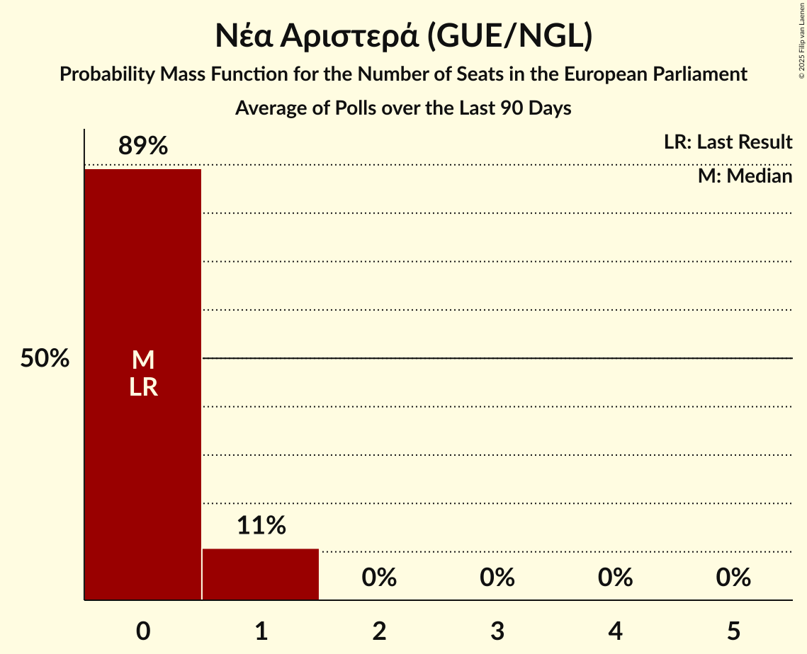

# Νέα Αριστερά (GUE/NGL)

<a href="#voting-intentions">Voting Intentions</a> | <a href="#seats">Seats</a>

## Voting Intentions

Last result: **0.0%** (General Election of 9 June 2024)

### Confidence Intervals

| Period     | Polling firm/Commissioner(s) | Median | 80% Confidence Interval | 90% Confidence Interval | 95% Confidence Interval | 99% Confidence Interval |
|:----------:|:----------------:|:-----------:|:-----------------------:|:-----------------------:|:-----------------------:|:-----------------------:|
| N/A | [Poll Average](average.html) | 1.8% | 1.2–2.6% | 1.0–2.9% | 0.9–3.1% | 0.7–3.6% |
| [14–20 January 2026](2026-01-20-MetronAnalysis.html) | Metron Analysis   Mega TV | 2.4% | 1.9–3.2% | 1.8–3.4% | 1.7–3.6% | 1.4–4.0% |
| [16–19 January 2026](2026-01-19-PulseRC.html) | Pulse RC   ΣΚΑΪ | 1.9% | 1.4–2.6% | 1.3–2.8% | 1.2–3.0% | 1.0–3.3% |
| [14–16 January 2026](2026-01-16-OpinionPoll.html) | Opinion Poll   Action 24 | 1.2% | 0.9–1.9% | 0.7–2.1% | 0.7–2.3% | 0.5–2.6% |
| [12–15 January 2026](2026-01-15-GPO.html) | GPO   Παραπολιτικά | 1.8% | 1.4–2.6% | 1.2–2.8% | 1.1–3.0% | 0.9–3.4% |
| [11–12 January 2026](2026-01-12-RealPolls.html) | Real Polls   Protagon | 1.8% | 1.4–2.3% | 1.3–2.5% | 1.2–2.6% | 1.1–2.9% |
| [9–12 January 2026](2026-01-12-Interview.html) | Interview   Political | 1.4% | 1.0–1.9% | 0.9–2.0% | 0.9–2.1% | 0.7–2.4% |
| [22–29 December 2025](2025-12-29-PalmosAnalysis.html) | Palmos Analysis   Ελεύθερος Τύπος | 1.9% | 1.4–2.7% | 1.3–2.9% | 1.2–3.1% | 1.0–3.5% |
| [16–19 December 2025](2025-12-19-Interview.html) | Interview   Politic.gr | 1.4% | 1.2–1.8% | 1.1–1.8% | 1.0–1.9% | 0.9–2.1% |
| [11–16 December 2025](2025-12-16-OpinionPoll.html) | Opinion Poll   Action 24 | 1.2% | 0.9–1.9% | 0.8–2.1% | 0.7–2.3% | 0.5–2.6% |
| [9–16 December 2025](2025-12-16-MetronAnalysis.html) | Metron Analysis   Mega TV | 2.7% | 2.1–3.4% | 2.0–3.7% | 1.8–3.9% | 1.6–4.3% |
| [11–14 December 2025](2025-12-14-PulseRC.html) | Pulse RC   ΣΚΑΪ | 1.9% | 1.4–2.6% | 1.3–2.8% | 1.2–3.0% | 1.0–3.4% |
| [10–13 December 2025](2025-12-13-GPO.html) | GPO   Παραπολιτικά | 1.7% | 1.2–2.4% | 1.1–2.6% | 1.0–2.8% | 0.8–3.2% |
| [10–13 December 2025](2025-12-13-Alco.html) | Alco   Alpha TV | 1.4% | 1.0–2.1% | 0.9–2.3% | 0.8–2.5% | 0.6–2.9% |
| [4–12 December 2025](2025-12-12-MRB.html) | MRB   Open TV | 1.5% | 1.2–2.0% | 1.1–2.2% | 1.0–2.3% | 0.9–2.6% |
| [6–8 December 2025](2025-12-08-RealPolls.html) | Real Polls   Protagon | 1.5% | 1.2–2.0% | 1.1–2.2% | 1.0–2.3% | 0.8–2.6% |
| [4–8 December 2025](2025-12-08-Interview.html) | Interview   Political | 1.6% | 1.3–2.0% | 1.2–2.0% | 1.2–2.1% | 1.1–2.3% |
| [18–26 November 2025](2025-11-26-Marc.html) | Marc   Πρώτο ΘΕΜΑ | 1.2% | 0.9–1.7% | 0.8–1.8% | 0.7–2.0% | 0.6–2.2% |
| [24–26 November 2025](2025-11-26-GPO.html) | GPO   Star TV | 1.8% | 1.3–2.4% | 1.2–2.6% | 1.1–2.8% | 0.9–3.1% |
| [20–24 November 2025](2025-11-24-Interview.html) | Interview   Politic.gr | 1.7% | 1.4–2.1% | 1.4–2.2% | 1.3–2.3% | 1.2–2.5% |
| [18–20 November 2025](2025-11-20-MRB.html) | MRB   Open TV | 2.0% | 1.5–2.8% | 1.3–3.0% | 1.2–3.2% | 1.0–3.7% |
| [12–19 November 2025](2025-11-19-PalmosAnalysis.html) | Palmos Analysis   Ελεύθερος Τύπος | 1.7% | 1.2–2.4% | 1.1–2.6% | 1.0–2.8% | 0.8–3.2% |
| [16–18 November 2025](2025-11-18-PulseRC.html) | Pulse RC   ΣΚΑΪ | 2.4% | 1.9–3.2% | 1.7–3.5% | 1.6–3.7% | 1.4–4.1% |
| [11–18 November 2025](2025-11-18-MetronAnalysis.html) | Metron Analysis   Mega TV | 2.2% | 1.7–2.9% | 1.5–3.1% | 1.4–3.3% | 1.2–3.6% |
| [11–18 November 2025](2025-11-18-GPO.html) | GPO   Παραπολιτικά | 1.7% | N/A | N/A | N/A | N/A |
| [10–11 November 2025](2025-11-11-OpinionPoll.html) | Opinion Poll   Action 24 | 1.3% | 0.9–1.9% | 0.8–2.1% | 0.7–2.3% | 0.6–2.6% |
| [9–10 November 2025](2025-11-10-RealPolls.html) | Real Polls   Protagon | 1.9% | 1.5–2.4% | 1.4–2.6% | 1.3–2.7% | 1.1–3.0% |
| [6–10 November 2025](2025-11-10-Interview.html) | Interview   Politic.gr | 1.4% | 1.1–1.7% | 1.0–1.8% | 1.0–1.9% | 0.9–2.1% |
| [29 October–2 November 2025](2025-11-02-Alco.html) | Alco   Alpha TV | 1.8% | 1.3–2.7% | 1.2–2.9% | 1.1–3.1% | 0.9–3.6% |
| [24–29 October 2025](2025-10-29-MRB.html) | MRB   Ελεύθερος Τύπος | 1.8% | 1.3–2.6% | 1.2–2.8% | 1.1–3.0% | 0.9–3.5% |
| [23–28 October 2025](2025-10-28-Interview.html) | Interview   Politic.gr | 2.0% | 1.7–2.4% | 1.6–2.5% | 1.5–2.6% | 1.4–2.8% |
| [17–20 October 2025](2025-10-20-PulseRC.html) | Pulse RC   ΣΚΑΪ | 2.4% | 1.9–3.2% | 1.7–3.4% | 1.6–3.6% | 1.4–4.0% |
| [14–20 October 2025](2025-10-20-MetronAnalysis.html) | Metron Analysis   Mega TV | 1.9% | 1.6–2.6% | 1.5–2.8% | 1.4–2.9% | 1.2–3.2% |
| [13–17 October 2025](2025-10-17-Marc.html) | Marc   ANT1 | 1.0% | 0.7–1.6% | 0.6–1.8% | 0.5–1.9% | 0.4–2.2% |
| [13–15 October 2025](2025-10-15-MRB.html) | MRB   Open TV | 2.0% | 1.4–2.8% | 1.3–3.0% | 1.2–3.2% | 1.0–3.6% |
| [8–11 October 2025](2025-10-11-GPO.html) | GPO   Παραπολιτικά | 1.8% | 1.3–2.5% | 1.2–2.7% | 1.1–2.9% | 0.9–3.3% |
| [7–10 October 2025](2025-10-10-OpinionPoll.html) | Opinion Poll   Action 24 | 1.2% | 0.9–1.9% | 0.8–2.1% | 0.7–2.3% | 0.5–2.6% |
| [1–8 October 2025](2025-10-08-Interview.html) | Interview   Political | 1.7% | 1.4–2.1% | 1.4–2.2% | 1.3–2.3% | 1.2–2.5% |
| [23–27 September 2025](2025-09-27-Alco.html) | Alco   Alpha TV | 1.6% | 1.2–2.4% | 1.0–2.6% | 0.9–2.9% | 0.8–3.3% |
| [22–24 September 2025](2025-09-24-GPO.html) | GPO   Star TV | 1.8% | 1.4–2.5% | 1.2–2.7% | 1.1–2.8% | 1.0–3.2% |
| [18–22 September 2025](2025-09-22-Interview.html) | Interview   Politic.gr | 2.4% | 2.0–2.9% | 1.9–3.0% | 1.9–3.1% | 1.7–3.3% |
| [15–19 September 2025](2025-09-19-Prorata.html) | Prorata   Η Εφημερίδα των Συντακτών | 1.7% | 1.2–2.3% | 1.1–2.5% | 1.0–2.7% | 0.8–3.1% |
| [15–19 September 2025](2025-09-19-PalmosAnalysis.html) | Palmos Analysis   The Opinion | 2.0% | 1.5–2.7% | 1.3–3.0% | 1.2–3.2% | 1.0–3.6% |
| [15–17 September 2025](2025-09-17-MRB.html) | MRB   Open TV | 2.1% | 1.5–2.9% | 1.4–3.1% | 1.3–3.3% | 1.1–3.8% |
| [14–16 September 2025](2025-09-16-PulseRC.html) | Pulse RC   ΣΚΑΪ | 2.3% | 2.0–3.2% | 1.8–3.4% | 1.7–3.6% | 1.5–3.9% |
| [10–16 September 2025](2025-09-16-MetronAnalysis.html) | Metron Analysis   Mega TV | 2.5% | 2.0–3.2% | 1.8–3.5% | 1.7–3.7% | 1.5–4.0% |
| [10–11 September 2025](2025-09-11-RealPolls.html) | Real Polls   Protagon | 2.7% | 2.2–3.3% | 2.0–3.5% | 1.9–3.7% | 1.7–4.0% |
| [8–11 September 2025](2025-09-11-Marc.html) | Marc   Πρώτο ΘΕΜΑ | 0.6% | 0.4–1.1% | 0.3–1.2% | 0.3–1.4% | 0.2–1.6% |
| [8–10 September 2025](2025-09-10-OpinionPoll.html) | Opinion Poll   Action 24 | 1.6% | 1.2–2.4% | 1.0–2.6% | 0.9–2.8% | 0.7–3.2% |
| [8–10 September 2025](2025-09-10-Interview.html) | Interview   Political | 2.5% | 2.2–3.0% | 2.1–3.1% | 2.0–3.2% | 1.9–3.4% |
| [8–10 September 2025](2025-09-10-GPO.html) | GPO   Parapolitika | 1.8% | 1.3–2.5% | 1.1–2.7% | 1.1–2.9% | 0.9–3.3% |
| [27 August–2 September 2025](2025-09-02-Marc.html) | Marc   Πρώτο ΘΕΜΑ | 1.3% | N/A | N/A | N/A | N/A |
| [21–25 August 2025](2025-08-25-Interview.html) | Interview   Politic.gr | 2.1% | 1.8–2.5% | 1.6–2.6% | 1.6–2.8% | 1.4–3.0% |
| [21–23 July 2025](2025-07-23-GPO.html) | GPO   Παραπολιτικά | 1.8% | 1.3–2.5% | 1.2–2.7% | 1.1–2.9% | 0.9–3.3% |
| [11–16 July 2025](2025-07-16-Prorata.html) | Prorata   Newsbomb | 2.3% | 1.8–3.2% | 1.6–3.4% | 1.5–3.6% | 1.3–4.0% |
| [11–14 July 2025](2025-07-14-RealPolls.html) | Real Polls   Protagon | 1.2% | 0.9–1.6% | 0.8–1.7% | 0.8–1.9% | 0.7–2.1% |
| [2–4 July 2025](2025-07-04-OpinionPoll.html) | Opinion Poll   Action 24 | 1.7% | 1.2–2.4% | 1.1–2.6% | 1.0–2.8% | 0.8–3.2% |
| [27 June–1 July 2025](2025-07-01-PulseRC.html) | Pulse RC   ΣΚΑΪ | 2.4% | 1.9–3.2% | 1.8–3.4% | 1.6–3.6% | 1.4–3.9% |
| [18–24 June 2025](2025-06-24-MetronAnalysis.html) | Metron Analysis   Mega TV | 3.1% | 2.5–3.9% | 2.4–4.2% | 2.2–4.4% | 2.0–4.8% |
| [19–23 June 2025](2025-06-23-Interview.html) | Interview   Politic.gr | 2.0% | 1.6–2.5% | 1.5–2.7% | 1.4–2.8% | 1.2–3.1% |
| [11–20 June 2025](2025-06-20-MRB.html) | MRB   Open TV | 1.9% | 1.5–2.4% | 1.4–2.6% | 1.3–2.7% | 1.2–3.0% |
| [13–16 June 2025](2025-06-16-RealPolls.html) | Real Polls   Protagon | 1.5% | N/A | N/A | N/A | N/A |
| [10–14 June 2025](2025-06-14-Alco.html) | Alco   Alpha TV | 2.0% | 1.5–2.9% | 1.4–3.1% | 1.2–3.3% | 1.0–3.8% |
| [10–13 June 2025](2025-06-13-GPO.html) | GPO   Παραπολιτικά | 1.7% | 1.3–2.5% | 1.2–2.7% | 1.1–2.9% | 0.9–3.3% |
| [4–9 June 2025](2025-06-09-Interview.html) | Interview   Political | 2.5% | 2.1–3.1% | 2.0–3.3% | 1.8–3.4% | 1.6–3.7% |
| [2–5 June 2025](2025-06-05-OpinionPoll.html) | Opinion Poll   Libre | 1.2% | 0.8–1.8% | 0.7–2.0% | 0.6–2.2% | 0.5–2.6% |
| [30 May–3 June 2025](2025-06-03-GPO.html) | GPO   Star TV | 1.5% | 1.1–2.2% | 1.0–2.3% | 0.9–2.5% | 0.8–2.8% |
| [29 May–3 June 2025](2025-06-03-Alco.html) | Alco   Epikaira.gr | 1.4% | 1.0–2.1% | 0.9–2.3% | 0.8–2.5% | 0.7–2.9% |
| [26–28 May 2025](2025-05-28-MRB.html) | MRB   Open TV | 1.4% | 1.0–2.2% | 0.9–2.4% | 0.8–2.6% | 0.6–3.0% |
| [24–27 May 2025](2025-05-27-PulseRC.html) | Pulse RC   ΣΚΑΪ | 2.4% | 1.9–3.2% | 1.8–3.4% | 1.6–3.6% | 1.4–4.0% |
| [21–26 May 2025](2025-05-26-Interview.html) | Interview   Politic.gr | 1.4% | 1.1–1.9% | 1.0–2.0% | 0.9–2.1% | 0.8–2.3% |
| [19–21 May 2025](2025-05-21-OpinionPoll.html) | Opinion Poll   Action 24 | 1.2% | 0.8–1.8% | 0.7–2.0% | 0.7–2.2% | 0.5–2.5% |
| [14–20 May 2025](2025-05-20-MetronAnalysis.html) | Metron Analysis   Mega TV | 2.4% | N/A | N/A | N/A | N/A |
| [12–15 May 2025](2025-05-15-Marc.html) | Marc   Πρώτο ΘΕΜΑ | 1.2% | 0.8–1.7% | 0.7–1.9% | 0.6–2.1% | 0.5–2.4% |
| [9–12 May 2025](2025-05-12-RealPolls.html) | Real Polls   Protagon | 1.5% | N/A | N/A | N/A | N/A |
| [6–11 May 2025](2025-05-11-Interview.html) | Interview   Political | 2.0% | N/A | N/A | N/A | N/A |
| [28 April–3 May 2025](2025-05-03-Alco.html) | Alco   Alpha TV | 1.3% | 0.9–2.0% | 0.8–2.2% | 0.7–2.4% | 0.6–2.8% |
| [28 April–2 May 2025](2025-05-02-OpinionPoll.html) | Opinion Poll   Action 24 | 1.5% | N/A | N/A | N/A | N/A |
| [28–30 April 2025](2025-04-30-GPO.html) | GPO   Παραπολιτικά | 2.2% | 1.7–3.0% | 1.5–3.2% | 1.4–3.4% | 1.2–3.8% |
| [25–28 April 2025](2025-04-28-PulseRC.html) | Pulse RC   ΣΚΑΪ | 3.0% | N/A | N/A | N/A | N/A |
| [24–28 April 2025](2025-04-28-Interview.html) | Interview   Politic.gr | 1.6% | N/A | N/A | N/A | N/A |
| [7–9 April 2025](2025-04-09-MRB.html) | MRB   Open TV | 2.0% | N/A | N/A | N/A | N/A |
| [2–8 April 2025](2025-04-08-MetronAnalysis.html) | Metron Analysis   Mega TV | 2.5% | N/A | N/A | N/A | N/A |
| [4–8 April 2025](2025-04-08-Interview.html) | Interview   Political | 1.1% | N/A | N/A | N/A | N/A |
| [4–7 April 2025](2025-04-07-RealPolls.html) | Real Polls   Protagon | 0.8% | 0.6–1.2% | 0.5–1.3% | 0.5–1.4% | 0.4–1.6% |
| [3–7 April 2025](2025-04-07-Prorata.html) | Prorata   Attica TV | 2.2% | 1.7–3.0% | 1.6–3.2% | 1.5–3.5% | 1.2–3.9% |
| [31 March–4 April 2025](2025-04-04-GPO.html) | GPO   Παραπολιτικά | 2.2% | N/A | N/A | N/A | N/A |
| [27 March–1 April 2025](2025-04-01-Marc.html) | Marc   ANT1 | 1.2% | N/A | N/A | N/A | N/A |
| [21–26 March 2025](2025-03-26-Interview.html) | Interview   Politic.gr | 2.2% | N/A | N/A | N/A | N/A |
| [18–19 March 2025](2025-03-19-GPO.html) | GPO   Παραπολιτικά | 2.2% | N/A | N/A | N/A | N/A |
| [16–18 March 2025](2025-03-18-PulseRC.html) | Pulse RC   ΣΚΑΪ | 2.4% | N/A | N/A | N/A | N/A |
| [14–18 March 2025](2025-03-18-OpinionPoll.html) | Opinion Poll   Action 24 | 1.2% | N/A | N/A | N/A | N/A |
| [12–18 March 2025](2025-03-18-MetronAnalysis.html) | Metron Analysis   Mega TV | 2.6% | N/A | N/A | N/A | N/A |
| [12–16 March 2025](2025-03-16-Alco.html) | Alco   Alpha TV | 1.3% | N/A | N/A | N/A | N/A |
| [10–12 March 2025](2025-03-12-Interview.html) | Interview   Politic.gr | 1.4% | N/A | N/A | N/A | N/A |
| [8–10 March 2025](2025-03-10-RealPolls.html) | Real Polls   Protagon | 1.0% | N/A | N/A | N/A | N/A |
| [6–10 March 2025](2025-03-10-GPO.html) | GPO   Flash | 1.9% | N/A | N/A | N/A | N/A |
| [4–6 March 2025](2025-03-06-MRB.html) | MRB   Open TV | 1.3% | N/A | N/A | N/A | N/A |
| [4–6 March 2025](2025-03-06-GoodAffairs.html) | Good Affairs   Το Βήμα | 1.7% | N/A | N/A | N/A | N/A |
| [1–4 March 2025](2025-03-04-GPO.html) | GPO   Star TV | 2.1% | N/A | N/A | N/A | N/A |
| [21–24 February 2025](2025-02-24-PulseRC.html) | Pulse RC   ΣΚΑΪ | 2.4% | N/A | N/A | N/A | N/A |
| [20–24 February 2025](2025-02-24-Prorata.html) | Prorata   Attica TV | 2.8% | N/A | N/A | N/A | N/A |
| [19–24 February 2025](2025-02-24-Interview.html) | Interview   Politic.gr | 1.7% | N/A | N/A | N/A | N/A |
| [12–18 February 2025](2025-02-18-MetronAnalysis.html) | Metron Analysis   Mega TV | 3.2% | N/A | N/A | N/A | N/A |
| [11–16 February 2025](2025-02-16-Alco.html) | Alco   Alpha TV | 1.5% | N/A | N/A | N/A | N/A |
| [10–14 February 2025](2025-02-14-GPO.html) | GPO   Παραπολιτικά | 1.9% | N/A | N/A | N/A | N/A |
| [4–6 February 2025](2025-02-06-RealPolls.html) | Real Polls   Protagon | 3.1% | N/A | N/A | N/A | N/A |
| [27–31 January 2025](2025-01-31-Interview.html) | Interview   Political | 1.4% | N/A | N/A | N/A | N/A |
| [27–29 January 2025](2025-01-29-MRB.html) | MRB   Open TV | 1.3% | N/A | N/A | N/A | N/A |
| [28–29 January 2025](2025-01-29-GPO.html) | GPO   Παραπολιτικά | 2.2% | N/A | N/A | N/A | N/A |
| [20–22 January 2025](2025-01-22-GPO.html) | GPO   Star TV | 2.4% | N/A | N/A | N/A | N/A |
| [19–21 January 2025](2025-01-21-PulseRC.html) | Pulse RC   ΣΚΑΪ | 2.4% | N/A | N/A | N/A | N/A |
| [15–21 January 2025](2025-01-21-MetronAnalysis.html) | Metron Analysis   Mega TV | 1.8% | N/A | N/A | N/A | N/A |
| [14–20 January 2025](2025-01-20-Interview.html) | Interview   Politic.gr | 1.6% | N/A | N/A | N/A | N/A |
| [15–19 January 2025](2025-01-19-Alco.html) | Alco   Alpha TV | 1.4% | N/A | N/A | N/A | N/A |
| [8–10 January 2025](2025-01-10-OpinionPoll.html) | Opinion Poll   Action 24 | 2.1% | N/A | N/A | N/A | N/A |
| [7–10 January 2025](2025-01-10-Marc.html) | Marc   ANT1 | 1.3% | N/A | N/A | N/A | N/A |
| [16–23 December 2024](2024-12-23-PalmosAnalysis.html) | Palmos Analysis   Ελεύθερος Τύπος | 1.9% | N/A | N/A | N/A | N/A |
| [15–17 December 2024](2024-12-17-PulseRC.html) | Pulse RC   ΣΚΑΪ | 2.4% | N/A | N/A | N/A | N/A |
| [11–17 December 2024](2024-12-17-MetronAnalysis.html) | Metron Analysis   Mega TV | 2.8% | N/A | N/A | N/A | N/A |
| [11–16 December 2024](2024-12-16-Interview.html) | Interview   Politic.gr | 2.5% | N/A | N/A | N/A | N/A |
| [11–13 December 2024](2024-12-13-OpinionPoll.html) | Opinion Poll   Manifesto | 1.6% | N/A | N/A | N/A | N/A |
| [4–13 December 2024](2024-12-13-MRB.html) | MRB | 1.6% | N/A | N/A | N/A | N/A |
| [9–13 December 2024](2024-12-13-GPO.html) | GPO   Παραπολιτικά | 2.8% | N/A | N/A | N/A | N/A |
| [3–9 December 2024](2024-12-09-Prorata.html) | Prorata   Attica TV | 2.3% | N/A | N/A | N/A | N/A |
| [4–7 December 2024](2024-12-07-RealPolls.html) | Real Polls   Star TV | 2.0% | N/A | N/A | N/A | N/A |
| [2–7 December 2024](2024-12-07-Alco.html) | Alco   Alpha TV | 1.2% | N/A | N/A | N/A | N/A |
| [25–28 November 2024](2024-11-28-Marc.html) | Marc   Πρώτο ΘΕΜΑ | 1.4% | N/A | N/A | N/A | N/A |
| [24–26 November 2024](2024-11-26-PulseRC.html) | Pulse RC   ΣΚΑΪ | 2.4% | N/A | N/A | N/A | N/A |
| [20–26 November 2024](2024-11-26-MetronAnalysis.html) | Metron Analysis   Mega TV | 3.0% | N/A | N/A | N/A | N/A |
| [21–25 November 2024](2024-11-25-Interview.html) | Interview   Politic.gr | 2.7% | N/A | N/A | N/A | N/A |
| [18–22 November 2024](2024-11-22-GPO.html) | GPO   Παραπολιτικά | 2.0% | N/A | N/A | N/A | N/A |
| [11–15 November 2024](2024-11-15-GPO.html) | GPO   Παραπολιτικά | 2.4% | N/A | N/A | N/A | N/A |
| [12–13 November 2024](2024-11-13-RealPolls.html) | Real Polls   Alpha TV | 2.3% | N/A | N/A | N/A | N/A |
| [7–12 November 2024](2024-11-12-OpinionPoll.html) | Opinion Poll   Action 24 | 2.4% | N/A | N/A | N/A | N/A |
| [22–26 October 2024](2024-10-26-Marc.html) | Marc   ANT1 | 1.5% | N/A | N/A | N/A | N/A |
| [21–23 October 2024](2024-10-23-MRB.html) | MRB   Open TV | 1.6% | N/A | N/A | N/A | N/A |
| [16–22 October 2024](2024-10-22-MetronAnalysis.html) | Metron Analysis   Mega TV | 4.0% | N/A | N/A | N/A | N/A |
| [16–21 October 2024](2024-10-21-Interview.html) | Interview   Politic.gr | 3.5% | N/A | N/A | N/A | N/A |
| [15–19 October 2024](2024-10-19-Alco.html) | Alco   Alpha TV | 2.2% | N/A | N/A | N/A | N/A |
| [14–16 October 2024](2024-10-16-GPO.html) | GPO   Star TV | 2.5% | N/A | N/A | N/A | N/A |
| [26 September–2 October 2024](2024-10-02-MetronAnalysis.html) | Metron Analysis   Mega TV | 3.3% | N/A | N/A | N/A | N/A |
| [30 September–2 October 2024](2024-10-02-MRB.html) | MRB   Open TV | 2.7% | N/A | N/A | N/A | N/A |
| [29 September–1 October 2024](2024-10-01-PulseRC.html) | Pulse RC   ΣΚΑΪ | 1.8% | N/A | N/A | N/A | N/A |
| [24–28 September 2024](2024-09-28-PalmosAnalysis.html) | Palmos Analysis   Tvxs.gr | 2.9% | N/A | N/A | N/A | N/A |
| [24–27 September 2024](2024-09-27-OpinionPoll.html) | Opinion Poll   Action 24 | 2.4% | N/A | N/A | N/A | N/A |
| [13–23 September 2024](2024-09-23-MetronAnalysis.html) | Metron Analysis   Mega TV | 3.3% | N/A | N/A | N/A | N/A |
| [19–23 September 2024](2024-09-23-Interview.html) | Interview   Politic.gr | 2.9% | N/A | N/A | N/A | N/A |
| [16–21 September 2024](2024-09-21-Prorata.html) | Prorata   Attica TV | 3.4% | N/A | N/A | N/A | N/A |
| [15–19 September 2024](2024-09-19-PalmosAnalysis.html) | Palmos Analysis   The Opinion | 2.0% | N/A | N/A | N/A | N/A |
| [13–18 September 2024](2024-09-18-MRB.html) | MRB   Open TV | 2.8% | N/A | N/A | N/A | N/A |
| [13–16 September 2024](2024-09-16-PulseRC.html) | Pulse RC   ΣΚΑΪ | 1.9% | N/A | N/A | N/A | N/A |
| [9–14 September 2024](2024-09-14-Alco.html) | Alco   Alpha TV | 1.5% | N/A | N/A | N/A | N/A |
| [2–11 September 2024](2024-09-11-DataRC.html) | Data RC   Πελοπόννησος | 3.2% | N/A | N/A | N/A | N/A |
| [4–10 September 2024](2024-09-10-MetronAnalysis.html) | Metron Analysis   Mega TV | 2.6% | N/A | N/A | N/A | N/A |
| [8–10 September 2024](2024-09-10-GPO.html) | GPO   Star TV | 2.5% | N/A | N/A | N/A | N/A |
| [2–6 September 2024](2024-09-06-Interview.html) | Interview   Political | 1.1% | N/A | N/A | N/A | N/A |
| [27–30 August 2024](2024-08-30-OpinionPoll.html) | Opinion Poll   Action 24 | 2.4% | N/A | N/A | N/A | N/A |
| [26–30 August 2024](2024-08-30-MRB.html) | MRB   Open TV | 2.8% | N/A | N/A | N/A | N/A |
| [21–26 August 2024](2024-08-26-Interview.html) | Interview   Politic.gr | 1.8% | N/A | N/A | N/A | N/A |
| [27 June–4 July 2024](2024-07-04-MRB.html) | MRB | 2.3% | N/A | N/A | N/A | N/A |
| [21 June–1 July 2024](2024-07-01-MetronAnalysis.html) | Metron Analysis   Mega TV | 2.9% | N/A | N/A | N/A | N/A |
| [25–28 June 2024](2024-06-28-ΚάπαResearch.html) | Κάπα Research | 2.0% | N/A | N/A | N/A | N/A |
| [17–19 June 2024](2024-06-19-GPO.html) | GPO   Star TV | 2.2% | N/A | N/A | N/A | N/A |

### Probability Mass Function

The following table shows the probability mass function per percentage block of voting intentions for the [poll average](average.html) for Νέα Αριστερά (GUE/NGL).

| Voting Intentions | Probability | Accumulated | Special Marks |
|:-----------------:|:-----------:|:-----------:|:-------------:|
| 0.0–0.5% | 0.1% | 100% | Last Result |
| 0.5–1.5% | 31% | 99.9% |  |
| 1.5–2.5% | 57% | 69% | Median |
| 2.5–3.5% | 12% | 12% |  |
| 3.5–4.5% | 0.5% | 0.5% |  |
| 4.5–5.5% | 0% | 0% |  |

## Seats

Last result: **0** seats (General Election of 9 June 2024)

### Confidence Intervals

| Period     | Polling firm/Commissioner(s) | Median | 80% Confidence Interval | 90% Confidence Interval | 95% Confidence Interval | 99% Confidence Interval |
|:----------:|:----------------:|:------:|:-----------------------:|:-----------------------:|:-----------------------:|:-----------------------:|
| N/A | [Poll Average](average.html) | 0 | 0 | 0 | 0 | 0–1 |
| [14–20 January 2026](2026-01-20-MetronAnalysis.html) | Metron Analysis   Mega TV | 0 | 0–1 | 0–1 | 0–1 | 0–1 |
| [16–19 January 2026](2026-01-19-PulseRC.html) | Pulse RC   ΣΚΑΪ | 0 | 0 | 0 | 0 | 0–1 |
| [14–16 January 2026](2026-01-16-OpinionPoll.html) | Opinion Poll   Action 24 | 0 | 0 | 0 | 0 | 0 |
| [12–15 January 2026](2026-01-15-GPO.html) | GPO   Παραπολιτικά | 0 | 0 | 0 | 0 | 0–1 |
| [11–12 January 2026](2026-01-12-RealPolls.html) | Real Polls   Protagon | 0 | 0 | 0 | 0 | 0 |
| [9–12 January 2026](2026-01-12-Interview.html) | Interview   Political | 0 | 0 | 0 | 0 | 0 |
| [22–29 December 2025](2025-12-29-PalmosAnalysis.html) | Palmos Analysis   Ελεύθερος Τύπος | 0 | 0 | 0 | 0 | 0–1 |
| [16–19 December 2025](2025-12-19-Interview.html) | Interview   Politic.gr | 0 | 0 | 0 | 0 | 0 |
| [11–16 December 2025](2025-12-16-OpinionPoll.html) | Opinion Poll   Action 24 | 0 | 0 | 0 | 0 | 0 |
| [9–16 December 2025](2025-12-16-MetronAnalysis.html) | Metron Analysis   Mega TV | 0 | 0–1 | 0–1 | 0–1 | 0–1 |
| [11–14 December 2025](2025-12-14-PulseRC.html) | Pulse RC   ΣΚΑΪ | 0 | 0 | 0 | 0–1 | 0–1 |
| [10–13 December 2025](2025-12-13-GPO.html) | GPO   Παραπολιτικά | 0 | 0 | 0 | 0 | 0–1 |
| [10–13 December 2025](2025-12-13-Alco.html) | Alco   Alpha TV | 0 | 0 | 0 | 0 | 0 |
| [4–12 December 2025](2025-12-12-MRB.html) | MRB   Open TV | 0 | 0 | 0 | 0 | 0 |
| [6–8 December 2025](2025-12-08-RealPolls.html) | Real Polls   Protagon | 0 | 0 | 0 | 0 | 0 |
| [4–8 December 2025](2025-12-08-Interview.html) | Interview   Political | 0 | 0 | 0 | 0 | 0 |
| [18–26 November 2025](2025-11-26-Marc.html) | Marc   Πρώτο ΘΕΜΑ | 0 | 0 | 0 | 0 | 0 |
| [24–26 November 2025](2025-11-26-GPO.html) | GPO   Star TV | 0 | 0 | 0 | 0 | 0–1 |
| [20–24 November 2025](2025-11-24-Interview.html) | Interview   Politic.gr | 0 | 0 | 0 | 0 | 0 |
| [18–20 November 2025](2025-11-20-MRB.html) | MRB   Open TV | 0 | 0 | 0–1 | 0–1 | 0–1 |
| [12–19 November 2025](2025-11-19-PalmosAnalysis.html) | Palmos Analysis   Ελεύθερος Τύπος | 0 | 0 | 0 | 0 | 0–1 |
| [16–18 November 2025](2025-11-18-PulseRC.html) | Pulse RC   ΣΚΑΪ | 0 | 0–1 | 0–1 | 0–1 | 0–1 |
| [11–18 November 2025](2025-11-18-MetronAnalysis.html) | Metron Analysis   Mega TV | 0 | 0 | 0 | 0–1 | 0–1 |
| [11–18 November 2025](2025-11-18-GPO.html) | GPO   Παραπολιτικά |  |  |  |  |  |
| [10–11 November 2025](2025-11-11-OpinionPoll.html) | Opinion Poll   Action 24 | 0 | 0 | 0 | 0 | 0 |
| [9–10 November 2025](2025-11-10-RealPolls.html) | Real Polls   Protagon | 0 | 0 | 0 | 0 | 0 |
| [6–10 November 2025](2025-11-10-Interview.html) | Interview   Politic.gr | 0 | 0 | 0 | 0 | 0 |
| [29 October–2 November 2025](2025-11-02-Alco.html) | Alco   Alpha TV | 0 | 0 | 0 | 0 | 0–1 |
| [24–29 October 2025](2025-10-29-MRB.html) | MRB   Ελεύθερος Τύπος | 0 | 0 | 0 | 0 | 0–1 |
| [23–28 October 2025](2025-10-28-Interview.html) | Interview   Politic.gr | 0 | 0 | 0 | 0 | 0 |
| [17–20 October 2025](2025-10-20-PulseRC.html) | Pulse RC   ΣΚΑΪ | 0 | 0–1 | 0–1 | 0–1 | 0–1 |
| [14–20 October 2025](2025-10-20-MetronAnalysis.html) | Metron Analysis   Mega TV | 0 | 0 | 0 | 0 | 0–1 |
| [13–17 October 2025](2025-10-17-Marc.html) | Marc   ANT1 | 0 | 0 | 0 | 0 | 0 |
| [13–15 October 2025](2025-10-15-MRB.html) | MRB   Open TV | 0 | 0 | 0 | 0–1 | 0–1 |
| [8–11 October 2025](2025-10-11-GPO.html) | GPO   Παραπολιτικά | 0 | 0 | 0 | 0 | 0–1 |
| [7–10 October 2025](2025-10-10-OpinionPoll.html) | Opinion Poll   Action 24 | 0 | 0 | 0 | 0 | 0 |
| [1–8 October 2025](2025-10-08-Interview.html) | Interview   Political | 0 | 0 | 0 | 0 | 0 |
| [23–27 September 2025](2025-09-27-Alco.html) | Alco   Alpha TV | 0 | 0 | 0 | 0 | 0–1 |
| [22–24 September 2025](2025-09-24-GPO.html) | GPO   Star TV | 0 | 0 | 0 | 0 | 0–1 |
| [18–22 September 2025](2025-09-22-Interview.html) | Interview   Politic.gr | 0 | 0 | 0 | 0–1 | 0–1 |
| [15–19 September 2025](2025-09-19-Prorata.html) | Prorata   Η Εφημερίδα των Συντακτών | 0 | 0 | 0 | 0 | 0 |
| [15–19 September 2025](2025-09-19-PalmosAnalysis.html) | Palmos Analysis   The Opinion | 0 | 0 | 0 | 0 | 0–1 |
| [15–17 September 2025](2025-09-17-MRB.html) | MRB   Open TV | 0 | 0 | 0 | 0–1 | 0–1 |
| [14–16 September 2025](2025-09-16-PulseRC.html) | Pulse RC   ΣΚΑΪ | 0 | 0 | 0–1 | 0–1 | 0–1 |
| [10–16 September 2025](2025-09-16-MetronAnalysis.html) | Metron Analysis   Mega TV | 0 | 0–1 | 0–1 | 0–1 | 0–1 |
| [10–11 September 2025](2025-09-11-RealPolls.html) | Real Polls   Protagon | 0 | 0–1 | 0–1 | 0–1 | 0–1 |
| [8–11 September 2025](2025-09-11-Marc.html) | Marc   Πρώτο ΘΕΜΑ | 0 | 0 | 0 | 0 | 0 |
| [8–10 September 2025](2025-09-10-OpinionPoll.html) | Opinion Poll   Action 24 | 0 | 0 | 0 | 0 | 0–1 |
| [8–10 September 2025](2025-09-10-Interview.html) | Interview   Political | 0 | 0 | 0 | 0–1 | 0–1 |
| [8–10 September 2025](2025-09-10-GPO.html) | GPO   Parapolitika | 0 | 0 | 0 | 0 | 0–1 |
| [27 August–2 September 2025](2025-09-02-Marc.html) | Marc   Πρώτο ΘΕΜΑ |  |  |  |  |  |
| [21–25 August 2025](2025-08-25-Interview.html) | Interview   Politic.gr | 0 | 0 | 0 | 0 | 0 |
| [21–23 July 2025](2025-07-23-GPO.html) | GPO   Παραπολιτικά | 0 | 0 | 0 | 0 | 0–1 |
| [11–16 July 2025](2025-07-16-Prorata.html) | Prorata   Newsbomb | 0 | 0–1 | 0–1 | 0–1 | 0–1 |
| [11–14 July 2025](2025-07-14-RealPolls.html) | Real Polls   Protagon | 0 | 0 | 0 | 0 | 0 |
| [2–4 July 2025](2025-07-04-OpinionPoll.html) | Opinion Poll   Action 24 | 0 | 0 | 0 | 0 | 0–1 |
| [27 June–1 July 2025](2025-07-01-PulseRC.html) | Pulse RC   ΣΚΑΪ | 0 | 0 | 0–1 | 0–1 | 0–1 |
| [18–24 June 2025](2025-06-24-MetronAnalysis.html) | Metron Analysis   Mega TV | 1 | 0–1 | 0–1 | 0–1 | 0–1 |
| [19–23 June 2025](2025-06-23-Interview.html) | Interview   Politic.gr | 0 | 0 | 0 | 0 | 0–1 |
| [11–20 June 2025](2025-06-20-MRB.html) | MRB   Open TV | 0 | 0 | 0 | 0 | 0 |
| [13–16 June 2025](2025-06-16-RealPolls.html) | Real Polls   Protagon |  |  |  |  |  |
| [10–14 June 2025](2025-06-14-Alco.html) | Alco   Alpha TV | 0 | 0 | 0 | 0–1 | 0–1 |
| [10–13 June 2025](2025-06-13-GPO.html) | GPO   Παραπολιτικά | 0 | 0 | 0 | 0 | 0–1 |
| [4–9 June 2025](2025-06-09-Interview.html) | Interview   Political | 0 | 0–1 | 0–1 | 0–1 | 0–1 |
| [2–5 June 2025](2025-06-05-OpinionPoll.html) | Opinion Poll   Libre | 0 | 0 | 0 | 0 | 0 |
| [30 May–3 June 2025](2025-06-03-GPO.html) | GPO   Star TV | 0 | 0 | 0 | 0 | 0 |
| [29 May–3 June 2025](2025-06-03-Alco.html) | Alco   Epikaira.gr | 0 | 0 | 0 | 0 | 0 |
| [26–28 May 2025](2025-05-28-MRB.html) | MRB   Open TV | 0 | 0 | 0 | 0 | 0–1 |
| [24–27 May 2025](2025-05-27-PulseRC.html) | Pulse RC   ΣΚΑΪ | 0 | 0–1 | 0–1 | 0–1 | 0–1 |
| [21–26 May 2025](2025-05-26-Interview.html) | Interview   Politic.gr | 0 | 0 | 0 | 0 | 0 |
| [19–21 May 2025](2025-05-21-OpinionPoll.html) | Opinion Poll   Action 24 | 0 | 0 | 0 | 0 | 0 |
| [14–20 May 2025](2025-05-20-MetronAnalysis.html) | Metron Analysis   Mega TV |  |  |  |  |  |
| [12–15 May 2025](2025-05-15-Marc.html) | Marc   Πρώτο ΘΕΜΑ | 0 | 0 | 0 | 0 | 0 |
| [9–12 May 2025](2025-05-12-RealPolls.html) | Real Polls   Protagon |  |  |  |  |  |
| [6–11 May 2025](2025-05-11-Interview.html) | Interview   Political |  |  |  |  |  |
| [28 April–3 May 2025](2025-05-03-Alco.html) | Alco   Alpha TV | 0 | 0 | 0 | 0 | 0 |
| [28 April–2 May 2025](2025-05-02-OpinionPoll.html) | Opinion Poll   Action 24 |  |  |  |  |  |
| [28–30 April 2025](2025-04-30-GPO.html) | GPO   Παραπολιτικά | 0 | 0 | 0–1 | 0–1 | 0–1 |
| [25–28 April 2025](2025-04-28-PulseRC.html) | Pulse RC   ΣΚΑΪ |  |  |  |  |  |
| [24–28 April 2025](2025-04-28-Interview.html) | Interview   Politic.gr |  |  |  |  |  |
| [7–9 April 2025](2025-04-09-MRB.html) | MRB   Open TV |  |  |  |  |  |
| [2–8 April 2025](2025-04-08-MetronAnalysis.html) | Metron Analysis   Mega TV |  |  |  |  |  |
| [4–8 April 2025](2025-04-08-Interview.html) | Interview   Political |  |  |  |  |  |
| [4–7 April 2025](2025-04-07-RealPolls.html) | Real Polls   Protagon | 0 | 0 | 0 | 0 | 0 |
| [3–7 April 2025](2025-04-07-Prorata.html) | Prorata   Attica TV | 0 | 0 | 0–1 | 0–1 | 0–1 |
| [31 March–4 April 2025](2025-04-04-GPO.html) | GPO   Παραπολιτικά |  |  |  |  |  |
| [27 March–1 April 2025](2025-04-01-Marc.html) | Marc   ANT1 |  |  |  |  |  |
| [21–26 March 2025](2025-03-26-Interview.html) | Interview   Politic.gr |  |  |  |  |  |
| [18–19 March 2025](2025-03-19-GPO.html) | GPO   Παραπολιτικά |  |  |  |  |  |
| [16–18 March 2025](2025-03-18-PulseRC.html) | Pulse RC   ΣΚΑΪ |  |  |  |  |  |
| [14–18 March 2025](2025-03-18-OpinionPoll.html) | Opinion Poll   Action 24 |  |  |  |  |  |
| [12–18 March 2025](2025-03-18-MetronAnalysis.html) | Metron Analysis   Mega TV |  |  |  |  |  |
| [12–16 March 2025](2025-03-16-Alco.html) | Alco   Alpha TV |  |  |  |  |  |
| [10–12 March 2025](2025-03-12-Interview.html) | Interview   Politic.gr |  |  |  |  |  |
| [8–10 March 2025](2025-03-10-RealPolls.html) | Real Polls   Protagon |  |  |  |  |  |
| [6–10 March 2025](2025-03-10-GPO.html) | GPO   Flash |  |  |  |  |  |
| [4–6 March 2025](2025-03-06-MRB.html) | MRB   Open TV |  |  |  |  |  |
| [4–6 March 2025](2025-03-06-GoodAffairs.html) | Good Affairs   Το Βήμα |  |  |  |  |  |
| [1–4 March 2025](2025-03-04-GPO.html) | GPO   Star TV |  |  |  |  |  |
| [21–24 February 2025](2025-02-24-PulseRC.html) | Pulse RC   ΣΚΑΪ |  |  |  |  |  |
| [20–24 February 2025](2025-02-24-Prorata.html) | Prorata   Attica TV |  |  |  |  |  |
| [19–24 February 2025](2025-02-24-Interview.html) | Interview   Politic.gr |  |  |  |  |  |
| [12–18 February 2025](2025-02-18-MetronAnalysis.html) | Metron Analysis   Mega TV |  |  |  |  |  |
| [11–16 February 2025](2025-02-16-Alco.html) | Alco   Alpha TV |  |  |  |  |  |
| [10–14 February 2025](2025-02-14-GPO.html) | GPO   Παραπολιτικά |  |  |  |  |  |
| [4–6 February 2025](2025-02-06-RealPolls.html) | Real Polls   Protagon |  |  |  |  |  |
| [27–31 January 2025](2025-01-31-Interview.html) | Interview   Political |  |  |  |  |  |
| [27–29 January 2025](2025-01-29-MRB.html) | MRB   Open TV |  |  |  |  |  |
| [28–29 January 2025](2025-01-29-GPO.html) | GPO   Παραπολιτικά |  |  |  |  |  |
| [20–22 January 2025](2025-01-22-GPO.html) | GPO   Star TV |  |  |  |  |  |
| [19–21 January 2025](2025-01-21-PulseRC.html) | Pulse RC   ΣΚΑΪ |  |  |  |  |  |
| [15–21 January 2025](2025-01-21-MetronAnalysis.html) | Metron Analysis   Mega TV |  |  |  |  |  |
| [14–20 January 2025](2025-01-20-Interview.html) | Interview   Politic.gr |  |  |  |  |  |
| [15–19 January 2025](2025-01-19-Alco.html) | Alco   Alpha TV |  |  |  |  |  |
| [8–10 January 2025](2025-01-10-OpinionPoll.html) | Opinion Poll   Action 24 |  |  |  |  |  |
| [7–10 January 2025](2025-01-10-Marc.html) | Marc   ANT1 |  |  |  |  |  |
| [16–23 December 2024](2024-12-23-PalmosAnalysis.html) | Palmos Analysis   Ελεύθερος Τύπος |  |  |  |  |  |
| [15–17 December 2024](2024-12-17-PulseRC.html) | Pulse RC   ΣΚΑΪ |  |  |  |  |  |
| [11–17 December 2024](2024-12-17-MetronAnalysis.html) | Metron Analysis   Mega TV |  |  |  |  |  |
| [11–16 December 2024](2024-12-16-Interview.html) | Interview   Politic.gr |  |  |  |  |  |
| [11–13 December 2024](2024-12-13-OpinionPoll.html) | Opinion Poll   Manifesto |  |  |  |  |  |
| [4–13 December 2024](2024-12-13-MRB.html) | MRB |  |  |  |  |  |
| [9–13 December 2024](2024-12-13-GPO.html) | GPO   Παραπολιτικά |  |  |  |  |  |
| [3–9 December 2024](2024-12-09-Prorata.html) | Prorata   Attica TV |  |  |  |  |  |
| [4–7 December 2024](2024-12-07-RealPolls.html) | Real Polls   Star TV |  |  |  |  |  |
| [2–7 December 2024](2024-12-07-Alco.html) | Alco   Alpha TV |  |  |  |  |  |
| [25–28 November 2024](2024-11-28-Marc.html) | Marc   Πρώτο ΘΕΜΑ |  |  |  |  |  |
| [24–26 November 2024](2024-11-26-PulseRC.html) | Pulse RC   ΣΚΑΪ |  |  |  |  |  |
| [20–26 November 2024](2024-11-26-MetronAnalysis.html) | Metron Analysis   Mega TV |  |  |  |  |  |
| [21–25 November 2024](2024-11-25-Interview.html) | Interview   Politic.gr |  |  |  |  |  |
| [18–22 November 2024](2024-11-22-GPO.html) | GPO   Παραπολιτικά |  |  |  |  |  |
| [11–15 November 2024](2024-11-15-GPO.html) | GPO   Παραπολιτικά |  |  |  |  |  |
| [12–13 November 2024](2024-11-13-RealPolls.html) | Real Polls   Alpha TV |  |  |  |  |  |
| [7–12 November 2024](2024-11-12-OpinionPoll.html) | Opinion Poll   Action 24 |  |  |  |  |  |
| [22–26 October 2024](2024-10-26-Marc.html) | Marc   ANT1 |  |  |  |  |  |
| [21–23 October 2024](2024-10-23-MRB.html) | MRB   Open TV |  |  |  |  |  |
| [16–22 October 2024](2024-10-22-MetronAnalysis.html) | Metron Analysis   Mega TV |  |  |  |  |  |
| [16–21 October 2024](2024-10-21-Interview.html) | Interview   Politic.gr |  |  |  |  |  |
| [15–19 October 2024](2024-10-19-Alco.html) | Alco   Alpha TV |  |  |  |  |  |
| [14–16 October 2024](2024-10-16-GPO.html) | GPO   Star TV |  |  |  |  |  |
| [26 September–2 October 2024](2024-10-02-MetronAnalysis.html) | Metron Analysis   Mega TV |  |  |  |  |  |
| [30 September–2 October 2024](2024-10-02-MRB.html) | MRB   Open TV |  |  |  |  |  |
| [29 September–1 October 2024](2024-10-01-PulseRC.html) | Pulse RC   ΣΚΑΪ |  |  |  |  |  |
| [24–28 September 2024](2024-09-28-PalmosAnalysis.html) | Palmos Analysis   Tvxs.gr |  |  |  |  |  |
| [24–27 September 2024](2024-09-27-OpinionPoll.html) | Opinion Poll   Action 24 |  |  |  |  |  |
| [13–23 September 2024](2024-09-23-MetronAnalysis.html) | Metron Analysis   Mega TV |  |  |  |  |  |
| [19–23 September 2024](2024-09-23-Interview.html) | Interview   Politic.gr |  |  |  |  |  |
| [16–21 September 2024](2024-09-21-Prorata.html) | Prorata   Attica TV |  |  |  |  |  |
| [15–19 September 2024](2024-09-19-PalmosAnalysis.html) | Palmos Analysis   The Opinion |  |  |  |  |  |
| [13–18 September 2024](2024-09-18-MRB.html) | MRB   Open TV |  |  |  |  |  |
| [13–16 September 2024](2024-09-16-PulseRC.html) | Pulse RC   ΣΚΑΪ |  |  |  |  |  |
| [9–14 September 2024](2024-09-14-Alco.html) | Alco   Alpha TV |  |  |  |  |  |
| [2–11 September 2024](2024-09-11-DataRC.html) | Data RC   Πελοπόννησος |  |  |  |  |  |
| [4–10 September 2024](2024-09-10-MetronAnalysis.html) | Metron Analysis   Mega TV |  |  |  |  |  |
| [8–10 September 2024](2024-09-10-GPO.html) | GPO   Star TV |  |  |  |  |  |
| [2–6 September 2024](2024-09-06-Interview.html) | Interview   Political |  |  |  |  |  |
| [27–30 August 2024](2024-08-30-OpinionPoll.html) | Opinion Poll   Action 24 |  |  |  |  |  |
| [26–30 August 2024](2024-08-30-MRB.html) | MRB   Open TV |  |  |  |  |  |
| [21–26 August 2024](2024-08-26-Interview.html) | Interview   Politic.gr |  |  |  |  |  |
| [27 June–4 July 2024](2024-07-04-MRB.html) | MRB |  |  |  |  |  |
| [21 June–1 July 2024](2024-07-01-MetronAnalysis.html) | Metron Analysis   Mega TV |  |  |  |  |  |
| [25–28 June 2024](2024-06-28-ΚάπαResearch.html) | Κάπα Research |  |  |  |  |  |
| [17–19 June 2024](2024-06-19-GPO.html) | GPO   Star TV |  |  |  |  |  |

### Probability Mass Function

The following table shows the probability mass function per seat for the [poll average](average.html) for Νέα Αριστερά (GUE/NGL).

| Number of Seats | Probability | Accumulated | Special Marks |
|:---------------:|:-----------:|:-----------:|:-------------:|
| 0 | 98% | 100% | Last Result, Median |
| 1 | 2% | 2% |  |
| 2 | 0% | 0% |  |

