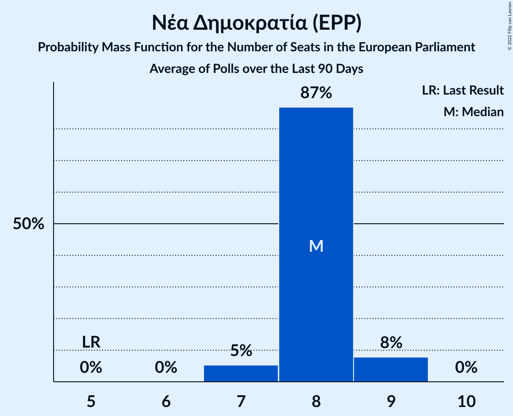

# Νέα Δημοκρατία (EPP)

<a href="#voting-intentions">Voting Intentions</a> | <a href="#seats">Seats</a>

## Voting Intentions

Last result: **0.0%** (General Election of 9 June 2024)

### Confidence Intervals

| Period     | Polling firm/Commissioner(s) | Median | 80% Confidence Interval | 90% Confidence Interval | 95% Confidence Interval | 99% Confidence Interval |
|:----------:|:----------------:|:-----------:|:-----------------------:|:-----------------------:|:-----------------------:|:-----------------------:|
| N/A | [Poll Average](average.html) | 29.3% | 26.5–31.7% | 25.8–32.2% | 25.2–32.7% | 24.1–33.6% |
| [11–16 July 2025](2025-07-16-Prorata.html) | Prorata   Newsbomb | 26.9% | 25.0–28.9% | 24.5–29.5% | 24.0–30.0% | 23.2–31.0% |
| [2–4 July 2025](2025-07-04-OpinionPoll.html) | Opinion Poll   Action 24 | 29.9% | 28.0–32.0% | 27.4–32.6% | 26.9–33.1% | 26.0–34.2% |
| [27 June–1 July 2025](2025-07-01-PulseRC.html) | Pulse RC   ΣΚΑΪ | 28.2% | 26.4–30.0% | 25.9–30.5% | 25.5–31.0% | 24.7–31.9% |
| [18–24 June 2025](2025-06-24-MetronAnalysis.html) | Metron Analysis   Mega TV | 28.5% | 26.8–30.4% | 26.3–30.9% | 25.8–31.4% | 25.0–32.3% |
| [19–23 June 2025](2025-06-23-Interview.html) | Interview   Politic.gr | 31.1% | 29.6–32.6% | 29.2–33.0% | 28.9–33.4% | 28.2–34.2% |
| [11–20 June 2025](2025-06-20-MRB.html) | MRB   Open TV | 30.2% | 28.8–31.7% | 28.3–32.2% | 28.0–32.6% | 27.3–33.3% |
| [10–14 June 2025](2025-06-14-Alco.html) | Alco   Alpha TV | 30.3% | 28.2–32.5% | 27.6–33.1% | 27.1–33.7% | 26.1–34.8% |
| [10–13 June 2025](2025-06-13-GPO.html) | GPO   Παραπολιτικά | 30.3% | 28.3–32.4% | 27.8–33.0% | 27.3–33.5% | 26.4–34.5% |
| [4–9 June 2025](2025-06-09-Interview.html) | Interview   Political | 28.4% | 26.9–29.9% | 26.5–30.3% | 26.2–30.7% | 25.5–31.4% |
| [2–5 June 2025](2025-06-05-OpinionPoll.html) | Opinion Poll   Libre | 30.6% | 28.5–32.7% | 27.9–33.3% | 27.4–33.9% | 26.4–34.9% |
| [30 May–3 June 2025](2025-06-03-GPO.html) | GPO   Star TV | 29.6% | 27.8–31.5% | 27.3–32.0% | 26.9–32.5% | 26.1–33.4% |
| [29 May–3 June 2025](2025-06-03-Alco.html) | Alco   Epikaira.gr | 29.4% | 27.5–31.5% | 26.9–32.1% | 26.4–32.6% | 25.5–33.6% |
| [26–28 May 2025](2025-05-28-MRB.html) | MRB   Open TV | 29.7% | 27.6–31.9% | 27.0–32.5% | 26.5–33.0% | 25.6–34.1% |
| [24–27 May 2025](2025-05-27-PulseRC.html) | Pulse RC   ΣΚΑΪ | 28.4% | 26.6–30.3% | 26.1–30.8% | 25.7–31.3% | 24.8–32.2% |
| [21–26 May 2025](2025-05-26-Interview.html) | Interview   Politic.gr | 28.8% | 27.4–30.3% | 27.0–30.7% | 26.7–31.0% | 26.0–31.8% |
| [19–21 May 2025](2025-05-21-OpinionPoll.html) | Opinion Poll   Action 24 | 30.3% | 28.3–32.4% | 27.8–33.0% | 27.3–33.5% | 26.4–34.5% |
| [12–15 May 2025](2025-05-15-MetronAnalysis.html) | Metron Analysis   Mega TV | 30.2% | 28.3–32.1% | 27.8–32.6% | 27.3–33.1% | 26.5–34.0% |
| [12–15 May 2025](2025-05-15-Marc.html) | Marc   Πρώτο ΘΕΜΑ | 32.6% | 30.7–34.6% | 30.1–35.1% | 29.7–35.6% | 28.8–36.6% |
| [6–11 May 2025](2025-05-11-Interview.html) | Interview   Political | 29.0% | N/A | N/A | N/A | N/A |
| [28 April–3 May 2025](2025-05-03-Alco.html) | Alco   Alpha TV | 29.4% | 27.4–31.6% | 26.8–32.2% | 26.3–32.7% | 25.3–33.8% |
| [28 April–2 May 2025](2025-05-02-OpinionPoll.html) | Opinion Poll   Action 24 | 29.9% | N/A | N/A | N/A | N/A |
| [28–30 April 2025](2025-04-30-GPO.html) | GPO   Παραπολιτικά | 28.7% | 26.8–30.7% | 26.3–31.3% | 25.8–31.8% | 24.9–32.8% |
| [25–28 April 2025](2025-04-28-PulseRC.html) | Pulse RC   ΣΚΑΪ | 28.7% | N/A | N/A | N/A | N/A |
| [24–28 April 2025](2025-04-28-Interview.html) | Interview   Politic.gr | 28.0% | N/A | N/A | N/A | N/A |
| [7–9 April 2025](2025-04-09-MRB.html) | MRB   Open TV | 26.7% | N/A | N/A | N/A | N/A |
| [2–8 April 2025](2025-04-08-MetronAnalysis.html) | Metron Analysis   Mega TV | 27.4% | N/A | N/A | N/A | N/A |
| [4–8 April 2025](2025-04-08-Interview.html) | Interview   Political | 26.4% | N/A | N/A | N/A | N/A |
| [4–7 April 2025](2025-04-07-RealPolls.html) | Real Polls   Protagon | 30.9% | 29.4–32.5% | 29.0–33.0% | 28.6–33.3% | 27.9–34.1% |
| [3–7 April 2025](2025-04-07-Prorata.html) | Prorata   Attica TV | 25.2% | 23.4–27.1% | 22.9–27.6% | 22.4–28.1% | 21.6–29.1% |
| [31 March–4 April 2025](2025-04-04-GPO.html) | GPO   Παραπολιτικά | 26.5% | N/A | N/A | N/A | N/A |
| [27 March–1 April 2025](2025-04-01-Marc.html) | Marc   ANT1 | 31.1% | N/A | N/A | N/A | N/A |
| [21–26 March 2025](2025-03-26-Interview.html) | Interview   Politic.gr | 25.0% | N/A | N/A | N/A | N/A |
| [18–19 March 2025](2025-03-19-GPO.html) | GPO   Παραπολιτικά | 26.9% | N/A | N/A | N/A | N/A |
| [16–18 March 2025](2025-03-18-PulseRC.html) | Pulse RC   ΣΚΑΪ | 27.4% | N/A | N/A | N/A | N/A |
| [14–18 March 2025](2025-03-18-OpinionPoll.html) | Opinion Poll   Action 24 | 28.2% | N/A | N/A | N/A | N/A |
| [12–18 March 2025](2025-03-18-MetronAnalysis.html) | Metron Analysis   Mega TV | 26.4% | N/A | N/A | N/A | N/A |
| [12–16 March 2025](2025-03-16-Alco.html) | Alco   Alpha TV | 27.9% | N/A | N/A | N/A | N/A |
| [10–12 March 2025](2025-03-12-Interview.html) | Interview   Politic.gr | 25.6% | N/A | N/A | N/A | N/A |
| [6–10 March 2025](2025-03-10-GPO.html) | GPO   Flash | 27.3% | N/A | N/A | N/A | N/A |
| [4–6 March 2025](2025-03-06-MRB.html) | MRB   Open TV | 26.7% | N/A | N/A | N/A | N/A |
| [1–4 March 2025](2025-03-04-GPO.html) | GPO   Star TV | 27.9% | N/A | N/A | N/A | N/A |
| [21–24 February 2025](2025-02-24-PulseRC.html) | Pulse RC   ΣΚΑΪ | 28.2% | N/A | N/A | N/A | N/A |
| [20–24 February 2025](2025-02-24-Prorata.html) | Prorata   Attica TV | 24.9% | N/A | N/A | N/A | N/A |
| [19–24 February 2025](2025-02-24-Interview.html) | Interview   Politic.gr | 27.3% | N/A | N/A | N/A | N/A |
| [12–18 February 2025](2025-02-18-MetronAnalysis.html) | Metron Analysis   Mega TV | 28.8% | N/A | N/A | N/A | N/A |
| [11–16 February 2025](2025-02-16-Alco.html) | Alco   Alpha TV | 28.7% | N/A | N/A | N/A | N/A |
| [10–14 February 2025](2025-02-14-GPO.html) | GPO   Παραπολιτικά | 28.3% | N/A | N/A | N/A | N/A |
| [30 January–4 February 2025](2025-02-04-Interview.html) | Interview   Political | 30.1% | N/A | N/A | N/A | N/A |
| [27–29 January 2025](2025-01-29-MRB.html) | MRB   Open TV | 27.9% | N/A | N/A | N/A | N/A |
| [28–29 January 2025](2025-01-29-GPO.html) | GPO   Παραπολιτικά | 29.0% | N/A | N/A | N/A | N/A |
| [20–22 January 2025](2025-01-22-GPO.html) | GPO   Star TV | 30.9% | N/A | N/A | N/A | N/A |
| [19–21 January 2025](2025-01-21-PulseRC.html) | Pulse RC   ΣΚΑΪ | 30.2% | N/A | N/A | N/A | N/A |
| [15–21 January 2025](2025-01-21-MetronAnalysis.html) | Metron Analysis   Mega TV | 29.1% | N/A | N/A | N/A | N/A |
| [14–20 January 2025](2025-01-20-Interview.html) | Interview   Politic.gr | 30.5% | N/A | N/A | N/A | N/A |
| [15–19 January 2025](2025-01-19-Alco.html) | Alco   Alpha TV | 30.1% | N/A | N/A | N/A | N/A |
| [8–10 January 2025](2025-01-10-OpinionPoll.html) | Opinion Poll   Action 24 | 30.8% | N/A | N/A | N/A | N/A |
| [7–10 January 2025](2025-01-10-Marc.html) | Marc   ANT1 | 33.2% | N/A | N/A | N/A | N/A |
| [16–23 December 2024](2024-12-23-PalmosAnalysis.html) | Palmos Analysis   Ελεύθερος Τύπος | 31.2% | N/A | N/A | N/A | N/A |
| [15–17 December 2024](2024-12-17-PulseRC.html) | Pulse RC   ΣΚΑΪ | 29.8% | N/A | N/A | N/A | N/A |
| [11–17 December 2024](2024-12-17-MetronAnalysis.html) | Metron Analysis   Mega TV | 29.2% | N/A | N/A | N/A | N/A |
| [11–16 December 2024](2024-12-16-Interview.html) | Interview   Politic.gr | 29.0% | N/A | N/A | N/A | N/A |
| [11–13 December 2024](2024-12-13-OpinionPoll.html) | Opinion Poll   Manifesto | 30.4% | N/A | N/A | N/A | N/A |
| [4–13 December 2024](2024-12-13-MRB.html) | MRB     | 28.3% | N/A | N/A | N/A | N/A |
| [9–13 December 2024](2024-12-13-GPO.html) | GPO   Παραπολιτικά | 30.3% | N/A | N/A | N/A | N/A |
| [3–9 December 2024](2024-12-09-Prorata.html) | Prorata   Attica TV | 29.1% | N/A | N/A | N/A | N/A |
| [25–28 November 2024](2024-11-28-Marc.html) | Marc   Πρώτο ΘΕΜΑ | 31.8% | N/A | N/A | N/A | N/A |
| [24–26 November 2024](2024-11-26-PulseRC.html) | Pulse RC   ΣΚΑΪ | 29.3% | N/A | N/A | N/A | N/A |
| [20–26 November 2024](2024-11-26-MetronAnalysis.html) | Metron Analysis   Mega TV | 28.2% | N/A | N/A | N/A | N/A |
| [21–25 November 2024](2024-11-25-Interview.html) | Interview   Politic.gr | 29.4% | N/A | N/A | N/A | N/A |
| [18–22 November 2024](2024-11-22-GPO.html) | GPO   Παραπολιτικά | 30.6% | N/A | N/A | N/A | N/A |
| [11–15 November 2024](2024-11-15-GPO.html) | GPO   Παραπολιτικά | 31.6% | N/A | N/A | N/A | N/A |
| [7–12 November 2024](2024-11-12-OpinionPoll.html) | Opinion Poll   Action 24 | 29.8% | N/A | N/A | N/A | N/A |
| [22–26 October 2024](2024-10-26-Marc.html) | Marc   ANT1 | 32.1% | N/A | N/A | N/A | N/A |
| [21–23 October 2024](2024-10-23-MRB.html) | MRB   Open TV | 28.1% | N/A | N/A | N/A | N/A |
| [16–22 October 2024](2024-10-22-MetronAnalysis.html) | Metron Analysis   Mega TV | 29.0% | N/A | N/A | N/A | N/A |
| [16–21 October 2024](2024-10-21-Interview.html) | Interview   Politic.gr | 29.2% | N/A | N/A | N/A | N/A |
| [15–19 October 2024](2024-10-19-Alco.html) | Alco   Alpha TV | 29.5% | N/A | N/A | N/A | N/A |
| [14–16 October 2024](2024-10-16-GPO.html) | GPO   Star TV | 32.7% | N/A | N/A | N/A | N/A |
| [26 September–2 October 2024](2024-10-02-MetronAnalysis.html) | Metron Analysis   Mega TV | 29.1% | N/A | N/A | N/A | N/A |
| [30 September–2 October 2024](2024-10-02-MRB.html) | MRB   Open TV | 28.4% | N/A | N/A | N/A | N/A |
| [29 September–1 October 2024](2024-10-01-PulseRC.html) | Pulse RC   ΣΚΑΪ | 29.5% | N/A | N/A | N/A | N/A |
| [24–28 September 2024](2024-09-28-PalmosAnalysis.html) | Palmos Analysis   Tvxs.gr | 29.2% | N/A | N/A | N/A | N/A |
| [24–27 September 2024](2024-09-27-OpinionPoll.html) | Opinion Poll   Action 24 | 32.2% | N/A | N/A | N/A | N/A |
| [13–23 September 2024](2024-09-23-MetronAnalysis.html) | Metron Analysis   Mega TV | 30.2% | N/A | N/A | N/A | N/A |
| [19–23 September 2024](2024-09-23-Interview.html) | Interview   Politic.gr | 28.0% | N/A | N/A | N/A | N/A |
| [16–21 September 2024](2024-09-21-Prorata.html) | Prorata   Attica TV | 27.3% | N/A | N/A | N/A | N/A |
| [13–18 September 2024](2024-09-18-MRB.html) | MRB   Open TV | 28.0% | N/A | N/A | N/A | N/A |
| [13–16 September 2024](2024-09-16-PulseRC.html) | Pulse RC   ΣΚΑΪ | 29.6% | N/A | N/A | N/A | N/A |
| [9–14 September 2024](2024-09-14-Alco.html) | Alco   Alpha TV | 28.7% | N/A | N/A | N/A | N/A |
| [2–11 September 2024](2024-09-11-DataRC.html) | Data RC   Peloponnisos | 30.1% | N/A | N/A | N/A | N/A |
| [4–10 September 2024](2024-09-10-MetronAnalysis.html) | Metron Analysis   Mega TV | 29.6% | N/A | N/A | N/A | N/A |
| [8–10 September 2024](2024-09-10-GPO.html) | GPO   Star TV | 33.9% | N/A | N/A | N/A | N/A |
| [2–6 September 2024](2024-09-06-Interview.html) | Interview   Political | 27.2% | N/A | N/A | N/A | N/A |
| [27–30 August 2024](2024-08-30-OpinionPoll.html) | Opinion Poll   Action 24 | 31.1% | N/A | N/A | N/A | N/A |
| [26–30 August 2024](2024-08-30-MRB.html) | MRB   Open TV | 27.7% | N/A | N/A | N/A | N/A |
| [21–26 August 2024](2024-08-26-Interview.html) | Interview   Politic.gr | 26.5% | N/A | N/A | N/A | N/A |
| [27 June–4 July 2024](2024-07-04-MRB.html) | MRB | 29.7% | N/A | N/A | N/A | N/A |
| [21 June–1 July 2024](2024-07-01-MetronAnalysis.html) | Metron Analysis   Mega TV | 30.4% | N/A | N/A | N/A | N/A |
| [25–28 June 2024](2024-06-28-ΚάπαResearch.html) | Κάπα Research | 34.5% | N/A | N/A | N/A | N/A |
| [17–19 June 2024](2024-06-19-GPO.html) | GPO   Star TV | 33.9% | N/A | N/A | N/A | N/A |

### Probability Mass Function

The following table shows the probability mass function per percentage block of voting intentions for the [poll average](average.html) for Νέα Δημοκρατία (EPP).

| Voting Intentions | Probability | Accumulated | Special Marks |
|:-----------------:|:-----------:|:-----------:|:-------------:|
| 0.0–0.5% | 0% | 100% | Last Result |
| 0.5–1.5% | 0% | 100% |  |
| 1.5–2.5% | 0% | 100% |  |
| 2.5–3.5% | 0% | 100% |  |
| 3.5–4.5% | 0% | 100% |  |
| 4.5–5.5% | 0% | 100% |  |
| 5.5–6.5% | 0% | 100% |  |
| 6.5–7.5% | 0% | 100% |  |
| 7.5–8.5% | 0% | 100% |  |
| 8.5–9.5% | 0% | 100% |  |
| 9.5–10.5% | 0% | 100% |  |
| 10.5–11.5% | 0% | 100% |  |
| 11.5–12.5% | 0% | 100% |  |
| 12.5–13.5% | 0% | 100% |  |
| 13.5–14.5% | 0% | 100% |  |
| 14.5–15.5% | 0% | 100% |  |
| 15.5–16.5% | 0% | 100% |  |
| 16.5–17.5% | 0% | 100% |  |
| 17.5–18.5% | 0% | 100% |  |
| 18.5–19.5% | 0% | 100% |  |
| 19.5–20.5% | 0% | 100% |  |
| 20.5–21.5% | 0% | 100% |  |
| 21.5–22.5% | 0% | 100% |  |
| 22.5–23.5% | 0.2% | 100% |  |
| 23.5–24.5% | 0.8% | 99.8% |  |
| 24.5–25.5% | 3% | 99.0% |  |
| 25.5–26.5% | 6% | 96% |  |
| 26.5–27.5% | 11% | 90% |  |
| 27.5–28.5% | 15% | 78% |  |
| 28.5–29.5% | 18% | 63% | Median |
| 29.5–30.5% | 18% | 45% |  |
| 30.5–31.5% | 15% | 26% |  |
| 31.5–32.5% | 8% | 11% |  |
| 32.5–33.5% | 3% | 3% |  |
| 33.5–34.5% | 0.5% | 0.6% |  |
| 34.5–35.5% | 0.1% | 0.1% |  |
| 35.5–36.5% | 0% | 0% |  |

## Seats

Last result: **0** seats (General Election of 9 June 2024)

### Confidence Intervals

| Period     | Polling firm/Commissioner(s) | Median | 80% Confidence Interval | 90% Confidence Interval | 95% Confidence Interval | 99% Confidence Interval |
|:----------:|:----------------:|:------:|:-----------------------:|:-----------------------:|:-----------------------:|:-----------------------:|
| N/A | [Poll Average](average.html) | 6 | 6–7 | 6–7 | 6–7 | 5–7 |
| [11–16 July 2025](2025-07-16-Prorata.html) | Prorata   Newsbomb | 6 | 6 | 6 | 5–6 | 5–7 |
| [2–4 July 2025](2025-07-04-OpinionPoll.html) | Opinion Poll   Action 24 | 6 | 6–7 | 6–7 | 6–7 | 6–8 |
| [27 June–1 July 2025](2025-07-01-PulseRC.html) | Pulse RC   ΣΚΑΪ | 6 | 6 | 6–7 | 6–7 | 5–7 |
| [18–24 June 2025](2025-06-24-MetronAnalysis.html) | Metron Analysis   Mega TV | 6 | 6–7 | 6–7 | 6–7 | 5–7 |
| [19–23 June 2025](2025-06-23-Interview.html) | Interview   Politic.gr | 7 | 6–7 | 6–7 | 6–7 | 6–7 |
| [11–20 June 2025](2025-06-20-MRB.html) | MRB   Open TV | 7 | 6–7 | 6–7 | 6–7 | 6–7 |
| [10–14 June 2025](2025-06-14-Alco.html) | Alco   Alpha TV | 7 | 6–7 | 6–7 | 6–7 | 6–8 |
| [10–13 June 2025](2025-06-13-GPO.html) | GPO   Παραπολιτικά | 7 | 6–7 | 6–7 | 6–7 | 6–8 |
| [4–9 June 2025](2025-06-09-Interview.html) | Interview   Political | 6 | 6–7 | 6–7 | 6–7 | 6–7 |
| [2–5 June 2025](2025-06-05-OpinionPoll.html) | Opinion Poll   Libre | 7 | 6–7 | 6–7 | 6–7 | 6–8 |
| [30 May–3 June 2025](2025-06-03-GPO.html) | GPO   Star TV | 7 | 6–7 | 6–7 | 6–7 | 6–8 |
| [29 May–3 June 2025](2025-06-03-Alco.html) | Alco   Epikaira.gr | 6 | 6–7 | 6–7 | 6–7 | 5–7 |
| [26–28 May 2025](2025-05-28-MRB.html) | MRB   Open TV | 6 | 6–7 | 6–7 | 6–7 | 5–8 |
| [24–27 May 2025](2025-05-27-PulseRC.html) | Pulse RC   ΣΚΑΪ | 6 | 6–7 | 6–7 | 6–7 | 5–7 |
| [21–26 May 2025](2025-05-26-Interview.html) | Interview   Politic.gr | 6 | 6–7 | 6–7 | 6–7 | 6–7 |
| [19–21 May 2025](2025-05-21-OpinionPoll.html) | Opinion Poll   Action 24 | 7 | 6–7 | 6–7 | 6–7 | 6–8 |
| [12–15 May 2025](2025-05-15-MetronAnalysis.html) | Metron Analysis   Mega TV | 7 | 6–7 | 6–7 | 6–7 | 6–8 |
| [12–15 May 2025](2025-05-15-Marc.html) | Marc   Πρώτο ΘΕΜΑ | 7 | 7–8 | 6–8 | 6–8 | 6–8 |
| [6–11 May 2025](2025-05-11-Interview.html) | Interview   Political |  |  |  |  |  |
| [28 April–3 May 2025](2025-05-03-Alco.html) | Alco   Alpha TV | 6 | 6–7 | 6–7 | 6–7 | 5–7 |
| [28 April–2 May 2025](2025-05-02-OpinionPoll.html) | Opinion Poll   Action 24 |  |  |  |  |  |
| [28–30 April 2025](2025-04-30-GPO.html) | GPO   Παραπολιτικά | 6 | 6–7 | 6–7 | 6–7 | 5–7 |
| [25–28 April 2025](2025-04-28-PulseRC.html) | Pulse RC   ΣΚΑΪ |  |  |  |  |  |
| [24–28 April 2025](2025-04-28-Interview.html) | Interview   Politic.gr |  |  |  |  |  |
| [7–9 April 2025](2025-04-09-MRB.html) | MRB   Open TV |  |  |  |  |  |
| [2–8 April 2025](2025-04-08-MetronAnalysis.html) | Metron Analysis   Mega TV |  |  |  |  |  |
| [4–8 April 2025](2025-04-08-Interview.html) | Interview   Political |  |  |  |  |  |
| [4–7 April 2025](2025-04-07-RealPolls.html) | Real Polls   Protagon | 7 | 6–7 | 6–7 | 6–7 | 6–7 |
| [3–7 April 2025](2025-04-07-Prorata.html) | Prorata   Attica TV | 6 | 5–6 | 5–6 | 5–6 | 5–6 |
| [31 March–4 April 2025](2025-04-04-GPO.html) | GPO   Παραπολιτικά |  |  |  |  |  |
| [27 March–1 April 2025](2025-04-01-Marc.html) | Marc   ANT1 |  |  |  |  |  |
| [21–26 March 2025](2025-03-26-Interview.html) | Interview   Politic.gr |  |  |  |  |  |
| [18–19 March 2025](2025-03-19-GPO.html) | GPO   Παραπολιτικά |  |  |  |  |  |
| [16–18 March 2025](2025-03-18-PulseRC.html) | Pulse RC   ΣΚΑΪ |  |  |  |  |  |
| [14–18 March 2025](2025-03-18-OpinionPoll.html) | Opinion Poll   Action 24 |  |  |  |  |  |
| [12–18 March 2025](2025-03-18-MetronAnalysis.html) | Metron Analysis   Mega TV |  |  |  |  |  |
| [12–16 March 2025](2025-03-16-Alco.html) | Alco   Alpha TV |  |  |  |  |  |
| [10–12 March 2025](2025-03-12-Interview.html) | Interview   Politic.gr |  |  |  |  |  |
| [6–10 March 2025](2025-03-10-GPO.html) | GPO   Flash |  |  |  |  |  |
| [4–6 March 2025](2025-03-06-MRB.html) | MRB   Open TV |  |  |  |  |  |
| [1–4 March 2025](2025-03-04-GPO.html) | GPO   Star TV |  |  |  |  |  |
| [21–24 February 2025](2025-02-24-PulseRC.html) | Pulse RC   ΣΚΑΪ |  |  |  |  |  |
| [20–24 February 2025](2025-02-24-Prorata.html) | Prorata   Attica TV |  |  |  |  |  |
| [19–24 February 2025](2025-02-24-Interview.html) | Interview   Politic.gr |  |  |  |  |  |
| [12–18 February 2025](2025-02-18-MetronAnalysis.html) | Metron Analysis   Mega TV |  |  |  |  |  |
| [11–16 February 2025](2025-02-16-Alco.html) | Alco   Alpha TV |  |  |  |  |  |
| [10–14 February 2025](2025-02-14-GPO.html) | GPO   Παραπολιτικά |  |  |  |  |  |
| [30 January–4 February 2025](2025-02-04-Interview.html) | Interview   Political |  |  |  |  |  |
| [27–29 January 2025](2025-01-29-MRB.html) | MRB   Open TV |  |  |  |  |  |
| [28–29 January 2025](2025-01-29-GPO.html) | GPO   Παραπολιτικά |  |  |  |  |  |
| [20–22 January 2025](2025-01-22-GPO.html) | GPO   Star TV |  |  |  |  |  |
| [19–21 January 2025](2025-01-21-PulseRC.html) | Pulse RC   ΣΚΑΪ |  |  |  |  |  |
| [15–21 January 2025](2025-01-21-MetronAnalysis.html) | Metron Analysis   Mega TV |  |  |  |  |  |
| [14–20 January 2025](2025-01-20-Interview.html) | Interview   Politic.gr |  |  |  |  |  |
| [15–19 January 2025](2025-01-19-Alco.html) | Alco   Alpha TV |  |  |  |  |  |
| [8–10 January 2025](2025-01-10-OpinionPoll.html) | Opinion Poll   Action 24 |  |  |  |  |  |
| [7–10 January 2025](2025-01-10-Marc.html) | Marc   ANT1 |  |  |  |  |  |
| [16–23 December 2024](2024-12-23-PalmosAnalysis.html) | Palmos Analysis   Ελεύθερος Τύπος |  |  |  |  |  |
| [15–17 December 2024](2024-12-17-PulseRC.html) | Pulse RC   ΣΚΑΪ |  |  |  |  |  |
| [11–17 December 2024](2024-12-17-MetronAnalysis.html) | Metron Analysis   Mega TV |  |  |  |  |  |
| [11–16 December 2024](2024-12-16-Interview.html) | Interview   Politic.gr |  |  |  |  |  |
| [11–13 December 2024](2024-12-13-OpinionPoll.html) | Opinion Poll   Manifesto |  |  |  |  |  |
| [4–13 December 2024](2024-12-13-MRB.html) | MRB     |  |  |  |  |  |
| [9–13 December 2024](2024-12-13-GPO.html) | GPO   Παραπολιτικά |  |  |  |  |  |
| [3–9 December 2024](2024-12-09-Prorata.html) | Prorata   Attica TV |  |  |  |  |  |
| [25–28 November 2024](2024-11-28-Marc.html) | Marc   Πρώτο ΘΕΜΑ |  |  |  |  |  |
| [24–26 November 2024](2024-11-26-PulseRC.html) | Pulse RC   ΣΚΑΪ |  |  |  |  |  |
| [20–26 November 2024](2024-11-26-MetronAnalysis.html) | Metron Analysis   Mega TV |  |  |  |  |  |
| [21–25 November 2024](2024-11-25-Interview.html) | Interview   Politic.gr |  |  |  |  |  |
| [18–22 November 2024](2024-11-22-GPO.html) | GPO   Παραπολιτικά |  |  |  |  |  |
| [11–15 November 2024](2024-11-15-GPO.html) | GPO   Παραπολιτικά |  |  |  |  |  |
| [7–12 November 2024](2024-11-12-OpinionPoll.html) | Opinion Poll   Action 24 |  |  |  |  |  |
| [22–26 October 2024](2024-10-26-Marc.html) | Marc   ANT1 |  |  |  |  |  |
| [21–23 October 2024](2024-10-23-MRB.html) | MRB   Open TV |  |  |  |  |  |
| [16–22 October 2024](2024-10-22-MetronAnalysis.html) | Metron Analysis   Mega TV |  |  |  |  |  |
| [16–21 October 2024](2024-10-21-Interview.html) | Interview   Politic.gr |  |  |  |  |  |
| [15–19 October 2024](2024-10-19-Alco.html) | Alco   Alpha TV |  |  |  |  |  |
| [14–16 October 2024](2024-10-16-GPO.html) | GPO   Star TV |  |  |  |  |  |
| [26 September–2 October 2024](2024-10-02-MetronAnalysis.html) | Metron Analysis   Mega TV |  |  |  |  |  |
| [30 September–2 October 2024](2024-10-02-MRB.html) | MRB   Open TV |  |  |  |  |  |
| [29 September–1 October 2024](2024-10-01-PulseRC.html) | Pulse RC   ΣΚΑΪ |  |  |  |  |  |
| [24–28 September 2024](2024-09-28-PalmosAnalysis.html) | Palmos Analysis   Tvxs.gr |  |  |  |  |  |
| [24–27 September 2024](2024-09-27-OpinionPoll.html) | Opinion Poll   Action 24 |  |  |  |  |  |
| [13–23 September 2024](2024-09-23-MetronAnalysis.html) | Metron Analysis   Mega TV |  |  |  |  |  |
| [19–23 September 2024](2024-09-23-Interview.html) | Interview   Politic.gr |  |  |  |  |  |
| [16–21 September 2024](2024-09-21-Prorata.html) | Prorata   Attica TV |  |  |  |  |  |
| [13–18 September 2024](2024-09-18-MRB.html) | MRB   Open TV |  |  |  |  |  |
| [13–16 September 2024](2024-09-16-PulseRC.html) | Pulse RC   ΣΚΑΪ |  |  |  |  |  |
| [9–14 September 2024](2024-09-14-Alco.html) | Alco   Alpha TV |  |  |  |  |  |
| [2–11 September 2024](2024-09-11-DataRC.html) | Data RC   Peloponnisos |  |  |  |  |  |
| [4–10 September 2024](2024-09-10-MetronAnalysis.html) | Metron Analysis   Mega TV |  |  |  |  |  |
| [8–10 September 2024](2024-09-10-GPO.html) | GPO   Star TV |  |  |  |  |  |
| [2–6 September 2024](2024-09-06-Interview.html) | Interview   Political |  |  |  |  |  |
| [27–30 August 2024](2024-08-30-OpinionPoll.html) | Opinion Poll   Action 24 |  |  |  |  |  |
| [26–30 August 2024](2024-08-30-MRB.html) | MRB   Open TV |  |  |  |  |  |
| [21–26 August 2024](2024-08-26-Interview.html) | Interview   Politic.gr |  |  |  |  |  |
| [27 June–4 July 2024](2024-07-04-MRB.html) | MRB |  |  |  |  |  |
| [21 June–1 July 2024](2024-07-01-MetronAnalysis.html) | Metron Analysis   Mega TV |  |  |  |  |  |
| [25–28 June 2024](2024-06-28-ΚάπαResearch.html) | Κάπα Research |  |  |  |  |  |
| [17–19 June 2024](2024-06-19-GPO.html) | GPO   Star TV |  |  |  |  |  |

### Probability Mass Function

The following table shows the probability mass function per seat for the [poll average](average.html) for Νέα Δημοκρατία (EPP).

| Number of Seats | Probability | Accumulated | Special Marks |
|:---------------:|:-----------:|:-----------:|:-------------:|
| 0 | 0% | 100% | Last Result |
| 1 | 0% | 100% |  |
| 2 | 0% | 100% |  |
| 3 | 0% | 100% |  |
| 4 | 0% | 100% |  |
| 5 | 1.1% | 100% |  |
| 6 | 61% | 98.9% | Median |
| 7 | 38% | 38% |  |
| 8 | 0.4% | 0.4% |  |
| 9 | 0% | 0% |  |

