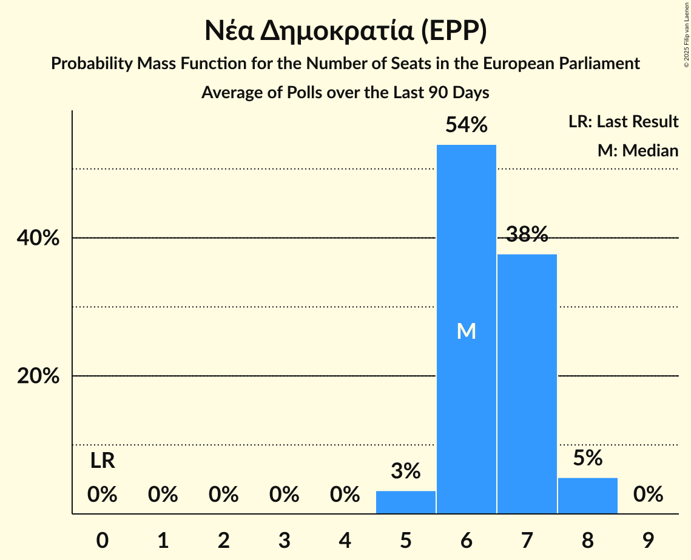

# Νέα Δημοκρατία (EPP)

<a href="#voting-intentions">Voting Intentions</a> | <a href="#seats">Seats</a>

## Voting Intentions

Last result: **22.7%** (General Election of 26 May 2019)

### Confidence Intervals

| Period     | Polling firm/Commissioner(s) | Median | 80% Confidence Interval | 90% Confidence Interval | 95% Confidence Interval | 99% Confidence Interval |
|:----------:|:----------------:|:-----------:|:-----------------------:|:-----------------------:|:-----------------------:|:-----------------------:|
| N/A | [Poll Average](average.html) | 32.5% | 30.0–35.2% | 29.4–35.9% | 28.8–36.5% | 27.9–37.6% |
| [27–30 May 2024](2024-05-30-PulseRC.html) | Pulse RC   ΣΚΑΪ | 32.6% | 30.8–34.5% | 30.2–35.0% | 29.8–35.5% | 28.9–36.4% |
| [27–30 May 2024](2024-05-30-Marc.html) | Marc   ANT1 | 34.7% | 32.8–36.6% | 32.3–37.1% | 31.8–37.6% | 31.0–38.5% |
| [27–29 May 2024](2024-05-29-GPO.html) | GPO   Star TV | 33.2% | 31.4–35.1% | 30.8–35.6% | 30.4–36.1% | 29.6–37.0% |
| [22–28 May 2024](2024-05-28-Prorata.html) | Prorata | 31.0% | 29.2–32.9% | 28.7–33.5% | 28.2–33.9% | 27.3–34.9% |
| [20–24 May 2024](2024-05-24-MetronAnalysis.html) | Metron Analysis   Mega TV | 31.1% | 29.3–32.9% | 28.8–33.5% | 28.4–33.9% | 27.5–34.8% |
| [13–22 May 2024](2024-05-22-GPO.html) | GPO   Παραπολιτικά | 33.4% | 32.2–34.6% | 31.9–34.9% | 31.6–35.3% | 31.0–35.8% |
| [15–16 May 2024](2024-05-16-OpinionPoll.html) | Opinion Poll   Action 24 | 33.3% | 31.3–35.3% | 30.7–35.9% | 30.2–36.4% | 29.3–37.4% |
| [13–16 May 2024](2024-05-16-GPO.html) | GPO   Παραπολιτικά | 33.3% | N/A | N/A | N/A | N/A |
| [13–15 May 2024](2024-05-15-PulseRC.html) | Pulse RC   ΣΚΑΪ | 33.1% | 31.2–35.1% | 30.7–35.7% | 30.2–36.2% | 29.3–37.1% |
| [10–15 May 2024](2024-05-15-Marc.html) | Marc   ANT1 | 35.5% | 33.6–37.4% | 33.1–38.0% | 32.6–38.5% | 31.8–39.4% |
| [13–15 May 2024](2024-05-15-Alco.html) | Alco   Alpha TV | 32.1% | 29.9–34.3% | 29.3–34.9% | 28.8–35.5% | 27.8–36.5% |
| [10–14 May 2024](2024-05-14-MRB.html) | MRB   Open TV | 32.3% | 30.3–34.3% | 29.8–34.9% | 29.3–35.4% | 28.4–36.4% |
| [8–13 May 2024](2024-05-13-Interview.html) | Interview   Politic.gr | 33.3% | 32.0–34.6% | 31.7–35.0% | 31.4–35.3% | 30.7–36.0% |
| [18–25 April 2024](2024-04-25-Marc.html) | Marc   Πρώτο ΘΕΜΑ | 35.7% | 33.7–37.8% | 33.1–38.3% | 32.6–38.9% | 31.6–39.9% |
| [20–22 April 2024](2024-04-22-OpinionPoll.html) | Opinion Poll   Action 24 | 32.6% | 30.6–34.7% | 30.0–35.3% | 29.5–35.8% | 28.6–36.8% |
| [17–22 April 2024](2024-04-22-GPO.html) | GPO   Παραπολιτικά | 34.3% | 32.6–36.1% | 32.1–36.7% | 31.6–37.1% | 30.8–38.0% |
| [10–16 April 2024](2024-04-16-MetronAnalysis.html) | Metron Analysis   Mega TV | 33.2% | 31.4–35.1% | 30.9–35.7% | 30.4–36.1% | 29.6–37.0% |
| [5–10 April 2024](2024-04-10-Prorata.html) | Prorata   Attica TV | 30.0% | 28.0–32.1% | 27.5–32.7% | 27.0–33.2% | 26.1–34.2% |
| [8–10 April 2024](2024-04-10-OpinionPoll.html) | Opinion Poll   Action 24 | 33.0% | 31.0–35.2% | 30.4–35.8% | 29.9–36.4% | 28.9–37.4% |
| [4–8 April 2024](2024-04-08-Interview.html) | Interview   Politic.gr | 28.0% | 26.8–29.3% | 26.5–29.7% | 26.2–30.0% | 25.6–30.6% |
| [2–5 April 2024](2024-04-05-Alco.html) | Alco   Alpha TV | 30.8% | 28.7–33.0% | 28.1–33.6% | 27.6–34.1% | 26.6–35.2% |
| [1–4 April 2024](2024-04-04-PalmosAnalysis.html) | Palmos Analysis   Ελεύθερος Τύπος | 32.9% | 31.0–34.9% | 30.5–35.5% | 30.0–35.9% | 29.1–36.9% |
| [1–3 April 2024](2024-04-03-PulseRC.html) | Pulse RC   ΣΚΑΪ | 34.0% | 32.2–35.9% | 31.7–36.5% | 31.3–36.9% | 30.4–37.9% |
| [1–3 April 2024](2024-04-03-GPO.html) | GPO   Παραπολιτικά | 34.2% | 32.1–36.4% | 31.5–37.0% | 31.0–37.5% | 30.0–38.6% |
| [15–20 March 2024](2024-03-20-OpinionPoll.html) | Opinion Poll   Action 24 | 35.2% | 33.0–37.5% | 32.4–38.2% | 31.9–38.7% | 30.8–39.9% |
| [12–19 March 2024](2024-03-19-MetronAnalysis.html) | Metron Analysis   Mega TV | 32.0% | 30.2–34.0% | 29.7–34.5% | 29.2–35.0% | 28.4–35.9% |
| [11–16 March 2024](2024-03-16-Marc.html) | Marc   Πρώτο ΘΕΜΑ | 37.1% | 35.0–39.3% | 34.4–39.9% | 33.9–40.4% | 33.0–41.4% |
| [11–13 March 2024](2024-03-13-GPO.html) | GPO   Star TV | 35.8% | 33.8–37.8% | 33.3–38.4% | 32.8–38.9% | 31.9–39.8% |
| [7–11 March 2024](2024-03-11-Interview.html) | Interview   Politic.gr | 29.6% | 28.3–31.0% | 27.9–31.4% | 27.6–31.7% | 27.0–32.4% |
| [1–6 March 2024](2024-03-06-Alco.html) | Alco   Alpha TV | 33.9% | 31.7–36.2% | 31.0–36.9% | 30.5–37.4% | 29.5–38.6% |
| [23 February–5 March 2024](2024-03-05-Ipsos.html) | Ipsos   Euronews | 36.0% | 34.1–38.1% | 33.5–38.6% | 33.1–39.1% | 32.2–40.1% |
| [1 April–3 March 2024](2024-03-03-MRB.html) | MRB   Open TV | 32.2% | 30.3–34.1% | 29.8–34.7% | 29.3–35.2% | 28.4–36.1% |
| [26–29 February 2024](2024-02-29-GPO.html) | GPO   Παραπολιτικά | 37.2% | 34.3–38.7% | 33.7–39.3% | 33.1–39.9% | 32.1–41.0% |
| [26–27 February 2024](2024-02-27-OpinionPoll.html) | Opinion Poll   Action 24 | 34.8% | 32.1–35.7% | 31.6–36.3% | 31.1–36.7% | 30.3–37.6% |
| [21–27 February 2024](2024-02-27-MRB.html) | MRB   Open TV | 37.2% | 34.6–37.8% | 34.2–38.3% | 33.8–38.7% | 33.1–39.4% |
| [13–16 February 2024](2024-02-16-OpinionPoll.html) | Opinion Poll   Action 24 | 35.3% | 32.2–36.5% | 31.6–37.1% | 31.1–37.7% | 30.1–38.7% |
| [6–12 February 2024](2024-02-12-Interview.html) | Interview   Politic.gr | 31.7% | 29.6–32.4% | 29.2–32.8% | 28.9–33.2% | 28.3–33.8% |
| [1–7 February 2024](2024-02-07-Alco.html) | Alco   Alpha TV | 35.7% | 32.7–36.8% | 32.1–37.4% | 31.7–37.9% | 30.7–38.9% |
| [22–24 January 2024](2024-01-24-MRB.html) | MRB   Open TV | 37.2% | 33.9–38.4% | 33.3–39.1% | 32.8–39.6% | 31.7–40.8% |
| [22–24 January 2024](2024-01-24-GPO.html) | GPO   Star TV | 39.7% | 36.8–40.9% | 36.2–41.5% | 35.7–42.0% | 34.8–43.0% |
| [17–23 January 2024](2024-01-23-Marc.html) | Marc   ΑΝΤ1 | 38.3% | 35.0–39.2% | 34.4–39.8% | 33.9–40.3% | 33.0–41.4% |
| [8–15 January 2024](2024-01-15-Marc.html) | Marc   ΑΝΤ1 | 38.3% | 35.0–39.2% | 34.4–39.8% | 33.9–40.3% | 33.0–41.4% |
| [10–15 January 2024](2024-01-15-Interview.html) | Interview   Politic.gr | 32.3% | 30.2–32.8% | 29.8–33.2% | 29.5–33.5% | 28.9–34.2% |
| [9–11 January 2024](2024-01-11-GPO.html) | GPO   Παραπολιτικά | 40.7% | 37.6–42.1% | 36.9–42.8% | 36.4–43.3% | 35.3–44.4% |
| [5–9 January 2024](2024-01-09-Prorata.html) | Prorata   Attica TV | 38.0% | 34.5–38.8% | 33.9–39.4% | 33.3–39.9% | 32.4–41.0% |
| [2–5 January 2024](2024-01-05-Alco.html) | Alco   Alpha TV | 36.5% | 33.2–37.6% | 32.6–38.2% | 32.1–38.7% | 31.0–39.8% |
| [4–8 December 2023](2023-12-08-Interview.html) | Interview   Politic.gr | 34.8% | 32.7–35.4% | 32.3–35.8% | 31.9–36.1% | 31.3–36.7% |
| [5–7 December 2023](2023-12-07-GPO.html) | GPO   Παραπολιτικά | 43.2% | 39.4–44.0% | 38.8–44.7% | 38.2–45.3% | 37.2–46.4% |
| [26–30 October 2023](2023-10-30-PulseRC.html) | Pulse RC   ΣΚΑΪ | 39.9% | 36.7–40.4% | 36.2–40.9% | 35.8–41.4% | 34.9–42.2% |
| [18–24 October 2023](2023-10-24-MetronAnalysis.html) | Metron Analysis   Mega TV | 39.1% | 36.3–39.8% | 35.8–40.3% | 35.4–40.7% | 34.6–41.5% |
| [23–24 October 2023](2023-10-24-GPO.html) | GPO   Star TV | 43.4% | 39.8–43.6% | 39.2–44.1% | 38.7–44.6% | 37.8–45.5% |
| [27 September–2 October 2023](2023-10-02-Prorata.html) | Prorata   Attica TV | 40.1% | 36.5–40.5% | 36.0–41.1% | 35.5–41.6% | 34.6–42.5% |
| [25–28 September 2023](2023-09-28-MRB.html) | MRB   Open TV | 39.3% | 36.1–39.9% | 35.6–40.5% | 35.1–41.0% | 34.2–41.9% |
| [25–28 September 2023](2023-09-28-Alco.html) | Alco   Alpha TV | 39.2% | 35.3–39.2% | 34.7–39.8% | 34.2–40.3% | 33.3–41.2% |
| [25–27 September 2023](2023-09-27-PulseRC.html) | Pulse RC   ΣΚΑΪ | 39.5% | 36.1–39.6% | 35.6–40.1% | 35.2–40.5% | 34.4–41.3% |
| [25–27 September 2023](2023-09-27-GPO.html) | GPO   Απογευματινή | 45.6% | 42.5–46.3% | 42.0–46.8% | 41.5–47.3% | 40.6–48.2% |
| [21–26 September 2023](2023-09-26-OpinionPoll.html) | Opinion Poll   Action 24 | 40.6% | 37.4–41.0% | 36.9–41.5% | 36.4–41.9% | 35.6–42.8% |
| [21–26 September 2023](2023-09-26-MetronAnalysis.html) | Metron Analysis   Mega TV | 37.8% | 34.5–38.4% | 34.0–39.0% | 33.5–39.4% | 32.6–40.4% |
| [21–23 June 2023](2023-06-23-MetronAnalysis.html) | Metron Analysis | 43.2% | 39.6–43.3% | 39.1–43.8% | 38.7–44.2% | 37.8–45.1% |
| [22–23 June 2023](2023-06-23-GPO.html) | GPO   Παραπολιτικά | 45.1% | 41.8–45.8% | 41.2–46.4% | 40.7–46.9% | 39.8–47.9% |
| [19–22 June 2023](2023-06-22-Rass.html) | Rass   iefimerida | 44.1% | 41.0–45.0% | 40.4–45.6% | 39.9–46.1% | 39.0–47.1% |
| [20–22 June 2023](2023-06-22-PulseRC.html) | Pulse RC   ΣΚΑΪ | 41.8% | 38.6–42.5% | 38.0–43.1% | 37.6–43.6% | 36.6–44.6% |
| [19–22 June 2023](2023-06-22-PalmosAnalysis.html) | Palmos Analysis   Tvxs.gr | 43.1% | 39.9–43.8% | 39.3–44.4% | 38.9–44.9% | 37.9–45.9% |
| [20–22 June 2023](2023-06-22-Marc.html) | Marc   ΑΝΤ1 | 43.4% | 40.6–43.9% | 40.1–44.4% | 39.8–44.7% | 39.0–45.5% |
| [20–22 June 2023](2023-06-22-MRB.html) | MRB   Open TV | 41.9% | 38.5–42.5% | 38.0–43.1% | 37.5–43.6% | 36.6–44.6% |
| [18–22 June 2023](2023-06-22-GPO.html) | GPO   Star TV | 45.0% | N/A | N/A | N/A | N/A |
| [15–21 June 2023](2023-06-21-MetronAnalysis.html) | Metron Analysis   Mega TV | 41.2% | N/A | N/A | N/A | N/A |
| [16–21 June 2023](2023-06-21-Alco.html) | Alco   Alpha TV | 43.1% | 40.5–43.9% | 40.0–44.4% | 39.6–44.8% | 38.8–45.6% |
| [18–20 June 2023](2023-06-20-PulseRC.html) | Pulse RC   ΣΚΑΪ | 41.6% | N/A | N/A | N/A | N/A |
| [15–19 June 2023](2023-06-19-MRB.html) | MRB   Newsbomb | 42.1% | 39.0–43.0% | 38.5–43.6% | 38.0–44.1% | 37.1–45.1% |
| [16–19 June 2023](2023-06-19-Interview.html) | Interview   Politic.gr | 42.1% | 40.7–43.5% | 40.3–43.9% | 39.9–44.3% | 39.3–45.0% |
| [9–15 June 2023](2023-06-15-MetronAnalysis.html) | Metron Analysis   Το Βήμα | 41.3% | 38.8–42.5% | 38.3–43.0% | 37.9–43.4% | 37.0–44.3% |
| [12–15 June 2023](2023-06-15-Marc.html) | Marc   Πρώτο ΘΕΜΑ | 43.7% | 41.2–44.2% | 40.8–44.6% | 40.5–45.0% | 39.8–45.7% |
| [12–14 June 2023](2023-06-14-OpinionPoll.html) | Opinion Poll   The TOC | 42.0% | 39.4–43.4% | 38.8–44.0% | 38.3–44.4% | 37.4–45.4% |
| [12–14 June 2023](2023-06-14-GPO.html) | GPO   Παραπολιτικά | 45.5% | 42.5–46.5% | 41.9–47.1% | 41.4–47.6% | 40.5–48.6% |
| [8–12 June 2023](2023-06-12-PulseRC.html) | Pulse RC   ΣΚΑΪ | 42.9% | 40.5–44.0% | 40.0–44.5% | 39.6–44.9% | 38.7–45.8% |
| [7–11 June 2023](2023-06-11-Marc.html) | Marc   ΑΝΤ1 | 42.6% | 40.3–43.6% | 39.8–44.0% | 39.4–44.4% | 38.7–45.2% |
| [7–10 June 2023](2023-06-10-MetronAnalysis.html) | Metron Analysis   Mega TV | 40.3% | 38.5–42.2% | 38.0–42.7% | 37.6–43.1% | 36.7–44.0% |
| [6–10 June 2023](2023-06-10-Alco.html) | Alco   Alpha TV | 43.1% | 41.3–44.9% | 40.7–45.5% | 40.3–45.9% | 39.4–46.8% |
| [6–8 June 2023](2023-06-08-GPO.html) | GPO   Τα Νέα | 43.9% | 41.9–45.9% | 41.3–46.5% | 40.8–47.0% | 39.9–48.0% |
| [6–7 June 2023](2023-06-07-MRB.html) | MRB   Open TV | 41.2% | 39.2–43.2% | 38.7–43.8% | 38.2–44.3% | 37.3–45.3% |
| [23–31 May 2023](2023-05-31-Marc.html) | Marc   Πρώτο ΘΕΜΑ | 42.1% | 40.9–43.3% | 40.6–43.6% | 40.3–43.9% | 39.8–44.4% |
| [30–31 May 2023](2023-05-31-GPO.html) | GPO   Παραπολιτικά | 43.9% | 41.9–45.9% | 41.3–46.5% | 40.8–47.0% | 39.9–48.0% |
| [25–30 May 2023](2023-05-30-MetronAnalysis.html) | Metron Analysis   Mega TV | 41.0% | 39.2–42.9% | 38.7–43.4% | 38.3–43.8% | 37.4–44.7% |
| [22 May 2022–23 May 2023](2023-05-23-ΚάπαResearch.html) | Κάπα Research | 41.3% | 39.3–43.3% | 38.8–43.9% | 38.3–44.4% | 37.4–45.4% |
| [14–19 May 2023](2023-05-19-PulseRC.html) | Pulse RC   ΣΚΑΪ | 36.4% | 34.8–38.1% | 34.4–38.5% | 34.0–39.0% | 33.2–39.8% |
| [16–19 May 2023](2023-05-19-MRB.html) | MRB   Open TV | 36.1% | 34.3–38.0% | 33.7–38.5% | 33.3–39.0% | 32.4–39.9% |
| [15–18 May 2023](2023-05-18-Rass.html) | Rass   iefimerida | 35.8% | 34.0–37.6% | 33.6–38.1% | 33.1–38.5% | 32.3–39.4% |
| [16–18 May 2023](2023-05-18-Marc.html) | Marc   ΑΝΤ1 | 38.0% | 36.3–39.8% | 35.8–40.3% | 35.4–40.7% | 34.5–41.6% |
| [13–17 May 2023](2023-05-17-PalmosAnalysis.html) | Palmos Analysis   Tvxs.gr | 35.4% | 33.7–37.1% | 33.2–37.6% | 32.8–38.0% | 32.0–38.9% |
| [12–17 May 2023](2023-05-17-MetronAnalysis.html) | Metron Analysis   Mega TV | 35.8% | 34.2–37.4% | 33.8–37.9% | 33.4–38.3% | 32.7–39.0% |
| [12–17 May 2023](2023-05-17-Interview.html) | Interview   Politic.gr | 37.9% | 36.6–39.2% | 36.3–39.5% | 36.0–39.8% | 35.4–40.5% |
| [15–17 May 2023](2023-05-17-GPO.html) | GPO   Παραπολιτικά | 37.2% | 35.4–39.0% | 34.9–39.5% | 34.5–39.9% | 33.6–40.8% |
| [13 June–16 May 2023](2023-05-16-Rass.html) | Rass   Action 24 | 44.0% | N/A | N/A | N/A | N/A |
| [11–16 May 2023](2023-05-16-Alco.html) | Alco   Alpha TV | 36.8% | 35.1–38.7% | 34.6–39.2% | 34.1–39.6% | 33.3–40.5% |
| [28–11 May 2023](2023-05-11-Prorata.html) | Prorata   Η Εφημερίδα των Συντακτών | 35.0% | 33.1–37.0% | 32.6–37.5% | 32.1–38.0% | 31.2–39.0% |
| [4–11 May 2023](2023-05-11-MetronAnalysis.html) | Metron Analysis   Mega TV | 36.1% | N/A | N/A | N/A | N/A |
| [9–11 May 2023](2023-05-11-Marc.html) | Marc   Πρώτο ΘΕΜΑ | 37.6% | N/A | N/A | N/A | N/A |
| [10–11 May 2023](2023-05-11-GPO.html) | GPO   Παραπολιτικά | 37.2% | N/A | N/A | N/A | N/A |
| [5 May 2022–9 May 2023](2023-05-09-ΚάπαResearch.html) | Κάπα Research | 36.6% | 34.8–38.4% | 34.4–38.9% | 33.9–39.4% | 33.1–40.3% |
| [5–9 May 2023](2023-05-09-Marc.html) | Marc   ΑΝΤ1 | 37.1% | N/A | N/A | N/A | N/A |
| [4–7 May 2023](2023-05-07-PulseRC.html) | Pulse RC   ΣΚΑΪ | 36.8% | N/A | N/A | N/A | N/A |
| [3–6 May 2023](2023-05-06-Alco.html) | Alco   Alpha TV | 36.8% | N/A | N/A | N/A | N/A |
| [25 April–5 May 2023](2023-05-05-MetronAnalysis.html) | Metron Analysis   Mega TV | 35.4% | N/A | N/A | N/A | N/A |
| [2–3 May 2023](2023-05-03-GPO.html) | GPO   Τα Νέα | 37.0% | N/A | N/A | N/A | N/A |
| [27–30 April 2023](2023-04-30-Prorata.html) | Prorata   Attica TV | 35.2% | 33.4–37.1% | 32.9–37.6% | 32.5–38.0% | 31.7–38.9% |
| [27–30 April 2023](2023-04-30-Interview.html) | Interview   Politic.gr | 35.6% | 34.1–37.1% | 33.7–37.5% | 33.3–37.9% | 32.7–38.6% |
| [24–26 April 2023](2023-04-26-MRB.html) | MRB   Open TV | 34.1% | 32.2–36.1% | 31.7–36.6% | 31.2–37.1% | 30.3–38.1% |
| [19–23 April 2023](2023-04-23-PulseRC.html) | Pulse RC   ΣΚΑΪ | 36.3% | 34.5–38.3% | 33.9–38.8% | 33.5–39.3% | 32.6–40.2% |
| [18–22 April 2023](2023-04-22-Alco.html) | Alco   Alpha TV | 35.8% | 33.9–37.8% | 33.3–38.3% | 32.9–38.8% | 32.0–39.8% |
| [18–21 April 2023](2023-04-21-OpinionPoll.html) | Opinion Poll   The TOC | 36.4% | 34.5–38.4% | 33.9–38.9% | 33.5–39.4% | 32.6–40.4% |
| [19–20 April 2023](2023-04-20-MetronAnalysis.html) | Metron Analysis   Το Βήμα | 33.8% | 31.9–35.7% | 31.4–36.3% | 30.9–36.7% | 30.0–37.7% |
| [3–5 April 2023](2023-04-05-GPO.html) | GPO   Παραπολιτικά | 35.6% | 33.7–37.6% | 33.2–38.1% | 32.7–38.6% | 31.8–39.6% |
| [30 March–3 April 2023](2023-04-03-PulseRC.html) | Pulse RC   ΣΚΑΪ | 35.3% | N/A | N/A | N/A | N/A |
| [28 March–1 April 2023](2023-04-01-Interview.html) | Interview   Politic.gr | 35.0% | N/A | N/A | N/A | N/A |
| [27–31 March 2023](2023-03-31-Rass.html) | Rass   Action 24 | 32.9% | 31.0–34.8% | 30.5–35.4% | 30.0–35.8% | 29.1–36.8% |
| [27–30 March 2023](2023-03-30-PalmosAnalysis.html) | Palmos Analysis   Tvxs.gr | 31.0% | 29.3–32.9% | 28.8–33.4% | 28.3–33.9% | 27.5–34.8% |
| [27–30 March 2023](2023-03-30-Marc.html) | Marc   Πρώτο ΘΕΜΑ | 35.1% | 33.4–36.9% | 32.9–37.4% | 32.5–37.9% | 31.7–38.7% |
| [24–28 March 2023](2023-03-28-Prorata.html) | Prorata   Η Εφημερίδα των Συντακτών | 33.9% | N/A | N/A | N/A | N/A |
| [22–28 March 2023](2023-03-28-MetronAnalysis.html) | Metron Analysis   Mega TV | 32.5% | N/A | N/A | N/A | N/A |
| [24–28 March 2023](2023-03-28-MRB.html) | MRB   Newsbomb | 33.3% | N/A | N/A | N/A | N/A |
| [24–27 March 2023](2023-03-27-Rass.html) | Rass   iefimerida | 34.4% | N/A | N/A | N/A | N/A |
| [18–21 March 2023](2023-03-21-GPO.html) | GPO   Star TV | 35.6% | N/A | N/A | N/A | N/A |
| [13–17 March 2023](2023-03-17-Alco.html) | Alco   Alpha TV | 33.0% | N/A | N/A | N/A | N/A |
| [13–15 March 2023](2023-03-15-PulseRC.html) | Pulse RC   ΣΚΑΪ | 34.5% | N/A | N/A | N/A | N/A |
| [7–13 March 2023](2023-03-13-MetronAnalysis.html) | Metron Analysis   Mega TV | 33.7% | N/A | N/A | N/A | N/A |
| [6–13 March 2023](2023-03-13-MRB.html) | MRB   Open TV | 33.2% | N/A | N/A | N/A | N/A |
| [8–11 March 2023](2023-03-11-Prorata.html) | Prorata   Attica TV | 33.7% | N/A | N/A | N/A | N/A |
| [6–9 March 2023](2023-03-09-Interview.html) | Interview   Politic.gr | 33.7% | N/A | N/A | N/A | N/A |
| [6–8 March 2023](2023-03-08-GPO.html) | GPO   Παραπολιτικά | 35.2% | N/A | N/A | N/A | N/A |
| [4–7 March 2023](2023-03-07-Marc.html) | Marc   ANT1 | 34.7% | N/A | N/A | N/A | N/A |
| [16–20 February 2023](2023-02-20-Interview.html) | Interview   Politic.gr | 36.6% | N/A | N/A | N/A | N/A |
| [14–17 February 2023](2023-02-17-OpinionPoll.html) | Opinion Poll   The TOC | 38.5% | N/A | N/A | N/A | N/A |
| [13–17 February 2023](2023-02-17-Alco.html) | Alco   Alpha TV | 36.6% | N/A | N/A | N/A | N/A |
| [7–9 February 2023](2023-02-09-GPO.html) | GPO   Παραπολιτικά | 38.1% | N/A | N/A | N/A | N/A |
| [3–8 February 2023](2023-02-08-Marc.html) | Marc   Πρώτο ΘΕΜΑ | 37.5% | N/A | N/A | N/A | N/A |
| [24–31 January 2023](2023-01-31-Marc.html) | Marc   ANT1 | 37.5% | N/A | N/A | N/A | N/A |
| [23–24 January 2023](2023-01-24-MRB.html) | MRB   Open TV | 36.0% | N/A | N/A | N/A | N/A |
| [20–24 January 2023](2023-01-24-GPO.html) | GPO   Star TV | 38.1% | N/A | N/A | N/A | N/A |
| [19–23 January 2023](2023-01-23-PulseRC.html) | Pulse RC   ΣΚΑΪ | 37.2% | N/A | N/A | N/A | N/A |
| [19–23 January 2023](2023-01-23-Prorata.html) | Prorata   Attica TV | 36.6% | N/A | N/A | N/A | N/A |
| [16–20 January 2023](2023-01-20-Rass.html) | Rass   Action 24 | 34.7% | N/A | N/A | N/A | N/A |
| [11–17 January 2023](2023-01-17-MetronAnalysis.html) | Metron Analysis   Mega TV | 36.5% | N/A | N/A | N/A | N/A |
| [12–16 January 2023](2023-01-16-Interview.html) | Interview   Politic.gr | 36.0% | N/A | N/A | N/A | N/A |
| [11–13 January 2023](2023-01-13-OpinionPoll.html) | Opinion Poll   The TOC | 38.6% | N/A | N/A | N/A | N/A |
| [9–13 January 2023](2023-01-13-Alco.html) | Alco   Alpha TV | 35.8% | N/A | N/A | N/A | N/A |
| [16–21 December 2022](2022-12-21-Marc.html) | Marc   Πρώτο ΘΕΜΑ | 37.0% | N/A | N/A | N/A | N/A |
| [18–19 December 2022](2022-12-19-PulseRC.html) | Pulse RC   ΣΚΑΪ | 37.9% | N/A | N/A | N/A | N/A |
| [15–19 December 2022](2022-12-19-Interview.html) | Interview   Politic.gr | 36.7% | N/A | N/A | N/A | N/A |
| [13–15 December 2022](2022-12-15-GPO.html) | GPO   Powergame.gr | 36.8% | N/A | N/A | N/A | N/A |
| [1–9 December 2022](2022-12-09-MRB.html) | MRB | 33.5% | N/A | N/A | N/A | N/A |
| [28 November–2 December 2022](2022-12-02-RASS.html) | RASS   Action 24 | 35.5% | N/A | N/A | N/A | N/A |
| [29 November–2 December 2022](2022-12-02-OpinionPoll.html) | Opinion Poll   Lykavitos | 38.1% | N/A | N/A | N/A | N/A |
| [24–28 November 2022](2022-11-28-GPO.html) | GPO   Star TV | 37.1% | N/A | N/A | N/A | N/A |
| [22–27 November 2022](2022-11-27-Marc.html) | Marc   ANT1 | 36.8% | N/A | N/A | N/A | N/A |
| [19–22 November 2022](2022-11-22-PulseRC.html) | Pulse RC   ΣΚΑΪ | 36.6% | N/A | N/A | N/A | N/A |
| [19–22 November 2022](2022-11-22-Prorata.html) | Prorata   Η Εφημερίδα των Συντακτών | 35.9% | N/A | N/A | N/A | N/A |
| [16–22 November 2022](2022-11-22-MetronAnalysis.html) | Metron Analysis   Mega TV | 36.5% | N/A | N/A | N/A | N/A |
| [17–21 November 2022](2022-11-21-Interview.html) | Interview   Politic.gr | 35.7% | N/A | N/A | N/A | N/A |
| [14–18 November 2022](2022-11-18-Alco.html) | Alco   Alpha TV | 35.3% | N/A | N/A | N/A | N/A |
| [8–10 November 2022](2022-11-10-GPO.html) | GPO   Παραπολιτικά | 36.6% | N/A | N/A | N/A | N/A |
| [31 October–2 November 2022](2022-11-02-MRB.html) | MRB   Open TV | 35.5% | N/A | N/A | N/A | N/A |
| [23–25 October 2022](2022-10-25-PulseRC.html) | Pulse RC   ΣΚΑΪ | 37.2% | N/A | N/A | N/A | N/A |
| [18–22 October 2022](2022-10-22-Marc.html) | Marc   ANT1 | 37.4% | N/A | N/A | N/A | N/A |
| [13–19 October 2022](2022-10-19-Interview.html) | Interview   Politic.gr | 35.6% | N/A | N/A | N/A | N/A |
| [12–15 October 2022](2022-10-15-GPO.html) | GPO   Powergame.gr | 37.6% | N/A | N/A | N/A | N/A |
| [10–14 October 2022](2022-10-14-Alco.html) | Alco   Alpha TV | 35.6% | N/A | N/A | N/A | N/A |
| [10–12 October 2022](2022-10-12-MRB.html) | MRB   Newsbomb | 35.6% | N/A | N/A | N/A | N/A |
| [22–27 September 2022](2022-09-27-Interview.html) | Interview   Politic.gr | 35.3% | N/A | N/A | N/A | N/A |
| [22–26 September 2022](2022-09-26-MetronAnalysis.html) | Metron Analysis   Mega TV | 35.8% | N/A | N/A | N/A | N/A |
| [20–24 September 2022](2022-09-24-Marc.html) | Marc   ANT1 | 37.6% | N/A | N/A | N/A | N/A |
| [20–23 September 2022](2022-09-23-PalmosAnalysis.html) | Palmos Analysis   The Caller | 36.5% | N/A | N/A | N/A | N/A |
| [19–23 September 2022](2022-09-23-Alco.html) | Alco   Alpha TV | 35.9% | N/A | N/A | N/A | N/A |
| [19–21 September 2022](2022-09-21-MRB.html) | MRB   Open TV | 35.7% | N/A | N/A | N/A | N/A |
| [18–20 September 2022](2022-09-20-PulseRC.html) | Pulse RC   ΣΚΑΪ | 37.9% | N/A | N/A | N/A | N/A |
| [12–15 September 2022](2022-09-15-PulseRC.html) | Pulse RC   ΣΚΑΪ | 37.9% | N/A | N/A | N/A | N/A |
| [12–14 September 2022](2022-09-14-OpinionPoll.html) | Opinion Poll   Mononews | 38.3% | N/A | N/A | N/A | N/A |
| [12–14 September 2022](2022-09-14-GPO.html) | GPO   Παραπολιτικά | 37.2% | N/A | N/A | N/A | N/A |
| [8–9 September 2022](2022-09-09-PulseRC.html) | Pulse RC   ΣΚΑΪ | 36.8% | N/A | N/A | N/A | N/A |
| [2–5 September 2022](2022-09-05-Prorata.html) | Prorata   Η Εφημερίδα των Συντακτών | 35.7% | N/A | N/A | N/A | N/A |
| [31 August–5 September 2022](2022-09-05-MRB.html) | MRB   Newsbomb | 34.5% | N/A | N/A | N/A | N/A |
| [29–31 August 2022](2022-08-31-MetronAnalysis.html) | Metron Analysis   Mega TV | 34.0% | N/A | N/A | N/A | N/A |
| [23–29 August 2022](2022-08-29-Interview.html) | Interview   Politic.gr | 35.8% | N/A | N/A | N/A | N/A |
| [22–25 August 2022](2022-08-25-Marc.html) | Marc   Πρώτο ΘΕΜΑ | 36.4% | N/A | N/A | N/A | N/A |
| [22–24 August 2022](2022-08-24-GPO.html) | GPO   Τα Νέα | 35.8% | N/A | N/A | N/A | N/A |
| [21–24 July 2022](2022-07-24-Prorata.html) | Prorata   Η Εφημερίδα των Συντακτών | 35.6% | N/A | N/A | N/A | N/A |
| [16–20 July 2022](2022-07-20-Marc.html) | Marc   Πρώτο ΘΕΜΑ | 37.2% | N/A | N/A | N/A | N/A |
| [12–15 July 2022](2022-07-15-OpinionPoll.html) | Opinion Poll   tomanifesto.gr | 36.9% | N/A | N/A | N/A | N/A |
| [11–13 July 2022](2022-07-13-PulseRC.html) | Pulse RC   ΣΚΑΪ | 36.9% | N/A | N/A | N/A | N/A |
| [4–6 July 2022](2022-07-06-Interview.html) | Interview   Politic.gr | 36.0% | N/A | N/A | N/A | N/A |
| [27 June–4 July 2022](2022-07-04-Alco.html) | Alco   Open TV | 35.2% | N/A | N/A | N/A | N/A |
| [28 June–1 July 2022](2022-07-01-GPO.html) | GPO   Powergame.gr | 37.8% | N/A | N/A | N/A | N/A |
| [22–30 June 2022](2022-06-30-MRB.html) | MRB | 34.1% | N/A | N/A | N/A | N/A |
| [22–25 June 2022](2022-06-25-Marc.html) | Marc   ANT1 | 37.1% | N/A | N/A | N/A | N/A |
| [6–8 June 2022](2022-06-08-PulseRC.html) | Pulse RC   ΣΚΑΪ | 36.4% | N/A | N/A | N/A | N/A |
| [27 May–1 June 2022](2022-06-01-ΚάπαResearch.html) | Κάπα Research | 37.6% | N/A | N/A | N/A | N/A |
| [30 May–1 June 2022](2022-06-01-Prorata.html) | Prorata   Η Εφημερίδα των Συντακτών | 36.0% | N/A | N/A | N/A | N/A |
| [24–31 May 2022](2022-05-31-Interview.html) | Interview   Politic.gr | 35.3% | N/A | N/A | N/A | N/A |
| [23–28 May 2022](2022-05-28-Alco.html) | Alco   Open TV | 35.5% | N/A | N/A | N/A | N/A |
| [16–23 May 2022](2022-05-23-MetronAnalysis.html) | Metron Analysis   Mega TV | 36.1% | N/A | N/A | N/A | N/A |
| [18–22 May 2022](2022-05-22-Marc.html) | Marc   ANT1 | 37.0% | N/A | N/A | N/A | N/A |
| [16–18 May 2022](2022-05-18-MRB.html) | MRB   Newsbomb | 35.0% | N/A | N/A | N/A | N/A |
| [16–18 May 2022](2022-05-18-GPO.html) | GPO   Τα Νέα | 37.6% | N/A | N/A | N/A | N/A |
| [11–13 May 2022](2022-05-13-OpinionPoll.html) | Opinion Poll   tomanifesto.gr | 36.7% | N/A | N/A | N/A | N/A |
| [9–11 May 2022](2022-05-11-PulseRC.html) | Pulse RC   ΣΚΑΪ | 35.4% | N/A | N/A | N/A | N/A |
| [7–11 May 2022](2022-05-11-Marc.html) | Marc   Πρώτο ΘΕΜΑ | 36.9% | N/A | N/A | N/A | N/A |
| [4–9 May 2022](2022-05-09-Interview.html) | Interview   Politic.gr | 34.9% | N/A | N/A | N/A | N/A |
| [4–7 May 2022](2022-05-07-GPO.html) | GPO   Powergame.gr | 36.1% | N/A | N/A | N/A | N/A |
| [26–30 April 2022](2022-04-30-Alco.html) | Alco   Open TV | 35.5% | N/A | N/A | N/A | N/A |
| [28 March–15 April 2022](2022-04-15-DATARC.html) | DATA RC   Πελοπόννησος & Dnews | 36.0% | N/A | N/A | N/A | N/A |
| [8–11 April 2022](2022-04-11-Prorata.html) | Prorata   Η Εφημερίδα των Συντακτών | 35.5% | N/A | N/A | N/A | N/A |
| [30 March–5 April 2022](2022-04-05-Interview.html) | Interview   Politic.gr | 34.2% | N/A | N/A | N/A | N/A |
| [30 March–1 April 2022](2022-04-01-OpinionPoll.html) | Opinion Poll   Mononews | 36.8% | N/A | N/A | N/A | N/A |
| [27–29 March 2022](2022-03-29-PulseRC.html) | Pulse RC   ΣΚΑΪ | 35.4% | N/A | N/A | N/A | N/A |
| [18–26 March 2022](2022-03-26-MRB.html) | MRB   Newsbomb | 34.9% | N/A | N/A | N/A | N/A |
| [21–26 March 2022](2022-03-26-Alco.html) | Alco   Open TV | 36.2% | N/A | N/A | N/A | N/A |
| [16–21 March 2022](2022-03-21-MetronAnalysis.html) | Metron Analysis   Mega TV | 34.2% | N/A | N/A | N/A | N/A |
| [16–21 March 2022](2022-03-21-Marc.html) | Marc   ANT1 | 35.6% | N/A | N/A | N/A | N/A |
| [11–14 March 2022](2022-03-14-Prorata.html) | Prorata   Η Εφημερίδα των Συντακτών | 36.7% | N/A | N/A | N/A | N/A |
| [9–11 March 2022](2022-03-11-GPO.html) | GPO   Powergame.gr | 37.6% | N/A | N/A | N/A | N/A |
| [8–10 March 2022](2022-03-10-Marc.html) | Marc   Πρώτο ΘΕΜΑ | 37.3% | N/A | N/A | N/A | N/A |
| [2–8 March 2022](2022-03-08-AbacusResearch.html) | Abacus Research   Alpha TV | 34.5% | N/A | N/A | N/A | N/A |
| [2–6 March 2022](2022-03-06-Interview.html) | Interview   Politic.gr | 36.5% | N/A | N/A | N/A | N/A |
| [25–28 February 2022](2022-02-28-PulseRC.html) | Pulse RC   ΣΚΑΪ | 36.2% | N/A | N/A | N/A | N/A |
| [14–18 February 2022](2022-02-18-Alco.html) | Alco   Open TV | 37.3% | N/A | N/A | N/A | N/A |
| [10–14 February 2022](2022-02-14-Interview.html) | Interview   Politic.gr | 36.8% | N/A | N/A | N/A | N/A |
| [7–12 February 2022](2022-02-12-OpinionPoll.html) | Opinion Poll   tomanifesto.gr | 38.5% | N/A | N/A | N/A | N/A |
| [8–12 February 2022](2022-02-12-Marc.html) | Marc   ANT1 | 37.3% | N/A | N/A | N/A | N/A |
| [31 January–3 February 2022](2022-02-03-GPO.html) | GPO   Powergame.gr | 36.2% | N/A | N/A | N/A | N/A |
| [28–31 January 2022](2022-01-31-Prorata.html) | Prorata   Η Εφημερίδα των Συντακτών | 37.0% | N/A | N/A | N/A | N/A |
| [26–29 January 2022](2022-01-29-PulseRC.html) | Pulse RC   ΣΚΑΪ | 35.2% | N/A | N/A | N/A | N/A |
| [19–23 January 2022](2022-01-23-AbacusResearch.html) | Abacus Research   Alpha TV | 39.0% | N/A | N/A | N/A | N/A |
| [18–22 January 2022](2022-01-22-Marc.html) | Marc   ANT1 | 38.2% | N/A | N/A | N/A | N/A |
| [12–18 January 2022](2022-01-18-MetronAnalysis.html) | Metron Analysis   Mega TV | 36.1% | N/A | N/A | N/A | N/A |
| [14–16 January 2022](2022-01-16-Prorata.html) | Prorata   iEidiseis | 37.4% | N/A | N/A | N/A | N/A |
| [10–12 January 2022](2022-01-12-Interview.html) | Interview   Politic.gr | 37.9% | N/A | N/A | N/A | N/A |
| [13–18 December 2021](2021-12-18-Alco.html) | Alco   Open TV | 37.3% | N/A | N/A | N/A | N/A |
| [13–17 December 2021](2021-12-17-GPO.html) | GPO   Powergame.gr | 38.0% | N/A | N/A | N/A | N/A |
| [13–16 December 2021](2021-12-16-Marc.html) | Marc   Πρώτο ΘΕΜΑ | 38.5% | N/A | N/A | N/A | N/A |
| [14–15 December 2021](2021-12-15-Prorata.html) | Prorata   Η Εφημερίδα των Συντακτών | 37.9% | N/A | N/A | N/A | N/A |
| [13–15 December 2021](2021-12-15-Interview.html) | Interview   Politic.gr | 38.1% | N/A | N/A | N/A | N/A |
| [13–14 December 2021](2021-12-14-ΚάπαResearch.html) | Κάπα Research | 39.3% | N/A | N/A | N/A | N/A |
| [13–14 December 2021](2021-12-14-MRB.html) | MRB | 37.9% | N/A | N/A | N/A | N/A |
| [1–10 December 2021](2021-12-10-MRB.html) | MRB | 38.2% | N/A | N/A | N/A | N/A |
| [20–25 November 2021](2021-11-25-PulseRC.html) | Pulse RC   ΣΚΑΪ | 38.2% | N/A | N/A | N/A | N/A |
| [22–25 November 2021](2021-11-25-GPO.html) | GPO   Παραπολιτικά | 40.4% | N/A | N/A | N/A | N/A |
| [16–23 November 2021](2021-11-23-MetronAnalysis.html) | Metron Analysis   Mega TV | 40.0% | N/A | N/A | N/A | N/A |
| [15–20 November 2021](2021-11-20-Alco.html) | Alco   Open TV | 38.3% | N/A | N/A | N/A | N/A |
| [14–18 November 2021](2021-11-18-Marc.html) | Marc   Πρώτο ΘΕΜΑ | 41.3% | N/A | N/A | N/A | N/A |
| [12–17 November 2021](2021-11-17-MRB.html) | MRB   Star | 38.2% | N/A | N/A | N/A | N/A |
| [8–13 November 2021](2021-11-13-Marc.html) | Marc   ANT1 | 42.1% | N/A | N/A | N/A | N/A |
| [1–9 November 2021](2021-11-09-MetronAnalysis.html) | Metron Analysis   Το Βήμα | 36.9% | N/A | N/A | N/A | N/A |
| [3–8 November 2021](2021-11-08-Interview.html) | Interview   Politic.gr | 40.0% | N/A | N/A | N/A | N/A |
| [27–29 October 2021](2021-10-29-GPO.html) | GPO   Powergame.gr | 41.6% | N/A | N/A | N/A | N/A |
| [22–25 October 2021](2021-10-25-PulseRC.html) | Pulse RC   ΣΚΑΪ | 40.1% | N/A | N/A | N/A | N/A |
| [13–19 October 2021](2021-10-19-OpinionPoll.html) | Opinion Poll   Mononews | 43.7% | N/A | N/A | N/A | N/A |
| [11–16 October 2021](2021-10-16-Alco.html) | Alco   Open TV | 39.7% | N/A | N/A | N/A | N/A |
| [11–14 October 2021](2021-10-14-Interview.html) | Interview   Political | 40.0% | N/A | N/A | N/A | N/A |
| [5–12 October 2021](2021-10-12-Prorata.html) | Prorata   Η Εφημερίδα των Συντακτών | 40.7% | N/A | N/A | N/A | N/A |
| [6–11 October 2021](2021-10-11-Marc.html) | Marc   ANT1 | 42.8% | N/A | N/A | N/A | N/A |
| [27–30 September 2021](2021-09-30-Interview.html) | Interview   Politic.gr | 39.9% | N/A | N/A | N/A | N/A |
| [21–27 September 2021](2021-09-27-MetronAnalysis.html) | Metron Analysis   Mega TV | 41.0% | N/A | N/A | N/A | N/A |
| [20–24 September 2021](2021-09-24-GPO.html) | GPO   Powergame.gr | 41.3% | N/A | N/A | N/A | N/A |
| [19–23 September 2021](2021-09-23-Marc.html) | Marc   Πρώτο ΘΕΜΑ | 42.2% | N/A | N/A | N/A | N/A |
| [19–21 September 2021](2021-09-21-PulseRC.html) | Pulse RC   ΣΚΑΪ | 39.7% | N/A | N/A | N/A | N/A |
| [20–21 September 2021](2021-09-21-MRB.html) | MRB   Star | 40.6% | N/A | N/A | N/A | N/A |
| [13–17 September 2021](2021-09-17-Alco.html) | Alco   Open TV | 39.1% | N/A | N/A | N/A | N/A |
| [13–15 September 2021](2021-09-15-MRB.html) | MRB   Star | 41.4% | N/A | N/A | N/A | N/A |
| [13–15 September 2021](2021-09-15-GPO.html) | GPO   Παραπολιτικά | 41.3% | N/A | N/A | N/A | N/A |
| [2–7 September 2021](2021-09-07-OpinionPoll.html) | Opinion Poll   Political | 44.6% | N/A | N/A | N/A | N/A |
| [23–27 August 2021](2021-08-27-Interview.html) | Interview   Politic.gr | 39.7% | N/A | N/A | N/A | N/A |
| [20–25 August 2021](2021-08-25-GPO.html) | GPO   Τα Νέα | 40.2% | N/A | N/A | N/A | N/A |
| [23–24 August 2021](2021-08-24-Prorata.html) | Prorata   iEidiseis | 40.0% | N/A | N/A | N/A | N/A |
| [12–17 July 2021](2021-07-17-Alco.html) | Alco   Open TV | 41.7% | N/A | N/A | N/A | N/A |
| [7–11 July 2021](2021-07-11-Prorata.html) | Prorata | 41.3% | N/A | N/A | N/A | N/A |
| [7–10 July 2021](2021-07-10-GPO.html) | GPO   Powergame.gr | 42.8% | N/A | N/A | N/A | N/A |
| [27 June–7 July 2021](2021-07-07-PulseRC.html) | Pulse RC   ΣΚΑΪ | 41.4% | N/A | N/A | N/A | N/A |
| [30 June–7 July 2021](2021-07-07-OpinionPoll.html) | Opinion Poll   tomanifesto.gr | 46.4% | N/A | N/A | N/A | N/A |
| [23 June–1 July 2021](2021-07-01-MRB.html) | MRB | 43.6% | N/A | N/A | N/A | N/A |
| [26–29 June 2021](2021-06-29-GPO.html) | GPO   Τα Νέα | 42.9% | N/A | N/A | N/A | N/A |
| [18–24 June 2021](2021-06-24-Marc.html) | Marc   Πρώτο ΘΕΜΑ | 45.7% | N/A | N/A | N/A | N/A |
| [17–23 June 2021](2021-06-23-Interview.html) | Interview   Βεργίνα TV | 42.0% | N/A | N/A | N/A | N/A |
| [15–19 June 2021](2021-06-19-Alco.html) | Alco   Open TV | 43.2% | N/A | N/A | N/A | N/A |
| [3–5 June 2021](2021-06-05-GPO.html) | GPO   Powergame.gr | 42.6% | N/A | N/A | N/A | N/A |
| [31 May–2 June 2021](2021-06-02-PulseRC.html) | Pulse RC   ΣΚΑΪ | 41.9% | N/A | N/A | N/A | N/A |
| [18–28 May 2021](2021-05-28-OpinionPoll.html) | Opinion Poll | 46.6% | N/A | N/A | N/A | N/A |
| [18–24 May 2021](2021-05-24-MetronAnalysis.html) | Metron Analysis   Mega TV | 43.1% | N/A | N/A | N/A | N/A |
| [17–21 May 2021](2021-05-21-Alco.html) | Alco   Open TV | 43.3% | N/A | N/A | N/A | N/A |
| [11–17 May 2021](2021-05-17-Interview.html) | Interview   Βεργίνα TV | 42.0% | N/A | N/A | N/A | N/A |
| [5–7 May 2021](2021-05-07-GPO.html) | GPO   Powergame.gr | 43.4% | N/A | N/A | N/A | N/A |
| [22–27 April 2021](2021-04-27-Marc.html) | Marc   Πρώτο ΘΕΜΑ | 44.7% | N/A | N/A | N/A | N/A |
| [23–25 April 2021](2021-04-25-PulseRC.html) | Pulse RC   ΣΚΑΪ | 42.1% | N/A | N/A | N/A | N/A |
| [19–23 April 2021](2021-04-23-OpinionPoll.html) | Opinion Poll | 46.7% | N/A | N/A | N/A | N/A |
| [19–22 April 2021](2021-04-22-Interview.html) | Interview   Politic.gr | 42.3% | N/A | N/A | N/A | N/A |
| [13–19 April 2021](2021-04-19-Interview.html) | Interview   Βεργίνα TV | 42.3% | N/A | N/A | N/A | N/A |
| [12–16 April 2021](2021-04-16-Alco.html) | Alco   Open TV | 43.3% | N/A | N/A | N/A | N/A |
| [6–9 April 2021](2021-04-09-GPO.html) | GPO   Powergame.gr | 42.5% | N/A | N/A | N/A | N/A |
| [31 March–6 April 2021](2021-04-06-Prorata.html) | Prorata   Η Εφημερίδα των Συντακτών | 41.5% | N/A | N/A | N/A | N/A |
| [26–28 March 2021](2021-03-28-PulseRC.html) | Pulse RC   ΣΚΑΪ | 41.1% | N/A | N/A | N/A | N/A |
| [16–22 March 2021](2021-03-22-MetronAnalysis.html) | Metron Analysis   Mega TV | 43.4% | N/A | N/A | N/A | N/A |
| [19–22 March 2021](2021-03-22-Marc.html) | Marc   Alpha TV | 45.2% | N/A | N/A | N/A | N/A |
| [17–22 March 2021](2021-03-22-Interview.html) | Interview   Βεργίνα TV | 42.7% | N/A | N/A | N/A | N/A |
| [12–17 March 2021](2021-03-17-Alco.html) | Alco   Open TV | 42.8% | N/A | N/A | N/A | N/A |
| [3–5 March 2021](2021-03-05-GPO.html) | GPO   Powergame.gr | 43.2% | N/A | N/A | N/A | N/A |
| [1–3 March 2021](2021-03-03-MRB.html) | MRB   Star | 45.0% | N/A | N/A | N/A | N/A |
| [1–3 March 2021](2021-03-03-GPO.html) | GPO   Τα Νέα | 43.5% | N/A | N/A | N/A | N/A |
| [26–28 February 2021](2021-02-28-PulseRC.html) | Pulse RC   ΣΚΑΪ | 42.1% | N/A | N/A | N/A | N/A |
| [22–26 February 2021](2021-02-26-OpinionPoll.html) | Opinion Poll   Political | 46.4% | N/A | N/A | N/A | N/A |
| [14–22 February 2021](2021-02-22-Prorata.html) | Prorata   Η Εφημερίδα των Συντακτών | 41.8% | N/A | N/A | N/A | N/A |
| [15–19 February 2021](2021-02-19-OpinionPoll.html) | Opinion Poll | 46.3% | N/A | N/A | N/A | N/A |
| [15–18 February 2021](2021-02-18-Alco.html) | Alco   Open TV | 43.2% | N/A | N/A | N/A | N/A |
| [15–17 February 2021](2021-02-17-Interview.html) | Interview   Βεργίνα TV | 43.2% | N/A | N/A | N/A | N/A |
| [25–27 January 2021](2021-01-27-PulseRC.html) | Pulse RC   ΣΚΑΪ | 42.8% | N/A | N/A | N/A | N/A |
| [19–25 January 2021](2021-01-25-MetronAnalysis.html) | Metron Analysis   Mega TV | 46.3% | N/A | N/A | N/A | N/A |
| [19–20 January 2021](2021-01-20-GPO.html) | GPO   Παραπολιτικά | 44.1% | N/A | N/A | N/A | N/A |
| [14–19 January 2021](2021-01-19-Alco.html) | Alco   Open TV | 44.2% | N/A | N/A | N/A | N/A |
| [7–11 January 2021](2021-01-11-Marc.html) | Marc   Αlpha TV | 48.3% | N/A | N/A | N/A | N/A |
| [4–8 January 2021](2021-01-08-OpinionPoll.html) | Opinion Poll   Political | 47.8% | N/A | N/A | N/A | N/A |
| [12–16 December 2020](2020-12-16-PulseRC.html) | Pulse RC   ΣΚΑΪ | 43.9% | N/A | N/A | N/A | N/A |
| [27 November–11 December 2020](2020-12-11-MRB.html) | MRB   Star | 44.9% | N/A | N/A | N/A | N/A |
| [3–9 December 2020](2020-12-09-Alco.html) | Alco   Open TV | 44.1% | N/A | N/A | N/A | N/A |
| [3–7 December 2020](2020-12-07-Interview.html) | Interview   Political | 44.8% | N/A | N/A | N/A | N/A |
| [26 November–2 December 2020](2020-12-02-Interview.html) | Interview   Βεργίνα TV | 45.2% | N/A | N/A | N/A | N/A |
| [24–27 November 2020](2020-11-27-Prorata.html) | Prorata | 44.2% | N/A | N/A | N/A | N/A |
| [24–26 November 2020](2020-11-26-PulseRC.html) | Pulse RC   ΣΚΑΪ | 44.0% | N/A | N/A | N/A | N/A |
| [18–24 November 2020](2020-11-24-MetronAnalysis.html) | Metron Analysis   MEGA TV | 45.8% | N/A | N/A | N/A | N/A |
| [22–24 November 2020](2020-11-24-MRB.html) | MRB   Star | 47.0% | N/A | N/A | N/A | N/A |
| [17–19 November 2020](2020-11-19-ΚάπαResearch.html) | Κάπα Research | 45.7% | N/A | N/A | N/A | N/A |
| [10–13 November 2020](2020-11-13-GPO.html) | GPO   Παραπολιτικά | 44.5% | N/A | N/A | N/A | N/A |
| [4–11 November 2020](2020-11-11-OpinionPoll.html) | Opinion Poll | 48.6% | N/A | N/A | N/A | N/A |
| [6–11 November 2020](2020-11-11-Alco.html) | Alco   Open TV | 43.4% | N/A | N/A | N/A | N/A |
| [26–28 October 2020](2020-10-28-GPO.html) | GPO   Action24 | 45.6% | N/A | N/A | N/A | N/A |
| [18–22 October 2020](2020-10-22-PulseRC.html) | Pulse RC   ΣΚΑΪ | 45.1% | N/A | N/A | N/A | N/A |
| [16–21 October 2020](2020-10-21-Interview.html) | Interview   Βεργίνα TV | 45.5% | N/A | N/A | N/A | N/A |
| [11–15 October 2020](2020-10-15-OpinionPoll.html) | Opinion Poll | 49.9% | N/A | N/A | N/A | N/A |
| [10–14 October 2020](2020-10-14-Marc.html) | Marc   Αlpha TV | 48.9% | N/A | N/A | N/A | N/A |
| [6–10 October 2020](2020-10-10-Alco.html) | Alco   Open TV | 43.1% | N/A | N/A | N/A | N/A |
| [23–29 September 2020](2020-09-29-MetronAnalysis.html) | Metron Analysis   MEGA TV | 47.9% | N/A | N/A | N/A | N/A |
| [22–23 September 2020](2020-09-23-PulseRC.html) | Pulse RC   ΣΚΑΪ | 45.4% | N/A | N/A | N/A | N/A |
| [21–23 September 2020](2020-09-23-MRB.html) | MRB   Star | 48.0% | N/A | N/A | N/A | N/A |
| [21–23 September 2020](2020-09-23-Interview.html) | Interview   Βεργίνα TV | 45.4% | N/A | N/A | N/A | N/A |
| [14–16 September 2020](2020-09-16-GPO.html) | GPO   Παραπολιτικά | 46.6% | N/A | N/A | N/A | N/A |
| [14–16 September 2020](2020-09-16-Alco.html) | Alco   Open TV | 44.4% | N/A | N/A | N/A | N/A |
| [10–12 September 2020](2020-09-12-Marc.html) | Marc   Πρώτο ΘΕΜΑ | 49.9% | N/A | N/A | N/A | N/A |
| [7–10 September 2020](2020-09-10-OpinionPoll.html) | Opinion Poll | 51.1% | N/A | N/A | N/A | N/A |
| [30 August–2 September 2020](2020-09-02-GPO.html) | GPO   Τα Νέα | 46.9% | N/A | N/A | N/A | N/A |
| [13–15 July 2020](2020-07-15-Interview.html) | Interview   Βεργίνα TV | 47.4% | N/A | N/A | N/A | N/A |
| [10–13 July 2020](2020-07-13-Marc.html) | Marc   Αlpha TV | 50.1% | N/A | N/A | N/A | N/A |
| [6–8 July 2020](2020-07-08-PulseRC.html) | Pulse RC   ΣΚΑΪ | 46.5% | N/A | N/A | N/A | N/A |
| [29 June–4 July 2020](2020-07-04-Alco.html) | Alco   Open TV | 46.1% | N/A | N/A | N/A | N/A |
| [1–3 July 2020](2020-07-03-OpinionPoll.html) | Opinion Poll | 49.1% | N/A | N/A | N/A | N/A |
| [2 July 2020](2020-07-02-ΚάπαResearch.html) | Κάπα Research | 47.3% | N/A | N/A | N/A | N/A |
| [1–2 July 2020](2020-07-02-Marc.html) | Marc | 52.2% | N/A | N/A | N/A | N/A |
| [24–29 June 2020](2020-06-29-MetronAnalysis.html) | Metron Analysis   Το Βήμα | 50.1% | N/A | N/A | N/A | N/A |
| [22–26 June 2020](2020-06-26-Prorata.html) | Prorata | 46.0% | N/A | N/A | N/A | N/A |
| [22–26 June 2020](2020-06-26-GPO.html) | GPO   Τα Νέα | 49.0% | N/A | N/A | N/A | N/A |
| [17–25 June 2020](2020-06-25-MRB.html) | MRB   Star | 46.2% | N/A | N/A | N/A | N/A |
| [4–9 June 2020](2020-06-09-Interview.html) | Interview   Βεργίνα TV | 47.1% | N/A | N/A | N/A | N/A |
| [2–8 June 2020](2020-06-08-Alco.html) | Alco   Open TV | 46.1% | N/A | N/A | N/A | N/A |
| [1–3 June 2020](2020-06-03-PulseRC.html) | Pulse RC   ΣΚΑΪ | 48.0% | N/A | N/A | N/A | N/A |
| [1–3 June 2020](2020-06-03-OpinionPoll.html) | Opinion Poll   paraskhnio.gr | 50.9% | N/A | N/A | N/A | N/A |
| [22–27 May 2020](2020-05-27-MetronAnalysis.html) | Metron Analysis   MEGA TV | 49.6% | N/A | N/A | N/A | N/A |
| [22–27 May 2020](2020-05-27-GPO.html) | GPO   Παραπολιτικά | 50.2% | N/A | N/A | N/A | N/A |
| [8–13 May 2020](2020-05-13-MRB.html) | MRB   Star | 49.7% | N/A | N/A | N/A | N/A |
| [5–10 May 2020](2020-05-10-Alco.html) | Alco   Open TV | 46.2% | N/A | N/A | N/A | N/A |
| [7–9 May 2020](2020-05-09-OpinionPoll.html) | Opinion Poll | 50.4% | N/A | N/A | N/A | N/A |
| [4–6 May 2020](2020-05-06-PulseRC.html) | Pulse RC   ΣΚΑΪ | 48.0% | N/A | N/A | N/A | N/A |
| [3–6 May 2020](2020-05-06-Interview.html) | Interview   Βεργίνα TV | 49.0% | N/A | N/A | N/A | N/A |
| [24–29 April 2020](2020-04-29-Prorata.html) | Prorata | 46.0% | N/A | N/A | N/A | N/A |
| [22–28 April 2020](2020-04-28-MetronAnalysis.html) | Metron Analysis   MEGA TV | 50.4% | N/A | N/A | N/A | N/A |
| [14–22 April 2020](2020-04-22-GPO.html) | GPO   Παραπολιτικά | 49.8% | N/A | N/A | N/A | N/A |
| [15–17 April 2020](2020-04-17-ΚάπαResearch.html) | Κάπα Research   ΕΘΝΟΣ | 49.0% | N/A | N/A | N/A | N/A |
| [11–13 April 2020](2020-04-13-Marc.html) | Marc   Alpha TV | 52.7% | N/A | N/A | N/A | N/A |
| [30 March–1 April 2020](2020-04-01-PulseRC.html) | Pulse RC   ΣΚΑΪ | 50.0% | N/A | N/A | N/A | N/A |
| [23–26 March 2020](2020-03-26-OpinionPoll.html) | Opinion Poll   Πρώτο ΘΕΜΑ | 50.5% | N/A | N/A | N/A | N/A |
| [6–7 March 2020](2020-03-07-OpinionPoll.html) | Opinion Poll   Πρώτο ΘΕΜΑ | 48.7% | N/A | N/A | N/A | N/A |
| [2–7 March 2020](2020-03-07-Alco.html) | Alco   Open TV | 43.9% | N/A | N/A | N/A | N/A |
| [3–4 March 2020](2020-03-04-PulseRC.html) | Pulse RC   ΣΚΑΪ | 43.5% | N/A | N/A | N/A | N/A |
| [22–27 January 2020](2020-01-27-OpinionPoll.html) | Opinion Poll | 48.0% | N/A | N/A | N/A | N/A |
| [21–22 January 2020](2020-01-22-PulseRC.html) | Pulse RC   ΣΚΑΪ | 43.0% | N/A | N/A | N/A | N/A |
| [20–22 January 2020](2020-01-22-MetronAnalysis.html) | Metron Analysis   Το Βήμα | 45.2% | N/A | N/A | N/A | N/A |
| [13–17 January 2020](2020-01-17-MRB.html) | MRB   Star | 43.5% | N/A | N/A | N/A | N/A |
| [7–8 January 2020](2020-01-08-Interview.html) | Interview   Βεργίνα TV | 45.8% | N/A | N/A | N/A | N/A |
| [16–18 December 2019](2019-12-18-PulseRC.html) | Pulse RC   ΣΚΑΪ | 42.5% | N/A | N/A | N/A | N/A |
| [27 November–5 December 2019](2019-12-05-MRB.html) | MRB   Star | 41.5% | N/A | N/A | N/A | N/A |
| [25–28 November 2019](2019-11-28-OpinionPoll.html) | Opinion Poll | 49.0% | N/A | N/A | N/A | N/A |
| [18–20 November 2019](2019-11-20-ΜetronAnalysis.html) | Μetron Analysis   Το Βήμα | 45.4% | N/A | N/A | N/A | N/A |
| [18–20 November 2019](2019-11-20-PulseRC.html) | Pulse RC   ΣΚΑΪ | 43.7% | N/A | N/A | N/A | N/A |
| [11–14 November 2019](2019-11-14-PalmosAnalysis.html) | Palmos Analysis   GUE–NGL | 40.6% | N/A | N/A | N/A | N/A |
| [29–31 October 2019](2019-10-31-Marc.html) | Marc   Πρώτο ΘΕΜΑ | 47.6% | N/A | N/A | N/A | N/A |
| [22–23 October 2019](2019-10-23-PulseRC.html) | Pulse RC   ΣΚΑΪ | 44.0% | N/A | N/A | N/A | N/A |
| [16–18 September 2019](2019-09-18-ΜetronAnalysis.html) | Μetron Analysis   Το Βήμα | 46.1% | N/A | N/A | N/A | N/A |
| [17–18 September 2019](2019-09-18-PulseRC.html) | Pulse RC   ΣΚΑΪ | 44.5% | N/A | N/A | N/A | N/A |
| [14–16 September 2019](2019-09-16-MRB.html) | MRB   Star | 44.4% | N/A | N/A | N/A | N/A |
| [2–5 September 2019](2019-09-05-Marc.html) | Marc   Πρώτο ΘΕΜΑ | 45.9% | N/A | N/A | N/A | N/A |
| [2–4 September 2019](2019-09-04-OpinionPoll.html) | Opinion Poll | 48.3% | N/A | N/A | N/A | N/A |
| [1–5 July 2019](2019-07-05-ΚάπαResearch.html) | Κάπα Research   ΕΘΝΟΣ | 40.0% | N/A | N/A | N/A | N/A |
| [1–5 July 2019](2019-07-05-MetronAnalysis.html) | Metron Analysis | 40.0% | N/A | N/A | N/A | N/A |
| [1–4 July 2019](2019-07-04-RASS.html) | RASS   Action24 | 39.4% | N/A | N/A | N/A | N/A |
| [2–4 July 2019](2019-07-04-Marc.html) | Marc   ANT1 | 38.9% | N/A | N/A | N/A | N/A |
| [1–4 July 2019](2019-07-04-MRB.html) | MRB   Star | 38.8% | N/A | N/A | N/A | N/A |
| [2–3 July 2019](2019-07-03-PulseRC.html) | Pulse RC   ΣΚΑΪ | 38.9% | N/A | N/A | N/A | N/A |
| [18 June–3 July 2019](2019-07-03-PublicIssue.html) | Public Issue | 42.5% | N/A | N/A | N/A | N/A |
| [1–3 July 2019](2019-07-03-Interview.html) | Interview   Βεργίνα TV | 35.7% | N/A | N/A | N/A | N/A |
| [28 June–2 July 2019](2019-07-02-Alco.html) | Alco   Open TV | 38.9% | N/A | N/A | N/A | N/A |
| [28 June–1 July 2019](2019-07-01-Prorata.html) | Prorata | 39.5% | N/A | N/A | N/A | N/A |
| [27 June–1 July 2019](2019-07-01-MetronAnalysis.html) | Metron Analysis   Alpha TV | 38.6% | N/A | N/A | N/A | N/A |
| [24–27 June 2019](2019-06-27-RASS.html) | RASS   in.gr | 38.8% | N/A | N/A | N/A | N/A |
| [24–26 June 2019](2019-06-26-PulseRC.html) | Pulse RC   ΣΚΑΪ | 38.9% | N/A | N/A | N/A | N/A |
| [24–26 June 2019](2019-06-26-MRB.html) | MRB   Τα Νέα | 37.9% | N/A | N/A | N/A | N/A |
| [24–26 June 2019](2019-06-26-Interview.html) | Interview   Politik | 39.1% | N/A | N/A | N/A | N/A |
| [19–23 June 2019](2019-06-23-Marc.html) | Marc   ANT1 | 39.2% | N/A | N/A | N/A | N/A |
| [18–20 June 2019](2019-06-20-Prorata.html) | Prorata   Newpost | 40.2% | N/A | N/A | N/A | N/A |
| [18–20 June 2019](2019-06-20-Interview.html) | Interview   Βεργίνα TV | 34.2% | N/A | N/A | N/A | N/A |
| [18–19 June 2019](2019-06-19-PulseRC.html) | Pulse RC   ΣΚΑΪ | 37.1% | N/A | N/A | N/A | N/A |
| [17–19 June 2019](2019-06-19-OpinionPoll.html) | Opinion Poll | 39.8% | N/A | N/A | N/A | N/A |
| [14–19 June 2019](2019-06-19-MetronAnalysis.html) | Metron Analysis   Το Βήμα | 38.0% | N/A | N/A | N/A | N/A |
| [13–19 June 2019](2019-06-19-Alco.html) | Alco | 32.4% | N/A | N/A | N/A | N/A |
| [10–13 June 2019](2019-06-13-Marc.html) | Marc | 40.1% | N/A | N/A | N/A | N/A |
| [10–12 June 2019](2019-06-12-PulseRC.html) | Pulse RC   ΣΚΑΪ | 37.9% | N/A | N/A | N/A | N/A |
| [10–12 June 2019](2019-06-12-MRB.html) | MRB   Star | 37.0% | N/A | N/A | N/A | N/A |
| [3–5 June 2019](2019-06-05-MetronAnalysis.html) | Metron Analysis   Alpha TV | 39.8% | N/A | N/A | N/A | N/A |
| [30 May–1 June 2019](2019-06-01-PulseRC.html) | Pulse RC   ΣΚΑΪ | 36.4% | N/A | N/A | N/A | N/A |

### Probability Mass Function

The following table shows the probability mass function per percentage block of voting intentions for the [poll average](average.html) for Νέα Δημοκρατία (EPP).

| Voting Intentions | Probability | Accumulated | Special Marks |
|:-----------------:|:-----------:|:-----------:|:-------------:|
| 22.5–23.5% | 0% | 100% | Last Result |
| 23.5–24.5% | 0% | 100% |  |
| 24.5–25.5% | 0% | 100% |  |
| 25.5–26.5% | 0% | 100% |  |
| 26.5–27.5% | 0.2% | 100% |  |
| 27.5–28.5% | 1.3% | 99.7% |  |
| 28.5–29.5% | 5% | 98% |  |
| 29.5–30.5% | 10% | 94% |  |
| 30.5–31.5% | 16% | 83% |  |
| 31.5–32.5% | 19% | 67% | Median |
| 32.5–33.5% | 18% | 48% |  |
| 33.5–34.5% | 14% | 31% |  |
| 34.5–35.5% | 9% | 16% |  |
| 35.5–36.5% | 5% | 7% |  |
| 36.5–37.5% | 2% | 2% |  |
| 37.5–38.5% | 0.5% | 0.6% |  |
| 38.5–39.5% | 0.1% | 0.1% |  |
| 39.5–40.5% | 0% | 0% |  |

## Seats

Last result: **5** seats (General Election of 26 May 2019)

### Confidence Intervals

| Period     | Polling firm/Commissioner(s) | Median | 80% Confidence Interval | 90% Confidence Interval | 95% Confidence Interval | 99% Confidence Interval |
|:----------:|:----------------:|:------:|:-----------------------:|:-----------------------:|:-----------------------:|:-----------------------:|
| N/A | [Poll Average](average.html) | 7 | 7–8 | 6–8 | 6–8 | 6–8 |
| [27–30 May 2024](2024-05-30-PulseRC.html) | Pulse RC   ΣΚΑΪ | 7 | 7 | 6–8 | 6–8 | 6–8 |
| [27–30 May 2024](2024-05-30-Marc.html) | Marc   ANT1 | 7 | 7–8 | 7–8 | 7–8 | 7–9 |
| [27–29 May 2024](2024-05-29-GPO.html) | GPO   Star TV | 7 | 7–8 | 7–8 | 7–8 | 6–8 |
| [22–28 May 2024](2024-05-28-Prorata.html) | Prorata | 7 | 6–7 | 6–7 | 6–7 | 6–8 |
| [20–24 May 2024](2024-05-24-MetronAnalysis.html) | Metron Analysis   Mega TV | 7 | 6–7 | 6–7 | 6–7 | 6–7 |
| [13–22 May 2024](2024-05-22-GPO.html) | GPO   Παραπολιτικά | 7 | 7–8 | 7–8 | 7–8 | 7–8 |
| [15–16 May 2024](2024-05-16-OpinionPoll.html) | Opinion Poll   Action 24 | 7 | 7–8 | 7–8 | 7–8 | 6–8 |
| [13–16 May 2024](2024-05-16-GPO.html) | GPO   Παραπολιτικά |  |  |  |  |  |
| [13–15 May 2024](2024-05-15-PulseRC.html) | Pulse RC   ΣΚΑΪ | 7 | 7–8 | 7–8 | 7–8 | 6–8 |
| [10–15 May 2024](2024-05-15-Marc.html) | Marc   ANT1 | 8 | 7–8 | 7–8 | 7–8 | 7–9 |
| [13–15 May 2024](2024-05-15-Alco.html) | Alco   Alpha TV | 7 | 6–8 | 6–8 | 6–8 | 6–8 |
| [10–14 May 2024](2024-05-14-MRB.html) | MRB   Open TV | 7 | 7–8 | 7–8 | 6–8 | 6–8 |
| [8–13 May 2024](2024-05-13-Interview.html) | Interview   Politic.gr | 8 | 7–8 | 7–8 | 7–8 | 7–8 |
| [18–25 April 2024](2024-04-25-Marc.html) | Marc   Πρώτο ΘΕΜΑ | 8 | 7–8 | 7–9 | 7–9 | 7–9 |
| [20–22 April 2024](2024-04-22-OpinionPoll.html) | Opinion Poll   Action 24 | 7 | 7–8 | 7–8 | 6–8 | 6–8 |
| [17–22 April 2024](2024-04-22-GPO.html) | GPO   Παραπολιτικά | 8 | 7–8 | 7–8 | 7–8 | 7–9 |
| [10–16 April 2024](2024-04-16-MetronAnalysis.html) | Metron Analysis   Mega TV | 7 | 7–8 | 7–8 | 7–8 | 7–8 |
| [5–10 April 2024](2024-04-10-Prorata.html) | Prorata   Attica TV | 7 | 6–7 | 6–7 | 6–7 | 6–8 |
| [8–10 April 2024](2024-04-10-OpinionPoll.html) | Opinion Poll   Action 24 | 7 | 7–8 | 7–8 | 6–8 | 6–8 |
| [4–8 April 2024](2024-04-08-Interview.html) | Interview   Politic.gr | 6 | 6–7 | 6–7 | 6–7 | 6–7 |
| [2–5 April 2024](2024-04-05-Alco.html) | Alco   Alpha TV | 7 | 6–7 | 6–8 | 6–8 | 6–8 |
| [1–4 April 2024](2024-04-04-PalmosAnalysis.html) | Palmos Analysis   Ελεύθερος Τύπος | 7 | 7 | 7–8 | 6–8 | 6–8 |
| [1–3 April 2024](2024-04-03-PulseRC.html) | Pulse RC   ΣΚΑΪ | 8 | 7–8 | 7–8 | 7–8 | 6–9 |
| [1–3 April 2024](2024-04-03-GPO.html) | GPO   Παραπολιτικά | 7 | 7–8 | 7–8 | 7–8 | 6–9 |
| [15–20 March 2024](2024-03-20-OpinionPoll.html) | Opinion Poll   Action 24 | 8 | 7–8 | 7–8 | 7–9 | 7–9 |
| [12–19 March 2024](2024-03-19-MetronAnalysis.html) | Metron Analysis   Mega TV | 7 | 7 | 6–8 | 6–8 | 6–8 |
| [11–16 March 2024](2024-03-16-Marc.html) | Marc   Πρώτο ΘΕΜΑ | 8 | 8–9 | 8–9 | 7–9 | 7–9 |
| [11–13 March 2024](2024-03-13-GPO.html) | GPO   Star TV | 8 | 7–8 | 7–9 | 7–9 | 7–9 |
| [7–11 March 2024](2024-03-11-Interview.html) | Interview   Politic.gr | 6 | 6–7 | 6–7 | 6–7 | 6–7 |
| [1–6 March 2024](2024-03-06-Alco.html) | Alco   Alpha TV | 7 | 7–8 | 7–8 | 6–8 | 6–8 |
| [23 February–5 March 2024](2024-03-05-Ipsos.html) | Ipsos   Euronews | 8 | 7–8 | 7–8 | 7–8 | 7–9 |
| [1 April–3 March 2024](2024-03-03-MRB.html) | MRB   Open TV | 7 | 7 | 7–8 | 7–8 | 6–8 |
| [26–29 February 2024](2024-02-29-GPO.html) | GPO   Παραπολιτικά | 8 | 7–9 | 7–9 | 7–9 | 7–9 |
| [26–27 February 2024](2024-02-27-OpinionPoll.html) | Opinion Poll   Action 24 | 7 | 7–8 | 7–8 | 7–8 | 7–8 |
| [21–27 February 2024](2024-02-27-MRB.html) | MRB   Open TV | 8 | 8 | 7–8 | 7–9 | 7–9 |
| [13–16 February 2024](2024-02-16-OpinionPoll.html) | Opinion Poll   Action 24 | 7 | 7–8 | 7–8 | 7–8 | 6–8 |
| [6–12 February 2024](2024-02-12-Interview.html) | Interview   Politic.gr | 7 | 6–7 | 6–7 | 6–7 | 6–7 |
| [1–7 February 2024](2024-02-07-Alco.html) | Alco   Alpha TV | 8 | 7–8 | 7–8 | 7–8 | 7–9 |
| [22–24 January 2024](2024-01-24-MRB.html) | MRB   Open TV | 8 | 7–8 | 7–9 | 7–9 | 7–9 |
| [22–24 January 2024](2024-01-24-GPO.html) | GPO   Star TV | 9 | 8–9 | 8–9 | 8–9 | 8–10 |
| [17–23 January 2024](2024-01-23-Marc.html) | Marc   ΑΝΤ1 | 8 | 8–9 | 7–9 | 7–9 | 7–9 |
| [8–15 January 2024](2024-01-15-Marc.html) | Marc   ΑΝΤ1 | 8 | 8–9 | 7–9 | 7–9 | 7–9 |
| [10–15 January 2024](2024-01-15-Interview.html) | Interview   Politic.gr | 7 | 7 | 7 | 6–7 | 6–8 |
| [9–11 January 2024](2024-01-11-GPO.html) | GPO   Παραπολιτικά | 9 | 8–9 | 8–9 | 8–10 | 8–10 |
| [5–9 January 2024](2024-01-09-Prorata.html) | Prorata   Attica TV | 8 | 8–9 | 7–9 | 7–9 | 7–9 |
| [2–5 January 2024](2024-01-05-Alco.html) | Alco   Alpha TV | 8 | 7–8 | 7–8 | 7–9 | 6–9 |
| [4–8 December 2023](2023-12-08-Interview.html) | Interview   Politic.gr | 7 | 7–8 | 7–8 | 7–8 | 7–8 |
| [5–7 December 2023](2023-12-07-GPO.html) | GPO   Παραπολιτικά | 9 | 9–10 | 9–10 | 8–10 | 8–10 |
| [26–30 October 2023](2023-10-30-PulseRC.html) | Pulse RC   ΣΚΑΪ | 8 | 8–9 | 8–9 | 8–9 | 8–9 |
| [18–24 October 2023](2023-10-24-MetronAnalysis.html) | Metron Analysis   Mega TV | 8 | 8–9 | 8–9 | 8–9 | 7–9 |
| [23–24 October 2023](2023-10-24-GPO.html) | GPO   Star TV | 9 | 9–10 | 9–10 | 8–10 | 8–10 |
| [27 September–2 October 2023](2023-10-02-Prorata.html) | Prorata   Attica TV | 8 | 8–9 | 8–9 | 8–9 | 7–9 |
| [25–28 September 2023](2023-09-28-MRB.html) | MRB   Open TV | 8 | 8–9 | 8–9 | 7–9 | 7–9 |
| [25–28 September 2023](2023-09-28-Alco.html) | Alco   Alpha TV | 8 | 8–9 | 7–9 | 7–9 | 7–9 |
| [25–27 September 2023](2023-09-27-PulseRC.html) | Pulse RC   ΣΚΑΪ | 8 | 8–9 | 8–9 | 8–9 | 7–9 |
| [25–27 September 2023](2023-09-27-GPO.html) | GPO   Απογευματινή | 10 | 9–10 | 9–10 | 9–10 | 9–11 |
| [21–26 September 2023](2023-09-26-OpinionPoll.html) | Opinion Poll   Action 24 | 8 | 8–9 | 8–9 | 8–9 | 8–9 |
| [21–26 September 2023](2023-09-26-MetronAnalysis.html) | Metron Analysis   Mega TV | 8 | 7–8 | 7–8 | 7–9 | 7–9 |
| [21–23 June 2023](2023-06-23-MetronAnalysis.html) | Metron Analysis | 9 | 8–10 | 8–10 | 8–10 | 8–10 |
| [22–23 June 2023](2023-06-23-GPO.html) | GPO   Παραπολιτικά | 10 | 9–10 | 9–10 | 9–10 | 9–11 |
| [19–22 June 2023](2023-06-22-Rass.html) | Rass   iefimerida | 9 | 9–10 | 9–10 | 9–10 | 8–10 |
| [20–22 June 2023](2023-06-22-PulseRC.html) | Pulse RC   ΣΚΑΪ | 9 | 8–9 | 8–9 | 8–9 | 8–10 |
| [19–22 June 2023](2023-06-22-PalmosAnalysis.html) | Palmos Analysis   Tvxs.gr | 9 | 9–10 | 8–10 | 8–10 | 8–10 |
| [20–22 June 2023](2023-06-22-Marc.html) | Marc   ΑΝΤ1 | 9 | 9–10 | 9–10 | 9–10 | 8–10 |
| [20–22 June 2023](2023-06-22-MRB.html) | MRB   Open TV | 9 | 8–9 | 8–9 | 8–10 | 8–10 |
| [18–22 June 2023](2023-06-22-GPO.html) | GPO   Star TV |  |  |  |  |  |
| [15–21 June 2023](2023-06-21-MetronAnalysis.html) | Metron Analysis   Mega TV |  |  |  |  |  |
| [16–21 June 2023](2023-06-21-Alco.html) | Alco   Alpha TV | 9 | 9–10 | 9–10 | 9–10 | 8–10 |
| [18–20 June 2023](2023-06-20-PulseRC.html) | Pulse RC   ΣΚΑΪ |  |  |  |  |  |
| [15–19 June 2023](2023-06-19-MRB.html) | MRB   Newsbomb | 9 | 8–9 | 8–9 | 8–10 | 8–10 |
| [16–19 June 2023](2023-06-19-Interview.html) | Interview   Politic.gr | 9 | 9–10 | 9–10 | 9–10 | 9–10 |
| [9–15 June 2023](2023-06-15-MetronAnalysis.html) | Metron Analysis   Το Βήμα | 9 | 8–9 | 8–9 | 8–9 | 8–10 |
| [12–15 June 2023](2023-06-15-Marc.html) | Marc   Πρώτο ΘΕΜΑ | 9 | 9–10 | 9–10 | 9–10 | 9–10 |
| [12–14 June 2023](2023-06-14-OpinionPoll.html) | Opinion Poll   The TOC | 9 | 8–9 | 8–10 | 8–10 | 8–10 |
| [12–14 June 2023](2023-06-14-GPO.html) | GPO   Παραπολιτικά | 10 | 9–10 | 9–10 | 9–10 | 9–11 |
| [8–12 June 2023](2023-06-12-PulseRC.html) | Pulse RC   ΣΚΑΪ | 9 | 9–10 | 9–10 | 9–10 | 8–10 |
| [7–11 June 2023](2023-06-11-Marc.html) | Marc   ΑΝΤ1 | 9 | 9 | 9–10 | 8–10 | 8–10 |
| [7–10 June 2023](2023-06-10-MetronAnalysis.html) | Metron Analysis   Mega TV | 9 | 8–9 | 8–9 | 8–9 | 8–10 |
| [6–10 June 2023](2023-06-10-Alco.html) | Alco   Alpha TV | 9 | 9–10 | 9–10 | 9–10 | 9–10 |
| [6–8 June 2023](2023-06-08-GPO.html) | GPO   Τα Νέα | 10 | 9–10 | 9–10 | 9–10 | 9–11 |
| [6–7 June 2023](2023-06-07-MRB.html) | MRB   Open TV | 9 | 8–9 | 8–9 | 8–10 | 8–10 |
| [23–31 May 2023](2023-05-31-Marc.html) | Marc   Πρώτο ΘΕΜΑ | 9 | 9 | 9 | 9–10 | 9–10 |
| [30–31 May 2023](2023-05-31-GPO.html) | GPO   Παραπολιτικά | 10 | 9–10 | 9–10 | 9–10 | 9–11 |
| [25–30 May 2023](2023-05-30-MetronAnalysis.html) | Metron Analysis   Mega TV | 9 | 8–9 | 8–9 | 8–9 | 8–10 |
| [22 May 2022–23 May 2023](2023-05-23-ΚάπαResearch.html) | Κάπα Research | 9 | 8–9 | 8–10 | 8–10 | 8–10 |
| [14–19 May 2023](2023-05-19-PulseRC.html) | Pulse RC   ΣΚΑΪ | 8 | 8 | 8 | 7–9 | 7–9 |
| [16–19 May 2023](2023-05-19-MRB.html) | MRB   Open TV | 8 | 7–8 | 7–8 | 7–9 | 7–9 |
| [15–18 May 2023](2023-05-18-Rass.html) | Rass   iefimerida | 8 | 7–8 | 7–8 | 7–8 | 7–9 |
| [16–18 May 2023](2023-05-18-Marc.html) | Marc   ΑΝΤ1 | 8 | 8–9 | 8–9 | 8–9 | 8–9 |
| [13–17 May 2023](2023-05-17-PalmosAnalysis.html) | Palmos Analysis   Tvxs.gr | 8 | 7–8 | 7–8 | 7–8 | 7–9 |
| [12–17 May 2023](2023-05-17-MetronAnalysis.html) | Metron Analysis   Mega TV | 8 | 7–8 | 7–8 | 7–8 | 7–9 |
| [12–17 May 2023](2023-05-17-Interview.html) | Interview   Politic.gr | 8 | 8–9 | 8–9 | 8–9 | 8–9 |
| [15–17 May 2023](2023-05-17-GPO.html) | GPO   Παραπολιτικά | 8 | 8–9 | 7–9 | 7–9 | 7–9 |
| [13 June–16 May 2023](2023-05-16-Rass.html) | Rass   Action 24 |  |  |  |  |  |
| [11–16 May 2023](2023-05-16-Alco.html) | Alco   Alpha TV | 8 | 8–9 | 8–9 | 8–9 | 7–9 |
| [28–11 May 2023](2023-05-11-Prorata.html) | Prorata   Η Εφημερίδα των Συντακτών | 7 | 7–8 | 7–8 | 7–8 | 7–8 |
| [4–11 May 2023](2023-05-11-MetronAnalysis.html) | Metron Analysis   Mega TV |  |  |  |  |  |
| [9–11 May 2023](2023-05-11-Marc.html) | Marc   Πρώτο ΘΕΜΑ |  |  |  |  |  |
| [10–11 May 2023](2023-05-11-GPO.html) | GPO   Παραπολιτικά |  |  |  |  |  |
| [5 May 2022–9 May 2023](2023-05-09-ΚάπαResearch.html) | Κάπα Research | 8 | 8–9 | 8–9 | 7–9 | 7–9 |
| [5–9 May 2023](2023-05-09-Marc.html) | Marc   ΑΝΤ1 |  |  |  |  |  |
| [4–7 May 2023](2023-05-07-PulseRC.html) | Pulse RC   ΣΚΑΪ |  |  |  |  |  |
| [3–6 May 2023](2023-05-06-Alco.html) | Alco   Alpha TV |  |  |  |  |  |
| [25 April–5 May 2023](2023-05-05-MetronAnalysis.html) | Metron Analysis   Mega TV |  |  |  |  |  |
| [2–3 May 2023](2023-05-03-GPO.html) | GPO   Τα Νέα |  |  |  |  |  |
| [27–30 April 2023](2023-04-30-Prorata.html) | Prorata   Attica TV | 8 | 7–8 | 7–8 | 7–8 | 7–8 |
| [27–30 April 2023](2023-04-30-Interview.html) | Interview   Politic.gr | 8 | 7–8 | 7–8 | 7–8 | 7–8 |
| [24–26 April 2023](2023-04-26-MRB.html) | MRB   Open TV | 7 | 7–8 | 7–8 | 7–8 | 7–8 |
| [19–23 April 2023](2023-04-23-PulseRC.html) | Pulse RC   ΣΚΑΪ | 8 | 7–8 | 7–8 | 7–8 | 7–9 |
| [18–22 April 2023](2023-04-22-Alco.html) | Alco   Alpha TV | 8 | 7–8 | 7–8 | 7–8 | 7–9 |
| [18–21 April 2023](2023-04-21-OpinionPoll.html) | Opinion Poll   The TOC | 8 | 7–8 | 7–9 | 7–9 | 7–9 |
| [19–20 April 2023](2023-04-20-MetronAnalysis.html) | Metron Analysis   Το Βήμα | 7 | 7–8 | 7–8 | 7–8 | 6–8 |
| [3–5 April 2023](2023-04-05-GPO.html) | GPO   Παραπολιτικά | 8 | 7–8 | 7–8 | 7–8 | 7–9 |
| [30 March–3 April 2023](2023-04-03-PulseRC.html) | Pulse RC   ΣΚΑΪ |  |  |  |  |  |
| [28 March–1 April 2023](2023-04-01-Interview.html) | Interview   Politic.gr |  |  |  |  |  |
| [27–31 March 2023](2023-03-31-Rass.html) | Rass   Action 24 | 7 | 7 | 6–8 | 6–8 | 6–8 |
| [27–30 March 2023](2023-03-30-PalmosAnalysis.html) | Palmos Analysis   Tvxs.gr | 7 | 6–7 | 6–7 | 6–7 | 6–8 |
| [27–30 March 2023](2023-03-30-Marc.html) | Marc   Πρώτο ΘΕΜΑ | 8 | 7–8 | 7–8 | 7–8 | 7–8 |
| [24–28 March 2023](2023-03-28-Prorata.html) | Prorata   Η Εφημερίδα των Συντακτών |  |  |  |  |  |
| [22–28 March 2023](2023-03-28-MetronAnalysis.html) | Metron Analysis   Mega TV |  |  |  |  |  |
| [24–28 March 2023](2023-03-28-MRB.html) | MRB   Newsbomb |  |  |  |  |  |
| [24–27 March 2023](2023-03-27-Rass.html) | Rass   iefimerida |  |  |  |  |  |
| [18–21 March 2023](2023-03-21-GPO.html) | GPO   Star TV |  |  |  |  |  |
| [13–17 March 2023](2023-03-17-Alco.html) | Alco   Alpha TV |  |  |  |  |  |
| [13–15 March 2023](2023-03-15-PulseRC.html) | Pulse RC   ΣΚΑΪ |  |  |  |  |  |
| [7–13 March 2023](2023-03-13-MetronAnalysis.html) | Metron Analysis   Mega TV |  |  |  |  |  |
| [6–13 March 2023](2023-03-13-MRB.html) | MRB   Open TV |  |  |  |  |  |
| [8–11 March 2023](2023-03-11-Prorata.html) | Prorata   Attica TV |  |  |  |  |  |
| [6–9 March 2023](2023-03-09-Interview.html) | Interview   Politic.gr |  |  |  |  |  |
| [6–8 March 2023](2023-03-08-GPO.html) | GPO   Παραπολιτικά |  |  |  |  |  |
| [4–7 March 2023](2023-03-07-Marc.html) | Marc   ANT1 |  |  |  |  |  |
| [16–20 February 2023](2023-02-20-Interview.html) | Interview   Politic.gr |  |  |  |  |  |
| [14–17 February 2023](2023-02-17-OpinionPoll.html) | Opinion Poll   The TOC |  |  |  |  |  |
| [13–17 February 2023](2023-02-17-Alco.html) | Alco   Alpha TV |  |  |  |  |  |
| [7–9 February 2023](2023-02-09-GPO.html) | GPO   Παραπολιτικά |  |  |  |  |  |
| [3–8 February 2023](2023-02-08-Marc.html) | Marc   Πρώτο ΘΕΜΑ |  |  |  |  |  |
| [24–31 January 2023](2023-01-31-Marc.html) | Marc   ANT1 |  |  |  |  |  |
| [23–24 January 2023](2023-01-24-MRB.html) | MRB   Open TV |  |  |  |  |  |
| [20–24 January 2023](2023-01-24-GPO.html) | GPO   Star TV |  |  |  |  |  |
| [19–23 January 2023](2023-01-23-PulseRC.html) | Pulse RC   ΣΚΑΪ |  |  |  |  |  |
| [19–23 January 2023](2023-01-23-Prorata.html) | Prorata   Attica TV |  |  |  |  |  |
| [16–20 January 2023](2023-01-20-Rass.html) | Rass   Action 24 |  |  |  |  |  |
| [11–17 January 2023](2023-01-17-MetronAnalysis.html) | Metron Analysis   Mega TV |  |  |  |  |  |
| [12–16 January 2023](2023-01-16-Interview.html) | Interview   Politic.gr |  |  |  |  |  |
| [11–13 January 2023](2023-01-13-OpinionPoll.html) | Opinion Poll   The TOC |  |  |  |  |  |
| [9–13 January 2023](2023-01-13-Alco.html) | Alco   Alpha TV |  |  |  |  |  |
| [16–21 December 2022](2022-12-21-Marc.html) | Marc   Πρώτο ΘΕΜΑ |  |  |  |  |  |
| [18–19 December 2022](2022-12-19-PulseRC.html) | Pulse RC   ΣΚΑΪ |  |  |  |  |  |
| [15–19 December 2022](2022-12-19-Interview.html) | Interview   Politic.gr |  |  |  |  |  |
| [13–15 December 2022](2022-12-15-GPO.html) | GPO   Powergame.gr |  |  |  |  |  |
| [1–9 December 2022](2022-12-09-MRB.html) | MRB |  |  |  |  |  |
| [28 November–2 December 2022](2022-12-02-RASS.html) | RASS   Action 24 |  |  |  |  |  |
| [29 November–2 December 2022](2022-12-02-OpinionPoll.html) | Opinion Poll   Lykavitos |  |  |  |  |  |
| [24–28 November 2022](2022-11-28-GPO.html) | GPO   Star TV |  |  |  |  |  |
| [22–27 November 2022](2022-11-27-Marc.html) | Marc   ANT1 |  |  |  |  |  |
| [19–22 November 2022](2022-11-22-PulseRC.html) | Pulse RC   ΣΚΑΪ |  |  |  |  |  |
| [19–22 November 2022](2022-11-22-Prorata.html) | Prorata   Η Εφημερίδα των Συντακτών |  |  |  |  |  |
| [16–22 November 2022](2022-11-22-MetronAnalysis.html) | Metron Analysis   Mega TV |  |  |  |  |  |
| [17–21 November 2022](2022-11-21-Interview.html) | Interview   Politic.gr |  |  |  |  |  |
| [14–18 November 2022](2022-11-18-Alco.html) | Alco   Alpha TV |  |  |  |  |  |
| [8–10 November 2022](2022-11-10-GPO.html) | GPO   Παραπολιτικά |  |  |  |  |  |
| [31 October–2 November 2022](2022-11-02-MRB.html) | MRB   Open TV |  |  |  |  |  |
| [23–25 October 2022](2022-10-25-PulseRC.html) | Pulse RC   ΣΚΑΪ |  |  |  |  |  |
| [18–22 October 2022](2022-10-22-Marc.html) | Marc   ANT1 |  |  |  |  |  |
| [13–19 October 2022](2022-10-19-Interview.html) | Interview   Politic.gr |  |  |  |  |  |
| [12–15 October 2022](2022-10-15-GPO.html) | GPO   Powergame.gr |  |  |  |  |  |
| [10–14 October 2022](2022-10-14-Alco.html) | Alco   Alpha TV |  |  |  |  |  |
| [10–12 October 2022](2022-10-12-MRB.html) | MRB   Newsbomb |  |  |  |  |  |
| [22–27 September 2022](2022-09-27-Interview.html) | Interview   Politic.gr |  |  |  |  |  |
| [22–26 September 2022](2022-09-26-MetronAnalysis.html) | Metron Analysis   Mega TV |  |  |  |  |  |
| [20–24 September 2022](2022-09-24-Marc.html) | Marc   ANT1 |  |  |  |  |  |
| [20–23 September 2022](2022-09-23-PalmosAnalysis.html) | Palmos Analysis   The Caller |  |  |  |  |  |
| [19–23 September 2022](2022-09-23-Alco.html) | Alco   Alpha TV |  |  |  |  |  |
| [19–21 September 2022](2022-09-21-MRB.html) | MRB   Open TV |  |  |  |  |  |
| [18–20 September 2022](2022-09-20-PulseRC.html) | Pulse RC   ΣΚΑΪ |  |  |  |  |  |
| [12–15 September 2022](2022-09-15-PulseRC.html) | Pulse RC   ΣΚΑΪ |  |  |  |  |  |
| [12–14 September 2022](2022-09-14-OpinionPoll.html) | Opinion Poll   Mononews |  |  |  |  |  |
| [12–14 September 2022](2022-09-14-GPO.html) | GPO   Παραπολιτικά |  |  |  |  |  |
| [8–9 September 2022](2022-09-09-PulseRC.html) | Pulse RC   ΣΚΑΪ |  |  |  |  |  |
| [2–5 September 2022](2022-09-05-Prorata.html) | Prorata   Η Εφημερίδα των Συντακτών |  |  |  |  |  |
| [31 August–5 September 2022](2022-09-05-MRB.html) | MRB   Newsbomb |  |  |  |  |  |
| [29–31 August 2022](2022-08-31-MetronAnalysis.html) | Metron Analysis   Mega TV |  |  |  |  |  |
| [23–29 August 2022](2022-08-29-Interview.html) | Interview   Politic.gr |  |  |  |  |  |
| [22–25 August 2022](2022-08-25-Marc.html) | Marc   Πρώτο ΘΕΜΑ |  |  |  |  |  |
| [22–24 August 2022](2022-08-24-GPO.html) | GPO   Τα Νέα |  |  |  |  |  |
| [21–24 July 2022](2022-07-24-Prorata.html) | Prorata   Η Εφημερίδα των Συντακτών |  |  |  |  |  |
| [16–20 July 2022](2022-07-20-Marc.html) | Marc   Πρώτο ΘΕΜΑ |  |  |  |  |  |
| [12–15 July 2022](2022-07-15-OpinionPoll.html) | Opinion Poll   tomanifesto.gr |  |  |  |  |  |
| [11–13 July 2022](2022-07-13-PulseRC.html) | Pulse RC   ΣΚΑΪ |  |  |  |  |  |
| [4–6 July 2022](2022-07-06-Interview.html) | Interview   Politic.gr |  |  |  |  |  |
| [27 June–4 July 2022](2022-07-04-Alco.html) | Alco   Open TV |  |  |  |  |  |
| [28 June–1 July 2022](2022-07-01-GPO.html) | GPO   Powergame.gr |  |  |  |  |  |
| [22–30 June 2022](2022-06-30-MRB.html) | MRB |  |  |  |  |  |
| [22–25 June 2022](2022-06-25-Marc.html) | Marc   ANT1 |  |  |  |  |  |
| [6–8 June 2022](2022-06-08-PulseRC.html) | Pulse RC   ΣΚΑΪ |  |  |  |  |  |
| [27 May–1 June 2022](2022-06-01-ΚάπαResearch.html) | Κάπα Research |  |  |  |  |  |
| [30 May–1 June 2022](2022-06-01-Prorata.html) | Prorata   Η Εφημερίδα των Συντακτών |  |  |  |  |  |
| [24–31 May 2022](2022-05-31-Interview.html) | Interview   Politic.gr |  |  |  |  |  |
| [23–28 May 2022](2022-05-28-Alco.html) | Alco   Open TV |  |  |  |  |  |
| [16–23 May 2022](2022-05-23-MetronAnalysis.html) | Metron Analysis   Mega TV |  |  |  |  |  |
| [18–22 May 2022](2022-05-22-Marc.html) | Marc   ANT1 |  |  |  |  |  |
| [16–18 May 2022](2022-05-18-MRB.html) | MRB   Newsbomb |  |  |  |  |  |
| [16–18 May 2022](2022-05-18-GPO.html) | GPO   Τα Νέα |  |  |  |  |  |
| [11–13 May 2022](2022-05-13-OpinionPoll.html) | Opinion Poll   tomanifesto.gr |  |  |  |  |  |
| [9–11 May 2022](2022-05-11-PulseRC.html) | Pulse RC   ΣΚΑΪ |  |  |  |  |  |
| [7–11 May 2022](2022-05-11-Marc.html) | Marc   Πρώτο ΘΕΜΑ |  |  |  |  |  |
| [4–9 May 2022](2022-05-09-Interview.html) | Interview   Politic.gr |  |  |  |  |  |
| [4–7 May 2022](2022-05-07-GPO.html) | GPO   Powergame.gr |  |  |  |  |  |
| [26–30 April 2022](2022-04-30-Alco.html) | Alco   Open TV |  |  |  |  |  |
| [28 March–15 April 2022](2022-04-15-DATARC.html) | DATA RC   Πελοπόννησος & Dnews |  |  |  |  |  |
| [8–11 April 2022](2022-04-11-Prorata.html) | Prorata   Η Εφημερίδα των Συντακτών |  |  |  |  |  |
| [30 March–5 April 2022](2022-04-05-Interview.html) | Interview   Politic.gr |  |  |  |  |  |
| [30 March–1 April 2022](2022-04-01-OpinionPoll.html) | Opinion Poll   Mononews |  |  |  |  |  |
| [27–29 March 2022](2022-03-29-PulseRC.html) | Pulse RC   ΣΚΑΪ |  |  |  |  |  |
| [18–26 March 2022](2022-03-26-MRB.html) | MRB   Newsbomb |  |  |  |  |  |
| [21–26 March 2022](2022-03-26-Alco.html) | Alco   Open TV |  |  |  |  |  |
| [16–21 March 2022](2022-03-21-MetronAnalysis.html) | Metron Analysis   Mega TV |  |  |  |  |  |
| [16–21 March 2022](2022-03-21-Marc.html) | Marc   ANT1 |  |  |  |  |  |
| [11–14 March 2022](2022-03-14-Prorata.html) | Prorata   Η Εφημερίδα των Συντακτών |  |  |  |  |  |
| [9–11 March 2022](2022-03-11-GPO.html) | GPO   Powergame.gr |  |  |  |  |  |
| [8–10 March 2022](2022-03-10-Marc.html) | Marc   Πρώτο ΘΕΜΑ |  |  |  |  |  |
| [2–8 March 2022](2022-03-08-AbacusResearch.html) | Abacus Research   Alpha TV |  |  |  |  |  |
| [2–6 March 2022](2022-03-06-Interview.html) | Interview   Politic.gr |  |  |  |  |  |
| [25–28 February 2022](2022-02-28-PulseRC.html) | Pulse RC   ΣΚΑΪ |  |  |  |  |  |
| [14–18 February 2022](2022-02-18-Alco.html) | Alco   Open TV |  |  |  |  |  |
| [10–14 February 2022](2022-02-14-Interview.html) | Interview   Politic.gr |  |  |  |  |  |
| [7–12 February 2022](2022-02-12-OpinionPoll.html) | Opinion Poll   tomanifesto.gr |  |  |  |  |  |
| [8–12 February 2022](2022-02-12-Marc.html) | Marc   ANT1 |  |  |  |  |  |
| [31 January–3 February 2022](2022-02-03-GPO.html) | GPO   Powergame.gr |  |  |  |  |  |
| [28–31 January 2022](2022-01-31-Prorata.html) | Prorata   Η Εφημερίδα των Συντακτών |  |  |  |  |  |
| [26–29 January 2022](2022-01-29-PulseRC.html) | Pulse RC   ΣΚΑΪ |  |  |  |  |  |
| [19–23 January 2022](2022-01-23-AbacusResearch.html) | Abacus Research   Alpha TV |  |  |  |  |  |
| [18–22 January 2022](2022-01-22-Marc.html) | Marc   ANT1 |  |  |  |  |  |
| [12–18 January 2022](2022-01-18-MetronAnalysis.html) | Metron Analysis   Mega TV |  |  |  |  |  |
| [14–16 January 2022](2022-01-16-Prorata.html) | Prorata   iEidiseis |  |  |  |  |  |
| [10–12 January 2022](2022-01-12-Interview.html) | Interview   Politic.gr |  |  |  |  |  |
| [13–18 December 2021](2021-12-18-Alco.html) | Alco   Open TV |  |  |  |  |  |
| [13–17 December 2021](2021-12-17-GPO.html) | GPO   Powergame.gr |  |  |  |  |  |
| [13–16 December 2021](2021-12-16-Marc.html) | Marc   Πρώτο ΘΕΜΑ |  |  |  |  |  |
| [14–15 December 2021](2021-12-15-Prorata.html) | Prorata   Η Εφημερίδα των Συντακτών |  |  |  |  |  |
| [13–15 December 2021](2021-12-15-Interview.html) | Interview   Politic.gr |  |  |  |  |  |
| [13–14 December 2021](2021-12-14-ΚάπαResearch.html) | Κάπα Research |  |  |  |  |  |
| [13–14 December 2021](2021-12-14-MRB.html) | MRB |  |  |  |  |  |
| [1–10 December 2021](2021-12-10-MRB.html) | MRB |  |  |  |  |  |
| [20–25 November 2021](2021-11-25-PulseRC.html) | Pulse RC   ΣΚΑΪ |  |  |  |  |  |
| [22–25 November 2021](2021-11-25-GPO.html) | GPO   Παραπολιτικά |  |  |  |  |  |
| [16–23 November 2021](2021-11-23-MetronAnalysis.html) | Metron Analysis   Mega TV |  |  |  |  |  |
| [15–20 November 2021](2021-11-20-Alco.html) | Alco   Open TV |  |  |  |  |  |
| [14–18 November 2021](2021-11-18-Marc.html) | Marc   Πρώτο ΘΕΜΑ |  |  |  |  |  |
| [12–17 November 2021](2021-11-17-MRB.html) | MRB   Star |  |  |  |  |  |
| [8–13 November 2021](2021-11-13-Marc.html) | Marc   ANT1 |  |  |  |  |  |
| [1–9 November 2021](2021-11-09-MetronAnalysis.html) | Metron Analysis   Το Βήμα |  |  |  |  |  |
| [3–8 November 2021](2021-11-08-Interview.html) | Interview   Politic.gr |  |  |  |  |  |
| [27–29 October 2021](2021-10-29-GPO.html) | GPO   Powergame.gr |  |  |  |  |  |
| [22–25 October 2021](2021-10-25-PulseRC.html) | Pulse RC   ΣΚΑΪ |  |  |  |  |  |
| [13–19 October 2021](2021-10-19-OpinionPoll.html) | Opinion Poll   Mononews |  |  |  |  |  |
| [11–16 October 2021](2021-10-16-Alco.html) | Alco   Open TV |  |  |  |  |  |
| [11–14 October 2021](2021-10-14-Interview.html) | Interview   Political |  |  |  |  |  |
| [5–12 October 2021](2021-10-12-Prorata.html) | Prorata   Η Εφημερίδα των Συντακτών |  |  |  |  |  |
| [6–11 October 2021](2021-10-11-Marc.html) | Marc   ANT1 |  |  |  |  |  |
| [27–30 September 2021](2021-09-30-Interview.html) | Interview   Politic.gr |  |  |  |  |  |
| [21–27 September 2021](2021-09-27-MetronAnalysis.html) | Metron Analysis   Mega TV |  |  |  |  |  |
| [20–24 September 2021](2021-09-24-GPO.html) | GPO   Powergame.gr |  |  |  |  |  |
| [19–23 September 2021](2021-09-23-Marc.html) | Marc   Πρώτο ΘΕΜΑ |  |  |  |  |  |
| [19–21 September 2021](2021-09-21-PulseRC.html) | Pulse RC   ΣΚΑΪ |  |  |  |  |  |
| [20–21 September 2021](2021-09-21-MRB.html) | MRB   Star |  |  |  |  |  |
| [13–17 September 2021](2021-09-17-Alco.html) | Alco   Open TV |  |  |  |  |  |
| [13–15 September 2021](2021-09-15-MRB.html) | MRB   Star |  |  |  |  |  |
| [13–15 September 2021](2021-09-15-GPO.html) | GPO   Παραπολιτικά |  |  |  |  |  |
| [2–7 September 2021](2021-09-07-OpinionPoll.html) | Opinion Poll   Political |  |  |  |  |  |
| [23–27 August 2021](2021-08-27-Interview.html) | Interview   Politic.gr |  |  |  |  |  |
| [20–25 August 2021](2021-08-25-GPO.html) | GPO   Τα Νέα |  |  |  |  |  |
| [23–24 August 2021](2021-08-24-Prorata.html) | Prorata   iEidiseis |  |  |  |  |  |
| [12–17 July 2021](2021-07-17-Alco.html) | Alco   Open TV |  |  |  |  |  |
| [7–11 July 2021](2021-07-11-Prorata.html) | Prorata |  |  |  |  |  |
| [7–10 July 2021](2021-07-10-GPO.html) | GPO   Powergame.gr |  |  |  |  |  |
| [27 June–7 July 2021](2021-07-07-PulseRC.html) | Pulse RC   ΣΚΑΪ |  |  |  |  |  |
| [30 June–7 July 2021](2021-07-07-OpinionPoll.html) | Opinion Poll   tomanifesto.gr |  |  |  |  |  |
| [23 June–1 July 2021](2021-07-01-MRB.html) | MRB |  |  |  |  |  |
| [26–29 June 2021](2021-06-29-GPO.html) | GPO   Τα Νέα |  |  |  |  |  |
| [18–24 June 2021](2021-06-24-Marc.html) | Marc   Πρώτο ΘΕΜΑ |  |  |  |  |  |
| [17–23 June 2021](2021-06-23-Interview.html) | Interview   Βεργίνα TV |  |  |  |  |  |
| [15–19 June 2021](2021-06-19-Alco.html) | Alco   Open TV |  |  |  |  |  |
| [3–5 June 2021](2021-06-05-GPO.html) | GPO   Powergame.gr |  |  |  |  |  |
| [31 May–2 June 2021](2021-06-02-PulseRC.html) | Pulse RC   ΣΚΑΪ |  |  |  |  |  |
| [18–28 May 2021](2021-05-28-OpinionPoll.html) | Opinion Poll |  |  |  |  |  |
| [18–24 May 2021](2021-05-24-MetronAnalysis.html) | Metron Analysis   Mega TV |  |  |  |  |  |
| [17–21 May 2021](2021-05-21-Alco.html) | Alco   Open TV |  |  |  |  |  |
| [11–17 May 2021](2021-05-17-Interview.html) | Interview   Βεργίνα TV |  |  |  |  |  |
| [5–7 May 2021](2021-05-07-GPO.html) | GPO   Powergame.gr |  |  |  |  |  |
| [22–27 April 2021](2021-04-27-Marc.html) | Marc   Πρώτο ΘΕΜΑ |  |  |  |  |  |
| [23–25 April 2021](2021-04-25-PulseRC.html) | Pulse RC   ΣΚΑΪ |  |  |  |  |  |
| [19–23 April 2021](2021-04-23-OpinionPoll.html) | Opinion Poll |  |  |  |  |  |
| [19–22 April 2021](2021-04-22-Interview.html) | Interview   Politic.gr |  |  |  |  |  |
| [13–19 April 2021](2021-04-19-Interview.html) | Interview   Βεργίνα TV |  |  |  |  |  |
| [12–16 April 2021](2021-04-16-Alco.html) | Alco   Open TV |  |  |  |  |  |
| [6–9 April 2021](2021-04-09-GPO.html) | GPO   Powergame.gr |  |  |  |  |  |
| [31 March–6 April 2021](2021-04-06-Prorata.html) | Prorata   Η Εφημερίδα των Συντακτών |  |  |  |  |  |
| [26–28 March 2021](2021-03-28-PulseRC.html) | Pulse RC   ΣΚΑΪ |  |  |  |  |  |
| [16–22 March 2021](2021-03-22-MetronAnalysis.html) | Metron Analysis   Mega TV |  |  |  |  |  |
| [19–22 March 2021](2021-03-22-Marc.html) | Marc   Alpha TV |  |  |  |  |  |
| [17–22 March 2021](2021-03-22-Interview.html) | Interview   Βεργίνα TV |  |  |  |  |  |
| [12–17 March 2021](2021-03-17-Alco.html) | Alco   Open TV |  |  |  |  |  |
| [3–5 March 2021](2021-03-05-GPO.html) | GPO   Powergame.gr |  |  |  |  |  |
| [1–3 March 2021](2021-03-03-MRB.html) | MRB   Star |  |  |  |  |  |
| [1–3 March 2021](2021-03-03-GPO.html) | GPO   Τα Νέα |  |  |  |  |  |
| [26–28 February 2021](2021-02-28-PulseRC.html) | Pulse RC   ΣΚΑΪ |  |  |  |  |  |
| [22–26 February 2021](2021-02-26-OpinionPoll.html) | Opinion Poll   Political |  |  |  |  |  |
| [14–22 February 2021](2021-02-22-Prorata.html) | Prorata   Η Εφημερίδα των Συντακτών |  |  |  |  |  |
| [15–19 February 2021](2021-02-19-OpinionPoll.html) | Opinion Poll |  |  |  |  |  |
| [15–18 February 2021](2021-02-18-Alco.html) | Alco   Open TV |  |  |  |  |  |
| [15–17 February 2021](2021-02-17-Interview.html) | Interview   Βεργίνα TV |  |  |  |  |  |
| [25–27 January 2021](2021-01-27-PulseRC.html) | Pulse RC   ΣΚΑΪ |  |  |  |  |  |
| [19–25 January 2021](2021-01-25-MetronAnalysis.html) | Metron Analysis   Mega TV |  |  |  |  |  |
| [19–20 January 2021](2021-01-20-GPO.html) | GPO   Παραπολιτικά |  |  |  |  |  |
| [14–19 January 2021](2021-01-19-Alco.html) | Alco   Open TV |  |  |  |  |  |
| [7–11 January 2021](2021-01-11-Marc.html) | Marc   Αlpha TV |  |  |  |  |  |
| [4–8 January 2021](2021-01-08-OpinionPoll.html) | Opinion Poll   Political |  |  |  |  |  |
| [12–16 December 2020](2020-12-16-PulseRC.html) | Pulse RC   ΣΚΑΪ |  |  |  |  |  |
| [27 November–11 December 2020](2020-12-11-MRB.html) | MRB   Star |  |  |  |  |  |
| [3–9 December 2020](2020-12-09-Alco.html) | Alco   Open TV |  |  |  |  |  |
| [3–7 December 2020](2020-12-07-Interview.html) | Interview   Political |  |  |  |  |  |
| [26 November–2 December 2020](2020-12-02-Interview.html) | Interview   Βεργίνα TV |  |  |  |  |  |
| [24–27 November 2020](2020-11-27-Prorata.html) | Prorata |  |  |  |  |  |
| [24–26 November 2020](2020-11-26-PulseRC.html) | Pulse RC   ΣΚΑΪ |  |  |  |  |  |
| [18–24 November 2020](2020-11-24-MetronAnalysis.html) | Metron Analysis   MEGA TV |  |  |  |  |  |
| [22–24 November 2020](2020-11-24-MRB.html) | MRB   Star |  |  |  |  |  |
| [17–19 November 2020](2020-11-19-ΚάπαResearch.html) | Κάπα Research |  |  |  |  |  |
| [10–13 November 2020](2020-11-13-GPO.html) | GPO   Παραπολιτικά |  |  |  |  |  |
| [4–11 November 2020](2020-11-11-OpinionPoll.html) | Opinion Poll |  |  |  |  |  |
| [6–11 November 2020](2020-11-11-Alco.html) | Alco   Open TV |  |  |  |  |  |
| [26–28 October 2020](2020-10-28-GPO.html) | GPO   Action24 |  |  |  |  |  |
| [18–22 October 2020](2020-10-22-PulseRC.html) | Pulse RC   ΣΚΑΪ |  |  |  |  |  |
| [16–21 October 2020](2020-10-21-Interview.html) | Interview   Βεργίνα TV |  |  |  |  |  |
| [11–15 October 2020](2020-10-15-OpinionPoll.html) | Opinion Poll |  |  |  |  |  |
| [10–14 October 2020](2020-10-14-Marc.html) | Marc   Αlpha TV |  |  |  |  |  |
| [6–10 October 2020](2020-10-10-Alco.html) | Alco   Open TV |  |  |  |  |  |
| [23–29 September 2020](2020-09-29-MetronAnalysis.html) | Metron Analysis   MEGA TV |  |  |  |  |  |
| [22–23 September 2020](2020-09-23-PulseRC.html) | Pulse RC   ΣΚΑΪ |  |  |  |  |  |
| [21–23 September 2020](2020-09-23-MRB.html) | MRB   Star |  |  |  |  |  |
| [21–23 September 2020](2020-09-23-Interview.html) | Interview   Βεργίνα TV |  |  |  |  |  |
| [14–16 September 2020](2020-09-16-GPO.html) | GPO   Παραπολιτικά |  |  |  |  |  |
| [14–16 September 2020](2020-09-16-Alco.html) | Alco   Open TV |  |  |  |  |  |
| [10–12 September 2020](2020-09-12-Marc.html) | Marc   Πρώτο ΘΕΜΑ |  |  |  |  |  |
| [7–10 September 2020](2020-09-10-OpinionPoll.html) | Opinion Poll |  |  |  |  |  |
| [30 August–2 September 2020](2020-09-02-GPO.html) | GPO   Τα Νέα |  |  |  |  |  |
| [13–15 July 2020](2020-07-15-Interview.html) | Interview   Βεργίνα TV |  |  |  |  |  |
| [10–13 July 2020](2020-07-13-Marc.html) | Marc   Αlpha TV |  |  |  |  |  |
| [6–8 July 2020](2020-07-08-PulseRC.html) | Pulse RC   ΣΚΑΪ |  |  |  |  |  |
| [29 June–4 July 2020](2020-07-04-Alco.html) | Alco   Open TV |  |  |  |  |  |
| [1–3 July 2020](2020-07-03-OpinionPoll.html) | Opinion Poll |  |  |  |  |  |
| [2 July 2020](2020-07-02-ΚάπαResearch.html) | Κάπα Research |  |  |  |  |  |
| [1–2 July 2020](2020-07-02-Marc.html) | Marc |  |  |  |  |  |
| [24–29 June 2020](2020-06-29-MetronAnalysis.html) | Metron Analysis   Το Βήμα |  |  |  |  |  |
| [22–26 June 2020](2020-06-26-Prorata.html) | Prorata |  |  |  |  |  |
| [22–26 June 2020](2020-06-26-GPO.html) | GPO   Τα Νέα |  |  |  |  |  |
| [17–25 June 2020](2020-06-25-MRB.html) | MRB   Star |  |  |  |  |  |
| [4–9 June 2020](2020-06-09-Interview.html) | Interview   Βεργίνα TV |  |  |  |  |  |
| [2–8 June 2020](2020-06-08-Alco.html) | Alco   Open TV |  |  |  |  |  |
| [1–3 June 2020](2020-06-03-PulseRC.html) | Pulse RC   ΣΚΑΪ |  |  |  |  |  |
| [1–3 June 2020](2020-06-03-OpinionPoll.html) | Opinion Poll   paraskhnio.gr |  |  |  |  |  |
| [22–27 May 2020](2020-05-27-MetronAnalysis.html) | Metron Analysis   MEGA TV |  |  |  |  |  |
| [22–27 May 2020](2020-05-27-GPO.html) | GPO   Παραπολιτικά |  |  |  |  |  |
| [8–13 May 2020](2020-05-13-MRB.html) | MRB   Star |  |  |  |  |  |
| [5–10 May 2020](2020-05-10-Alco.html) | Alco   Open TV |  |  |  |  |  |
| [7–9 May 2020](2020-05-09-OpinionPoll.html) | Opinion Poll |  |  |  |  |  |
| [4–6 May 2020](2020-05-06-PulseRC.html) | Pulse RC   ΣΚΑΪ |  |  |  |  |  |
| [3–6 May 2020](2020-05-06-Interview.html) | Interview   Βεργίνα TV |  |  |  |  |  |
| [24–29 April 2020](2020-04-29-Prorata.html) | Prorata |  |  |  |  |  |
| [22–28 April 2020](2020-04-28-MetronAnalysis.html) | Metron Analysis   MEGA TV |  |  |  |  |  |
| [14–22 April 2020](2020-04-22-GPO.html) | GPO   Παραπολιτικά |  |  |  |  |  |
| [15–17 April 2020](2020-04-17-ΚάπαResearch.html) | Κάπα Research   ΕΘΝΟΣ |  |  |  |  |  |
| [11–13 April 2020](2020-04-13-Marc.html) | Marc   Alpha TV |  |  |  |  |  |
| [30 March–1 April 2020](2020-04-01-PulseRC.html) | Pulse RC   ΣΚΑΪ |  |  |  |  |  |
| [23–26 March 2020](2020-03-26-OpinionPoll.html) | Opinion Poll   Πρώτο ΘΕΜΑ |  |  |  |  |  |
| [6–7 March 2020](2020-03-07-OpinionPoll.html) | Opinion Poll   Πρώτο ΘΕΜΑ |  |  |  |  |  |
| [2–7 March 2020](2020-03-07-Alco.html) | Alco   Open TV |  |  |  |  |  |
| [3–4 March 2020](2020-03-04-PulseRC.html) | Pulse RC   ΣΚΑΪ |  |  |  |  |  |
| [22–27 January 2020](2020-01-27-OpinionPoll.html) | Opinion Poll |  |  |  |  |  |
| [21–22 January 2020](2020-01-22-PulseRC.html) | Pulse RC   ΣΚΑΪ |  |  |  |  |  |
| [20–22 January 2020](2020-01-22-MetronAnalysis.html) | Metron Analysis   Το Βήμα |  |  |  |  |  |
| [13–17 January 2020](2020-01-17-MRB.html) | MRB   Star |  |  |  |  |  |
| [7–8 January 2020](2020-01-08-Interview.html) | Interview   Βεργίνα TV |  |  |  |  |  |
| [16–18 December 2019](2019-12-18-PulseRC.html) | Pulse RC   ΣΚΑΪ |  |  |  |  |  |
| [27 November–5 December 2019](2019-12-05-MRB.html) | MRB   Star |  |  |  |  |  |
| [25–28 November 2019](2019-11-28-OpinionPoll.html) | Opinion Poll |  |  |  |  |  |
| [18–20 November 2019](2019-11-20-ΜetronAnalysis.html) | Μetron Analysis   Το Βήμα |  |  |  |  |  |
| [18–20 November 2019](2019-11-20-PulseRC.html) | Pulse RC   ΣΚΑΪ |  |  |  |  |  |
| [11–14 November 2019](2019-11-14-PalmosAnalysis.html) | Palmos Analysis   GUE–NGL |  |  |  |  |  |
| [29–31 October 2019](2019-10-31-Marc.html) | Marc   Πρώτο ΘΕΜΑ |  |  |  |  |  |
| [22–23 October 2019](2019-10-23-PulseRC.html) | Pulse RC   ΣΚΑΪ |  |  |  |  |  |
| [16–18 September 2019](2019-09-18-ΜetronAnalysis.html) | Μetron Analysis   Το Βήμα |  |  |  |  |  |
| [17–18 September 2019](2019-09-18-PulseRC.html) | Pulse RC   ΣΚΑΪ |  |  |  |  |  |
| [14–16 September 2019](2019-09-16-MRB.html) | MRB   Star |  |  |  |  |  |
| [2–5 September 2019](2019-09-05-Marc.html) | Marc   Πρώτο ΘΕΜΑ |  |  |  |  |  |
| [2–4 September 2019](2019-09-04-OpinionPoll.html) | Opinion Poll |  |  |  |  |  |
| [1–5 July 2019](2019-07-05-ΚάπαResearch.html) | Κάπα Research   ΕΘΝΟΣ |  |  |  |  |  |
| [1–5 July 2019](2019-07-05-MetronAnalysis.html) | Metron Analysis |  |  |  |  |  |
| [1–4 July 2019](2019-07-04-RASS.html) | RASS   Action24 |  |  |  |  |  |
| [2–4 July 2019](2019-07-04-Marc.html) | Marc   ANT1 |  |  |  |  |  |
| [1–4 July 2019](2019-07-04-MRB.html) | MRB   Star |  |  |  |  |  |
| [2–3 July 2019](2019-07-03-PulseRC.html) | Pulse RC   ΣΚΑΪ |  |  |  |  |  |
| [18 June–3 July 2019](2019-07-03-PublicIssue.html) | Public Issue |  |  |  |  |  |
| [1–3 July 2019](2019-07-03-Interview.html) | Interview   Βεργίνα TV |  |  |  |  |  |
| [28 June–2 July 2019](2019-07-02-Alco.html) | Alco   Open TV |  |  |  |  |  |
| [28 June–1 July 2019](2019-07-01-Prorata.html) | Prorata |  |  |  |  |  |
| [27 June–1 July 2019](2019-07-01-MetronAnalysis.html) | Metron Analysis   Alpha TV |  |  |  |  |  |
| [24–27 June 2019](2019-06-27-RASS.html) | RASS   in.gr |  |  |  |  |  |
| [24–26 June 2019](2019-06-26-PulseRC.html) | Pulse RC   ΣΚΑΪ |  |  |  |  |  |
| [24–26 June 2019](2019-06-26-MRB.html) | MRB   Τα Νέα |  |  |  |  |  |
| [24–26 June 2019](2019-06-26-Interview.html) | Interview   Politik |  |  |  |  |  |
| [19–23 June 2019](2019-06-23-Marc.html) | Marc   ANT1 |  |  |  |  |  |
| [18–20 June 2019](2019-06-20-Prorata.html) | Prorata   Newpost |  |  |  |  |  |
| [18–20 June 2019](2019-06-20-Interview.html) | Interview   Βεργίνα TV |  |  |  |  |  |
| [18–19 June 2019](2019-06-19-PulseRC.html) | Pulse RC   ΣΚΑΪ |  |  |  |  |  |
| [17–19 June 2019](2019-06-19-OpinionPoll.html) | Opinion Poll |  |  |  |  |  |
| [14–19 June 2019](2019-06-19-MetronAnalysis.html) | Metron Analysis   Το Βήμα |  |  |  |  |  |
| [13–19 June 2019](2019-06-19-Alco.html) | Alco |  |  |  |  |  |
| [10–13 June 2019](2019-06-13-Marc.html) | Marc |  |  |  |  |  |
| [10–12 June 2019](2019-06-12-PulseRC.html) | Pulse RC   ΣΚΑΪ |  |  |  |  |  |
| [10–12 June 2019](2019-06-12-MRB.html) | MRB   Star |  |  |  |  |  |
| [3–5 June 2019](2019-06-05-MetronAnalysis.html) | Metron Analysis   Alpha TV |  |  |  |  |  |
| [30 May–1 June 2019](2019-06-01-PulseRC.html) | Pulse RC   ΣΚΑΪ |  |  |  |  |  |

### Probability Mass Function

The following table shows the probability mass function per seat for the [poll average](average.html) for Νέα Δημοκρατία (EPP).

| Number of Seats | Probability | Accumulated | Special Marks |
|:---------------:|:-----------:|:-----------:|:-------------:|
| 5 | 0% | 100% | Last Result |
| 6 | 9% | 100% |  |
| 7 | 77% | 91% | Median |
| 8 | 14% | 14% |  |
| 9 | 0.2% | 0.2% |  |
| 10 | 0% | 0% |  |

