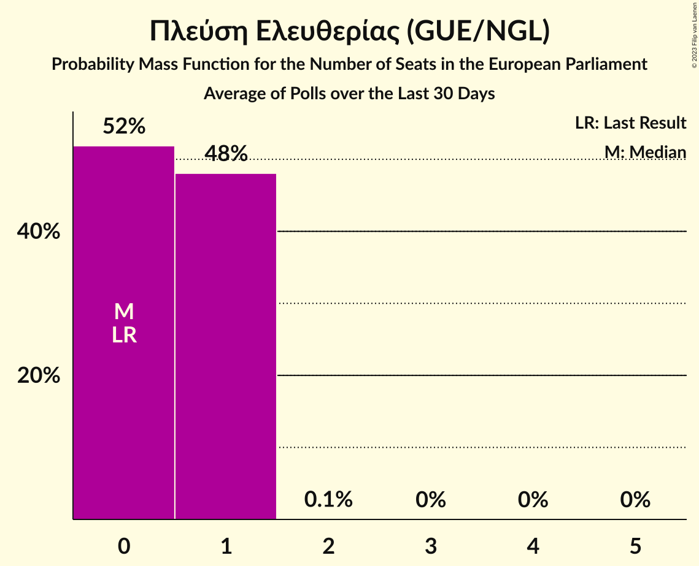

# Πλεύση Ελευθερίας (GUE/NGL)

<a href="#voting-intentions">Voting Intentions</a> | <a href="#seats">Seats</a>

## Voting Intentions

Last result: **0.0%** (General Election of 26 May 2019)

### Confidence Intervals

| Period     | Polling firm/Commissioner(s) | Median | 80% Confidence Interval | 90% Confidence Interval | 95% Confidence Interval | 99% Confidence Interval |
|:----------:|:----------------:|:-----------:|:-----------------------:|:-----------------------:|:-----------------------:|:-----------------------:|
| N/A | [Poll Average](average.html) | 1.6% | 1.1–2.1% | 1.0–2.3% | 0.9–2.5% | 0.8–2.8% |
| [1–3 June 2020](2020-06-03-PulseRC.html) | Pulse RC   ΣΚΑΪ | 0.0% | N/A | N/A | N/A | N/A |
| [22–27 May 2020](2020-05-27-MetronAnalysis.html) | Metron Analysis   MEGA TV | 0.0% | N/A | N/A | N/A | N/A |
| [22–27 May 2020](2020-05-27-GPO.html) | GPO   Παραπολιτικά | 0.0% | N/A | N/A | N/A | N/A |
| [8–13 May 2020](2020-05-13-MRB.html) | MRB   Star | 0.0% | N/A | N/A | N/A | N/A |
| [5–10 May 2020](2020-05-10-Alco.html) | Alco   Open TV | 1.5% | 1.1–2.1% | 1.0–2.3% | 0.9–2.5% | 0.7–2.8% |
| [7–9 May 2020](2020-05-09-OpinionPoll.html) | Opinion Poll | 0.0% | N/A | N/A | N/A | N/A |
| [4–6 May 2020](2020-05-06-PulseRC.html) | Pulse RC   ΣΚΑΪ | 0.0% | N/A | N/A | N/A | N/A |
| [3–6 May 2020](2020-05-06-Interview.html) | Interview   Βεργίνα TV | 0.0% | N/A | N/A | N/A | N/A |
| [24–29 April 2020](2020-04-29-Prorata.html) | Prorata | 0.0% | N/A | N/A | N/A | N/A |
| [22–28 April 2020](2020-04-28-MetronAnalysis.html) | Metron Analysis   MEGA TV | 0.0% | N/A | N/A | N/A | N/A |
| [14–22 April 2020](2020-04-22-GPO.html) | GPO   Παραπολιτικά | 0.0% | N/A | N/A | N/A | N/A |
| [15–17 April 2020](2020-04-17-ΚάπαResearch.html) | Κάπα Research   ΕΘΝΟΣ | 0.0% | N/A | N/A | N/A | N/A |
| [11–13 April 2020](2020-04-13-Marc.html) | Marc   Alpha TV | 0.0% | N/A | N/A | N/A | N/A |
| [30 March–1 April 2020](2020-04-01-PulseRC.html) | Pulse RC   ΣΚΑΪ | 0.0% | N/A | N/A | N/A | N/A |
| [23–26 March 2020](2020-03-26-OpinionPoll.html) | Opinion Poll   Πρώτο ΘΕΜΑ | 0.0% | N/A | N/A | N/A | N/A |
| [6–7 March 2020](2020-03-07-OpinionPoll.html) | Opinion Poll   Πρώτο ΘΕΜΑ | 0.0% | N/A | N/A | N/A | N/A |
| [2–7 March 2020](2020-03-07-Alco.html) | Alco   Open TV | 1.5% | 1.1–2.1% | 1.0–2.3% | 0.9–2.5% | 0.7–2.8% |
| [3–4 March 2020](2020-03-04-PulseRC.html) | Pulse RC   ΣΚΑΪ | 0.0% | N/A | N/A | N/A | N/A |
| [22–27 January 2020](2020-01-27-OpinionPoll.html) | Opinion Poll | 0.0% | N/A | N/A | N/A | N/A |
| [21–22 January 2020](2020-01-22-PulseRC.html) | Pulse RC   ΣΚΑΪ | 0.0% | N/A | N/A | N/A | N/A |
| [20–22 January 2020](2020-01-22-MetronAnalysis.html) | Metron Analysis   Το Βήμα | 0.0% | N/A | N/A | N/A | N/A |
| [13–17 January 2020](2020-01-17-MRB.html) | MRB   Star | 0.0% | N/A | N/A | N/A | N/A |
| [7–8 January 2020](2020-01-08-Interview.html) | Interview   Βεργίνα TV | 0.0% | N/A | N/A | N/A | N/A |
| [16–18 December 2019](2019-12-18-PulseRC.html) | Pulse RC   ΣΚΑΪ | 0.0% | N/A | N/A | N/A | N/A |
| [27 November–5 December 2019](2019-12-05-MRB.html) | MRB   Star | 0.0% | N/A | N/A | N/A | N/A |
| [25–28 November 2019](2019-11-28-OpinionPoll.html) | Opinion Poll | 0.0% | N/A | N/A | N/A | N/A |
| [18–20 November 2019](2019-11-20-ΜetronAnalysis.html) | Μetron Analysis   Το Βήμα | 0.0% | N/A | N/A | N/A | N/A |
| [18–20 November 2019](2019-11-20-PulseRC.html) | Pulse RC   ΣΚΑΪ | 0.0% | N/A | N/A | N/A | N/A |
| [11–14 November 2019](2019-11-14-PalmosAnalysis.html) | Palmos Analysis   GUE–NGL | 1.3% | 0.9–1.9% | 0.8–2.0% | 0.7–2.2% | 0.6–2.5% |
| [29–31 October 2019](2019-10-31-Marc.html) | Marc   Πρώτο ΘΕΜΑ | 1.4% | 1.0–2.0% | 0.9–2.2% | 0.8–2.3% | 0.7–2.7% |
| [22–23 October 2019](2019-10-23-PulseRC.html) | Pulse RC   ΣΚΑΪ | 0.0% | N/A | N/A | N/A | N/A |
| [16–18 September 2019](2019-09-18-ΜetronAnalysis.html) | Μetron Analysis   Το Βήμα | 0.0% | N/A | N/A | N/A | N/A |
| [17–18 September 2019](2019-09-18-PulseRC.html) | Pulse RC   ΣΚΑΪ | 0.0% | N/A | N/A | N/A | N/A |
| [14–16 September 2019](2019-09-16-MRB.html) | MRB   Star | 0.0% | N/A | N/A | N/A | N/A |
| [2–5 September 2019](2019-09-05-Marc.html) | Marc   Πρώτο ΘΕΜΑ | 1.3% | 0.9–1.9% | 0.8–2.1% | 0.8–2.2% | 0.6–2.5% |
| [2–4 September 2019](2019-09-04-OpinionPoll.html) | Opinion Poll | 1.6% | 1.2–2.2% | 1.1–2.4% | 1.0–2.6% | 0.9–2.9% |
| [1–5 July 2019](2019-07-05-ΚάπαResearch.html) | Κάπα Research   ΕΘΝΟΣ | 1.5% | 1.2–2.1% | 1.1–2.2% | 1.0–2.4% | 0.8–2.7% |
| [1–5 July 2019](2019-07-05-MetronAnalysis.html) | Metron Analysis | 0.0% | N/A | N/A | N/A | N/A |
| [1–4 July 2019](2019-07-04-RASS.html) | RASS   Action24 | 1.8% | 1.4–2.5% | 1.2–2.7% | 1.1–2.8% | 1.0–3.2% |
| [2–4 July 2019](2019-07-04-Marc.html) | Marc   ANT1 | 1.9% | 1.5–2.5% | 1.4–2.6% | 1.3–2.8% | 1.1–3.1% |
| [1–4 July 2019](2019-07-04-MRB.html) | MRB   Star | 1.7% | 1.3–2.2% | 1.2–2.4% | 1.1–2.6% | 0.9–2.9% |
| [2–3 July 2019](2019-07-03-PulseRC.html) | Pulse RC   ΣΚΑΪ | 1.6% | 1.2–2.1% | 1.1–2.3% | 1.0–2.5% | 0.9–2.8% |
| [18 June–3 July 2019](2019-07-03-PublicIssue.html) | Public Issue | 0.0% | N/A | N/A | N/A | N/A |
| [1–3 July 2019](2019-07-03-Interview.html) | Interview   Βεργίνα TV | 0.0% | N/A | N/A | N/A | N/A |
| [28 June–2 July 2019](2019-07-02-Alco.html) | Alco   Open TV | 1.5% | 1.1–2.1% | 1.0–2.3% | 0.9–2.5% | 0.7–2.8% |
| [28 June–1 July 2019](2019-07-01-Prorata.html) | Prorata | 0.0% | N/A | N/A | N/A | N/A |
| [27 June–1 July 2019](2019-07-01-MetronAnalysis.html) | Metron Analysis   Alpha TV | 1.7% | 1.3–2.3% | 1.2–2.5% | 1.1–2.7% | 1.0–3.0% |
| [24–27 June 2019](2019-06-27-RASS.html) | RASS   in.gr | 0.0% | N/A | N/A | N/A | N/A |
| [24–26 June 2019](2019-06-26-PulseRC.html) | Pulse RC   ΣΚΑΪ | 1.1% | 0.8–1.6% | 0.8–1.7% | 0.7–1.8% | 0.6–2.0% |
| [24–26 June 2019](2019-06-26-MRB.html) | MRB   Τα Νέα | 1.3% | 0.9–1.9% | 0.8–2.0% | 0.7–2.2% | 0.6–2.5% |
| [24–26 June 2019](2019-06-26-Interview.html) | Interview   Politik | 1.1% | 0.8–1.6% | 0.7–1.8% | 0.6–2.0% | 0.5–2.3% |
| [19–23 June 2019](2019-06-23-Marc.html) | Marc   ANT1 | 1.7% | 1.3–2.3% | 1.2–2.5% | 1.1–2.6% | 1.0–2.9% |
| [18–20 June 2019](2019-06-20-Prorata.html) | Prorata   Newpost | 1.1% | 0.8–1.7% | 0.7–1.8% | 0.6–2.0% | 0.5–2.3% |
| [18–20 June 2019](2019-06-20-Interview.html) | Interview   Βεργίνα TV | 1.8% | 1.4–2.5% | 1.2–2.7% | 1.1–2.8% | 1.0–3.2% |
| [18–19 June 2019](2019-06-19-PulseRC.html) | Pulse RC   ΣΚΑΪ | 2.3% | 1.8–3.0% | 1.7–3.1% | 1.6–3.3% | 1.4–3.6% |
| [17–19 June 2019](2019-06-19-OpinionPoll.html) | Opinion Poll | 2.3% | 1.8–3.0% | 1.6–3.2% | 1.5–3.4% | 1.3–3.8% |
| [14–19 June 2019](2019-06-19-MetronAnalysis.html) | Metron Analysis   Το Βήμα | 0.0% | N/A | N/A | N/A | N/A |
| [13–19 June 2019](2019-06-19-Alco.html) | Alco | 1.8% | 1.4–2.5% | 1.2–2.7% | 1.1–2.8% | 1.0–3.2% |
| [10–13 June 2019](2019-06-13-Marc.html) | Marc | 0.0% | N/A | N/A | N/A | N/A |
| [10–12 June 2019](2019-06-12-PulseRC.html) | Pulse RC   ΣΚΑΪ | 0.0% | N/A | N/A | N/A | N/A |
| [10–12 June 2019](2019-06-12-MRB.html) | MRB   Star | 0.0% | N/A | N/A | N/A | N/A |
| [3–5 June 2019](2019-06-05-MetronAnalysis.html) | Metron Analysis   Alpha TV | 0.0% | N/A | N/A | N/A | N/A |
| [30 May–1 June 2019](2019-06-01-PulseRC.html) | Pulse RC   ΣΚΑΪ | 1.6% | 1.2–2.2% | 1.2–2.3% | 1.1–2.5% | 0.9–2.7% |

### Probability Mass Function

The following table shows the probability mass function per percentage block of voting intentions for the [poll average](average.html) for Πλεύση Ελευθερίας (GUE/NGL).

| Voting Intentions | Probability | Accumulated | Special Marks |
|:-----------------:|:-----------:|:-----------:|:-------------:|
| 0.0–0.5% | 0% | 100% | Last Result |
| 0.5–1.5% | 49% | 100% |  |
| 1.5–2.5% | 49% | 51% | Median |
| 2.5–3.5% | 2% | 2% |  |
| 3.5–4.5% | 0% | 0% |  |

## Seats

Last result: **0** seats (General Election of 26 May 2019)

### Confidence Intervals

| Period     | Polling firm/Commissioner(s) | Median | 80% Confidence Interval | 90% Confidence Interval | 95% Confidence Interval | 99% Confidence Interval |
|:----------:|:----------------:|:------:|:-----------------------:|:-----------------------:|:-----------------------:|:-----------------------:|
| N/A | [Poll Average](average.html) | 0 | 0 | 0 | 0 | 0 |
| [1–3 June 2020](2020-06-03-PulseRC.html) | Pulse RC   ΣΚΑΪ |  |  |  |  |  |
| [22–27 May 2020](2020-05-27-MetronAnalysis.html) | Metron Analysis   MEGA TV |  |  |  |  |  |
| [22–27 May 2020](2020-05-27-GPO.html) | GPO   Παραπολιτικά |  |  |  |  |  |
| [8–13 May 2020](2020-05-13-MRB.html) | MRB   Star |  |  |  |  |  |
| [5–10 May 2020](2020-05-10-Alco.html) | Alco   Open TV | 0 | 0 | 0 | 0 | 0 |
| [7–9 May 2020](2020-05-09-OpinionPoll.html) | Opinion Poll |  |  |  |  |  |
| [4–6 May 2020](2020-05-06-PulseRC.html) | Pulse RC   ΣΚΑΪ |  |  |  |  |  |
| [3–6 May 2020](2020-05-06-Interview.html) | Interview   Βεργίνα TV |  |  |  |  |  |
| [24–29 April 2020](2020-04-29-Prorata.html) | Prorata |  |  |  |  |  |
| [22–28 April 2020](2020-04-28-MetronAnalysis.html) | Metron Analysis   MEGA TV |  |  |  |  |  |
| [14–22 April 2020](2020-04-22-GPO.html) | GPO   Παραπολιτικά |  |  |  |  |  |
| [15–17 April 2020](2020-04-17-ΚάπαResearch.html) | Κάπα Research   ΕΘΝΟΣ |  |  |  |  |  |
| [11–13 April 2020](2020-04-13-Marc.html) | Marc   Alpha TV |  |  |  |  |  |
| [30 March–1 April 2020](2020-04-01-PulseRC.html) | Pulse RC   ΣΚΑΪ |  |  |  |  |  |
| [23–26 March 2020](2020-03-26-OpinionPoll.html) | Opinion Poll   Πρώτο ΘΕΜΑ |  |  |  |  |  |
| [6–7 March 2020](2020-03-07-OpinionPoll.html) | Opinion Poll   Πρώτο ΘΕΜΑ |  |  |  |  |  |
| [2–7 March 2020](2020-03-07-Alco.html) | Alco   Open TV | 0 | 0 | 0 | 0 | 0 |
| [3–4 March 2020](2020-03-04-PulseRC.html) | Pulse RC   ΣΚΑΪ |  |  |  |  |  |
| [22–27 January 2020](2020-01-27-OpinionPoll.html) | Opinion Poll |  |  |  |  |  |
| [21–22 January 2020](2020-01-22-PulseRC.html) | Pulse RC   ΣΚΑΪ |  |  |  |  |  |
| [20–22 January 2020](2020-01-22-MetronAnalysis.html) | Metron Analysis   Το Βήμα |  |  |  |  |  |
| [13–17 January 2020](2020-01-17-MRB.html) | MRB   Star |  |  |  |  |  |
| [7–8 January 2020](2020-01-08-Interview.html) | Interview   Βεργίνα TV |  |  |  |  |  |
| [16–18 December 2019](2019-12-18-PulseRC.html) | Pulse RC   ΣΚΑΪ |  |  |  |  |  |
| [27 November–5 December 2019](2019-12-05-MRB.html) | MRB   Star |  |  |  |  |  |
| [25–28 November 2019](2019-11-28-OpinionPoll.html) | Opinion Poll |  |  |  |  |  |
| [18–20 November 2019](2019-11-20-ΜetronAnalysis.html) | Μetron Analysis   Το Βήμα |  |  |  |  |  |
| [18–20 November 2019](2019-11-20-PulseRC.html) | Pulse RC   ΣΚΑΪ |  |  |  |  |  |
| [11–14 November 2019](2019-11-14-PalmosAnalysis.html) | Palmos Analysis   GUE–NGL | 0 | 0 | 0 | 0 | 0 |
| [29–31 October 2019](2019-10-31-Marc.html) | Marc   Πρώτο ΘΕΜΑ | 0 | 0 | 0 | 0 | 0 |
| [22–23 October 2019](2019-10-23-PulseRC.html) | Pulse RC   ΣΚΑΪ |  |  |  |  |  |
| [16–18 September 2019](2019-09-18-ΜetronAnalysis.html) | Μetron Analysis   Το Βήμα |  |  |  |  |  |
| [17–18 September 2019](2019-09-18-PulseRC.html) | Pulse RC   ΣΚΑΪ |  |  |  |  |  |
| [14–16 September 2019](2019-09-16-MRB.html) | MRB   Star |  |  |  |  |  |
| [2–5 September 2019](2019-09-05-Marc.html) | Marc   Πρώτο ΘΕΜΑ | 0 | 0 | 0 | 0 | 0 |
| [2–4 September 2019](2019-09-04-OpinionPoll.html) | Opinion Poll | 0 | 0 | 0 | 0 | 0 |
| [1–5 July 2019](2019-07-05-ΚάπαResearch.html) | Κάπα Research   ΕΘΝΟΣ | 0 | 0 | 0 | 0 | 0 |
| [1–5 July 2019](2019-07-05-MetronAnalysis.html) | Metron Analysis |  |  |  |  |  |
| [1–4 July 2019](2019-07-04-RASS.html) | RASS   Action24 | 0 | 0 | 0 | 0 | 0–1 |
| [2–4 July 2019](2019-07-04-Marc.html) | Marc   ANT1 | 0 | 0 | 0 | 0 | 0–1 |
| [1–4 July 2019](2019-07-04-MRB.html) | MRB   Star | 0 | 0 | 0 | 0 | 0 |
| [2–3 July 2019](2019-07-03-PulseRC.html) | Pulse RC   ΣΚΑΪ | 0 | 0 | 0 | 0 | 0 |
| [18 June–3 July 2019](2019-07-03-PublicIssue.html) | Public Issue |  |  |  |  |  |
| [1–3 July 2019](2019-07-03-Interview.html) | Interview   Βεργίνα TV |  |  |  |  |  |
| [28 June–2 July 2019](2019-07-02-Alco.html) | Alco   Open TV | 0 | 0 | 0 | 0 | 0 |
| [28 June–1 July 2019](2019-07-01-Prorata.html) | Prorata |  |  |  |  |  |
| [27 June–1 July 2019](2019-07-01-MetronAnalysis.html) | Metron Analysis   Alpha TV | 0 | 0 | 0 | 0 | 0 |
| [24–27 June 2019](2019-06-27-RASS.html) | RASS   in.gr |  |  |  |  |  |
| [24–26 June 2019](2019-06-26-PulseRC.html) | Pulse RC   ΣΚΑΪ | 0 | 0 | 0 | 0 | 0 |
| [24–26 June 2019](2019-06-26-MRB.html) | MRB   Τα Νέα | 0 | 0 | 0 | 0 | 0 |
| [24–26 June 2019](2019-06-26-Interview.html) | Interview   Politik | 0 | 0 | 0 | 0 | 0 |
| [19–23 June 2019](2019-06-23-Marc.html) | Marc   ANT1 | 0 | 0 | 0 | 0 | 0 |
| [18–20 June 2019](2019-06-20-Prorata.html) | Prorata   Newpost | 0 | 0 | 0 | 0 | 0 |
| [18–20 June 2019](2019-06-20-Interview.html) | Interview   Βεργίνα TV | 0 | 0 | 0 | 0 | 0–1 |
| [18–19 June 2019](2019-06-19-PulseRC.html) | Pulse RC   ΣΚΑΪ | 0 | 0 | 0–1 | 0–1 | 0–1 |
| [17–19 June 2019](2019-06-19-OpinionPoll.html) | Opinion Poll | 0 | 0 | 0–1 | 0–1 | 0–1 |
| [14–19 June 2019](2019-06-19-MetronAnalysis.html) | Metron Analysis   Το Βήμα |  |  |  |  |  |
| [13–19 June 2019](2019-06-19-Alco.html) | Alco | 0 | 0 | 0 | 0 | 0–1 |
| [10–13 June 2019](2019-06-13-Marc.html) | Marc |  |  |  |  |  |
| [10–12 June 2019](2019-06-12-PulseRC.html) | Pulse RC   ΣΚΑΪ |  |  |  |  |  |
| [10–12 June 2019](2019-06-12-MRB.html) | MRB   Star |  |  |  |  |  |
| [3–5 June 2019](2019-06-05-MetronAnalysis.html) | Metron Analysis   Alpha TV |  |  |  |  |  |
| [30 May–1 June 2019](2019-06-01-PulseRC.html) | Pulse RC   ΣΚΑΪ | 0 | 0 | 0 | 0 | 0 |

### Probability Mass Function

The following table shows the probability mass function per seat for the [poll average](average.html) for Πλεύση Ελευθερίας (GUE/NGL).

| Number of Seats | Probability | Accumulated | Special Marks |
|:---------------:|:-----------:|:-----------:|:-------------:|
| 0 | 99.8% | 100% | Last Result, Median |
| 1 | 0.2% | 0.2% |  |
| 2 | 0% | 0% |  |

