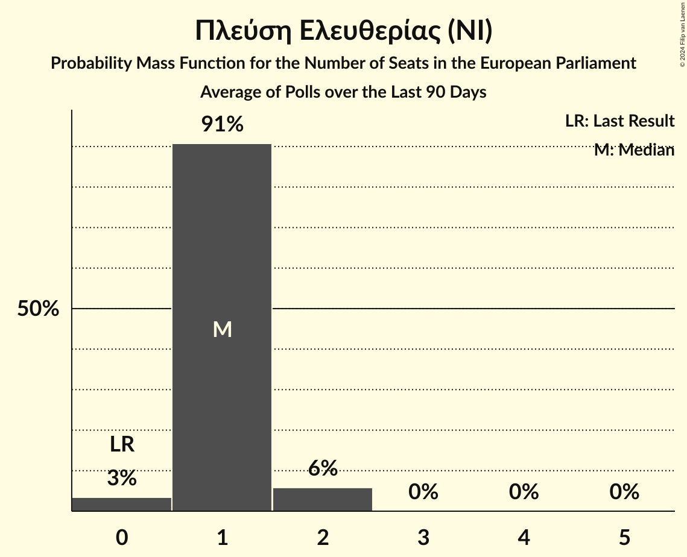

# Πλεύση Ελευθερίας (NI)

<a href="#voting-intentions">Voting Intentions</a> | <a href="#seats">Seats</a>

## Voting Intentions

Last result: **0.0%** (General Election of 9 June 2024)

### Confidence Intervals

| Period     | Polling firm/Commissioner(s) | Median | 80% Confidence Interval | 90% Confidence Interval | 95% Confidence Interval | 99% Confidence Interval |
|:----------:|:----------------:|:-----------:|:-----------------------:|:-----------------------:|:-----------------------:|:-----------------------:|
| N/A | [Poll Average](average.html) | 6.3% | 5.4–7.4% | 5.1–7.7% | 4.9–8.0% | 4.5–8.6% |
| [7–12 November 2024](2024-11-12-OpinionPoll.html) | Opinion Poll   Action 24 | 6.3% | 5.4–7.4% | 5.1–7.7% | 4.9–8.0% | 4.5–8.6% |
| [22–26 October 2024](2024-10-26-Marc.html) | Marc   ANT1 | 4.9% | N/A | N/A | N/A | N/A |
| [21–23 October 2024](2024-10-23-MRB.html) | MRB   Open TV | 5.3% | N/A | N/A | N/A | N/A |
| [16–22 October 2024](2024-10-22-MetronAnalysis.html) | Metron Analysis   Mega TV | 5.3% | N/A | N/A | N/A | N/A |
| [16–21 October 2024](2024-10-21-Interview.html) | Interview   Politic.gr | 4.4% | N/A | N/A | N/A | N/A |
| [15–19 October 2024](2024-10-19-Alco.html) | Alco   Alpha TV | 3.9% | N/A | N/A | N/A | N/A |
| [14–16 October 2024](2024-10-16-GPO.html) | GPO   Star TV | 4.4% | N/A | N/A | N/A | N/A |
| [26 September–2 October 2024](2024-10-02-MetronAnalysis.html) | Metron Analysis   Mega TV | 4.7% | N/A | N/A | N/A | N/A |
| [30 September–2 October 2024](2024-10-02-MRB.html) | MRB   Open TV | 4.5% | N/A | N/A | N/A | N/A |
| [29 September–1 October 2024](2024-10-01-PulseRC.html) | Pulse RC   ΣΚΑΪ | 4.2% | N/A | N/A | N/A | N/A |
| [24–28 September 2024](2024-09-28-PalmosAnalysis.html) | Palmos Analysis   Tvxs.gr | 4.3% | N/A | N/A | N/A | N/A |
| [24–27 September 2024](2024-09-27-OpinionPoll.html) | Opinion Poll   Action 24 | 4.3% | N/A | N/A | N/A | N/A |
| [13–23 September 2024](2024-09-23-MetronAnalysis.html) | Metron Analysis   Mega TV | 4.9% | N/A | N/A | N/A | N/A |
| [19–23 September 2024](2024-09-23-Interview.html) | Interview   Politic.gr | 3.6% | N/A | N/A | N/A | N/A |
| [16–21 September 2024](2024-09-21-Prorata.html) | Prorata   Attica TV | 5.1% | N/A | N/A | N/A | N/A |
| [13–18 September 2024](2024-09-18-MRB.html) | MRB   Open TV | 5.2% | N/A | N/A | N/A | N/A |
| [13–16 September 2024](2024-09-16-PulseRC.html) | Pulse RC   ΣΚΑΪ | 4.9% | N/A | N/A | N/A | N/A |
| [9–14 September 2024](2024-09-14-Alco.html) | Alco   Alpha TV | 4.0% | N/A | N/A | N/A | N/A |
| [2–11 September 2024](2024-09-11-DataRC.html) | Data RC   Peloponnisos | 4.3% | N/A | N/A | N/A | N/A |
| [4–10 September 2024](2024-09-10-MetronAnalysis.html) | Metron Analysis   Mega TV | 5.3% | N/A | N/A | N/A | N/A |
| [8–10 September 2024](2024-09-10-GPO.html) | GPO   Star TV | 4.3% | N/A | N/A | N/A | N/A |
| [2–6 September 2024](2024-09-06-Interview.html) | Interview   Political | 4.4% | N/A | N/A | N/A | N/A |
| [27–30 August 2024](2024-08-30-OpinionPoll.html) | Opinion Poll   Action 24 | 4.1% | N/A | N/A | N/A | N/A |
| [26–30 August 2024](2024-08-30-MRB.html) | MRB   Open TV | 6.8% | N/A | N/A | N/A | N/A |
| [21–26 August 2024](2024-08-26-Interview.html) | Interview   Politic.gr | 4.7% | N/A | N/A | N/A | N/A |
| [27 June–4 July 2024](2024-07-04-MRB.html) | MRB | 4.3% | N/A | N/A | N/A | N/A |
| [21 June–1 July 2024](2024-07-01-MetronAnalysis.html) | Metron Analysis   Mega TV | 5.7% | N/A | N/A | N/A | N/A |
| [25–28 June 2024](2024-06-28-ΚάπαResearch.html) | Κάπα Research | 3.6% | N/A | N/A | N/A | N/A |
| [17–19 June 2024](2024-06-19-GPO.html) | GPO   Star TV | 3.6% | N/A | N/A | N/A | N/A |

### Probability Mass Function

The following table shows the probability mass function per percentage block of voting intentions for the [poll average](average.html) for Πλεύση Ελευθερίας (NI).

| Voting Intentions | Probability | Accumulated | Special Marks |
|:-----------------:|:-----------:|:-----------:|:-------------:|
| 0.0–0.5% | 0% | 100% | Last Result |
| 0.5–1.5% | 0% | 100% |  |
| 1.5–2.5% | 0% | 100% |  |
| 2.5–3.5% | 0% | 100% |  |
| 3.5–4.5% | 0.6% | 100% |  |
| 4.5–5.5% | 14% | 99.4% |  |
| 5.5–6.5% | 46% | 85% | Median |
| 6.5–7.5% | 32% | 40% |  |
| 7.5–8.5% | 7% | 7% |  |
| 8.5–9.5% | 0.5% | 0.5% |  |
| 9.5–10.5% | 0% | 0% |  |

## Seats

Last result: **0** seats (General Election of 9 June 2024)

### Confidence Intervals

| Period     | Polling firm/Commissioner(s) | Median | 80% Confidence Interval | 90% Confidence Interval | 95% Confidence Interval | 99% Confidence Interval |
|:----------:|:----------------:|:------:|:-----------------------:|:-----------------------:|:-----------------------:|:-----------------------:|
| N/A | [Poll Average](average.html) | 2 | 1–2 | 1–2 | 1–2 | 1–2 |
| [7–12 November 2024](2024-11-12-OpinionPoll.html) | Opinion Poll   Action 24 | 2 | 1–2 | 1–2 | 1–2 | 1–2 |
| [22–26 October 2024](2024-10-26-Marc.html) | Marc   ANT1 |  |  |  |  |  |
| [21–23 October 2024](2024-10-23-MRB.html) | MRB   Open TV |  |  |  |  |  |
| [16–22 October 2024](2024-10-22-MetronAnalysis.html) | Metron Analysis   Mega TV |  |  |  |  |  |
| [16–21 October 2024](2024-10-21-Interview.html) | Interview   Politic.gr |  |  |  |  |  |
| [15–19 October 2024](2024-10-19-Alco.html) | Alco   Alpha TV |  |  |  |  |  |
| [14–16 October 2024](2024-10-16-GPO.html) | GPO   Star TV |  |  |  |  |  |
| [26 September–2 October 2024](2024-10-02-MetronAnalysis.html) | Metron Analysis   Mega TV |  |  |  |  |  |
| [30 September–2 October 2024](2024-10-02-MRB.html) | MRB   Open TV |  |  |  |  |  |
| [29 September–1 October 2024](2024-10-01-PulseRC.html) | Pulse RC   ΣΚΑΪ |  |  |  |  |  |
| [24–28 September 2024](2024-09-28-PalmosAnalysis.html) | Palmos Analysis   Tvxs.gr |  |  |  |  |  |
| [24–27 September 2024](2024-09-27-OpinionPoll.html) | Opinion Poll   Action 24 |  |  |  |  |  |
| [13–23 September 2024](2024-09-23-MetronAnalysis.html) | Metron Analysis   Mega TV |  |  |  |  |  |
| [19–23 September 2024](2024-09-23-Interview.html) | Interview   Politic.gr |  |  |  |  |  |
| [16–21 September 2024](2024-09-21-Prorata.html) | Prorata   Attica TV |  |  |  |  |  |
| [13–18 September 2024](2024-09-18-MRB.html) | MRB   Open TV |  |  |  |  |  |
| [13–16 September 2024](2024-09-16-PulseRC.html) | Pulse RC   ΣΚΑΪ |  |  |  |  |  |
| [9–14 September 2024](2024-09-14-Alco.html) | Alco   Alpha TV |  |  |  |  |  |
| [2–11 September 2024](2024-09-11-DataRC.html) | Data RC   Peloponnisos |  |  |  |  |  |
| [4–10 September 2024](2024-09-10-MetronAnalysis.html) | Metron Analysis   Mega TV |  |  |  |  |  |
| [8–10 September 2024](2024-09-10-GPO.html) | GPO   Star TV |  |  |  |  |  |
| [2–6 September 2024](2024-09-06-Interview.html) | Interview   Political |  |  |  |  |  |
| [27–30 August 2024](2024-08-30-OpinionPoll.html) | Opinion Poll   Action 24 |  |  |  |  |  |
| [26–30 August 2024](2024-08-30-MRB.html) | MRB   Open TV |  |  |  |  |  |
| [21–26 August 2024](2024-08-26-Interview.html) | Interview   Politic.gr |  |  |  |  |  |
| [27 June–4 July 2024](2024-07-04-MRB.html) | MRB |  |  |  |  |  |
| [21 June–1 July 2024](2024-07-01-MetronAnalysis.html) | Metron Analysis   Mega TV |  |  |  |  |  |
| [25–28 June 2024](2024-06-28-ΚάπαResearch.html) | Κάπα Research |  |  |  |  |  |
| [17–19 June 2024](2024-06-19-GPO.html) | GPO   Star TV |  |  |  |  |  |

### Probability Mass Function

The following table shows the probability mass function per seat for the [poll average](average.html) for Πλεύση Ελευθερίας (NI).

| Number of Seats | Probability | Accumulated | Special Marks |
|:---------------:|:-----------:|:-----------:|:-------------:|
| 0 | 0% | 100% | Last Result |
| 1 | 45% | 100% |  |
| 2 | 55% | 55% | Median |
| 3 | 0% | 0% |  |

