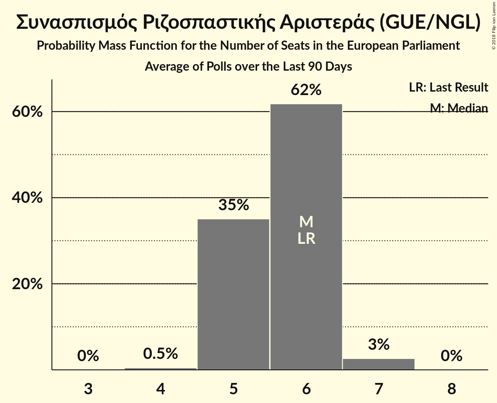

# Συνασπισμός Ριζοσπαστικής Αριστεράς (GUE/NGL)

<a href="#voting-intentions">Voting Intentions</a> | <a href="#seats">Seats</a>

## Voting Intentions

Last result: **26.6%** (General Election of 25 May 2014)

### Confidence Intervals

| Period     | Polling firm/Commissioner(s) | Median | 80% Confidence Interval | 90% Confidence Interval | 95% Confidence Interval | 99% Confidence Interval |
|:----------:|:----------------:|:-----------:|:-----------------------:|:-----------------------:|:-----------------------:|:-----------------------:|
| N/A | [Poll Average](average.html) | 24.5% | 21.5–26.7% | 20.9–27.3% | 20.4–27.8% | 19.5–28.7% |
| [10–14 May 2019](2019-05-14-MARC.html) | MARC | 26.0% | 24.5–27.6% | 24.1–28.1% | 23.7–28.5% | 23.0–29.3% |
| [10–14 May 2019](2019-05-14-Interview.html) | Interview | 26.0% | 24.3–27.8% | 23.8–28.4% | 23.4–28.8% | 22.6–29.7% |
| [6–8 May 2019](2019-05-08-VoxPopAnalysis.html) | Vox Pop Analysis   Documento | 32.0% | 30.4–33.7% | 29.9–34.2% | 29.5–34.6% | 28.8–35.5% |
| [6–8 May 2019](2019-05-08-MRB.html) | MRB   Star | 27.0% | 25.4–28.8% | 24.9–29.3% | 24.5–29.7% | 23.8–30.5% |
| [3–6 May 2019](2019-05-06-Alco.html) | Alco | 26.0% | N/A | N/A | N/A | N/A |
| [18–20 April 2019](2019-04-20-PulseRC.html) | Pulse RC   ΣΚΑΪ | 25.0% | 23.4–26.9% | 22.9–27.4% | 22.5–27.8% | 21.7–28.7% |
| [15–17 April 2019](2019-04-17-Opinion.html) | Opinion   ΘΕΜΑ 104.6 | 21.8% | 20.3–23.4% | 19.9–23.8% | 19.5–24.2% | 18.8–25.0% |
| [15–17 April 2019](2019-04-17-MetronAnalysis.html) | Metron Analysis   Alpha TV | 25.6% | 24.0–27.3% | 23.6–27.7% | 23.2–28.1% | 22.5–28.9% |
| [15–17 April 2019](2019-04-17-Interview.html) | Interview   Βεργίνα TV | 22.7% | 21.0–24.4% | 20.6–25.0% | 20.2–25.4% | 19.4–26.2% |
| [1–3 April 2019](2019-04-03-MRB.html) | MRB   Star | 25.6% | 23.9–27.5% | 23.4–28.0% | 23.0–28.4% | 22.2–29.3% |
| [26 March–1 April 2019](2019-04-01-Marc.html) | Marc   Πρώτο ΘΕΜΑ | 24.8% | 23.3–26.5% | 22.8–27.0% | 22.5–27.4% | 21.7–28.2% |
| [26–28 March 2019](2019-03-28-RASS.html) | RASS   in.gr | 25.2% | 23.5–27.0% | 23.0–27.5% | 22.6–28.0% | 21.8–28.8% |
| [19–26 March 2019](2019-03-26-Alco.html) | Alco | 24.0% | 22.3–25.8% | 21.9–26.3% | 21.4–26.7% | 20.7–27.6% |
| [18–20 March 2019](2019-03-20-VoxPopAnalysis.html) | Vox Pop Analysis   Documento | 28.2% | 26.4–30.1% | 25.9–30.6% | 25.5–31.1% | 24.7–32.0% |
| [18–20 March 2019](2019-03-20-PulseRC.html) | Pulse RC | 24.0% | 22.6–25.5% | 22.2–25.9% | 21.8–26.2% | 21.2–27.0% |
| [18–20 March 2019](2019-03-20-MetronAnalysis.html) | Metron Analysis   Το Βήμα | 26.0% | 24.4–27.7% | 24.0–28.2% | 23.6–28.6% | 22.8–29.4% |
| [24–26 February 2019](2019-02-26-PulseRC.html) | Pulse RC   ΣΚΑΪ | 24.5% | 23.0–26.1% | 22.6–26.5% | 22.2–26.9% | 21.6–27.6% |
| [18–23 February 2019](2019-02-23-Alco.html) | Alco   Open | 25.0% | 23.3–26.8% | 22.8–27.3% | 22.4–27.8% | 21.6–28.7% |
| [1–14 February 2019](2019-02-14-PublicIssue.html) | Public Issue | 24.5% | 22.8–26.3% | 22.3–26.8% | 21.9–27.2% | 21.1–28.1% |
| [4–5 February 2019](2019-02-05-Interview.html) | Interview   Βεργίνα TV | 24.7% | 23.0–26.5% | 22.5–27.0% | 22.1–27.5% | 21.3–28.4% |
| [1–4 February 2019](2019-02-04-Prorata.html) | Prorata   Η Εφημερίδα των Συντακτών | 24.5% | 22.8–26.3% | 22.3–26.8% | 21.9–27.3% | 21.1–28.2% |
| [1–2 February 2019](2019-02-02-VoxPopAnalysis.html) | Vox Pop Analysis   Documento | 25.1% | 23.5–26.7% | 23.1–27.2% | 22.7–27.6% | 22.0–28.4% |
| [28–29 January 2019](2019-01-29-MetronAnalysis.html) | Metron Analysis   Το Βήμα | 27.5% | 26.8–28.2% | 26.7–28.3% | 26.5–28.5% | 26.2–28.8% |
| [21–24 January 2019](2019-01-24-RASS.html) | RASS   in.gr | 25.2% | 23.5–27.0% | 23.0–27.5% | 22.6–28.0% | 21.8–28.9% |
| [20–22 January 2019](2019-01-22-PulseRC.html) | Pulse RC   ΣΚΑΪ | 26.0% | 24.5–27.6% | 24.1–28.1% | 23.8–28.4% | 23.1–29.2% |
| [14–17 January 2019](2019-01-17-Marc.html) | Marc   Πρώτο ΘΕΜΑ | 26.9% | 25.2–28.8% | 24.7–29.3% | 24.3–29.8% | 23.5–30.7% |
| [10–16 January 2019](2019-01-16-OpinionPoll.html) | Opinion Poll | 22.0% | 20.4–23.7% | 19.9–24.2% | 19.5–24.7% | 18.8–25.5% |
| [16–18 December 2018](2018-12-18-PulseRC.html) | Pulse RC   ΣΚΑΪ | 26.0% | 24.5–27.6% | 24.1–28.0% | 23.7–28.4% | 23.0–29.2% |
| [5–10 December 2018](2018-12-10-Alco.html) | Alco   Open | 25.4% | 23.7–27.2% | 23.2–27.7% | 22.8–28.2% | 22.0–29.1% |
| [4–6 December 2018](2018-12-06-ΚάπαResearch.html) | Κάπα Research   thebest.gr | 25.7% | 24.0–27.5% | 23.5–28.0% | 23.1–28.5% | 22.3–29.4% |
| [28 November–6 December 2018](2018-12-06-MRB.html) | MRB   real.gr | 27.6% | 26.3–28.9% | 26.0–29.3% | 25.7–29.6% | 25.1–30.2% |
| [20–23 November 2018](2018-11-23-PalmosAnalysis.html) | Palmos Analysis   TVXS | 28.5% | 26.7–30.3% | 26.2–30.9% | 25.8–31.3% | 25.0–32.2% |
| [19–21 November 2018](2018-11-21-MetronAnalysis.html) | Metron Analysis   Τα Νέα | 26.9% | 25.3–28.6% | 24.8–29.1% | 24.4–29.5% | 23.7–30.3% |
| [18–20 November 2018](2018-11-20-PulseRC.html) | Pulse RC   ΣΚΑΪ | 25.5% | 24.0–27.1% | 23.6–27.5% | 23.3–27.9% | 22.6–28.7% |
| [6–16 November 2018](2018-11-16-PublicIssue.html) | Public Issue | 22.0% | 20.4–23.7% | 19.9–24.2% | 19.5–24.7% | 18.8–25.5% |
| [22–24 October 2018](2018-10-24-Marc.html) | Marc   Πρώτο ΘΕΜΑ | 23.7% | 22.0–25.4% | 21.5–25.9% | 21.1–26.4% | 20.3–27.3% |
| [14–16 October 2018](2018-10-16-PulseRC.html) | Pulse RC   ΣΚΑΪ | 25.0% | 23.5–26.6% | 23.1–27.0% | 22.8–27.4% | 22.1–28.2% |
| [18–21 September 2018](2018-09-21-PalmosAnalysis.html) | Palmos Analysis   TVXS | 28.0% | 26.2–29.8% | 25.7–30.3% | 25.3–30.8% | 24.4–31.7% |
| [18–20 September 2018](2018-09-20-MetronAnalysis.html) | Metron Analysis   Τα Νέα | 25.2% | 23.5–27.0% | 23.0–27.5% | 22.6–28.0% | 21.8–28.9% |
| [17–19 September 2018](2018-09-19-MRB.html) | MRB   Star | 26.9% | 25.1–28.7% | 24.7–29.3% | 24.2–29.7% | 23.4–30.6% |
| [17–19 September 2018](2018-09-19-Alco.html) | Alco   Kontra Channel | 25.8% | 24.1–27.6% | 23.6–28.2% | 23.2–28.6% | 22.4–29.5% |
| [17–18 September 2018](2018-09-18-ΚάπαResearch.html) | Κάπα Research   ΕΘΝΟΣ | 25.2% | 23.5–27.0% | 23.0–27.5% | 22.6–28.0% | 21.8–28.8% |
| [16–18 September 2018](2018-09-18-PulseRC.html) | Pulse RC   ΣΚΑΪ | 26.0% | 24.5–27.6% | 24.1–28.0% | 23.7–28.4% | 23.0–29.2% |
| [8 September 2018](2018-09-08-Marc.html) | Marc   Πρώτο ΘΕΜΑ | 23.2% | 21.6–25.0% | 21.1–25.5% | 20.7–25.9% | 19.9–26.8% |
| [25 June–2 July 2018](2018-07-02-ΚάπαResearch.html) | Κάπα Research   ΕΘΝΟΣ | 23.4% | 21.7–25.2% | 21.3–25.7% | 20.9–26.1% | 20.1–27.0% |
| [22–29 June 2018](2018-06-29-MRB.html) | MRB   Real | 25.2% | 24.0–26.5% | 23.6–26.8% | 23.3–27.2% | 22.8–27.8% |
| [26–28 June 2018](2018-06-28-MetronAnalysis.html) | Metron Analysis   Τα Νέα | 22.6% | 21.0–24.4% | 20.5–24.9% | 20.1–25.3% | 19.3–26.2% |
| [23–27 June 2018](2018-06-27-Alco.html) | Alco   Kontra Channel | 23.6% | 21.9–25.4% | 21.5–25.9% | 21.1–26.3% | 20.3–27.2% |
| [24–26 June 2018](2018-06-26-PulseRC.html) | Pulse RC   ΣΚΑΪ | 24.5% | 23.0–26.1% | 22.6–26.5% | 22.2–26.9% | 21.6–27.6% |
| [13–15 June 2018](2018-06-15-Marc.html) | Marc   Πρώτο ΘΕΜΑ | 20.0% | 18.4–21.7% | 18.0–22.2% | 17.6–22.6% | 16.9–23.4% |
| [29–31 May 2018](2018-05-31-RASS.html) | RASS   Action 24 | 23.7% | 22.0–25.4% | 21.5–25.9% | 21.1–26.4% | 20.3–27.3% |
| [16–20 May 2018](2018-05-20-Alco.html) | Alco   Kontra Channel | 20.1% | 18.4–22.1% | 17.9–22.6% | 17.5–23.1% | 16.7–24.0% |
| [13–15 May 2018](2018-05-15-PulseRC.html) | Pulse RC   ΣΚΑΪ | 25.0% | 23.5–26.6% | 23.1–27.0% | 22.7–27.4% | 22.0–28.1% |
| [23 April–7 May 2018](2018-05-07-PublicIssue.html) | Public Issue | 20.0% | 18.5–21.7% | 18.0–22.2% | 17.7–22.6% | 16.9–23.5% |
| [21 April 2018](2018-04-21-MetronAnalysis.html) | Metron Analysis   Τα Νέα | 23.3% | 21.6–25.1% | 21.2–25.6% | 20.8–26.0% | 20.0–26.9% |
| [15–17 April 2018](2018-04-17-PulseRC.html) | Pulse RC   ΣΚΑΪ | 24.5% | 23.0–26.0% | 22.6–26.5% | 22.3–26.9% | 21.6–27.6% |
| [11–16 April 2018](2018-04-16-Alco.html) | Alco   Ραδιόφωνο 24/7 | 24.5% | 22.8–26.3% | 22.3–26.8% | 21.9–27.3% | 21.1–28.2% |
| [12–15 April 2018](2018-04-15-PalmosAnalysis.html) | Palmos Analysis   TVXS | 25.5% | 23.8–27.3% | 23.3–27.8% | 22.9–28.3% | 22.1–29.1% |
| [3 April 2018](2018-04-03-ΚάπαResearch.html) | Κάπα Research   ΕΘΝΟΣ | 22.6% | 22.0–23.2% | 21.8–23.4% | 21.7–23.5% | 21.4–23.8% |
| [1–23 March 2018](2018-03-23-Marc.html) | Marc   Πρώτο ΘΕΜΑ | 22.7% | 21.1–24.5% | 20.6–25.0% | 20.2–25.4% | 19.4–26.3% |
| [11–13 March 2018](2018-03-13-PulseRC.html) | Pulse RC   ΣΚΑΪ | 24.5% | 23.0–26.0% | 22.6–26.5% | 22.2–26.9% | 21.5–27.6% |
| [6–8 March 2018](2018-03-08-RASS.html) | RASS   Πρώτο Θέμα | 23.4% | 21.7–25.1% | 21.2–25.6% | 20.8–26.1% | 20.1–26.9% |
| [3 March 2018](2018-03-03-PulseRC.html) | Pulse RC   Δημοκρατία | 25.0% | 23.5–26.7% | 23.0–27.1% | 22.6–27.6% | 21.9–28.3% |
| [3 March 2018](2018-03-03-OpinionPoll.html) | Opinion Poll   Παρασκήνιο | 25.6% | 23.9–27.4% | 23.4–28.0% | 23.0–28.4% | 22.2–29.3% |
| [22–24 February 2018](2018-02-24-Alco.html) | Alco   ΕΘΝΟΣ | 24.7% | 23.0–26.5% | 22.5–27.0% | 22.1–27.5% | 21.3–28.4% |
| [12–23 February 2018](2018-02-23-MetronAnalysis.html) | Metron Analysis   Το Βήμα | 25.2% | 24.1–26.4% | 23.8–26.7% | 23.5–27.0% | 22.9–27.6% |
| [25–29 January 2018](2018-01-29-PulseRC.html) | Pulse RC   Action 24 | 24.0% | 22.6–25.4% | 22.2–25.8% | 21.9–26.2% | 21.2–26.9% |
| [20 January 2018](2018-01-20-MetronAnalysis.html) | Metron Analysis   Τα Νέα | 24.9% | 23.2–26.7% | 22.7–27.2% | 22.3–27.7% | 21.5–28.6% |
| [8–18 January 2018](2018-01-18-PublicIssue.html) | Public Issue | 21.5% | 19.9–23.2% | 19.4–23.7% | 19.1–24.1% | 18.3–25.0% |
| [16–18 January 2018](2018-01-18-Alco.html) | Alco   Ραδιόφωνο 24/7 | 25.0% | 23.3–26.8% | 22.8–27.3% | 22.4–27.8% | 21.6–28.7% |
| [13 January 2018](2018-01-13-Marc.html) | Marc   Πρώτο ΘΕΜΑ | 22.9% | 21.3–24.7% | 20.8–25.2% | 20.4–25.6% | 19.6–26.5% |
| [8–10 January 2018](2018-01-10-PulseRC.html) | Pulse RC   bankingnews.gr | 25.0% | 23.5–26.7% | 23.0–27.1% | 22.6–27.6% | 21.9–28.3% |

### Probability Mass Function

The following table shows the probability mass function per percentage block of voting intentions for the [poll average](average.html) for Συνασπισμός Ριζοσπαστικής Αριστεράς (GUE/NGL).

| Voting Intentions | Probability | Accumulated | Special Marks |
|:-----------------:|:-----------:|:-----------:|:-------------:|
| 17.5–18.5% | 0% | 100% |  |
| 18.5–19.5% | 0.5% | 100% |  |
| 19.5–20.5% | 3% | 99.4% |  |
| 20.5–21.5% | 7% | 97% |  |
| 21.5–22.5% | 11% | 90% |  |
| 22.5–23.5% | 13% | 79% |  |
| 23.5–24.5% | 17% | 66% |  |
| 24.5–25.5% | 20% | 49% | Median |
| 25.5–26.5% | 17% | 29% |  |
| 26.5–27.5% | 9% | 12% | Last Result |
| 27.5–28.5% | 3% | 3% |  |
| 28.5–29.5% | 0.6% | 0.7% |  |
| 29.5–30.5% | 0.1% | 0.1% |  |
| 30.5–31.5% | 0% | 0% |  |

## Seats

Last result: **6** seats (General Election of 25 May 2014)

### Confidence Intervals

| Period     | Polling firm/Commissioner(s) | Median | 80% Confidence Interval | 90% Confidence Interval | 95% Confidence Interval | 99% Confidence Interval |
|:----------:|:----------------:|:------:|:-----------------------:|:-----------------------:|:-----------------------:|:-----------------------:|
| N/A | [Poll Average](average.html) | 5 | 5–6 | 4–6 | 4–6 | 4–6 |
| [10–14 May 2019](2019-05-14-MARC.html) | MARC | 6 | 5–6 | 5–6 | 5–6 | 5–6 |
| [10–14 May 2019](2019-05-14-Interview.html) | Interview | 6 | 5–7 | 5–7 | 5–7 | 5–7 |
| [6–8 May 2019](2019-05-08-VoxPopAnalysis.html) | Vox Pop Analysis   Documento | 7 | 7–8 | 7–8 | 7–8 | 7–8 |
| [6–8 May 2019](2019-05-08-MRB.html) | MRB   Star | 6 | 5–6 | 5–7 | 5–7 | 5–7 |
| [3–6 May 2019](2019-05-06-Alco.html) | Alco |  |  |  |  |  |
| [18–20 April 2019](2019-04-20-PulseRC.html) | Pulse RC   ΣΚΑΪ | 6 | 5–6 | 5–6 | 5–6 | 5–6 |
| [15–17 April 2019](2019-04-17-Opinion.html) | Opinion   ΘΕΜΑ 104.6 | 5 | 4–5 | 4–5 | 4–5 | 4–6 |
| [15–17 April 2019](2019-04-17-MetronAnalysis.html) | Metron Analysis   Alpha TV | 6 | 5–6 | 5–6 | 5–6 | 5–6 |
| [15–17 April 2019](2019-04-17-Interview.html) | Interview   Βεργίνα TV | 5 | 5 | 5–6 | 4–6 | 4–6 |
| [1–3 April 2019](2019-04-03-MRB.html) | MRB   Star | 6 | 5–6 | 5–6 | 5–6 | 5–6 |
| [26 March–1 April 2019](2019-04-01-Marc.html) | Marc   Πρώτο ΘΕΜΑ | 5 | 5–6 | 5–6 | 5–6 | 5–6 |
| [26–28 March 2019](2019-03-28-RASS.html) | RASS   in.gr | 5 | 5–6 | 5–6 | 5–6 | 5–6 |
| [19–26 March 2019](2019-03-26-Alco.html) | Alco | 5 | 5–6 | 5–6 | 5–6 | 4–6 |
| [18–20 March 2019](2019-03-20-VoxPopAnalysis.html) | Vox Pop Analysis   Documento | 6 | 6–7 | 5–7 | 5–7 | 5–7 |
| [18–20 March 2019](2019-03-20-PulseRC.html) | Pulse RC | 5 | 5–6 | 5–6 | 5–6 | 5–6 |
| [18–20 March 2019](2019-03-20-MetronAnalysis.html) | Metron Analysis   Το Βήμα | 6 | 5–6 | 5–6 | 5–6 | 5–7 |
| [24–26 February 2019](2019-02-26-PulseRC.html) | Pulse RC   ΣΚΑΪ | 6 | 5–6 | 5–6 | 5–6 | 5–6 |
| [18–23 February 2019](2019-02-23-Alco.html) | Alco   Open | 5 | 5–6 | 5–6 | 5–6 | 5–6 |
| [1–14 February 2019](2019-02-14-PublicIssue.html) | Public Issue | 5 | 5–6 | 5–6 | 5–6 | 4–6 |
| [4–5 February 2019](2019-02-05-Interview.html) | Interview   Βεργίνα TV | 5 | 5–6 | 5–6 | 5–6 | 5–6 |
| [1–4 February 2019](2019-02-04-Prorata.html) | Prorata   Η Εφημερίδα των Συντακτών | 5 | 5–6 | 5–6 | 5–6 | 5–6 |
| [1–2 February 2019](2019-02-02-VoxPopAnalysis.html) | Vox Pop Analysis   Documento | 6 | 5–6 | 5–6 | 5–6 | 5–6 |
| [28–29 January 2019](2019-01-29-MetronAnalysis.html) | Metron Analysis   Το Βήμα | 6 | 6 | 6 | 6 | 6–7 |
| [21–24 January 2019](2019-01-24-RASS.html) | RASS   in.gr | 5 | 5–6 | 5–6 | 5–6 | 5–6 |
| [20–22 January 2019](2019-01-22-PulseRC.html) | Pulse RC   ΣΚΑΪ | 6 | 6 | 5–6 | 5–6 | 5–6 |
| [14–17 January 2019](2019-01-17-Marc.html) | Marc   Πρώτο ΘΕΜΑ | 6 | 5–6 | 5–6 | 5–7 | 5–7 |
| [10–16 January 2019](2019-01-16-OpinionPoll.html) | Opinion Poll | 5 | 5–6 | 5–6 | 5–6 | 4–6 |
| [16–18 December 2018](2018-12-18-PulseRC.html) | Pulse RC   ΣΚΑΪ | 6 | 5–6 | 5–6 | 5–6 | 5–6 |
| [5–10 December 2018](2018-12-10-Alco.html) | Alco   Open | 6 | 5–6 | 5–6 | 5–6 | 5–6 |
| [4–6 December 2018](2018-12-06-ΚάπαResearch.html) | Κάπα Research   thebest.gr | 6 | 5–6 | 5–6 | 5–6 | 5–7 |
| [28 November–6 December 2018](2018-12-06-MRB.html) | MRB   real.gr | 6 | 6 | 6 | 6 | 5–7 |
| [20–23 November 2018](2018-11-23-PalmosAnalysis.html) | Palmos Analysis   TVXS | 6 | 6–7 | 6–7 | 6–7 | 5–7 |
| [19–21 November 2018](2018-11-21-MetronAnalysis.html) | Metron Analysis   Τα Νέα | 6 | 6 | 6 | 5–6 | 5–7 |
| [18–20 November 2018](2018-11-20-PulseRC.html) | Pulse RC   ΣΚΑΪ | 6 | 5–6 | 5–6 | 5–6 | 5–7 |
| [6–16 November 2018](2018-11-16-PublicIssue.html) | Public Issue | 5 | 4–5 | 4–5 | 4–5 | 4–6 |
| [22–24 October 2018](2018-10-24-Marc.html) | Marc   Πρώτο ΘΕΜΑ | 5 | 5–6 | 5–6 | 5–6 | 4–6 |
| [14–16 October 2018](2018-10-16-PulseRC.html) | Pulse RC   ΣΚΑΪ | 6 | 5–6 | 5–6 | 5–6 | 5–6 |
| [18–21 September 2018](2018-09-21-PalmosAnalysis.html) | Palmos Analysis   TVXS | 6 | 6–7 | 6–7 | 6–7 | 5–7 |
| [18–20 September 2018](2018-09-20-MetronAnalysis.html) | Metron Analysis   Τα Νέα | 6 | 5–6 | 5–6 | 5–6 | 5–6 |
| [17–19 September 2018](2018-09-19-MRB.html) | MRB   Star | 6 | 5–6 | 5–6 | 5–7 | 5–7 |
| [17–19 September 2018](2018-09-19-Alco.html) | Alco   Kontra Channel | 6 | 5–6 | 5–6 | 5–6 | 5–7 |
| [17–18 September 2018](2018-09-18-ΚάπαResearch.html) | Κάπα Research   ΕΘΝΟΣ | 6 | 5–6 | 5–6 | 5–6 | 5–6 |
| [16–18 September 2018](2018-09-18-PulseRC.html) | Pulse RC   ΣΚΑΪ | 6 | 6 | 6–7 | 5–7 | 5–7 |
| [8 September 2018](2018-09-08-Marc.html) | Marc   Πρώτο ΘΕΜΑ | 5 | 5–6 | 5–6 | 4–6 | 4–6 |
| [25 June–2 July 2018](2018-07-02-ΚάπαResearch.html) | Κάπα Research   ΕΘΝΟΣ | 5 | 5 | 5 | 5–6 | 4–6 |
| [22–29 June 2018](2018-06-29-MRB.html) | MRB   Real | 5 | 5–6 | 5–6 | 5–6 | 5–6 |
| [26–28 June 2018](2018-06-28-MetronAnalysis.html) | Metron Analysis   Τα Νέα | 5 | 5 | 4–6 | 4–6 | 4–6 |
| [23–27 June 2018](2018-06-27-Alco.html) | Alco   Kontra Channel | 5 | 5–6 | 5–6 | 4–6 | 4–6 |
| [24–26 June 2018](2018-06-26-PulseRC.html) | Pulse RC   ΣΚΑΪ | 5 | 5–6 | 5–6 | 5–6 | 5–6 |
| [13–15 June 2018](2018-06-15-Marc.html) | Marc   Πρώτο ΘΕΜΑ | 4 | 4–5 | 4–5 | 4–5 | 4–5 |
| [29–31 May 2018](2018-05-31-RASS.html) | RASS   Action 24 | 5 | 5 | 5–6 | 4–6 | 4–6 |
| [16–20 May 2018](2018-05-20-Alco.html) | Alco   Kontra Channel | 5 | 4–5 | 4–5 | 4–5 | 4–5 |
| [13–15 May 2018](2018-05-15-PulseRC.html) | Pulse RC   ΣΚΑΪ | 6 | 5–6 | 5–6 | 5–6 | 5–6 |
| [23 April–7 May 2018](2018-05-07-PublicIssue.html) | Public Issue | 4 | 4–5 | 4–5 | 4–5 | 4–5 |
| [21 April 2018](2018-04-21-MetronAnalysis.html) | Metron Analysis   Τα Νέα | 5 | 5–6 | 5–6 | 4–6 | 4–6 |
| [15–17 April 2018](2018-04-17-PulseRC.html) | Pulse RC   ΣΚΑΪ | 5 | 5–6 | 5–6 | 5–6 | 5–6 |
| [11–16 April 2018](2018-04-16-Alco.html) | Alco   Ραδιόφωνο 24/7 | 5 | 5–6 | 5–6 | 5–6 | 5–6 |
| [12–15 April 2018](2018-04-15-PalmosAnalysis.html) | Palmos Analysis   TVXS | 5 | 5–6 | 5–6 | 5–6 | 5–6 |
| [3 April 2018](2018-04-03-ΚάπαResearch.html) | Κάπα Research   ΕΘΝΟΣ | 5 | 5 | 5 | 5 | 5 |
| [1–23 March 2018](2018-03-23-Marc.html) | Marc   Πρώτο ΘΕΜΑ | 5 | 5 | 4–5 | 4–6 | 4–6 |
| [11–13 March 2018](2018-03-13-PulseRC.html) | Pulse RC   ΣΚΑΪ | 5 | 5–6 | 5–6 | 5–6 | 5–6 |
| [6–8 March 2018](2018-03-08-RASS.html) | RASS   Πρώτο Θέμα | 5 | 5 | 4–6 | 4–6 | 4–6 |
| [3 March 2018](2018-03-03-PulseRC.html) | Pulse RC   Δημοκρατία | 6 | 5–6 | 5–6 | 5–6 | 5–6 |
| [3 March 2018](2018-03-03-OpinionPoll.html) | Opinion Poll   Παρασκήνιο | 6 | 5–6 | 5–6 | 5–6 | 5–6 |
| [22–24 February 2018](2018-02-24-Alco.html) | Alco   ΕΘΝΟΣ | 6 | 5–6 | 5–6 | 5–6 | 5–6 |
| [12–23 February 2018](2018-02-23-MetronAnalysis.html) | Metron Analysis   Το Βήμα | 6 | 5–6 | 5–6 | 5–6 | 5–6 |
| [25–29 January 2018](2018-01-29-PulseRC.html) | Pulse RC   Action 24 | 5 | 5–6 | 5–6 | 5–6 | 5–6 |
| [20 January 2018](2018-01-20-MetronAnalysis.html) | Metron Analysis   Τα Νέα | 5 | 5–6 | 5–6 | 5–6 | 5–6 |
| [8–18 January 2018](2018-01-18-PublicIssue.html) | Public Issue | 5 | 4–5 | 4–5 | 4–5 | 4–5 |
| [16–18 January 2018](2018-01-18-Alco.html) | Alco   Ραδιόφωνο 24/7 | 5 | 5–6 | 5–6 | 5–6 | 5–6 |
| [13 January 2018](2018-01-13-Marc.html) | Marc   Πρώτο ΘΕΜΑ | 5 | 5 | 4–5 | 4–6 | 4–6 |
| [8–10 January 2018](2018-01-10-PulseRC.html) | Pulse RC   bankingnews.gr | 5 | 5–6 | 5–6 | 5–6 | 5–6 |

### Probability Mass Function

The following table shows the probability mass function per seat for the [poll average](average.html) for Συνασπισμός Ριζοσπαστικής Αριστεράς (GUE/NGL).

| Number of Seats | Probability | Accumulated | Special Marks |
|:---------------:|:-----------:|:-----------:|:-------------:|
| 4 | 5% | 100% |  |
| 5 | 47% | 95% | Median |
| 6 | 47% | 47% | Last Result |
| 7 | 0.1% | 0.1% |  |
| 8 | 0% | 0% |  |

