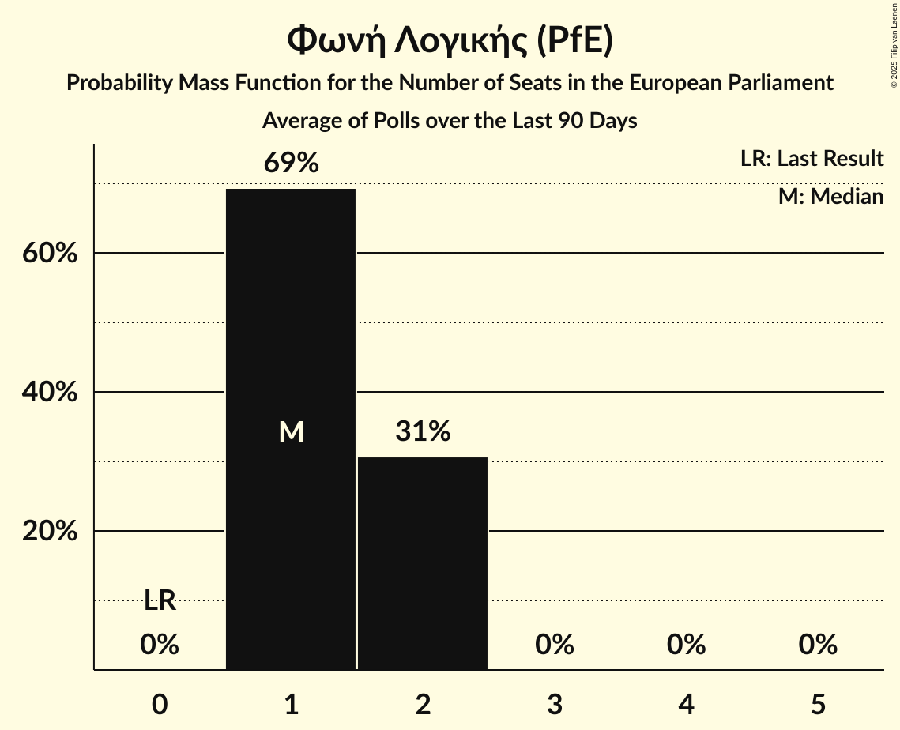

# Φωνή Λογικής (PfE)

<a href="#voting-intentions">Voting Intentions</a> | <a href="#seats">Seats</a>

## Voting Intentions

Last result: **0.0%** (General Election of 9 June 2024)

### Confidence Intervals

| Period     | Polling firm/Commissioner(s) | Median | 80% Confidence Interval | 90% Confidence Interval | 95% Confidence Interval | 99% Confidence Interval |
|:----------:|:----------------:|:-----------:|:-----------------------:|:-----------------------:|:-----------------------:|:-----------------------:|
| N/A | [Poll Average](average.html) | 3.3% | 2.7–4.0% | 2.5–4.2% | 2.4–4.3% | 2.1–4.7% |
| [27 June–4 July 2024](2024-07-04-MRB.html) | MRB | 3.2% | 2.7–3.9% | 2.6–4.0% | 2.5–4.2% | 2.3–4.5% |
| [21 June–1 July 2024](2024-07-01-MetronAnalysis.html) | Metron Analysis   Mega TV | 3.1% | 2.5–3.9% | 2.4–4.1% | 2.3–4.3% | 2.0–4.7% |
| [25–28 June 2024](2024-06-28-ΚάπαResearch.html) | Κάπα Research | 3.4% | 2.8–4.1% | 2.7–4.3% | 2.5–4.5% | 2.3–4.9% |
| [17–19 June 2024](2024-06-19-GPO.html) | GPO   Star TV | 3.8% | N/A | N/A | N/A | N/A |

### Probability Mass Function

The following table shows the probability mass function per percentage block of voting intentions for the [poll average](average.html) for Φωνή Λογικής (PfE).

| Voting Intentions | Probability | Accumulated | Special Marks |
|:-----------------:|:-----------:|:-----------:|:-------------:|
| 0.0–0.5% | 0% | 100% | Last Result |
| 0.5–1.5% | 0% | 100% |  |
| 1.5–2.5% | 5% | 100% |  |
| 2.5–3.5% | 65% | 95% | Median |
| 3.5–4.5% | 28% | 30% |  |
| 4.5–5.5% | 1.0% | 1.0% |  |
| 5.5–6.5% | 0% | 0% |  |

## Seats

Last result: **0** seats (General Election of 9 June 2024)

### Confidence Intervals

| Period     | Polling firm/Commissioner(s) | Median | 80% Confidence Interval | 90% Confidence Interval | 95% Confidence Interval | 99% Confidence Interval |
|:----------:|:----------------:|:------:|:-----------------------:|:-----------------------:|:-----------------------:|:-----------------------:|
| N/A | [Poll Average](average.html) | 1 | 0–1 | 0–1 | 0–1 | 0–1 |
| [27 June–4 July 2024](2024-07-04-MRB.html) | MRB | 1 | 0–1 | 0–1 | 0–1 | 0–1 |
| [21 June–1 July 2024](2024-07-01-MetronAnalysis.html) | Metron Analysis   Mega TV | 0 | 0–1 | 0–1 | 0–1 | 0–1 |
| [25–28 June 2024](2024-06-28-ΚάπαResearch.html) | Κάπα Research | 1 | 0–1 | 0–1 | 0–1 | 0–1 |
| [17–19 June 2024](2024-06-19-GPO.html) | GPO   Star TV |  |  |  |  |  |

### Probability Mass Function

The following table shows the probability mass function per seat for the [poll average](average.html) for Φωνή Λογικής (PfE).

| Number of Seats | Probability | Accumulated | Special Marks |
|:---------------:|:-----------:|:-----------:|:-------------:|
| 0 | 41% | 100% | Last Result |
| 1 | 59% | 59% | Median |
| 2 | 0% | 0% |  |

